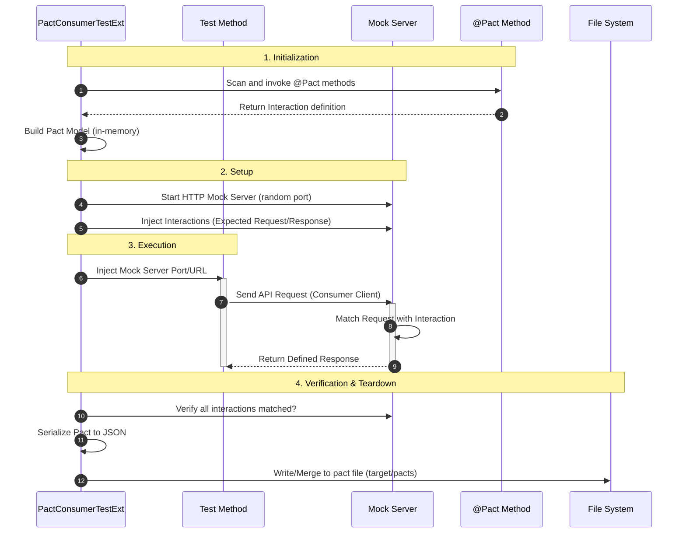

Pact에서 계약은 항상 --Consumer에서 시작--한다.  
Provider는 이 단계에 등장하지 않는다.

Consumer 쪽에서는 딱 두 가지를 한다.

- interaction을 정의한다
- 그 interaction을 실제로 한 번 사용한다

이 두 단계가 끝나야 pact file이 만들어진다.

## 1. interaction 정의 (`@Pact`)

테스트 클래스 안에 `@Pact`가 붙은 메서드가 있다.

``` kotlin
@Pact(consumer = CONSUMER_NAME)
fun getUserPact(builder: PactDslWithProvider): RequestResponsePact =
  builder
    .given("user exists")
    .uponReceiving("get user by id")
      .path("/users/1")
      .method("GET")
    .willRespondWith()
      .status(200)
      .body(
        PactDslJsonBody()
          .numberType("id", 1)
          .stringType("name", "kim")
      )
    .toPact()
```

이 메서드는 --테스트가 아니다--.

- JUnit이 직접 실행하지 않는다
- assert도 없다

역할은 하나다.

> Consumer가 Provider에게
> 어떤 요청을 보내고
> 어떤 응답을 기대하는지
> interaction으로 “정의”한다

이 시점에는 pact file이 생성되지 않는다.
아직은 계약 재료만 등록된 상태다.

## 2. 테스트와 interaction 연결 (`@PactTestFor`)

실제 테스트 메서드에는 `@PactTestFor`가 붙는다.

``` kotlin
@Test
@PactTestFor(pactMethod = "getUserPact")
fun getUser(mockServer: MockServer) {
  val api = UserApiClient(
    baseUrl = mockServer.getUrl()
  )

  api.getUser(1)
}
```

이 어노테이션이 의미하는 건 단순하다.

> “이 테스트는
> `getUserPact`에서 정의한 interaction을 사용해서 실행된다”

이 정보가 없으면 Pact는

- 어떤 interaction을 써야 하는지
- mock server에 어떤 응답을 올려야 하는지

알 수 없다.

## 3. 테스트 실행 시 내부에서 일어나는 일

### 1. Pact Consumer Test Extension

`PactConsumerTestExt`는 테스트가 시작되기 전, 클래스 내부에 정의된 `@Pact` 어노테이션이 붙은 메서드들을 스캔한다.

- **계약 모델 생성**: `@Pact` 메서드를 실행하여 `PactBuilder`를 통해 정의된 Request과 Response를 메모리 내의 `Pact` 객체로 변환한다.
- **메타데이터 파악**: 어떤 Consumer가 어떤 Provider를 대상으로 하는지, 그리고 V3/V4 중 어떤 규격을 사용할지 결정한다.

### 2. Mock Server의 동적 제어

테스트 메서드가 실행되기 직전, 확장팩은 실제 가짜 서버(Mock Server)를 기동한다.

- **포트 할당**: 시스템에서 사용 가능한 임의의 포트를 찾아 Netty 기반의 HTTP 서버를 띄운다.
- **상태 주입**: 앞서 생성한 `Pact` 객체(Interaction 리스트)를 Mock 서버의 메모리에 주입한다. 이제 이 서버는 "정답지"를 들고 있는 상태가 된다.
- **파라미터 주입**: `@Test` 메서드 인자인 `MockServer` 객체에 현재 기동된 서버의 Host와 Port 정보를 담아 전달한다. 이를 통해 테스트 코드에서 `mockServer.getUrl()`을 호출할 수 있게 된다.

### 3. 실시간 매칭 및 유효성 검사

테스트 코드에서 API 호출(예: Feign Client 호출)이 발생하면, 해당 요청은 Pact가 띄운 Mock 서버로 전달된다.  
Mock 서버는 미리 등록된 interaction 정의를 기준으로 요청을 매칭하고, 정의된 응답을 반환한다.  
이 과정에서 요청이 interaction과 일치하지 않으면 테스트는 실패한다.

`@PactTestFor`는 `PactConsumerTestExt` 확장에 **테스트 실행에 필요한 메타데이터**를 전달하는 역할을 한다.  
클래스 레벨과 메서드 레벨 모두에서 사용할 수 있으며, 선언 위치에 따라 설정의 적용 범위가 달라진다.

- **pactMethod**  
  테스트 메서드와 `@Pact`로 정의된 메서드를 1:1로 매핑한다.  
  한 클래스에 여러 API 시나리오(interaction)가 있을 때, 현재 테스트가 어떤 계약을 사용하는지 명시한다.

- **providerName**  
  계약 대상 Provider의 이름을 지정한다.  
  이 값은 생성되는 Pact JSON 파일의 파일명에 반영되며, Provider 검증 단계에서 식별자로 사용된다.

- **port = "0"**  
  Mock 서버가 사용할 포트를 지정한다.  
  `"0"`으로 설정하면 실행 시점에 사용 가능한 임의의 포트를 동적으로 할당받는다.

## 4. Consumer가 실제로 API를 호출한다

테스트 메서드 안에서는
Consumer 코드가 평소처럼 API를 호출한다.

```kotlin
api.getUser(1)
```

실제 Provider가 아닌 Pact가 띄운 mock server

테스트 메서드가 종료된 후, 확장팩은 해당 테스트가 '성공'했는지 확인한다.

- **Verifying Interaction**: 단순히 예외가 발생하지 않았는지만 보는 것이 아니라, "정의된 모든 Interaction이 최소 한 번 이상 호출되었는가?"를 확인한다.
- **PactWriter 작동**: 검증이 완료되면 메모리에 있는 `Pact` 객체를 JSON 포맷으로 직렬화한다.
- **파일 병합(Merge)**: 같은 Consumer-Provider 관계를 가진 테스트가 여러 개라면, 기존 파일에 새로운 Interaction을 병합하여 최종적인 `pact.json` 파일을 디스크(`target/pacts` 등)에 쓴다.

여기에는 별도의 assert가 없다.
호출이 예외 없이 끝나는지만 중요하다.

## 5. 테스트 종료 → pact file 생성

테스트가 끝나면 Pact는 다음을 정리한다.

- 정의된 interaction 중
- 실제로 호출에 사용된 interaction

이 조건을 만족한 interaction만 모아서
pact file을 생성한다.

이 시점에 처음으로
Consumer–Provider 간 계약이 파일로 남는다.

## 전체 흐름 요약



## 참고

