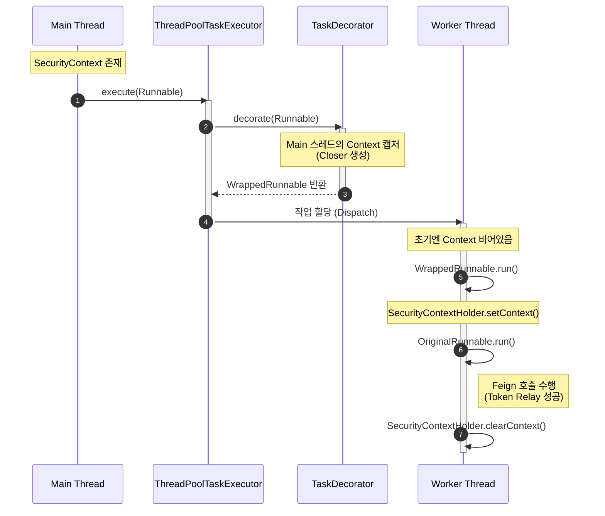

Spring Boot 프로젝트에서 `@Async`를 사용해 비동기 처리를 할 때 흔히 마주하는 문제가 있다.  
동기 로직에서는 잘 동작하던 Security Context나 MDC 로그 추적 ID가 비동기 스레드에서는 사라지는 현상이다.

이번 글에서는 프로젝트 진행 중 겪었던 비동기 Feign Client 호출 시의 401(Unauthorized) 문제와, 이를 `TaskDecorator`로 해결한 과정을 정리한다.

## 비동기 호출과 401 에러

기존 동기(Synchronous) 방식의 로직에서는 `member` 서비스로의 Feign 호출이 정상적으로 이루어졌다.  
그러나 성능 개선을 위해 해당 로직을 `@Async`로 전환하자마자 호출이 실패하고 401 에러가 발생했다.

### 실패 로그 분석

- **동기 호출**: `SecurityContext`에 저장된 인증 토큰이 Feign Interceptor를 통해 정상적으로 헤더에 주입됨.
- **비동기 호출**: 새로운 스레드에서 실행되면서 `SecurityContext`가 비어있음. 토큰이 주입되지 않아 인증 실패.

## ThreadLocal과 스레드 풀

Spring Security의 `SecurityContextHolder`는 기본적으로 **ThreadLocal**을 전략으로 사용하여 인증 정보를 저장한다.

`@Async`가 붙은 메서드는 메인 스레드가 아닌, `ThreadPoolTaskExecutor`가 관리하는 별도의 워커 스레드(Worker Thread)에서 실행된다.  
이 과정에서 메인 스레드의 ThreadLocal 정보(SecurityContext)는 워커 스레드로 100% 자동 복사되지 않는다.

따라서 워커 스레드는 "인증되지 않은 익명 사용자" 상태로 로직을 수행하게 되고, 이 상태에서 나가는 외부 API 호출은 인증 헤더가 없어 거절당한다.

## TaskDecorator

이 문제를 해결하기 위해 Spring은 `TaskDecorator` 인터페이스를 제공한다.  
이름 그대로 "작업(Task)을 꾸며주는(Decorate) 역할"을 한다.

```java
public interface TaskDecorator {
    Runnable decorate(Runnable runnable);
}
```

이 인터페이스의 핵심은 **실행 주체(Executor)와 실행 내용(Runnable) 사이의 가로채기**다. 

- 스레드 풀이 작업을 실행하기 직전(`execute` 호출 시점)에
- 메인 스레드의 컨텍스트를 캡처(Capture)해서
- 워커 스레드가 실행할 `Runnable`을 감싸는(Wrap) 방식이다.

## 구현 상세

### SecurityContext 전파용 Decorator

가장 먼저 필요한 것은 현재 스레드의 인증 정보를 캡처해서, 비동기 스레드 실행 시점에 `SecurityContextHolder`에 넣어주는 데코레이터다.

```kotlin
class SecurityContextDecorator : TaskDecorator {
    override fun decorate(runnable: Runnable): Runnable {
        // 1. (메인 스레드) 현재 SecurityContext를 캡처
        val context = SecurityContextHolder.getContext()

        return Runnable {
            try {
                // 2. (워커 스레드) 실행 직전 Context 복구
                SecurityContextHolder.setContext(context)
                // 3. 원래 작업 실행
                runnable.run()
            } finally {
                // 4. (워커 스레드) 작업 완료 후 정리
                SecurityContextHolder.clearContext()
            }
        }
    }
}
```

### ThreadPoolTaskExecutor

실제 실행은 `ThreadPoolTaskExecutor`가 담당한다.
`TaskDecorator`가 설정되어 있다면, `execute()` 메서드 호출 시점에 데코레이팅 과정이 일어난다.

```java
@Override
public void execute(Runnable command) {
    Runnable decorated = command;
    if (taskDecorator != null) {
        decorated = taskDecorator.decorate(command);
        if (decorated != command) {
            decoratedTaskMap.put(decorated, command);
        }
    }
    super.execute(decorated);
}
```

여기서 중요한 점은 다음과 같다.

- `decorate()`는 작업을 스레드 풀에 넣기 직전에 호출된다.
- 스레드 풀에는 원본 `command`가 아니라, 변환된 `decorated`가 전달된다.
- **실제 스레드에서 실행되는 것은 `decorated` 하나뿐이다.**

따라서 `run()` 메서드는 스레드 풀의 워커 스레드에서 `decorated.run()`이 호출될 때 한 번만 실행된다.

### decoratedTaskMap의 용도

코드에서 `decoratedTaskMap`에 매핑 정보를 저장하는 것을 볼 수 있다.

```java
decoratedTaskMap.put(decorated, command);
```

이 맵은 실행을 위한 것이 아니다. 관리 목적의 추적용 데이터다.

- 스레드 풀 튜닝이나 모니터링 시 원본 작업을 식별하기 위함
- 작업 취소나 종료 시 원본 `Runnable`을 참조하기 위함

실제 비동기 실행 흐름에는 관여하지 않는다.

### 여러 데코레이터의 합성 (Composition)

실무에서는 인증 정보뿐만 아니라 MDC(로깅), Locale 같은 여러 컨텍스트를 전파해야 할 때가 많다.  
하지만 `ThreadPoolTaskExecutor`는 `setTaskDecorator`로 단 하나의 데코레이터만 등록할 수 있다.

이를 해결하기 위해 여러 데코레이터를 하나로 합치는 **Composite 패턴**을 적용했다.

```kotlin
// 의사 코드 (Pseudo code)
val decorators = listOf(
    SecurityContextDecorator(),
    MdcLoggingDecorator()
)

val compositeDecorator = TaskDecorator { original ->
    decorators.fold(original) { runnable, decorator ->
        decorator.decorate(runnable)
    }
}
```

`orderedStream()`으로 순서대로 수집한 뒤, `fold` 함수를 이용해 `Runnable`을 양파 껍질처럼 겹겹이 감싸는 구조로 만들었다.

### ObjectProvider를 통한 선택적 적용

모든 모듈에서 Security가 필요한 것은 아니었다. `common-async` 모듈은 Security 의존성이 없어야 했다.  
따라서 `TaskDecorator` 구현체들은 빈(Bean)으로 등록하되, 주입받는 쪽에서는 `ObjectProvider`를 사용해 유연하게 처리했다.

- Security 모듈이 있으면 `SecurityContextDecorator`가 빈으로 등록됨 -> 적용
- 없으면 빈이 등록되지 않음 -> 무시

## 전체 동작 흐름 요약

이 모든 과정이 합쳐져서 비동기 호출이 성공하는 흐름을 시각화하면 다음과 같다.


