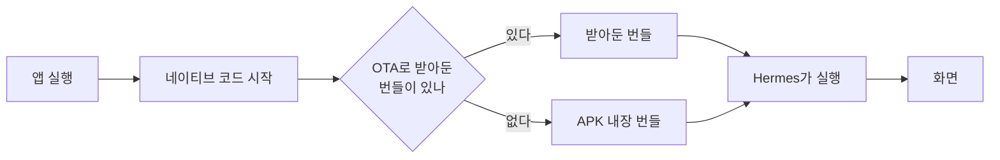

투닥 앱은 화면을 웹에서 띄우는 WebView 셸이다. 직접 쓴 안드로이드 네이티브 코드는 한 줄도 없고, Mac도 Android Studio도 없이 Windows PC 한 대로 빌드해 Play 스토어까지 보낸다. 그것을 가능하게 하는 도구가 Expo와 EAS다.

## Expo와 EAS의 차이

이름이 비슷해서 한 덩어리로 보이지만 서로 다른 층에 있다.

| | Expo | EAS |
|---|---|---|
| 정체 | npm 패키지 묶음. 내 PC에서 실행 | Expo 회사가 운영하는 클라우드. `expo.dev` |
| 비유 | Next.js | Vercel |
| 비용 | 무료 오픈소스 | 무료 한도 + 유료 |
| 필수인가 | 앱이 이것으로 만들어진다 | Android Studio로 직접 빌드해도 된다 |

Expo는 프레임워크고, EAS는 그 프레임워크로 만든 소스를 대신 컴파일해 주는 서비스다. "Expo 서버"라고 부르는 것은 전부 EAS를 가리킨다.

저장소에서 Expo가 담당하는 파일은 넷이다.

| 파일 | 역할 |
|---|---|
| `app.json` | 앱의 정체. 이름, 패키지명, 버전, 아이콘과 스플래시, EAS 프로젝트 ID |
| `app.config.ts` | `app.json`의 동적 확장. 환경변수를 보고 평문 트래픽 예외와 구글 로그인 URL scheme을 주입 |
| `src/app/index.tsx` | Expo Router 화면. 파일 하나가 라우트 하나 |
| `android/`, `ios/` | 저장소에 없다. gitignore이고 Expo가 `app.json`에서 매번 생성한다 |

핵심은 네이티브 프로젝트를 직접 고치지 않는 것이다. `app.json`을 진실의 원천으로 두고 prebuild가 네이티브 프로젝트를 생성한다. 그래서 로컬 `android/`가 낡아 있어도 EAS 빌드 결과는 멀쩡하다. gitignore라 업로드되지 않고 서버가 새로 만들기 때문이다. 반대로 `npx expo run:android`로 로컬 실행을 하려면 네이티브 설정을 바꾼 뒤 `npx expo prebuild --clean`이 필요하다.

## 네이티브 바이너리와 JS 번들

앱은 한 덩어리가 아니다. 같은 커밋에서 나오지만 성질이 다른 두 층이 겹쳐 있다.

```
+-------------------------------------+
|  네이티브 바이너리, 컴파일된 기계어       |   빌드해야만 바뀐다
|  Java/Kotlin, C++, 네이티브 모듈들       |
|  +-------------------------------+   |
|  |  JS 번들, 그냥 텍스트 파일        |   |   갈아끼울 수 있다
|  |  우리가 쓴 TS가 번들링된 것        |   |
|  +-------------------------------+   |
+-------------------------------------+
```

네이티브 앱이 켜지면서 JS 파일을 읽어 실행하는 구조다. JS는 네이티브에게 데이터일 뿐이고, 그 파일만 바꿔치기하는 것이 OTA다.

WebView 앱이라 딱 맞는 비유가 있다. 네이티브 바이너리가 브라우저고 JS 번들이 웹페이지다. 페이지는 언제든 고쳐서 배포할 수 있지만 브라우저에 없는 기능을 쓰면 깨진다. 브라우저를 바꾸려면 사용자가 새 버전을 받아야 하고, 그것이 `eas build`와 스토어 심사다.

### 앱이 켜질 때의 순서



네이티브 코드는 앱 파일에 박혀 있어 실행 시점에 바꿀 수 없다. JS 번들만 두 후보 중에서 고른다.

산출물도 이 구조를 그대로 따른다.

```
eas build    AAB        네이티브와 JS 둘 다. 전체 재조립
eas update   JS 번들만   네이티브는 손대지 않음
```

`eas build`에도 그 시점의 JS가 항상 포함된다. build는 전체고 update는 일부다. 그래서 빌드를 했으면 OTA는 따로 필요 없고, 반대는 성립하지 않는다.

### 파일이 속한 층

| 파일 | 층 | 바꾸면 |
|---|---|---|
| `src/app/index.tsx` | JS | OTA |
| `src/shared/lib/bridge.ts` | JS | OTA |
| `src/shared/config/env.ts` | JS | OTA |
| `package.json`의 네이티브 의존성 | 네이티브 | 빌드 |
| `app.json`의 권한, 아이콘, 스플래시, 버전 | 네이티브 설정 | 빌드 |
| `app.config.ts`의 평문 트래픽 예외와 URL scheme | 네이티브 설정 | 빌드 |

`react-native-webview` 같은 패키지가 경계에 걸친다. 이 패키지 안에는 JS와 Kotlin, ObjC가 같이 들어 있고, JS 쪽은 네이티브에게 WebView를 띄우라고 부르는 얇은 껍질이다. 실제 구현은 바이너리에 미리 컴파일돼 있어야 한다. `import`문만 보면 JS지만 층은 네이티브다.

### 네이티브 코드의 출처

TS만 써도 `node_modules`에는 남이 쓴 네이티브 코드가 잔뜩 들어와 있다. 의존성 13개 중 11개가 네이티브를 품고 있고 순수 JS는 `react` 하나뿐이다.

```
@react-native-google-signin/google-signin   android/ + podspec + config-plugin  (Kotlin/Java 18개)
react-native-webview                        android/ + podspec                  (Kotlin/Java 27개)
react-native                                ReactAndroid/ ReactCommon/          (RN 런타임, C++ 포함)
expo, expo-updates, expo-router, expo-splash-screen, expo-status-bar, expo-dev-client
react-native-safe-area-context, react-native-screens
expo-build-properties                       config-plugin (빌드 설정만 조작)
```

이 코드를 앱으로 만드는 일은 셋으로 나뉜다.

| 누가 | 무엇을 |
|---|---|
| 라이브러리 저자 | 실제 네이티브 기능 구현 |
| Expo의 prebuild | 접착제 생성. `AndroidManifest.xml`, `build.gradle`, `MainActivity`, 권한과 아이콘 리소스 |
| EAS Build | 전부를 Gradle로 컴파일해 AAB로 |

개발자가 하는 일은 고르는 것이다. `package.json`에 한 줄을 추가하는 순간이 네이티브 코드가 앱에 들어오는 순간이고, 그래서 의존성 변경이 재빌드를 요구한다.

접착제를 자동화하는 장치가 config plugin이다. 위 목록에서 `config-plugin`이 붙은 패키지는 나를 설치하면 매니페스트에 이걸 넣으라는 스크립트를 들고 있고, `app.config.ts`의 `plugins` 배열이 그들에게 값을 넘긴다. `android/`를 저장소에 두지 않는 이유가 이것이다. 손으로 고칠 파일이 아니라 매번 생성되는 결과물이다.

### 재빌드를 부르는 것들

라이브러리 코드를 직접 고칠 일은 없다. 그래도 재빌드는 주기적으로 생긴다. 바뀌는 것이 라이브러리 목록과 버전, 설정이기 때문이다.

| 트리거 | 빈도 |
|---|---|
| 네이티브 라이브러리 추가, 삭제 | 드묾. 셸이 고정돼 있다 |
| 네이티브 라이브러리 버전 업 | 드묾 |
| Expo SDK 업그레이드 | 연 1~2회. 전부 재빌드 |
| 아이콘, 스플래시, 앱 이름 | 가끔 |
| 권한, 패키지명, 평문 트래픽 설정 | 드묾 |
| `app.json`의 `version` 올리기 | 릴리스마다 |
| Play의 targetSdk 정책 상향 | 연 1회. 강제 |

마지막 항목이 사각지대다. Play는 매년 최신 API 레벨을 타겟으로 요구하므로, 코드를 한 줄도 바꾸지 않아도 1년에 한 번은 재빌드하고 재제출해야 스토어에 남는다.

아이콘과 스플래시도 놓치기 쉬운 자리다. 이들은 `res/mipmap/`에 들어가는 네이티브 리소스라 OTA로 전달되지 않는다. 아이콘을 바꿔 놓고 OTA만 발행하면 사용자 화면의 아이콘은 그대로다. 참고로 Play 스토어 목록에 뜨는 512x512 아이콘은 또 별개이고, 앱이 아니라 스토어 등록정보에 업로드한다.

### 빌드와 OTA의 판단 기준

> `android/`를 다시 생성했을 때 결과물이 달라지면 빌드, 아니면 OTA.

투닥에서는 대부분의 변경이 둘 다 아니다. 화면과 기능은 웹 저장소에서 배포되고 앱은 손대지 않는다.

## EAS의 세 가지 서비스

두 층의 구분이 EAS 명령어로 그대로 이어진다.

```
EAS Build    소스 업로드, 서버가 android/ 생성, 컴파일, 키스토어로 서명, AAB 산출
             네이티브가 바뀔 때. 10~20분. 스토어 심사 필요

EAS Update   JS 번들만 서버에 올림. 앱이 켜질 때 내려받아 교체
             JS만 바뀔 때. 몇 분. 심사 없음

EAS Submit   서명된 AAB를 서비스 계정 키로 Play API에 밀어넣음
             Play 트랙 지정
```

OTA가 아무 설치본에나 날아가지는 않는다. 빌드할 때 앱에 박히는 채널과 런타임 버전이 수신 조건을 좁히고, 그 값을 정하는 곳이 [`eas.json`](/posts/eas-channel-track)이다.

## 남는 의존

앱은 켜질 때마다 `u.expo.dev`에 OTA를 확인한다. Expo 회사의 서비스 정책과 가용성에 런타임으로 묶여 있고, `expo-updates`는 자체 호스팅도 가능하지만 현재 규모에서는 과하다. 무료 플랜에는 빌드 횟수와 OTA 사용자 수 한도가 있다.
