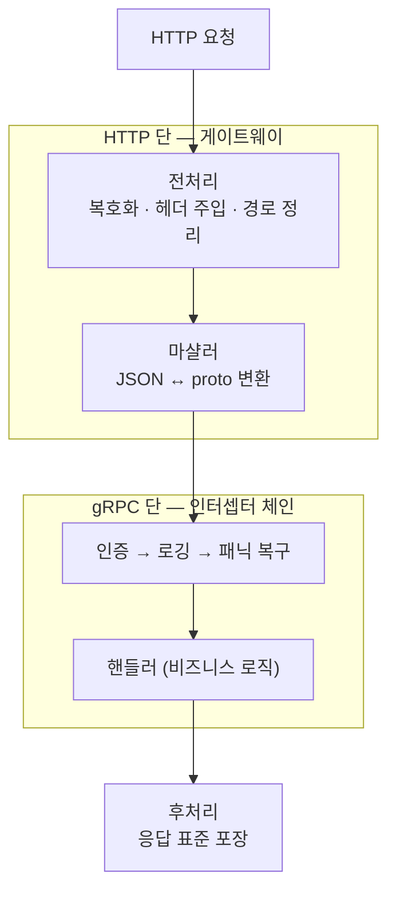
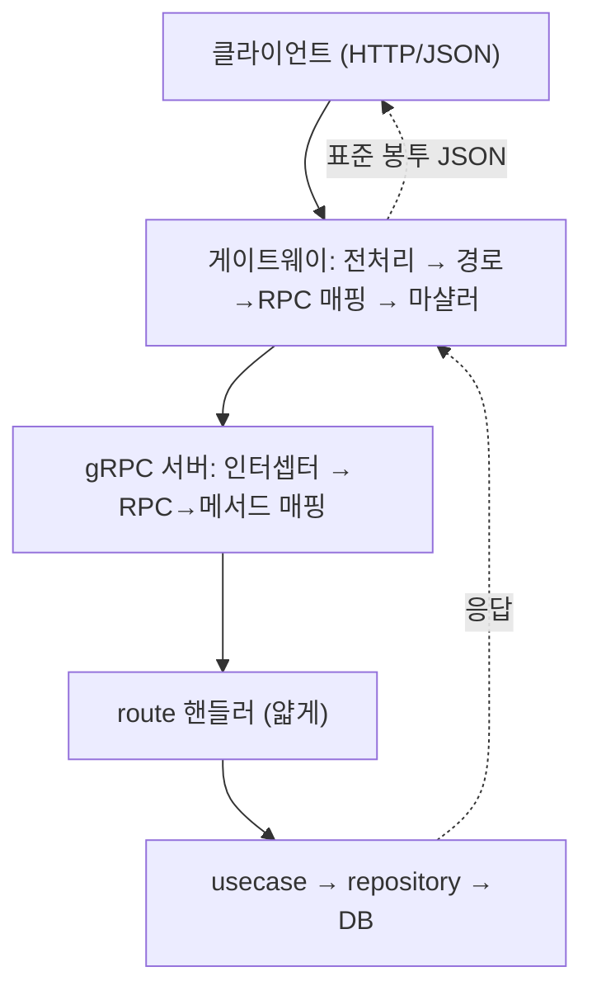

gRPC + grpc-gateway 구조의 Go 서버는 HTTP 게이트웨이가 요청을 받아 gRPC 서버로 넘기고, 거기 있는 핸들러가 요청을 처리한다. 그런데 그 여정에서 게이트웨이와 gRPC 서버는 단순 전달만 하지 않는다. 인증·로깅·복호화·응답 포장 같은 **공통 처리**가 중간중간 끼어든다. Spring의 `Filter`, `Interceptor`, `@ControllerAdvice`, `ResponseBodyAdvice`가 하던 일이 여기선 어디에 있을까?

답은 **두 층**으로 나뉜다. HTTP 단(게이트웨이)과 gRPC 단(인터셉터). 핸들러가 비즈니스 로직만 깔끔하게 다룰 수 있는 건 이 두 층이 잡일을 먼저 처리해 주기 때문이다.

## 1층(HTTP): 전처리 — 요청을 다듬는다

게이트웨이는 라우터(mux)를 바로 노출하지 않고, 그 앞을 **전처리 핸들러**로 감싸는 경우가 많다. Spring의 `Filter`에 해당한다. 요청이 mux에 닿기 전에 거치며 이런 일을 한다.

- **요청 본문 복호화**: 암호화 통신이라면 본문이 암호문으로 오는데, 여기서 평문 JSON으로 푼다. gRPC 핸들러는 평문만 다룬다.
- **추적 정보 주입**: trace ID 등을 헤더에 심어 요청을 추적 가능하게 만든다.
- **경로·쿼리 정리**: 쿼리스트링을 본문에 합치거나, 클라이언트별 경로를 내부 경로로 재작성한다.

핵심은 이 전처리가 **HTTP 헤더에 정보를 심는다**는 점이다. 그런데 gRPC 핸들러는 HTTP 헤더를 직접 보지 못한다. 그 사이를 잇는 게 다음이다.

## 헤더가 gRPC 메타데이터로 넘어간다

gRPC 세계에서 부가 정보는 **메타데이터(metadata)**로 흐른다. HTTP의 헤더에 해당하는 개념이다. 게이트웨이는 HTTP→gRPC 경계를 넘을 때, HTTP 헤더를 gRPC 메타데이터로 **자동 변환**해 컨텍스트에 실어 보낸다.

이때 "어떤 헤더를 넘길지"는 게이트웨이 설정(헤더 매처)으로 거른다. 그래서 전처리에서 심은 trace ID·인증 관련 표시 같은 헤더가 메타데이터가 되어, gRPC 핸들러나 응답 처리 단계에서 컨텍스트로 꺼내 쓸 수 있다.

전처리(HTTP)에서 심고, gRPC 단에서 꺼내는 이 한 쌍이 "요청이 암호화였으니 응답도 암호화" 같은 대칭 처리를 가능하게 한다.

## 마샬러: JSON ↔ proto 변환기

게이트웨이의 본질은 형식 변환이고, 그 변환을 하는 게 **마샬러(marshaler)**다. Spring의 `HttpMessageConverter`, JS의 `JSON.stringify/parse`와 같은 개념이다. 하나의 마샬러가 양방향을 담당한다.

- **Unmarshal**: 들어온 JSON → proto 구조체 (요청)
- **Marshal**: proto 응답 → JSON (응답)

변환 규칙도 설정할 수 있다. enum을 숫자로 낼지 이름으로 낼지, 필드명을 snake_case로 둘지, 값이 비어도 필드를 내보낼지, 모르는 필드를 무시할지 등. 이 설정이 곧 API의 JSON 생김새를 결정한다. 그래서 응답 JSON의 형태가 마음에 안 들면 핸들러가 아니라 마샬러 설정을 봐야 한다.

## 후처리: 응답을 표준 형식으로 포장한다

핸들러는 보통 알맹이(proto 응답)만 반환한다. 회사 표준 응답 형식 — 예컨대 `{ "error": ..., "code": ..., "data": { ... } }` 같은 봉투 — 로 감싸는 일은 **후처리 핸들러**가 한다. Spring의 `ResponseBodyAdvice`에 해당한다.

후처리는 보통 이렇게 흐른다.

1. 핸들러가 반환한 proto 응답을 마샬러로 JSON 변환
2. 표준 봉투의 `data`에 그 JSON을 채움
3. (암호화 요청이었다면) `data`를 다시 암호화
4. 추적 로그를 마감하고 클라이언트에 출력

그래서 핸들러가 봉투를 신경 쓰지 않아도, 모든 응답이 일관된 형식으로 나간다. 경로에 따라 다른 봉투를 써야 하면, 후처리기를 여러 개 등록해 두고 각자 "내 담당 경로가 아니면 넘긴다"는 식으로 나눠 갖기도 한다.

## 2층(gRPC): 인터셉터 체인

gRPC 서버에는 또 다른 공통 처리 층이 있다. gRPC에서 미들웨어를 **인터셉터(interceptor)**라 부르고, 보통 여러 개를 체인으로 엮는다. 모든 RPC가 핸들러 실행 전후로 이 체인을 통과한다.

전형적인 구성은 이렇다.

| 인터셉터 | 역할 | Spring 대응 |
|---|---|---|
| 태그/컨텍스트 | 요청 정보를 로깅 맥락에 부착 | MDC |
| 인증 | 토큰 검증, 경로별 인증 스킵 판단 | 시큐리티 필터 |
| 로깅 | 요청·응답·소요시간 기록 | 로깅 인터셉터 |
| 복구(recovery) | 패닉이 나도 서버가 죽지 않게 잡고 에러로 변환 | `@ControllerAdvice` |

여기서 인증 인터셉터가, 전처리에서 메타데이터로 넘어온 경로 정보를 보고 "이 경로는 인증 면제 목록이니 토큰 검사 스킵" 같은 판단을 한다. 공개 API가 토큰 없이 호출되는 건 이 체인 덕분이다. 복구 인터셉터는 한 요청의 패닉이 서버 전체를 무너뜨리지 않게 막는 안전망이다.

## 어디에 무엇을 두는가

이 구조에서 "내 코드를 어디에 둘지"의 기준이 자연스럽게 나온다.

| 일 | 두는 곳 |
|---|---|
| 복호화·trace·경로 재작성 | 게이트웨이 전처리 (HTTP 단) |
| JSON↔proto 변환 규칙 | 마샬러 설정 |
| 응답 표준 봉투·암호화 | 게이트웨이 후처리 |
| 인증·로깅·패닉 복구 | gRPC 인터셉터 |
| **비즈니스 규칙·판단** | **usecase (절대 위 계층에 두지 않는다)** |

전송·공통 처리는 게이트웨이와 인터셉터가 맡고, 핸들러는 받아서 usecase에 넘기는 일만 한다. 그래서 핸들러가 얇게 유지된다.

## 요청 하나의 전체 지도

지금까지 본 공통 처리를 요청 흐름 위에 얹어 한 장으로 모으면 이렇다.

이 그림에서 핵심은, 핸들러 양옆의 일이 전부 **이미 깔려 있는 공통 길**이라는 점이다. 전처리·마샬링·인터셉터·응답 포장은 게이트웨이와 gRPC 서버가 공통으로 처리하고, 핸들러는 받아서 usecase에 넘기는 일만 한다. 그래서 새 엔드포인트를 만들 때 이 공통 계층을 매번 손댈 필요가 없고, 핸들러와 usecase에만 집중하면 된다.

