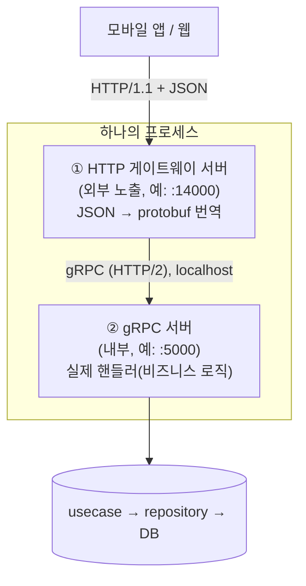

Spring 개발자가 규모 있는 Go 서버를 처음 열면 `@RestController`도, `@GetMapping`도, URL 문자열조차 코드에서 잘 안 보인다. 분명 `POST /api/notices`로 호출되는 API인데, 그 경로를 코드에서 검색해도 안 나온다. 어디서 받아서 어디로 흐르는 걸까?

이 흐름을 이해하려면 먼저 한 가지 사실부터 받아들여야 한다. **이런 서버는 한 프로세스 안에서 서버를 두 개 띄운다.** 이 글은 왜 둘인지, 둘이 어떻게 협력하는지를 정리한다.

## 먼저: 이건 "무거운 구성"이다

오해를 막기 위해 분명히 해 두면, 아래에서 설명하는 구성은 **Go 서버의 표준이 아니다.** Go 서버는 규모에 따라 천차만별이다.

| 규모 | 전형적인 구성 |
|---|---|
| 소규모 | `net/http` 표준 라이브러리만, 파일 한두 개 |
| 보통 | gin/echo 같은 프레임워크 하나 + 핸들러·서비스·repository 계층 |
| 대규모 | gRPC + grpc-gateway + IDL 코드 생성 + DI + 클린 아키텍처 |

대부분의 실무 Go API 서버는 가운데(gin + 계층 분리)에 가깝다. gRPC와 grpc-gateway는 **서비스가 여러 개이고 서비스 간 통신이 잦은 MSA 환경**에서 택하는 무거운 구성이다. 작은 프로젝트가 이렇게 하면 오버엔지니어링이다. 그러니 "Go는 이렇게 한다"가 아니라 "이런 구성을 쓰는 서버는 이렇게 흐른다"로 읽어야 한다.

## gRPC는 HTTP를 안 쓰는 게 아니다

흔한 오해부터 풀자. gRPC는 HTTP를 대체하는 별도 프로토콜이 아니다. **gRPC = HTTP/2 + Protobuf**다.

- 전송 계층: HTTP/2 (멀티플렉싱·스트리밍을 쓰는, HTTP/1.1의 개선 버전)
- 데이터 형식: Protobuf (사람이 못 읽는 바이너리. JSON보다 작고 빠름)

즉 gRPC 통신도 사실은 HTTP/2 요청이다. HTTP/2는 gRPC 전용이 아니라 범용 프로토콜이고, gRPC는 그 위에서 도는 여러 방식 중 하나일 뿐이다. "gRPC라서 HTTP/2를 쓴다"가 아니라 "HTTP/2라는 도로 위에서 gRPC가 달린다"가 맞다.

## 그런데 클라이언트는 gRPC를 안 쓰고 싶어 한다

문제는 여기다. 모바일 앱·웹 같은 클라이언트는 대개 익숙한 **HTTP/1.1 + JSON**으로 통신하길 원한다. 브라우저는 gRPC를 직접 쓰기도 까다롭다. 그렇다고 서버 로직을 REST용·gRPC용으로 두 번 짤 수는 없다.

그래서 **grpc-gateway**라는 도구를 앞에 세운다. 역할은 단순하다.

> HTTP/JSON 요청을 받아서 gRPC 호출로 번역해 주고, gRPC 응답을 다시 JSON으로 바꿔 돌려준다.

로직은 gRPC로 한 벌만 구현하고, 그 앞에 "HTTP 창구"를 두는 것이다. 이 덕분에 같은 기능을 gRPC로도, HTTP/JSON으로도 쓸 수 있다.

## 그래서 서버가 둘이다

이 구조에서 한 프로세스는 서버를 두 개 띄운다.



- **① 게이트웨이**: 클라이언트가 직접 만나는 입구. 번역기.
- **② gRPC 서버**: 실제 로직이 사는 곳. 외부에 직접 노출되지 않고, 게이트웨이가 `localhost`로 호출한다.

둘이 같은 포트 번호를 공유하는 코드를 보게 되는데(게이트웨이가 "5000번으로 보낼게", gRPC 서버가 "5000번에서 들을게"), 이는 같은 머신 안에서 루프백으로 서로를 부르기 때문이다.

## 결국 서버를 띄우는 건 표준 라이브러리다

여기서 Spring과 결정적으로 다른 점 하나. Go에는 톰캣 같은 별도 WAS가 없다. **HTTP 서버 자체가 표준 라이브러리(`net/http`)에 함수로 들어 있고, 그 함수를 직접 호출해 서버를 켠다.**

```go
http.ListenAndServe(":14000", httpMux)  // 이 한 줄이 곧 HTTP 서버
```

이 호출이 톰캣이 하던 일(소켓 열기, 요청 파싱, 동시 처리)을 전부 한다. gRPC 서버도 마찬가지로 `Serve(listener)` 한 줄로 가동된다. 둘 다 무한 루프(블로킹)라, 보통 각각 별도 고루틴(`go ...`)으로 띄워 동시에 돌린다.

그리고 한 가지 더 — gin 같은 프레임워크나 grpc-gateway도 **자기가 서버를 띄우는 게 아니라**, 결국 `net/http` 위에 얹힌 핸들러일 뿐이다. Go의 HTTP 세계는 `http.Handler`라는 인터페이스 하나로 통일돼 있어서, 게이트웨이 라우터든 gin 엔진이든 전부 `http.Handler`로서 같은 `net/http` 서버에 꽂힌다. 그래서 한 포트 안에서 경로에 따라 "이건 게이트웨이가, 저건 gin이" 나눠 처리하는 구성도 가능하다.

## Spring과의 대응

| 역할 | Spring | 이 구조 |
|---|---|---|
| HTTP 서버 엔진 | 톰캣 (별도 WAS) | `net/http` (표준 라이브러리) |
| 서버 기동 | 톰캣이 자동 | `ListenAndServe` / `Serve` 직접 호출 |
| 외부 요청 입구 | 톰캣 + DispatcherServlet | grpc-gateway (HTTP→gRPC 번역) |
| 실제 로직 처리 | 컨트롤러 | gRPC 서버의 핸들러 |

