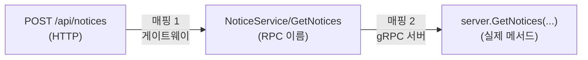
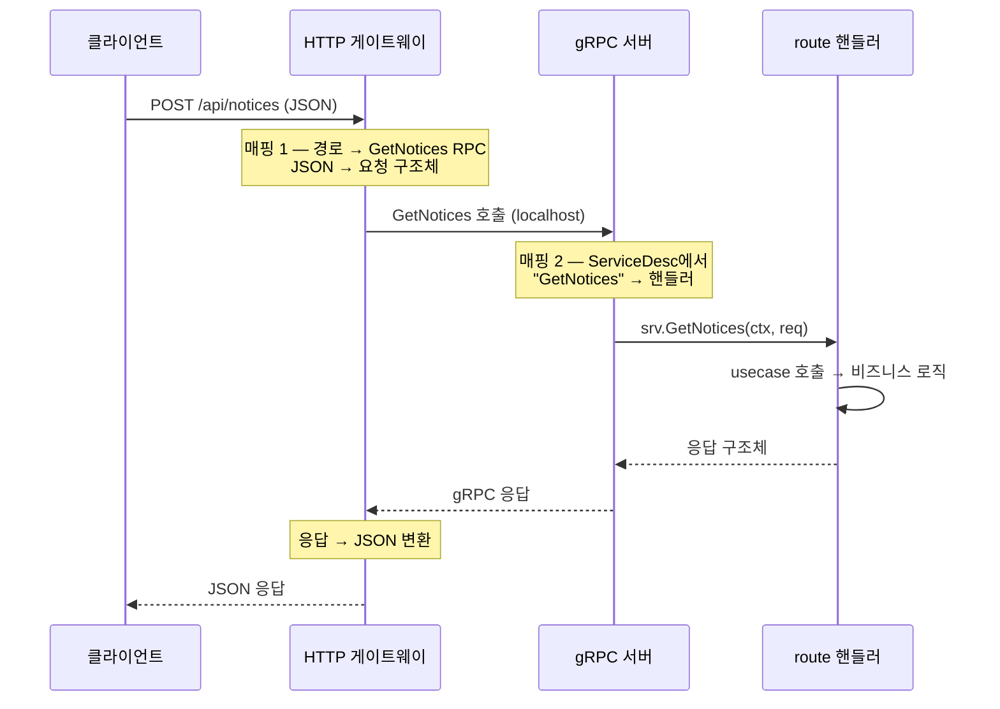

gRPC + grpc-gateway 구조의 Go 서버는 두 개의 서버가 한 프로세스에서 함께 돈다. 외부 요청을 받는 **HTTP 게이트웨이**와, 실제 핸들러가 사는 **gRPC 서버**다. 게이트웨이가 HTTP/JSON 요청을 받아 gRPC로 번역해 넘기는 구조다. 그리고 URL·메서드·메시지 타입은 proto 정의에서 코드로 생성된다.

이 전제 위에서 한 가지를 추적해 보자. 실행 시점에 `POST /api/notices`라는 HTTP 요청이 어떻게 `GetNotices`라는 함수까지 정확히 도달할까?

핵심은 이거다. **매핑은 한 번이 아니라 두 번 일어난다.** 서버가 둘이라 경계를 넘을 때마다 한 번씩 변환된다.



- **매핑 1**: HTTP 경로 → RPC 이름 (게이트웨이가 함)
- **매핑 2**: RPC 이름 → 실제 메서드 (gRPC 서버가 함)

Spring은 `@PostMapping`을 스캔해 "URL → 메서드" 표를 한 번에 만든다. 여기선 그 표가 둘로 나뉘고, 둘 다 proto에서 생성된 코드 안에 있다.

## 먼저: 등록이 두 곳에서 일어난다

매핑 표는 그냥 존재하는 게 아니라, 서버를 띄울 때 **등록(register)**해야 채워진다. 그리고 등록도 두 곳이다. 이름이 비슷해서 헷갈리기 쉽다.

```go
// ① gRPC 서버에 등록 — 매핑 2를 채운다
RegisterNoticeServiceServer(grpcServer, noticeHandler)

// ② HTTP 게이트웨이(mux)에 등록 — 매핑 1을 채운다
RegisterNoticeServiceHandlerFromEndpoint(ctx, mux, "localhost:5000", opts)
```

| 함수 | 첫 인자 | 채우는 매핑 |
|---|---|---|
| `RegisterXxxServer` | gRPC 서버 | 매핑 2 (RPC → 메서드) |
| `RegisterXxxHandlerFromEndpoint` | HTTP 라우터(mux) | 매핑 1 (경로 → RPC) |

`...Server`는 gRPC 쪽, `...HandlerFromEndpoint`는 HTTP 쪽이다. 둘 다 proto에서 생성된 함수이고, 우리는 "어디에 등록할지"(서버 / mux)와 "무엇을"(핸들러 구현 / gRPC 주소)만 넘긴다. 서비스가 여러 개면 이 줄이 서비스 수만큼 반복된다 — 한 줄이 서비스 하나의 모든 RPC를 통째로 등록한다.

## 매핑 1: HTTP 경로 → RPC

게이트웨이 라우터(mux)에는 proto의 `http option`에서 생성된 URL 패턴이 등록돼 있다. 개념적으로는 이런 항목이다.

```
{ POST, "/api/notices" } → GetNotices 를 호출하는 함수
```

HTTP 요청이 오면 mux가 메서드+경로로 이 항목을 찾아 실행한다. 그 함수는 내부에서 JSON 본문을 요청 구조체로 디코딩한 뒤, `localhost:5000`의 gRPC 서버로 `GetNotices` 호출을 보낸다. 여기까지가 "HTTP를 gRPC로 번역"하는 부분이다. Spring의 `@PostMapping("/api/notices")` 매핑 테이블에 해당한다.

## 매핑 2: RPC → 실제 메서드 (ServiceDesc)

진짜 "메서드 매핑"의 심장은 여기다. gRPC 서버는 **ServiceDesc**라는 표를 들고 있다. proto에서 생성된 이 표는 "RPC 이름 → 핸들러 함수" 목록이다.

```go
// 생성된 코드 (개념)
ServiceName: "api.v1.NoticeService",
Methods: []grpc.MethodDesc{
    { MethodName: "GetNotices", Handler: _NoticeService_GetNotices_Handler },
    { MethodName: "GetBanners", Handler: _NoticeService_GetBanners_Handler },
    // proto의 모든 rpc
}
```

전화번호부와 똑같다. RPC 요청이 `"GetNotices"`라는 이름을 달고 오면, 서버가 이 표에서 그 이름을 찾아 옆에 적힌 핸들러를 실행한다. 이 표는 `RegisterNoticeServiceServer`를 호출할 때 서버에 등록된다.

그 핸들러(`_NoticeService_GetNotices_Handler`)가 하는 일은 단순하다. 요청을 디코딩하고, **우리가 구현한 메서드를 호출**한다.

```go
// 생성된 핸들러 (개념)
func _NoticeService_GetNotices_Handler(srv interface{}, ctx, dec, ...) {
    in := new(GetNoticesRequest)
    dec(in)                              // 요청 디코딩
    return srv.(NoticeServiceServer).GetNotices(ctx, in)  // ← 우리 메서드 호출
}
```

여기서 `srv`는 `RegisterNoticeServiceServer(grpcServer, noticeHandler)`로 넘긴 `noticeHandler`, 즉 우리가 구현한 구조체다. 그래서 `srv.GetNotices(...)`가 곧 우리 코드의 메서드를 부른다. 매핑의 종착점이다.

## 왜 이름이 다 똑같을까

이게 전체 연결의 비밀이다. proto에 `rpc GetNotices`라고 **한 번** 적으면, 생성된 모든 곳에 같은 이름 `GetNotices`로 코드가 박힌다.

- HTTP 라우트도 `GetNotices`로 연결 (매핑 1)
- ServiceDesc의 `MethodName: "GetNotices"` (매핑 2)
- 그 핸들러가 부르는 `srv.GetNotices(...)`
- 우리가 구현하는 `func (s *server) GetNotices(...)`

같은 이름이 proto부터 우리 메서드까지 일직선으로 관통하기 때문에 자동으로 이어진다. "왜 이름을 맞춰야 하나"의 답이 여기 있다 — 이름이 곧 매핑의 키다. 그리고 proto에서 생성된 서버 인터페이스가 이 이름·시그니처를 컴파일 단계에서 강제하므로, 메서드를 빠뜨리거나 시그니처를 틀리면 빌드가 막힌다.

## 요청 하나의 전체 흐름

지금까지의 두 매핑을 한 장으로 이으면 이렇다.



