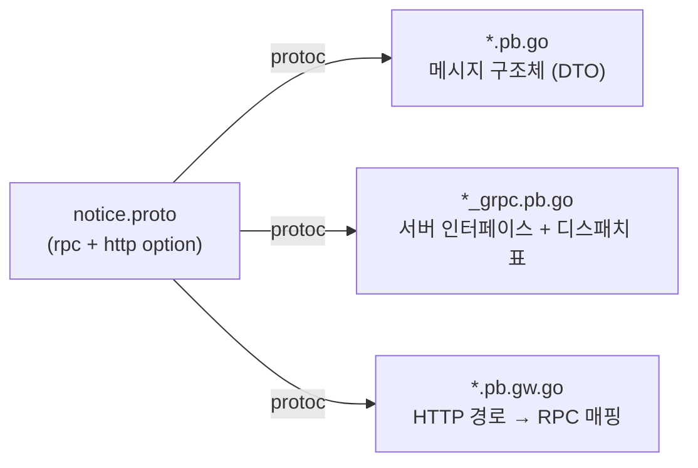

gRPC + grpc-gateway로 만든 Go 서버를 처음 열면 당황스러운 점이 하나 있다. `POST /api/notices`라는 URL도, 그 핸들러를 연결하는 매핑 코드도 프로젝트에서 검색이 안 된다. Spring이라면 `@PostMapping("/api/notices")`가 어딘가 있을 텐데, 여기엔 없다.

답은 **proto 파일**에 있다. gRPC + grpc-gateway 구조에서 proto는 단순한 스키마 정의가 아니라, **API의 단일 진실의 원천(single source of truth)**이다. URL·메서드·요청/응답 타입·서버 인터페이스가 전부 여기서 나온다.

## proto에 적는 "규약"

proto 파일에는 서비스와 그 안의 RPC(원격 호출 가능한 메서드)를 선언한다. 핵심은 RPC 하나에 HTTP 매핑을 함께 붙이는 부분이다.

```protobuf
service NoticeService {
  rpc GetNotices(GetNoticesRequest) returns (GetNoticesResponse) {
    option (google.api.http) = {
      post: "/api/notices"
      body: "*"
    };
  }
}

message GetNoticesRequest {
  int32 source_country = 1;
}

message GetNoticesResponse {
  repeated Notice list = 1;
}
```

이 한 덩어리가 세 가지 약속을 동시에 담는다.

| proto에 적은 것 | 무엇을 정하나 |
|---|---|
| `service NoticeService` | 서비스(컨트롤러) 그룹 |
| `rpc GetNotices(Req) returns (Res)` | 메서드 이름과 입출력 타입 |
| `option http { post: "/api/notices" }` | 이 RPC를 어떤 HTTP URL에 노출할지 |

Spring의 `@PostMapping`이 메서드 위 한 줄이라면, 여기선 그 정보가 proto의 `option`으로 빠져나온 셈이다.

## protoc가 코드를 생성한다

proto는 그 자체로 실행되지 않는다. `protoc`(proto 컴파일러)가 proto를 읽어 **Go 코드를 자동 생성**한다. 보통 세 종류가 나온다.



- `*.pb.go` — 요청/응답 구조체. `param.GetSourceCountry()` 같은 접근자도 여기서 생성된다.
- `*_grpc.pb.go` — 뒤에서 자세히 볼 **서버 인터페이스**와, "RPC 이름 → 핸들러" 매핑 표.
- `*.pb.gw.go` — `POST /api/notices`를 받아 `GetNotices` 호출로 잇는 게이트웨이 코드.

즉 "코드에 URL이 없다"고 느끼는 이유가 여기 있다. URL 매핑은 사람이 쓴 게 아니라 **proto에서 생성된 `*.pb.gw.go`에 들어 있다.** 그래서 직접 작성한 소스에는 안 보인다.

## 보통 IDL은 별도 레포에 있다

규모 있는 조직에서는 이 proto와 생성 코드를 **별도 저장소(IDL 레포)**에 둔다. 여러 서비스가 같은 API 계약을 공유해야 하기 때문이다.

```
[IDL 레포]                         [서버 레포]
proto 정의 + 생성된 *.pb.go   ──의존성──>  생성 코드를 가져다 import
(API 계약의 원본)                        (계약대로 구현)
```

서버 레포의 import 경로를 보면 구분이 된다. `.../idl/gen/go/...`처럼 IDL 레포에서 온 것은 생성 코드(계약)이고, `.../<우리서버>/...`로 시작하면 우리가 직접 쓴 코드다. proto가 바뀌면 IDL을 다시 빌드해 버전을 올리고, 서버 레포는 그 버전을 받아 쓴다. 커밋 로그에 "IDL 버전 업" 같은 게 자주 보이는 건 이 구조 때문이다.

## 인터페이스로 구현을 강제한다

여기가 흐름 이해의 핵심이다. 레포가 분리돼 있으니 "어딘가의 메서드를 자동으로 가져다 연결"하는 방식이 아니다. 대신 생성 코드가 **서버 인터페이스**를 만들어 구현을 강제한다.

`*_grpc.pb.go`에는 이런 인터페이스가 생성된다.

```go
// 생성된 코드
type NoticeServiceServer interface {
    GetNotices(context.Context, *GetNoticesRequest) (*GetNoticesResponse, error)
    // proto에 선언한 모든 rpc가 여기 메서드로 들어온다
}
```

우리 서버 레포에서는 이 인터페이스를 만족하는 구조체에 메서드를 구현한다.

```go
// 우리 코드 — 시그니처를 인터페이스와 정확히 맞춰야 한다
func (s *server) GetNotices(ctx context.Context, req *GetNoticesRequest) (*GetNoticesResponse, error) {
    // ... 실제 로직
}
```

Go는 `implements` 키워드가 없다. 메서드 시그니처만 맞으면 자동으로 그 인터페이스를 만족한 것으로 본다(암묵적 충족). 그래서 서버를 등록할 때 이 구조체를 인터페이스 자리에 넘기는데, 만약 메서드 하나라도 빠지거나 시그니처가 틀리면 **컴파일이 안 된다.**

이 점이 중요하다. proto에 RPC를 추가하면 인터페이스에 메서드가 늘고, 서버 레포에서 그 메서드를 구현하지 않으면 빌드가 막힌다. 사람이 이름을 맞춰 구현하지만, **실수는 런타임이 아니라 컴파일 단계에서 잡힌다.**

## 실전: 새 API를 추가하는 흐름

그래서 이 구조에서 API 하나를 추가하는 작업은 이렇게 흐른다.

```
1. IDL 레포: proto에 rpc + http option 추가
     rpc GetNotices(GetNoticesRequest) returns (GetNoticesResponse) {
       option http { post: "/api/notices" }
     }
2. protoc로 코드 생성
     → 서버 인터페이스에 GetNotices 추가
     → DTO, HTTP 매핑, 디스패치 표 자동 생성
3. IDL 버전 업 → 서버 레포에서 새 버전 받기
4. 서버 레포: 인터페이스에 맞춰 GetNotices 메서드 구현
     (시그니처 안 맞으면 컴파일 에러로 막힘)
5. 빌드 성공 = 계약대로 구현됨
```

Spring처럼 컨트롤러에 어노테이션 한 줄 붙이는 것과는 결이 다르다. **계약(proto)을 먼저 합의하고, 그 계약이 코드 생성으로 강제되는** 방식이다. API 명세가 proto로 단일화되니 클라이언트·서버가 같은 정의를 공유한다는 장점이 있다.

