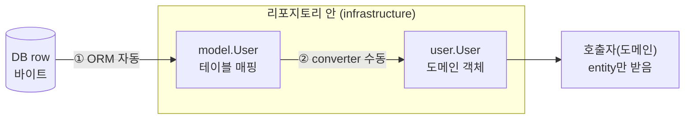

클린 아키텍처를 따르는 프로젝트는 도메인 객체(entity)와 DB 매핑 객체(model)를 **의도적으로 분리**한다. 둘을 따로 두고 그 사이를 변환기(converter)로 잇는다. 이 글은 Go 프로젝트를 기준으로 왜 굳이 나누는지, 그 비용은 무엇인지 정리한다.

## entity — 순수한 도메인 객체

entity는 비즈니스 규칙을 담은 객체다. DB를 전혀 모른다.

```go
package user

type User struct {
    id        int64    // 전부 소문자 = 비공개
    email     string
    failCount int
    locked    bool
}

// 규칙이 메서드로 들어 있다
func (u *User) FailLogin() {
    u.failCount++
    if u.failCount >= 5 {
        u.locked = true   // 5회 실패하면 잠금
    }
}

func (u *User) ID() int64 { return u.id }   // 읽기는 getter로
```

필드가 전부 비공개(소문자)이고 getter와 메서드로만 접근한다. 무엇보다 **ORM 태그가 하나도 없다.** "로그인 5회 실패 시 잠금" 같은 규칙이 이 안에 메서드로 산다. 스프링으로 치면 DDD 스타일의 rich domain 객체다.

## model — DB 테이블 매핑

model은 테이블 모양 그대로의 구조체다. 로직은 없고 매핑 태그만 있다.

```go
package model

type User struct {
    ID        int64  `db:"id"`
    Email     string `db:"email"`
    FailCount int    `db:"fail_count"`
    Locked    bool   `db:"locked"`
}
```

`db:"..."` 태그(ORM마다 문법은 다르다)가 스프링의 `@Column`에 해당한다. ORM은 이 태그를 리플렉션으로 읽어 "DB의 `fail_count` 컬럼 ↔ 구조체의 `FailCount` 필드"를 짝짓는다. 쿼리 결과를 구조체에 채우는 일도, 구조체로 INSERT 문을 만드는 일도 라이브러리가 이 태그를 보고 자동으로 한다.

## converter — 둘을 잇는 변환기

entity와 model이 분리돼 있으니, 둘 사이를 오가는 변환기가 필요하다.

```go
func toModel(u user.User) model.User {
    return model.User{
        ID:        u.ID(),
        Email:     u.Email(),
        FailCount: u.FailCount(),
        Locked:    u.Locked(),
    }
}

func toEntity(m model.User) user.User {
    return user.NewBuilder().
        ID(m.ID).Email(m.Email).
        FailCount(m.FailCount).Locked(m.Locked).
        Build()
}
```

저장할 땐 `toModel`, 조회할 땐 `toEntity`. 필드 이름이 양쪽에서 달라도(예: 도메인은 `hashedPassword`, 컬럼은 `password_digest`) 이 변환기가 흡수한다. 암복호화나 타입 변환 같은 변환 로직을 끼워 넣을 자리이기도 하다.

## 흐름 — DB 결과는 두 번 변환된다

조회 한 번이 어떤 경로를 타는지 보면 책임이 명확해진다.



- **①은 라이브러리 몫이다.** 와이어 프로토콜 파싱, 타입 변환(`bigint`→`int64`, NULL→포인터), 태그 기반 컬럼 매칭 — DB와 맞닿는 지저분한 일은 ORM이 다 한다. 스프링의 하이버네이트가 ResultSet을 엔티티에 매핑해 주는 것에 해당한다.
- **②만 우리가 손으로 짠다.** model을 도메인 객체로 옮기는 부분이다.

저장은 정확히 반대 방향이다. `entity → toModel → model → ORM이 INSERT 생성 → DB`.

## 리포지토리 — 경계를 지키는 곳

리포지토리는 이 변환을 수행하면서, 바깥(도메인)에는 **항상 entity만** 주고받는다.

```go
func (r *userRepo) Find(ctx context.Context, id int64) (user.User, error) {
    var m model.User                                   // model은 함수 안에서만
    err := conn(ctx, r.db).                             // tx 있으면 tx, 없으면 풀
        QueryRowContext(ctx, "SELECT ... WHERE id=$1", id).
        Scan(&m.ID, &m.Email, &m.FailCount, &m.Locked)
    if err != nil {
        return user.User{}, err
    }
    return toEntity(m), nil                             // 반환 직전 entity로
}
```

`model.User`는 함수 안에서 태어나 함수 안에서 사라진다. 반환 타입은 `user.User`(entity)다. 이게 규칙이다 — **model은 리포지토리 밖으로 절대 새어 나가지 않는다.**

왜 이렇게까지 하냐면, 리포지토리의 계약(인터페이스)이 도메인 쪽에 있기 때문이다.

```go
// 도메인이 소유한 포트. ORM을 모른다.
type UserRepository interface {
    Find(ctx context.Context, id int64) (user.User, error)
}
```

유스케이스는 이 인터페이스만 본다. 인터페이스가 entity를 반환한다고 약속했으니 구현은 거기 맞춰야 하고, 만약 model을 반환하면 유스케이스가 ORM 타입을 import하게 되어 "도메인은 DB를 모른다"는 원칙이 깨진다. 분리의 목적은 결국 이 한 줄이다 — **도메인 코드가 특정 DB 라이브러리에 묶이지 않게 한다.**

## 비용 — 보일러플레이트는 정직하게 늘어난다

이 패턴은 공짜가 아니다. 도메인 하나를 추가할 때마다 만들어야 하는 세트가 있다.

1. `entity` — 도메인 객체 (+ Builder)
2. `model` — 매핑 태그 붙은 구조체
3. `converter` — `toModel` / `toEntity` 양방향
4. `repository` — 인터페이스 + 구현

스프링이라면 1·2가 `@Entity` 하나로 합쳐지고 3은 통째로 사라질 분량이다. 필드 하나를 추가할 때도 entity·model·converter 양방향까지 여러 곳을 고쳐야 하고, 한 군데를 빠뜨리면 **컴파일은 되는데 값이 조용히 누락되는** 버그가 난다. 구조체 필드를 안 채우면 zero value가 들어가는 게 Go에선 정상 동작이라 컴파일러가 못 잡는다. 그래서 converter는 "모든 필드를 채운 entity → model → entity 왕복 후 같은지" 비교하는 단위 테스트로 지켜 주는 게 정석이다.

자바 진영의 MapStruct처럼 이 변환 코드를 생성해 주는 도구가 Go에도 있다(goverter 등). 손으로 짤지 생성할지는 팀의 선택이다.

## 거대 리포지토리라는 함정

분리 자체와는 별개로, 리포지토리를 **어떤 단위로 쪼개느냐**도 중요하다. 흔한 실수는 모든 도메인의 쿼리를 인터페이스 하나에 합치는 것이다.

```go
// 안티패턴: 메서드 수백 개짜리 god repository
type Repository interface {
    FindUser(...) ...
    CreateOrder(...) ...
    UpdateCoupon(...) ...
    // ... 수십 개 도메인이 한 인터페이스에
}
```

이러면 유스케이스 하나가 실제로 쓰지도 않는 수백 개 메서드에 의존하게 된다(인터페이스 분리 원칙 위반). 목(mock)도 거대해진다. 이런 구조는 보통 처음부터 의도한 게 아니라, 한 인터페이스에 계속 메서드를 더하다 커진 결과다.

대안은 **엔티티(또는 애그리거트)마다 작은 리포지토리**를 두는 것이다. 스프링 데이터의 `interface UserRepository extends CrudRepository<User, Long>`와 같은 발상이다. Go에서는 제네릭으로 기본 CRUD를 한 번만 구현해 공유할 수도 있다.

```go
// 기본 CRUD를 제네릭 base로 (E=entity, M=model, I=id)
type base[E, M, I any] struct {
    db        *sql.DB
    converter Converter[E, M, I]
}
func (b *base[E, M, I]) Create(ctx context.Context, e E) (E, error) { ... }
func (b *base[E, M, I]) FindByID(ctx context.Context, id I) (E, error) { ... }

// 도메인별 리포지토리는 base를 묻어 두고 커스텀 쿼리만 추가
type userRepo struct {
    *base[user.User, model.User, int64]
}
func (r *userRepo) FindByEmail(ctx context.Context, email string) (user.User, error) { ... }
```

`CrudRepository`가 `save`/`findById`를 거저 주듯, 제네릭 `base`가 `Create`/`FindByID`를 준다. 다만 스프링 데이터처럼 메서드 이름(`findByEmailAndLocked`)으로 쿼리를 만들어 주는 마법은 없다. 커스텀 쿼리는 전부 손으로 SQL을 쓴다.
