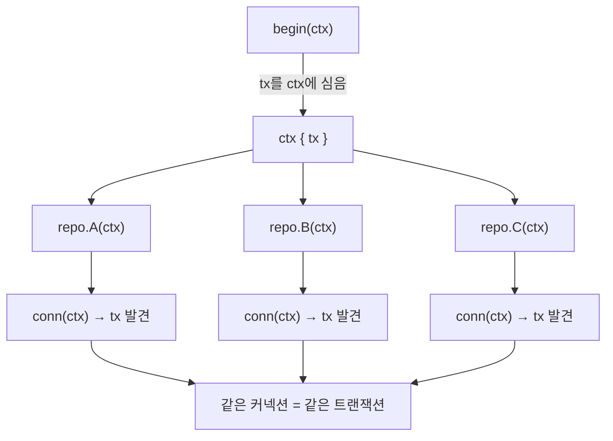
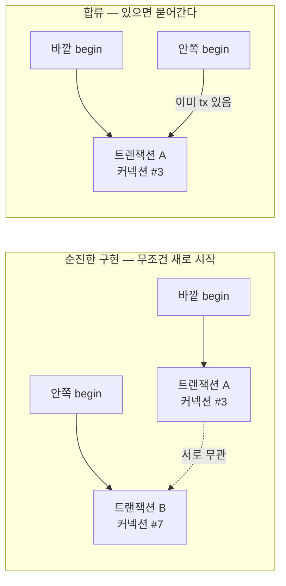

스프링에서 트랜잭션은 `@Transactional` 한 줄이다. 프록시가 메서드 앞에서 트랜잭션을 열고, 정상 종료하면 커밋하고, 예외가 나면 롤백한다. 어떻게 일어나는지 안 보여도 된다. Go에는 그런 어노테이션 마법이 없다. 트랜잭션의 시작·커밋·롤백을 코드로 직접 다루고, "지금 트랜잭션 안인지"도 직접 전파한다. 이 글은 그 메커니즘을 커넥션 풀부터 차근히 정리한다.

## 먼저 커넥션 풀

트랜잭션을 이해하려면 커넥션 풀부터 봐야 한다. 스프링의 `DataSource`(HikariCP)에 해당하는 것이다.

```go
db, err := sql.Open("postgres", dsn)   // database/sql 기준
db.SetMaxOpenConns(20)                  // 풀 최대 커넥션 수
```

여기서 `sql.Open`은 이름과 달리 **DB에 연결하지 않는다.** 메모리에 "최대 20개까지 담을 수 있는 빈 커넥션 바구니 + 접속 정보"만 만든다. 실제 TCP 연결과 인증은 첫 쿼리가 나갈 때 lazy하게 일어난다. 이렇게 만들어진 `db` 하나를 앱 전체가 싱글톤으로 공유한다.

커넥션을 "만든다"는 건 가벼운 일이 아니다. DB 서버로 TCP 연결을 맺고(3-way handshake), 인증을 주고받고, 세션 파라미터를 교환해야 한다. 이게 비싸서 매 쿼리마다 새로 맺지 않고 풀에 모아 재사용하는 것이다.

```go
db.QueryContext(ctx, "SELECT ...")
// ① 풀에서 유휴 커넥션 하나 꺼냄 (없으면 새로 만들거나 대기)
// ② 그 커넥션으로 쿼리 실행
// ③ 끝나면 커넥션을 풀에 반납 (끊지 않음)
```

빌리고-쓰고-반납하는 이 과정은 라이브러리가 알아서 한다. 애플리케이션 코드는 "풀 안의 어떤 커넥션이냐"를 알 필요도, 알 방법도 없다.

## 트랜잭션은 커넥션 위의 상태다

트랜잭션의 핵심 사실 하나. **트랜잭션은 하나의 커넥션(세션)에 묶인 상태다.** `BEGIN`을 보낸 그 커넥션으로만 이어지는 쿼리가 같은 트랜잭션에 속하고, 커밋 전의 변경분은 그 커넥션에서만 보인다.

그래서 트랜잭션을 시작한다는 건 풀에서 커넥션 하나를 **점유**한다는 뜻이다.

```go
tx, err := db.BeginTx(ctx, nil)
// 풀에서 커넥션 하나를 체크아웃하고, 그 커넥션으로 "BEGIN" 전송.
// 이 순간부터 commit/rollback 전까지 이 커넥션은 풀로 돌아가지 않는다.
```

`tx`는 사실상 "커넥션 + 진행 중인 트랜잭션 상태"를 감싼 핸들이다. 이후 모든 쿼리는 반드시 이 `tx`로 나가야 같은 트랜잭션에 묶인다. 중간에 한 쿼리가 풀의 다른 커넥션으로 새면, 그 쿼리는 트랜잭션 밖에서 도는 것이라 변경 전 데이터를 보거나 커밋/롤백 대상에서 빠진다.

여기서 비용도 드러난다. 트랜잭션은 커넥션을 독점하므로, 풀 크기가 20인데 트랜잭션 20개가 동시에 오래 열려 있으면(예: 트랜잭션 안에서 외부 API 호출) 풀이 말라 나머지 요청이 전부 대기한다. **트랜잭션 범위를 짧게 가져가라**는 원칙이 여기서 나온다.

## context로 "지금 트랜잭션 안인지"를 전파한다

이제 진짜 문제. 트랜잭션을 한 곳에서 열었는데, 실제 쿼리는 여러 리포지토리 함수에 흩어져 있다. 이들이 어떻게 "같은 `tx`"를 쓰게 만들까?

스프링은 트랜잭션을 `ThreadLocal`에 바인딩하고, 리포지토리가 매 쿼리마다 거기서 현재 커넥션을 꺼낸다. Go에는 ThreadLocal이 없다. 그 자리를 **`context`**가 대신한다.

트랜잭션을 열면서 `tx`를 context에 심는다.

```go
type txKey struct{}   // 패키지 전용 키 타입 (충돌 방지 관용구)

func begin(ctx context.Context, db *sql.DB) (context.Context, *sql.Tx, error) {
    tx, err := db.BeginTx(ctx, nil)
    if err != nil {
        return ctx, nil, err
    }
    return context.WithValue(ctx, txKey{}, tx), tx, nil
}
```

그리고 쿼리를 실제로 날리는 쪽은, 실행 직전에 **"context에 트랜잭션이 있으면 그걸로, 없으면 풀로"** 를 고른다.

```go
// 쿼리 실행기를 고르는 함수. 풀과 트랜잭션의 공통 인터페이스를 반환한다.
func conn(ctx context.Context, db *sql.DB) Querier {
    if tx, ok := ctx.Value(txKey{}).(*sql.Tx); ok {
        return tx   // 트랜잭션 진행 중 → 그 커넥션으로
    }
    return db       // 아니면 → 풀에서
}
```

리포지토리 함수는 항상 이 `conn(ctx, db)`로 시작한다.

```go
func (r *userRepo) Find(ctx context.Context, id int64) (User, error) {
    db := conn(ctx, r.db)            // tx 있으면 tx, 없으면 풀
    row := db.QueryRowContext(ctx, "SELECT ... WHERE id = $1", id)
    ...
}
```

이 구조의 힘은 **리포지토리가 무상태**라는 데 있다. 트랜잭션 안에서 불렸는지 밖에서 불렸는지를 필드로 기억하지 않고, 매 호출마다 `ctx`만 보고 판단한다. 그래서 같은 싱글톤 리포지토리를 트랜잭션 있는 요청과 없는 요청이 동시에 써도 안전하고, 호출자가 트랜잭션을 걸든 말든 리포지토리 코드는 한 글자도 바뀌지 않는다.

정리하면 역할이 셋으로 나뉜다.

- `begin`이 **심고** (트랜잭션 생성 + context에 저장)
- `conn`이 **꺼내고** (쿼리 시점의 라우팅)
- `context`가 그 사이를 **운반**한다 (함수 인자로 줄줄이 넘기지 않고)



리포지토리 시그니처에 `tx`가 안 보이는데도 트랜잭션에 묶이는 건 이 때문이다. 같은 `ctx`를 넘기는 한, 흩어진 리포지토리들이 모두 같은 `tx`를 꺼내 같은 커넥션으로 쿼리를 보낸다.

## Begin 없이 쓰면 — autocommit

`begin`을 거치지 않고 리포지토리를 바로 부르면 `conn`이 풀을 반환하고, 쿼리 한 방 단위로 빌리고-실행하고-반납한다. 이때는 PostgreSQL의 **autocommit**이 적용된다. 명시적 `BEGIN` 없이 날아온 문장은 그 자체로 하나의 트랜잭션이라, 성공하면 즉시 커밋되고 실패하면 그 문장만 롤백된다.

그래서 단건 조회나 단건 쓰기는 트랜잭션을 굳이 열 필요가 없다 — 문장 하나가 이미 원자적이다. 트랜잭션이 필요한 건 **여러 쓰기가 전부-성공 아니면 전부-실패여야 할 때**다. 차감과 이력 기록을 트랜잭션 없이 두 번 호출했는데 두 번째가 실패하면, 첫 번째는 이미 autocommit으로 박혀 되돌릴 수 없다.

## 두 가지 스타일: 명시적 vs 클로저

트랜잭션 경계를 표현하는 방법은 크게 둘이다.

**명시적 스타일** — 커밋/롤백 함수를 호출자에게 돌려주고 직접 부르게 한다.

```go
ctx, rollback, commit, err := begin(ctx)
if err != nil { return err }
defer rollback()          // 에러/패닉 경로에서 안전하게 롤백

if err := repo.A(ctx); err != nil { return err }
if err := repo.B(ctx); err != nil { return err }
return commit()           // 성공하면 커밋
```

`defer rollback()`을 깔고 마지막에 `commit()`을 부르는 패턴이다. commit이 끝난 뒤 defer로 rollback이 또 불리므로, rollback 쪽은 "이미 끝난 트랜잭션" 에러(`sql.ErrTxDone` 등)를 무시하도록 만들어 둔다.

**클로저 스타일** — 트랜잭션 안에서 돌릴 함수를 통째로 넘기고, 커밋/롤백은 라이브러리가 결정한다.

```go
func RunInTx(ctx context.Context, db *sql.DB, fn func(context.Context) error) error {
    tx, err := db.BeginTx(ctx, nil)
    if err != nil {
        return err
    }
    if err := fn(context.WithValue(ctx, txKey{}, tx)); err != nil {
        _ = tx.Rollback()   // fn이 에러 반환 → 롤백
        return err
    }
    return tx.Commit()      // fn이 nil 반환 → 커밋
}
```

```go
err := RunInTx(ctx, db, func(txCtx context.Context) error {
    if err := repo.A(txCtx); err != nil { return err }
    return repo.B(txCtx)
})
```

`fn`이 에러를 반환하느냐로 운명이 갈린다. 커밋/롤백을 잊어버릴 수가 없어서 더 안전하고, 대부분의 경우 이쪽을 기본으로 쓰면 된다. 스프링의 `TransactionTemplate.execute()`에 해당한다. (단 순수하게 `fn`의 반환 에러만 보므로, `fn` 안에서 패닉이 나면 커밋도 롤백도 안 되고 빠져나간다. 패닉 가능성이 있으면 `defer`로 롤백을 보강해야 한다.)

## 중첩과 합류 — 트랜잭션 전파

마지막으로 가장 까다로운 주제. 트랜잭션 안에서 또 트랜잭션을 여는 함수를 부르면 어떻게 될까?

순진하게 구현하면, 안쪽이 무조건 새 트랜잭션을 연다.

```go
func begin(ctx, db) (...) {
    tx, _ := db.BeginTx(ctx, nil)   // ctx에 이미 tx가 있든 말든 새로 시작
    ...
}
```

이러면 바깥 트랜잭션(커넥션 #3)과 안쪽 트랜잭션(커넥션 #7)이 **서로 무관한 별개**가 된다. 안쪽이 커밋되고 바깥이 롤백되는, "한 작업처럼 보이는데 반만 반영되는" 상황이 가능하다. 같은 행을 건드리면 한 프로세스 안에서 셀프 데드락도 날 수 있고, 커넥션도 2개를 점유한다.




해결책은 **시작할 때 이미 트랜잭션이 있는지 확인하고, 있으면 합류**하는 것이다.

```go
func RunInTx(ctx context.Context, db *sql.DB, fn func(context.Context) error) error {
    if _, ok := ctx.Value(txKey{}).(*sql.Tx); ok {
        return fn(ctx)   // 이미 트랜잭션 안 → 새로 안 열고 그대로 합류
    }
    // ... 없을 때만 새 트랜잭션 시작
}
```

이렇게 하면 깊은 곳에서 `RunInTx`를 불러도 바깥 트랜잭션에 묻어가고, 커밋/롤백의 최종 결정권은 트랜잭션을 처음 연 바깥만 갖는다. 이게 스프링의 propagation **REQUIRED**(있으면 합류, 없으면 생성)와 같은 의미론이다.

한 가지 주의. 이 합류는 양날의 검이다. "여기서 반드시 중간 커밋을 하고 싶다"는 의도로 트랜잭션을 열어도, 이미 바깥 트랜잭션 안이면 조용히 합류되어 중간 커밋이 일어나지 않는다. 그게 필요하면 스프링의 **REQUIRES_NEW**처럼 context에서 기존 트랜잭션 키를 비우고 새로 시작하는 별도 경로를 만들어야 한다.

또 하나. 트랜잭션을 식별하는 context 키가 두 종류로 갈리면(예: 구버전과 신버전 구현이 다른 키를 쓰면), 한쪽으로 연 트랜잭션을 다른 쪽이 못 본다. context의 값은 키의 **타입과 값이 모두 같아야** 꺼낼 수 있기 때문이다. 그러면 합류가 깨지고 쿼리가 엉뚱한 커넥션으로 새므로, 한 호출 경로에서 둘을 섞지 않는 규율이 필요하다.
