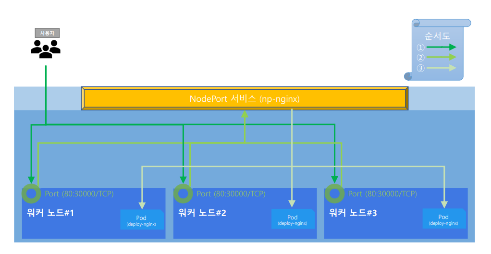

**NodePort**는 쿠버네티스 클러스터 내부의 서비스를 **외부에서 접속할 수 있도록**
각 노드(서버)의 특정 포트를 개방하는 방법입니다.

쉽게 말해,

- 모든 워커 노드의 `IP:NodePort`로 접속하면
- 쿠버네티스가 트래픽을 적절한 파드로 전달해줍니다.

## NodePort의 동작 구조

1. Service의 타입을 **NodePort**로 지정하면,
2. 쿠버네티스가 **30000~32767** 범위 내에서 임의의 포트(혹은 직접 지정한 포트)를 할당합니다.
3. 이 NodePort로 들어온 외부 트래픽은 자동으로 해당 서비스(파드)로 라우팅됩니다.
4. **클러스터에 있는 모든 노드의 IP**에서 NodePort로 접속이 가능합니다.
    - 즉, 어느 워커노드든 상관없이,
        `http://노드IP:NodePort`로 접속하면 서비스에 연결됩니다.

```yaml
apiVersion: v1
kind: Service
metadata:
  name: my-service
spec:
  type: NodePort
  selector:
    app: my-app
  ports:
    - port: 80          # 클러스터 내부 서비스 포트
      targetPort: 80    # 파드가 실제로 리슨하는 포트
      nodePort: 30080   # 외부에서 사용할 포트 (생략하면 자동할당)
```

## NodePort 특징

- **모든 노드에서 동일한 포트**로 서비스에 접근할 수 있습니다.
- 내부적으로 **ClusterIP 서비스**를 자동으로 생성해 함께 동작합니다.
- **외부 트래픽이 노드의 NodePort를 거쳐 해당 서비스의 파드로** 자동 라우팅됩니다.
- 간단한 개발, 테스트 환경에서는 별도 로드밸런서 없이도 외부에서 접근이 가능합니다.


