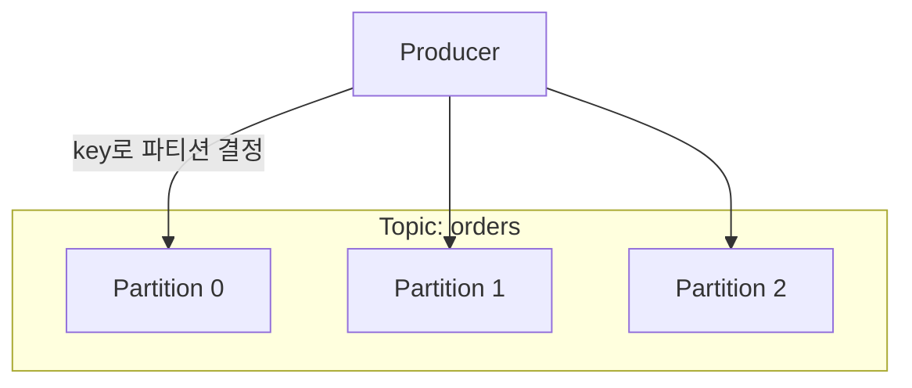
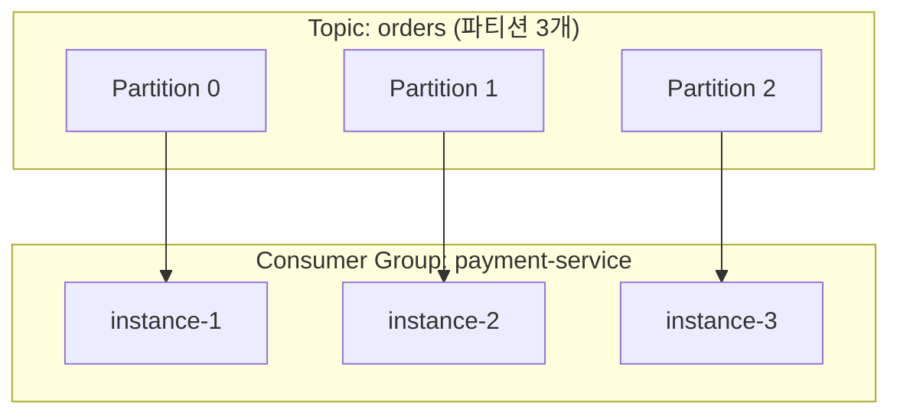
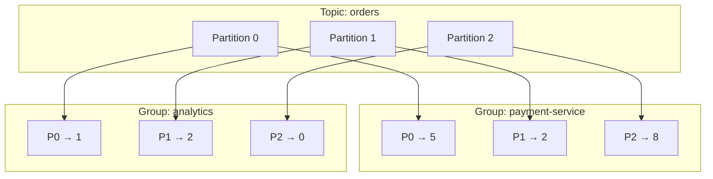
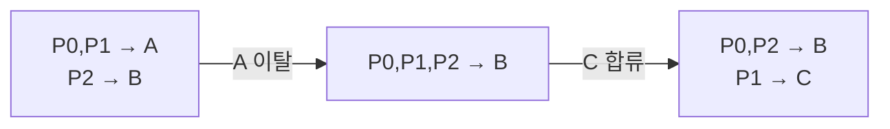

Kafka는 대량의 이벤트를 여러 서비스가 나눠 읽도록 중계하는 분산 메시지 플랫폼이다. 핵심 개념은 토픽·파티션·컨슈머 그룹·offset 네 가지인데, 이름이 비슷해 처음엔 경계가 헷갈린다. 이 글은 이 네 가지가 어떻게 맞물려 돌아가는지 정리한다.

## 토픽과 파티션

메시지는 **토픽(Topic)** 단위로 쌓인다. "주문 토픽", "결제 토픽"처럼 이벤트 종류마다 토픽을 둔다. 토픽은 append-only 로그다 — 메시지는 끝에만 추가되고, 보관 기간이 지나기 전엔 읽어도 지워지지 않는다.

여기까지는 평범한 로그지만, Kafka의 토픽은 한 덩어리가 아니라 **파티션(Partition)**이라는 여러 조각으로 나뉜다. 토픽은 곧 파티션들의 집합이다.

- 각 파티션은 독립된 로그(한 줄)다.
- 메시지가 어느 파티션에 들어갈지는 **key**로 정해진다. 같은 key는 항상 같은 파티션으로 간다.
- 파티션 안의 메시지에는 0부터 증가하는 번호가 붙는데, 이게 **offset**이다.

## 왜 파티션으로 쪼개나

파티션이 하나뿐이면 토픽은 한 줄짜리 로그다. 한 줄은 한 서버가 감당해야 하고, 읽는 쪽도 그 한 줄을 차례로 따라갈 수밖에 없어 처리량이 묶인다. 토픽을 여러 파티션으로 나누면 두 가지를 얻는다.

- **분산** — 파티션을 여러 브로커(서버)에 흩어 둘 수 있다.
- **병렬 처리** — 파티션마다 다른 소비자가 동시에 읽는다.

대신 대가가 하나 있다. **순서는 파티션 안에서만 보장된다.** 한 파티션은 한 줄이라 그 안의 순서는 지켜지지만, 서로 다른 파티션 사이의 선후 관계는 보장되지 않는다. 그래서 "한 고객의 이벤트는 순서대로 처리돼야 한다" 같은 요구가 있으면, 그 기준값(예: 고객ID)을 key로 삼아 같은 파티션에 모은다. 전체 순서 대신 **key별 순서**를 지키는 방식이다.

## 컨슈머 그룹

메시지를 읽는 쪽은 **컨슈머(Consumer)**이고, 컨슈머들은 **컨슈머 그룹(Consumer Group)**으로 묶인다. 그룹은 `group.id`로 구분한다. 한 애플리케이션을 여러 인스턴스로 띄우면(스케일아웃), 그 인스턴스들이 같은 `group.id`를 갖는 하나의 그룹이 된다.

그룹과 파티션의 관계는 규칙 하나로 요약된다.

> 한 파티션은 한 그룹 안에서 **정확히 한 컨슈머**에게만 배정된다.

이 규칙에서 그룹의 두 성질이 따라 나온다.

- **그룹 안에서는 일을 나눈다.** 파티션이 컨슈머들에게 갈리므로 한 메시지는 그룹 안에서 한 번만 처리된다. 컨슈머를 늘리면 처리량이 는다.
- **그룹끼리는 독립이다.** 다른 `group.id`를 가진 그룹은 같은 토픽을 따로 처음부터 다 읽는다. 같은 이벤트를 결제용·분석용으로 각각 소비하려면 그룹을 나눈다.

컨슈머 수와 파티션 수의 관계도 이 규칙이 결정한다.

- 컨슈머 < 파티션 → 한 컨슈머가 여러 파티션을 맡는다. 노는 파티션은 없다.
- 컨슈머 > 파티션 → 파티션을 다 배정하고 남은 컨슈머는 놀게 된다.

즉 **파티션 수가 그룹의 병렬 처리 상한**이다. 파티션이 3개면 컨슈머를 4개 이상 띄워도 동시에 일하는 건 최대 3개다. 토픽을 설계할 때 파티션 수를 정하는 것이 곧 스케일아웃 한도를 정하는 일이다.

## 파티션 배정은 누가 정하나

그렇다면 어느 컨슈머가 어느 파티션을 맡을지는 누가 정할까. 컨슈머가 알아서 랜덤으로 집어가는 게 아니라, 정해진 절차로 배정된다.

1. 그룹의 컨슈머들은 브로커 중 하나인 **그룹 코디네이터(Group Coordinator)**에 멤버로 등록한다.
2. 멤버 중 하나가 **리더**로 뽑혀, 설정된 **할당 전략(partition assignment strategy)**에 따라 "누가 어느 파티션"을 계산한다.
3. 코디네이터가 그 결과를 각 컨슈머에 통보한다.

한 군데서 계산해 통보하기 때문에, 두 컨슈머가 같은 파티션을 동시에 맡는 충돌이 구조적으로 막힌다. 전략은 `partition.assignment.strategy`로 고르며 결과는 결정적(deterministic)이다 — 파티션을 연속 구간으로 잘라 나눠 주는 **Range**, 돌아가며 한 개씩 배분하는 **RoundRobin**, 리밸런싱 때 기존 배정을 최대한 유지하는 **Sticky** 계열이 대표적이다. 특히 Sticky 계열은 재배정이 일어나도 맡던 파티션을 가급적 그대로 둬서, 캐시·상태를 버리고 다시 워밍업하는 비용을 줄인다.

## Offset

**offset**은 파티션 안에서 메시지의 위치를 가리키는 번호이자, 컨슈머가 "어디까지 읽었나"를 기록하는 값이다. 저장 단위가 중요하다.

> 진행 위치(committed offset)는 **(컨슈머 그룹, 파티션) 조합마다** 따로 저장된다.

- **파티션마다 따로다.** 파티션은 독립된 로그라 진도가 제각각이므로, 파티션 2개를 맡은 컨슈머는 offset 2개를 관리한다.
- **그룹마다 따로다.** 같은 파티션이라도 결제 그룹과 분석 그룹의 진행 위치는 별개다. 한 이벤트를 두 그룹이 각자 다 보는 것이 이래서 가능하다.

이 offset의 주인은 개별 컨슈머가 아니라 **그룹**이다. 컨슈머는 메시지를 처리한 뒤 "여기까지 했다"고 offset을 **commit**하고, 이 값은 브로커의 내부 토픽 `__consumer_offsets`에 그룹 이름으로 저장된다. 컨슈머 개인이 아니라 그룹에 귀속되기 때문에, 컨슈머가 죽거나 교체돼도 다음 컨슈머가 commit된 지점부터 이어 읽는다.

## 리밸런싱

파티션–컨슈머 배정은 고정이 아니다. 배포로 인스턴스가 재시작하거나, 오토스케일링으로 수가 바뀌거나, 장애로 죽으면 배정을 다시 짜야 한다. 이 재배정을 **리밸런싱(Rebalancing)**이라 한다.

컨슈머는 살아있다는 신호(**heartbeat**)를 주기적으로 보내고, 이 신호가 일정 시간 끊기면 브로커가 해당 컨슈머를 빼고 파티션을 다시 분배한다. offset이 그룹에 저장돼 있으므로, 새 담당 컨슈머는 처음이 아니라 commit된 지점부터 이어 읽는다.

문제는 리밸런싱에 비용이 따른다는 점이다. 전통적인(eager) 방식은 재배정 동안 그룹 전체가 잠시 읽기를 멈춘다(stop-the-world). 그래서 인스턴스 수가 자주 출렁이면 리밸런싱이 반복되고, 그 멈춤이 쌓여 오히려 처리량을 떨어뜨린다. 대응책은 대략 셋이다.

- **스케일링 안정화** — 오토스케일러에 쿨다운을 둬 잦은 증감을 억제한다.
- **Static Membership** — `group.instance.id`를 고정해, 짧은 재시작은 같은 멤버로 보고 리밸런싱을 생략한다.
- **Cooperative Rebalancing** — 전체를 멈추지 않고 영향받는 파티션만 옮긴다(최신 Kafka의 기본).
