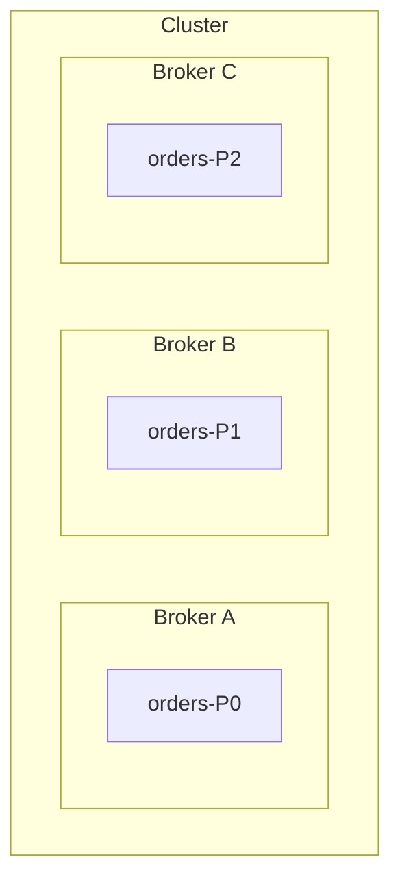
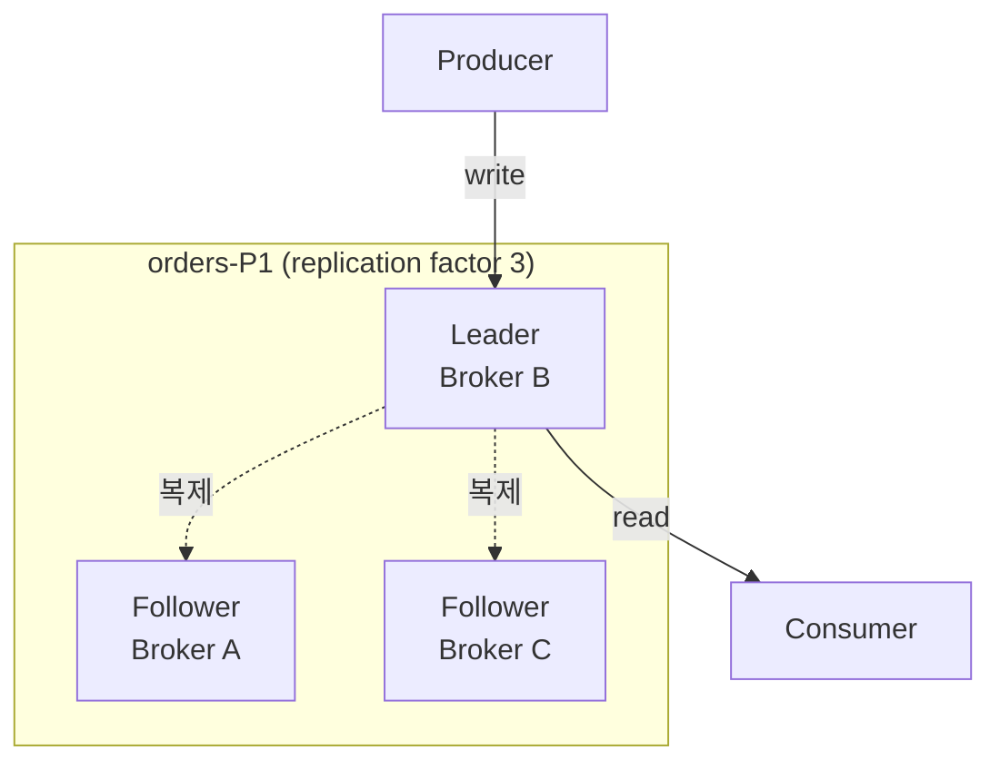
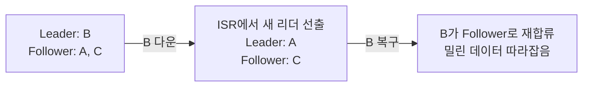

Kafka에서 메시지는 파티션이라는 append-only 로그에 쌓인다. 토픽은 그 파티션들을 묶어 부르는 논리적 이름이고, 실제로 데이터가 저장되는 실체는 파티션이다. 그 파티션은 브로커의 디스크에 놓이며, 같은 파티션이 여러 브로커에 복제된다.

## 브로커와 클러스터

**브로커**는 Kafka 서버 하나다. 파티션을 디스크에 저장하고, 프로듀서의 쓰기와 컨슈머의 읽기 요청에 응답한다. 브로커 여러 대를 묶은 것이 **클러스터**다. 실무에서 "Kafka를 쓴다"는 건 보통 브로커 여러 대짜리 클러스터를 말한다.

그래서 토픽 하나의 파티션들은 한 브로커에 몰려 있지 않고, 여러 브로커에 흩어진다.



토픽 `orders`의 파티션 3개가 브로커 3대에 하나씩 흩어져 있다. 그래서 브로커 하나를 열어보면 여러 토픽의 파티션들이 섞여 들어 있다.

이렇게 흩어 두면 저장 용량과 처리량이 브로커 수만큼 늘어난다. 대신 브로커 B가 죽으면 orders-P1의 메시지가 통째로 사라진다. 그래서 파티션을 복제한다.

## 복제 — 같은 파티션을 여러 브로커에

Kafka는 파티션을 한 곳에만 두지 않고 **여러 브로커에 복제본**을 만든다. 복제본을 몇 개 둘지는 토픽의 **replication factor**로 정한다. factor가 3이면 같은 파티션이 브로커 3대에 존재한다.

복제본은 대등하지 않다. 하나가 **리더**, 나머지는 **팔로워**다.

> 프로듀서와 컨슈머는 **리더하고만** 통신한다. 팔로워는 리더를 따라 복사만 한다.



- 쓰기: 프로듀서 → 리더. 리더가 기록한 뒤 팔로워들이 그 내용을 따라 복사한다.
- 읽기: 컨슈머 → 리더. 이게 기본 동작이고, 팔로워에서 읽는 설정도 있지만 예외다.
- 팔로워는 평소엔 백업 대기조로, 리더가 죽는 순간을 위해 존재한다.

리더는 브로커 단위가 아니다.

> 리더/팔로워는 **파티션의 복제본마다** 정해진다. 한 브로커가 어떤 파티션에는 리더, 다른 파티션에는 팔로워일 수 있다.

토픽 `orders`가 파티션 3개, replication factor 3, 브로커 3대라고 하면 배치는 이렇게 된다.

| | Broker A | Broker B | Broker C |
|---|---|---|---|
| orders-P0 | **Leader** | Follower | Follower |
| orders-P1 | Follower | **Leader** | Follower |
| orders-P2 | Follower | Follower | **Leader** |

- 같은 토픽 안에서도 **파티션마다 리더가 다르다** — P0의 리더는 A, P1은 B, P2는 C.
- 한 브로커도 **파티션에 따라 리더도 되고 팔로워도 된다** — A는 P0에선 리더, P1·P2에선 팔로워.

이렇게 하는 이유는 부하 분산이다. 읽기·쓰기는 리더만 처리하므로, 리더가 한 브로커에 몰리면 그 브로커만 과부하가 된다. 그래서 Kafka는 **모든 파티션의 리더를 여러 브로커에 최대한 고르게 흩어** 놓는다. 토픽이 여러 개여도 마찬가지로, 토픽 구분 없이 전체 파티션의 리더를 브로커 전체에 골고루 배치하는 것이 목표다.

## ISR — 어디까지가 "믿을 수 있는 복제본"인가

팔로워가 리더를 따라잡는 데엔 시간이 걸린다. 네트워크가 느리거나 팔로워가 버벅이면 리더보다 뒤처진다. 그래서 Kafka는 **리더를 충분히 따라잡은 복제본들**만 따로 관리하는데, 이 집합을 **ISR**, 곧 In-Sync Replicas라 한다.

> 리더가 죽으면, 새 리더는 **ISR 안에서만** 뽑힌다.

이유는 데이터 손실을 막기 위해서다. 한참 뒤처진 팔로워를 리더로 승격시키면 그 팔로워에 없던 최근 메시지가 통째로 날아간다. ISR에 든 복제본은 최근까지 따라잡은 것들이라, 승격돼도 손실이 최소다.

## acks — 어디까지 써야 "성공"인가

복제가 있으면 "메시지를 성공적으로 보냈다"의 기준이 갈린다. 리더에만 쓰이면 성공인지, 팔로워까지 복사돼야 성공인지를 프로듀서의 **acks**가 정한다.

| acks | 성공 판정 시점 | 성격 |
|---|---|---|
| `0` | 보내고 확인 안 함 | 제일 빠름, 유실 위험 큼 |
| `1` | 리더에 쓰이면 성공 | 중간. 리더가 복제 전에 죽으면 유실 가능 |
| `all` 또는 `-1` | ISR의 복제본까지 다 쓰이면 성공 | 제일 안전, 제일 느림 |

표의 `1`에 적힌 "리더가 복제 전에 죽으면 유실"은 offset으로 걸어 보면 이렇게 된다.

```
프로듀서 → offset 999  → 리더가 기록, ack 반환 → 팔로워도 999까지 복제
프로듀서 → offset 1000 → 리더가 기록, ack 반환 → 팔로워가 복제하기 전에 리더 다운
```

프로듀서는 999와 1000 둘 다 성공으로 받았다. 그런데 승격되는 팔로워는 999까지만 갖고 있으므로, 새 리더의 로그는 999에서 끝난다. 프로듀서는 ack를 받은 다음 자리인 1001부터 보내고, **1000은 아무도 갖고 있지 않은 채로 사라진다.**

죽은 브로커의 디스크에는 1000이 남아 있어 되살릴 여지는 있다. 다만 그 브로커가 팔로워로 재합류할 때는 새 리더의 로그에 맞춰 자기 것을 잘라내므로, 사람이 개입해 꺼내지 않으면 그대로 버려진다.

`acks=all`은 이 틈을 막으려고 ack를 복제 뒤로 미룬다. 흔히 `min.insync.replicas`와 함께 쓰는데, 이 값이 2면 "ISR이 최소 2개는 살아있고 거기 다 써져야 성공"으로 본다. 복제본이 부족한 채로 쓰기가 성공 처리돼 유실되는 상황을 막는 안전장치다.

`min.insync.replicas`가 충족되지 않으면 쓰기는 성공도 유실도 아니라 **실패로 돌아온다.** replication factor 3에 `min.insync.replicas` 2인 토픽에서 브로커 하나가 죽으면 ISR이 2라 아직 쓰기가 된다. 하나가 더 죽어 ISR이 1이 되면 그때부터 프로듀서는 `NOT_ENOUGH_REPLICAS`를 받는다. 조용히 잃는 것보다 나은 쪽을 택한 설계다.

## 브로커가 죽으면

브로커 하나가 죽었을 때 파티션의 운명은 그 브로커가 무슨 역할이었냐로 갈린다.



- **죽은 게 리더면** — ISR 중 하나가 새 리더로 승격되고, 프로듀서·컨슈머는 잠깐의 전환 뒤 새 리더로 계속한다.
- **죽은 게 팔로워면** — 리더는 그대로라 서비스에 영향이 없다. 다만 복제본이 하나 줄어 그동안은 내구성이 낮아진다.
- **복구되면** — 그 브로커는 팔로워로 다시 합류해, 죽어 있는 동안 밀린 메시지를 리더에게서 따라잡아 ISR에 다시 든다.

replication factor가 크면 브로커가 더 많이 죽어도 견디지만, 그만큼 저장 공간과 복제 트래픽을 더 쓴다. 프로덕션에서는 "브로커 1대 장애를 견딘다"는 기준으로 factor 3을 흔히 쓰고, 개발용 소규모 클러스터는 2로 두기도 한다. 브로커 수가 factor보다 적으면 복제본을 다 놓을 자리가 없으니, factor는 브로커 수 이하로 맞춰야 한다.
