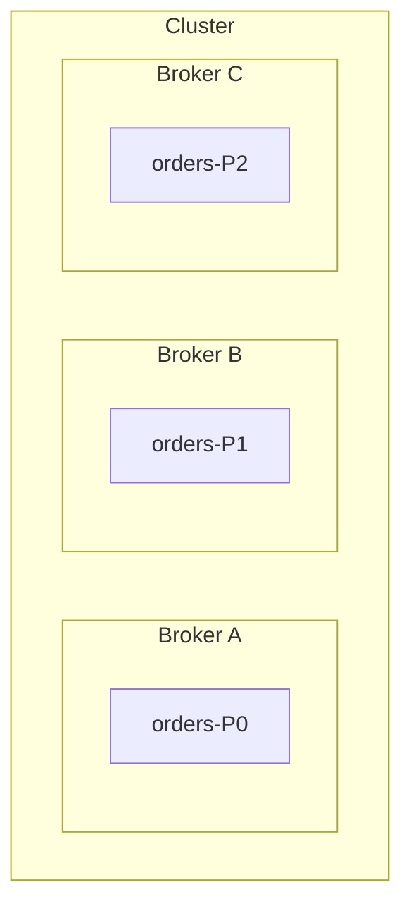
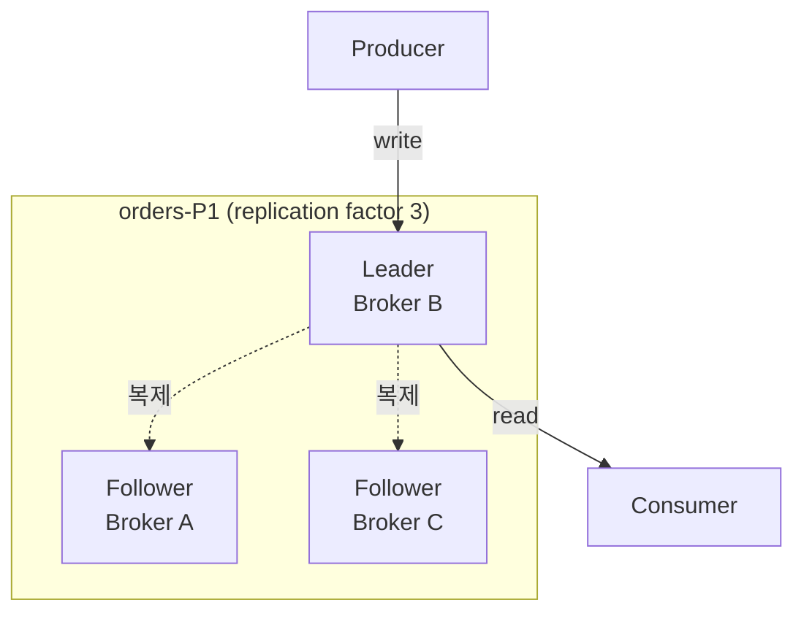
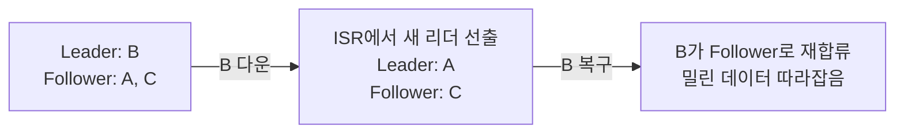

Kafka에서 메시지는 파티션이라는 append-only 로그에 쌓인다. 토픽은 그 파티션들을 묶어 부르는 논리적 이름이고, 실제로 데이터가 저장되는 실체는 파티션이다. 그런데 그 파티션은 **실제로 어디에** 저장될까. 그리고 그 서버가 죽으면 메시지는 사라질까. 이 글은 파티션이 저장되는 물리 계층 — 브로커와 복제를 다룬다.

## 브로커와 클러스터

**브로커(Broker)**는 Kafka 서버 하나다. 파티션을 디스크에 저장하고, 프로듀서의 쓰기와 컨슈머의 읽기 요청에 응답한다. 브로커 여러 대를 묶은 것이 **클러스터**다. 실무에서 "Kafka를 쓴다"는 건 보통 브로커 여러 대짜리 클러스터를 말한다.

그래서 토픽 하나의 파티션들은 한 브로커에 몰려 있지 않고, 여러 브로커에 흩어진다.

토픽 `orders`의 파티션 3개가 브로커 3대에 하나씩 흩어져 있다. 토픽은 디스크에 존재하는 덩어리가 아니라 **이 파티션들을 묶어 부르는 논리적 이름**일 뿐이고, 실제로 저장되는 실체는 파티션이다. 그래서 브로커 하나를 열어보면 여러 토픽의 파티션들이 섞여 들어 있다.

이렇게 흩어 두면 저장 용량과 처리량이 브로커 수만큼 늘어난다. 하지만 이대로면 문제가 하나 있다 — **브로커 B가 죽으면 orders-P1의 메시지가 통째로 사라진다.** 그래서 복제가 필요하다.

## 복제 — 같은 파티션을 여러 브로커에

Kafka는 파티션을 한 곳에만 두지 않고 **여러 브로커에 복제본(replica)**을 만든다. 복제본을 몇 개 둘지는 토픽의 **replication factor**로 정한다. factor가 3이면 같은 파티션이 브로커 3대에 존재한다.

복제본은 대등하지 않다. 하나가 **리더(leader)**, 나머지는 **팔로워(follower)**다.

> 프로듀서와 컨슈머는 **리더하고만** 통신한다. 팔로워는 리더를 따라 복사만 한다.

- 쓰기: 프로듀서 → 리더. 리더가 기록한 뒤 팔로워들이 그 내용을 따라 복사한다.
- 읽기: 컨슈머 → 리더. (기본 동작. 팔로워에서 읽는 설정도 있지만 예외다.)
- 팔로워는 평소엔 백업 대기조다. 리더가 죽는 순간을 위해 존재한다.

여기서 리더의 단위를 오해하기 쉽다. "브로커 하나가 리더"인 게 아니다.

> 리더/팔로워는 **파티션의 복제본마다** 정해진다. 한 브로커가 어떤 파티션에는 리더, 다른 파티션에는 팔로워일 수 있다.

토픽 `orders`가 파티션 3개, replication factor 3, 브로커 3대라고 하면 배치는 이렇게 된다.

| | Broker A | Broker B | Broker C |
|---|---|---|---|
| orders-P0 | **Leader** | Follower | Follower |
| orders-P1 | Follower | **Leader** | Follower |
| orders-P2 | Follower | Follower | **Leader** |

- 같은 토픽 안에서도 **파티션마다 리더가 다르다** — P0의 리더는 A, P1은 B, P2는 C.
- 한 브로커도 **파티션에 따라 리더도 되고 팔로워도 된다** — A는 P0에선 리더, P1·P2에선 팔로워.

이렇게 하는 이유는 부하 분산이다. 읽기·쓰기는 리더만 처리하므로, 리더가 한 브로커에 몰리면 그 브로커만 과부하가 된다. 그래서 Kafka는 **모든 파티션의 리더를 여러 브로커에 최대한 고르게 흩어** 놓는다. 토픽이 여러 개여도 마찬가지로, 토픽 구분 없이 전체 파티션의 리더를 브로커 전체에 골고루 배치하는 것이 목표다.

## ISR — 어디까지가 "믿을 수 있는 복제본"인가

팔로워가 리더를 따라잡는 데엔 시간이 걸린다. 네트워크가 느리거나 팔로워가 버벅이면 리더보다 뒤처진다. 그래서 Kafka는 **리더를 충분히 따라잡은 복제본들**만 따로 관리하는데, 이 집합을 **ISR(In-Sync Replicas)**이라 한다.

> 리더가 죽으면, 새 리더는 **ISR 안에서만** 뽑힌다.

이유는 데이터 손실을 막기 위해서다. 한참 뒤처진 팔로워를 리더로 승격시키면 그 팔로워에 없던 최근 메시지가 통째로 날아간다. ISR에 든 복제본은 최근까지 따라잡은 것들이라, 승격돼도 손실이 최소다.

## acks — 어디까지 써야 "성공"인가

복제가 있으면 "메시지를 성공적으로 보냈다"의 기준이 달라진다. 리더에만 썼을 때 성공으로 볼지, 팔로워들까지 복사된 걸 확인하고 성공으로 볼지. 이걸 프로듀서의 **acks** 설정으로 정한다.

| acks | 성공 판정 시점 | 성격 |
|---|---|---|
| `0` | 보내고 확인 안 함 | 제일 빠름, 유실 위험 큼 |
| `1` | 리더에 쓰이면 성공 | 중간. 리더가 복제 전에 죽으면 유실 가능 |
| `all` (`-1`) | ISR의 복제본까지 다 쓰이면 성공 | 제일 안전, 제일 느림 |

`acks=all`은 흔히 `min.insync.replicas`와 함께 쓴다. 이 값이 2면 "ISR이 최소 2개는 살아있고 거기 다 써져야 성공"으로 본다. 복제본이 부족한 채로 쓰기가 성공 처리돼 유실되는 상황을 막는 안전장치다. 속도와 안전성의 트레이드오프를 여기서 조율한다.

## 브로커가 죽으면

브로커 하나가 죽었을 때 파티션의 운명은 그 브로커가 무슨 역할이었냐로 갈린다.

- **죽은 게 리더면** — ISR 중 하나가 새 리더로 승격되고, 프로듀서·컨슈머는 잠깐의 전환 뒤 새 리더로 계속한다.
- **죽은 게 팔로워면** — 리더는 그대로라 서비스에 영향이 없다. 다만 복제본이 하나 줄어 그동안은 내구성이 낮아진다.
- **복구되면** — 그 브로커는 팔로워로 다시 합류해, 죽어 있는 동안 밀린 메시지를 리더에게서 따라잡아 ISR에 다시 든다.

replication factor를 몇으로 둘지는 결국 설계 결정이다. factor가 크면 브로커가 더 많이 죽어도 견디지만, 그만큼 저장 공간과 복제 트래픽을 더 쓴다. 프로덕션에서는 "브로커 1대 장애를 견딘다"는 기준으로 factor 3을 흔히 쓰고, 개발용 소규모 클러스터는 2로 두기도 한다. 브로커 수가 factor보다 적으면 복제본을 다 놓을 자리가 없으니, factor는 브로커 수 이하로 맞춰야 한다.
