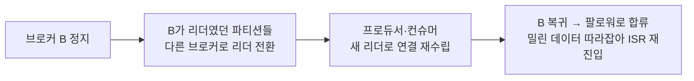
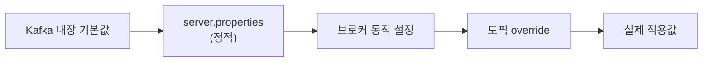

Kafka의 설정 파라미터는 수백 개다. 전부 외우는 건 의미가 없고, 필요할 때 문서에서 찾으면 된다. 정작 막히는 건 다른 지점이다 — 이 값을 **어디에 써야 하고, 재기동이 필요하고, 이미 만들어진 토픽에는 적용되는가**. 설정이 누구의 것인지, 언제 반영되는지, 그리고 계층 규칙 하나 — 이 셋을 알면 이 질문들이 정리된다.

## 서버가 갖는 설정과 클라이언트가 갖는 설정

먼저 볼 것은 그 설정이 **누구의 것인가**이다. 크게 네 레벨이 있고, 이 넷은 다시 서버 쪽과 클라이언트 쪽으로 갈린다.

| 레벨 | 어디에 있나 | 예 |
|---|---|---|
| **브로커** | `server.properties` + 클러스터 메타데이터 | `num.partitions`, `log.retention.ms` |
| **토픽** | 브로커가 보관하는 토픽 메타데이터 | `retention.ms`, `cleanup.policy` |
| **프로듀서** | 애플리케이션 코드 | `acks`, `batch.size` |
| **컨슈머** | 애플리케이션 코드 | `group.id`, `auto.offset.reset` |

위 둘은 Kafka 서버가 갖고, 아래 둘은 클라이언트가 갖는다. 그래서 **프로듀서·컨슈머 설정은 `server.properties`에 존재하지 않는다.** 자바 클라이언트라면 `Properties` 객체에 담아 프로듀서·컨슈머를 생성할 때 넘기고, 그 설정은 그 클라이언트 인스턴스에만 적용된다.

여기서 성질 하나가 따라 나온다.

> Kafka가 제공하는 보장의 상당수는 브로커가 강제할 수 없고, 클라이언트의 선택에 달려 있다.

`acks=0`으로 보내겠다는 프로듀서를 브로커가 막을 방법은 없다. `auto.offset.reset=latest`로 두어 밀린 메시지를 건너뛰는 컨슈머도 마찬가지다. 서버 설정을 아무리 안전하게 잠가도, 유실이 실제로 발생하는 지점은 클라이언트 설정인 경우가 많다.

물론 서버가 개입할 여지가 전혀 없지는 않다. `min.insync.replicas`는 토픽 레벨 설정이라, `acks=all`로 들어온 쓰기가 몇 개의 복제본에 도달해야 성공으로 볼지를 서버가 정한다. 하지만 이것도 프로듀서가 `acks=all`을 골랐을 때만 의미가 있다. 서버는 클라이언트의 선택에 조건을 붙일 수는 있어도 선택 자체를 대신하지는 못한다.

## 재기동이 필요한 설정과 그렇지 않은 설정

다음은 **언제 반영되는가**이다.

| 구분 | 반영 방법 |
|---|---|
| **정적** | `server.properties`를 고치고 브로커를 재기동해야 반영 |
| **동적** | 클러스터에 명령을 보내 운영 중 즉시 반영 |

왜 굳이 나눴을까. 브로커 재기동이 프로세스 재시작으로 끝나지 않기 때문이다.

브로커 3대짜리 클러스터에서 한 대를 재기동하면 클러스터 전체 파티션 중 그 브로커가 리더였던 몫 — 대략 1/3 — 이 리더 전환을 겪는다. 그동안 해당 파티션들은 잠깐 쓰기·읽기가 끊기고, 복귀한 뒤에도 밀린 복제를 따라잡을 때까지는 내구성이 낮은 상태로 남는다. 설정값 하나 바꾸자고 치르기엔 비싼 값이다.

그래서 운영 중 조정될 법한 값들 — 보관 기간, 복제 스로틀, 로그 레벨 같은 것들 — 은 재기동 없이 바꿀 수 있게 분리돼 있다. 반대로 정적으로 남은 것들은 대개 브로커의 정체성이거나 기동 시점에 확정돼야 하는 값이다. 브로커 ID, 리스너 주소, 로그 디렉토리 경로처럼.

## 브로커 설정은 토픽 설정의 기본값이다

같은 성격의 설정이 브로커 레벨과 토픽 레벨 양쪽에 있는 경우가 많다. 중복이 아니라 계층이다.

| 성격 | 브로커 레벨 (전체 기본값) | 토픽 레벨 (개별 override) |
|---|---|---|
| 보관 기간 | `log.retention.ms` | `retention.ms` |
| 세그먼트 크기 | `log.segment.bytes` | `segment.bytes` |
| 최대 메시지 크기 | `message.max.bytes` | `max.message.bytes` |
| 정리 방식 | `log.cleanup.policy` | `cleanup.policy` |

**이름이 서로 다르다는 점을 조심해야 한다.** 브로커 쪽은 대체로 `log.` 접두어가 붙고, 최대 메시지 크기처럼 단어 순서가 아예 뒤집힌 경우도 있다. 검색해서 찾은 파라미터명이 어느 레벨의 것인지 먼저 확인하지 않으면 엉뚱한 곳에 값을 넣게 된다.

동작 규칙 자체는 단순하다.

> 토픽에 값이 설정돼 있으면 그 값이 이긴다. 없으면 브로커의 값이 기본값으로 적용된다.

이 구조가 필요한 이유는 토픽마다 성격이 다르기 때문이다. 이벤트 스트림 토픽은 7일 보관이면 충분하지만 감사 로그 토픽은 1년을 남겨야 할 수 있고, 대부분의 토픽은 1MB 메시지면 되지만 한 토픽만 큰 페이로드를 받을 수 있다. 브로커 기본값 하나로 전부를 만족시킬 수 없으니, **기본값은 브로커에 두고 예외를 토픽에 둔다.**

주의할 점은 토픽 override가 **한 번 걸리면 계속 남는다**는 것이다. 나중에 브로커 기본값을 바꿔도 override가 걸린 토픽은 따라오지 않는다. 그래서 원복은 "브로커와 같은 값을 다시 써넣는" 방식이 아니라 **토픽의 override를 삭제하는** 방식이어야 한다. 삭제해야 다시 브로커 기본값을 따라간다. 같은 값을 써넣으면 지금은 같아 보여도 다음에 기본값이 바뀔 때 어긋난다.

## 지금 적용된 값은 합성의 결과다

그래서 "이 토픽의 보관 기간은 얼마인가"의 답은 어느 파일 한 곳에도 없다. 여러 소스가 겹쳐서 최종값이 나온다.

오른쪽으로 갈수록 우선순위가 높다. 아래 계층에 값이 걸려 있으면 위 계층을 고쳐도 반영되지 않는다. "분명히 설정을 바꿨는데 동작이 그대로"인 상황은 대개 이것이다 — `server.properties`를 고치고 재기동까지 했는데, 그 토픽에 예전에 걸어둔 override가 남아 있어서 계속 그 값이 이기고 있는 경우.

그래서 설정을 다룰 때 중요한 습관은 "내가 어디에 무엇을 썼는지" 기억하는 것이 아니라, **지금 실제로 적용된 값이 무엇인지를 조회해서 확인하는 것**이다. 설정을 바꾼 직후와, 이상 동작을 조사할 때 양쪽 모두에서.
