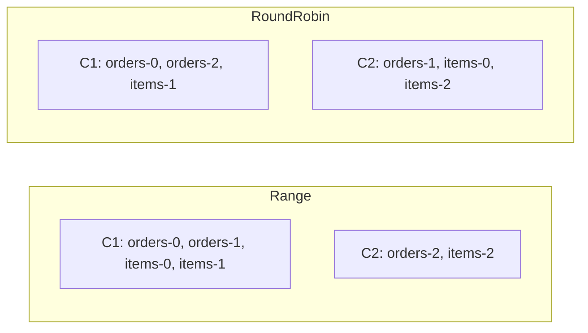
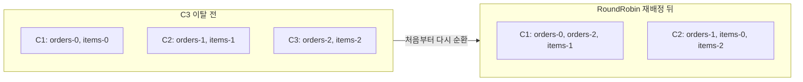
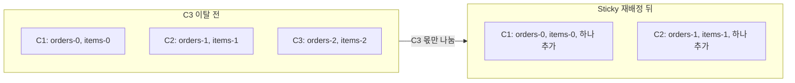

컨슈머 그룹에서 어느 파티션을 누구에게 줄지는 그룹 리더가 계산하고, 계산 방식은 `partition.assignment.strategy`에 꽂힌 전략이 정한다. 토픽이 하나이고 파티션 수가 컨슈머 수로 나누어떨어지면 어느 전략을 골라도 결과가 같다. 토픽을 여럿 구독하거나 멤버가 바뀌어 다시 나눌 때는 전략마다 결과가 달라지고, 그 차이가 처리 방식과 리밸런싱 비용에 그대로 옮겨 온다.

## 내장 전략 네 가지

| 전략 | 먼저 지키는 것 | 리밸런싱 절차 |
|---|---|---|
| `RangeAssignor` | 토픽 사이에서 같은 번호의 파티션을 한 컨슈머에 | eager |
| `RoundRobinAssignor` | 컨슈머별 파티션 개수 | eager |
| `StickyAssignor` | 개수, 그다음 이전 배정 | eager |
| `CooperativeStickyAssignor` | 개수, 그다음 이전 배정 | cooperative |

eager는 리밸런싱이 시작되면 모든 멤버가 가진 파티션을 전부 내려놓고 새 배정을 받는 절차이고, cooperative는 주인이 바뀌는 파티션만 내려놓는 절차다. 기본 목록의 첫 번째가 Range라서 설정을 건드리지 않은 그룹은 Range로 계산하고 eager로 돈다. 목록에서 Range를 빼고 CooperativeSticky로 넘어가는 절차는 [Kafka 토픽, 파티션, 컨슈머 그룹](/posts/kafka-basics)에서 다룬다.

아래 예시는 모두 같은 그룹을 쓴다. 주문 토픽 `orders`와 주문 상품 토픽 `items`가 파티션을 3개씩 갖는다. 컨슈머는 C1, C2, C3이고 셋 다 두 토픽을 구독한다.

## Range의 토픽별 구간 배정

Range는 토픽마다 따로 계산한다. 파티션을 번호순으로, 컨슈머를 member id 순으로 세운 뒤 파티션 수를 컨슈머 수로 나눈 만큼씩 앞에서부터 잘라 주고, 나누어떨어지지 않으면 앞쪽 컨슈머가 하나씩 더 받는다. 컨슈머가 셋이면 토픽마다 하나씩 돌아가서 C1이 두 토픽의 0번을, C2가 1번을, C3가 2번을 받는다.

컨슈머가 둘이면 파티션 3개를 둘로 나눠 C1이 2개, C2가 1개를 받는다. 토픽마다 같은 계산을 되풀이하므로 남는 하나가 매번 C1에게 가고, 두 토픽을 합치면 C1이 4개, C2가 2개가 된다. 구독하는 토픽이 늘면 쏠림도 토픽 수만큼 쌓인다.

## RoundRobin의 순환 배정

RoundRobin은 구독하는 모든 토픽의 파티션을 한 줄로 세우고 컨슈머를 돌아가며 하나씩 준다. 컨슈머가 둘이면 `orders-0`부터 번갈아 받아 3개씩 나뉜다.

개수는 RoundRobin이 고르다. 대신 두 토픽의 같은 번호 파티션이 갈라진다. `orders-0`은 C1에, `items-0`은 C2에 있다.

## 멤버가 빠질 때 옮겨지는 파티션

C3가 죽어 C1과 C2만 남는 경우를 본다. 셋일 때의 배정은 C1이 `orders-0`, `items-0`을, C2가 `orders-1`, `items-1`을, C3가 `orders-2`, `items-2`를 들고 있었다고 둔다. 주인이 반드시 바뀌어야 하는 것은 C3가 들고 있던 두 개뿐이다.

RoundRobin은 이전 배정을 보지 않고 남은 두 멤버로 처음부터 다시 돌린다.

C1은 읽던 `items-0`을 C2에 넘기고, C2는 읽던 `items-1`을 C1에 넘긴다. 둘 다 계속 살아 있었는데도 파티션을 하나씩 맞바꾼다. Range도 같은 방식으로 다시 자르므로, C2가 들고 있던 `orders-1`과 `items-1`이 C1에게 간다.

Sticky 계열은 새 배정을 짤 때 멤버마다 이전에 들고 있던 파티션을 입력으로 받아, 그대로 둘 수 있는 것은 두고 남는 것만 나눈다.

| 전략 | 살아 있던 멤버에게서 옮겨진 파티션 |
|---|---|
| `RangeAssignor` | 2 |
| `RoundRobinAssignor` | 2 |
| `StickyAssignor` | 0 |
| `CooperativeStickyAssignor` | 0 |

옮겨지는 파티션마다 비용이 붙는다. 새 주인은 마지막으로 커밋된 offset부터 읽으므로 그 뒤로 처리된 레코드를 다시 처리하고, 파티션별로 들고 있던 캐시나 집계 상태는 넘어가지 않아 새 주인이 다시 쌓는다.

Sticky의 두 목표가 부딪히면 개수가 이긴다. 컨슈머 사이의 파티션 수 차이가 하나 이하가 되도록 맞추는 것이 먼저이고, 그 안에서 이전 배정을 최대한 남긴다. Range와 달리 토픽 사이에서 번호를 맞추지 않아서, C3에게서 풀려난 `orders-2`와 `items-2`가 같은 컨슈머로 간다는 보장이 없다.

## StickyAssignor와 CooperativeStickyAssignor의 차이

두 전략의 계산 목표는 같고, 리밸런싱 절차가 다르다.

- **`StickyAssignor`는 eager로 돈다.** 리밸런싱이 시작되면 C1과 C2도 들고 있던 파티션을 전부 내려놓고, 배정표가 나온 뒤에야 같은 파티션을 돌려받는다. 옮겨진 파티션은 없지만 그동안 모든 파티션이 멈춰 있다.
- **`CooperativeStickyAssignor`는 cooperative로 돈다.** C1과 C2는 파티션을 쥔 채 JoinGroup을 보내고, 들고 있는 목록에 없는 `orders-2`와 `items-2`만 새로 배정받는다. 리밸런싱 동안에도 네 파티션은 계속 읽힌다.

cooperative에서 배정이 두 라운드로 나뉘는 것은 살아 있는 멤버에게서 파티션을 빼앗아 다른 멤버로 옮길 때다. 이전 주인이 먼저 내놓고, 그다음 라운드에서 새 주인이 받는다. 죽은 C3의 파티션은 쥐고 있는 멤버가 없으므로 첫 배정표에서 바로 새 주인에게 간다. 두 라운드가 어떻게 오가는지는 [Kafka classic 리밸런싱 프로토콜](/posts/kafka-consumer-rebalance-protocol)에서 다룬다.

## 재시작만으로 배정이 섞이는 경우

Range와 RoundRobin은 컨슈머를 member id 순으로 세운다. 이 id는 컨슈머가 그룹에 합류할 때 코디네이터가 새로 발급하는 값이라, 롤링 재시작으로 모든 인스턴스가 한 번씩 다시 합류하면 순서가 바뀔 수 있다. 멤버 수와 구독이 그대로여도 C1이 받던 몫을 C2가 받는 식으로 배정 전체가 섞인다.

`group.instance.id`를 지정한 [Static Membership](/posts/kafka-static-membership) 멤버는 재시작해도 같은 신원으로 돌아오므로, 멤버 수와 구독이 그대로인 한 Range와 RoundRobin도 매번 같은 배정을 낸다.

## group.protocol이 consumer일 때

`group.protocol`을 `consumer`로 두면 배정을 컨슈머가 아니라 브로커의 코디네이터가 계산하고, `partition.assignment.strategy`는 쓰이지 않는다. 브로커에 내장된 `uniform`과 `range` 중 하나를 `group.remote.assignor`로 골라 요청한다. 이 두 전략과 새 프로토콜의 배정 절차는 [Kafka KIP-848 리밸런싱 프로토콜](/posts/kafka-consumer-rebalance-kip848)에서 다룬다.
