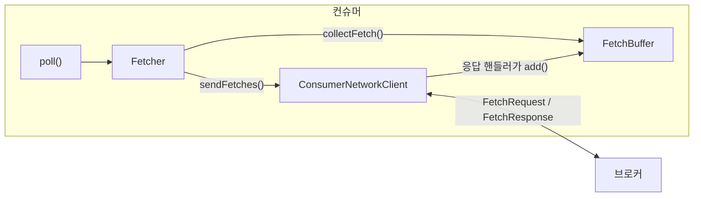
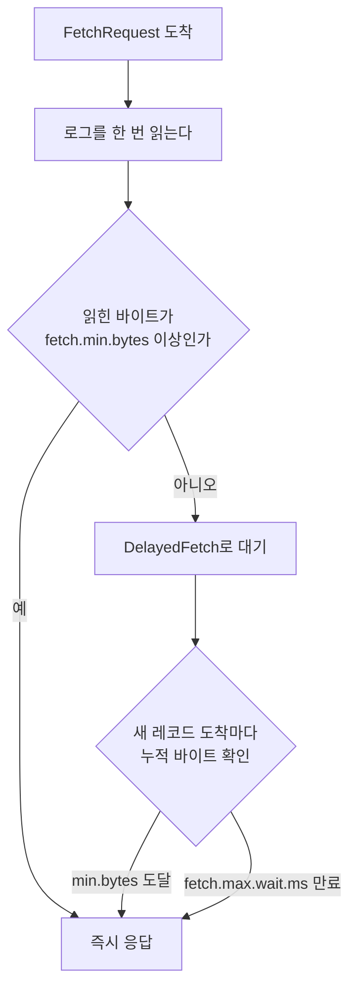

`poll()` 한 번이 돌려주는 `ConsumerRecords`는 그 호출이 브로커에서 받아 온 것이 아닐 수 있다. 컨슈머 안에는 브로커 응답을 쌓아 두는 큐가 있고, `poll()`은 그 큐에서 정해진 건수만큼 꺼내 준다. 브로커가 한 번에 얼마를 보내는지와 `poll()`이 한 번에 얼마를 건네는지는 서로 다른 설정이 정하고, 그 사이에서 배치 크기가 어떻게 잡히는지는 브로커가 요청을 언제까지 붙잡는지에 달려 있다.

## 컨슈머 안의 큐

`KafkaConsumer`를 만들면 안에 협력 객체 몇 개가 함께 생긴다. `group.protocol`이 기본값 `classic`일 때의 구현인 `ClassicKafkaConsumer`를 디버거로 열면 최상위 필드 넷이 보이고, 그중 `fetcher`를 한 단계 더 펼치면 fetch에 쓰는 객체들이 나온다.

| 필드 | 타입 | 하는 일 |
|---|---|---|
| `client` | `ConsumerNetworkClient` | 요청을 브로커에 보내고 응답을 받는다 |
| `subscriptions` | `SubscriptionState` | 구독 중인 파티션과 각각의 읽기 위치를 든다 |
| `coordinator` | `ConsumerCoordinator` | 그룹 합류, 리밸런싱, 커밋을 맡는다 |
| `fetcher` | `Fetcher` | fetch 요청을 만들고, 응답을 큐에 넣고, 큐에서 꺼낸다 |
| `fetcher.fetchConfig` | `FetchConfig` | fetch 설정값 |
| `fetcher.fetchBuffer` | `FetchBuffer` | 브로커 응답을 파티션 단위로 담아 두는 큐 |
| `fetcher.fetchCollector` | `FetchCollector` | 큐에서 레코드를 꺼내 역직렬화하고 건수를 센다 |

`fetcher` 안에도 `client` 필드가 있는데 최상위의 것과 같은 객체다. fetch에 관여하는 것은 `client`와 `fetcher` 아래 셋이고, `subscriptions`와 `coordinator`는 이 글에서 다루지 않는다.

`FetchBuffer`의 실체는 `ConcurrentLinkedQueue<CompletedFetch>` 필드 하나다. 이 큐가 어떤 단위로 차는지가 뒤에 오는 설명 전부의 바탕이다.

- **항목 하나는 파티션 하나분이다.** `CompletedFetch`는 브로커 응답에서 파티션 하나에 해당하는 조각이다. 응답 하나에 파티션 세 개분이 담겨 오면 큐에는 항목 셋이 들어간다.
- **파티션당 항목은 최대 하나다.** 클래스 주석에 그렇게 적혀 있다. 구독 파티션이 12개면 큐 길이도 최대 12다.
- **안에 든 것은 파싱 전 바이트다.** `ConsumerRecord` 목록이 아니라 브로커가 디스크에서 읽은 그대로의 레코드 배치다. 압축 해제와 역직렬화는 큐에 넣을 때가 아니라 `poll()`이 꺼낼 때, 그 건수만큼만 일어난다.

`poll()`은 큐 머리의 항목부터 연다.

- **머리 항목이 상한보다 작으면 다음 파티션으로 넘어간다.** 항목이 바닥나면 다음 항목을 열어 마저 채우므로, `poll()` 한 번의 결과에 여러 파티션의 레코드가 섞여 온다. 파티션 안의 순서는 바이트 순서 그대로다.
- **머리 항목이 상한보다 크면 그 파티션 것만 돌아온다.** 나머지 파티션 항목은 큐에서 차례를 기다린다.



`fetcher` 안의 `fetchConfig`에는 설정값이 이름을 바꿔 들어 있어서, 디버거에서 실제 적용된 값을 볼 때 이 대응을 알아야 한다.

| 설정 | `FetchConfig` 필드 |
|---|---|
| `fetch.min.bytes` | `minBytes` |
| `fetch.max.wait.ms` | `maxWaitMs` |
| `fetch.max.bytes` | `maxBytes` |
| `max.partition.fetch.bytes` | `fetchSize` |
| `max.poll.records` | `maxPollRecords` |

## fetch 요청이 나가는 조건

`poll()`이 레코드를 구하는 부분은 `pollForFetches()` 하나다. 주석까지 합쳐도 짧다.

```java
private Fetch<K, V> pollForFetches(Timer timer) {
    // 큐에 이미 데이터가 있으면 그대로 돌려준다
    final Fetch<K, V> fetch = fetcher.collectFetch();
    if (!fetch.isEmpty()) {
        return fetch;
    }

    // 새 fetch를 보낸다. 대기 중인 fetch는 다시 보내지 않는다
    sendFetches();

    // 큐에 데이터가 들어올 때까지, 최대 timeout 만큼 네트워크를 돈다
    client.poll(pollTimer, () -> !fetcher.hasAvailableFetches());

    return fetcher.collectFetch();
}
```

큐가 비어 있을 때만 요청이 나가는 구조로 읽히지만, `sendFetches()` 안에서 요청 대상을 고르는 기준은 큐 전체가 아니라 파티션이다.

- **큐에 데이터가 있는 파티션은 요청에서 뺀다.** `fetchablePartitions()`가 구독 중인 파티션에서 버퍼에 이미 들어 있는 것을 걸러 낸다. 주석 그대로 "버퍼에 메시지가 앉아 있지 않은 파티션"만 남는다.
- **한 브로커에는 요청을 하나만 띄운다.** 앞 요청의 응답이 오기 전에는 같은 브로커로 다음 요청을 보내지 않는다.
- **버퍼에 데이터가 있는 파티션의 브로커에는 다른 파티션 요청도 보내지 않는다.** 그 파티션을 뺀 채 요청하면 브로커의 fetch session 캐시에서 그 파티션이 빠져 세션이 깨질 수 있어서다.

위 코드에서 `sendFetches()`는 요청을 만들어 전송 대기열에 넣기만 하고, 소켓에 쓰고 응답을 읽는 일은 `client.poll()`이 한다. `client.poll()`은 두 번째 인자가 참인 동안, 곧 큐가 비어 있는 동안만 돌고, 응답 핸들러가 큐에 항목을 넣는 순간 timeout이 남았어도 빠져나온다.

`poll()` 본문에는 `sendFetches()`를 부르는 자리가 하나 더 있다. `pollForFetches()`가 레코드를 돌려주면, 그것을 애플리케이션에 넘기기 직전에 다음 요청을 미리 내보낸다.

```java
final Fetch<K, V> fetch = pollForFetches(timer);
if (!fetch.isEmpty()) {
    // 레코드를 돌려주기 전에 다음 fetch를 소켓에 써 둔다. 응답은 기다리지 않는다
    if (sendFetches() > 0 || client.hasPendingRequests()) {
        client.transmitSends();
    }
    return new ConsumerRecords<>(fetch.records(), fetch.nextOffsets());
}
```

여기서는 `client.poll()` 대신 `client.transmitSends()`를 부른다. 소켓에 쓰기만 하고 곧바로 반환하므로, 애플리케이션이 이번 레코드를 처리하는 동안 브로커 응답이 도착해 소켓 버퍼에 쌓인다. 다음 `poll()`이 `client.poll()`에 들어가면 읽을 응답이 이미 와 있어 대기 없이 큐를 채우고 빠져나온다. 레코드 처리에 걸리는 시간이 브로커 응답 시간보다 길면 이 대기는 0에 가깝고, 짧으면 그 차이만큼만 기다린다.

## 브로커가 응답하는 시점

브로커의 `ReplicaManager.fetchMessages()`는 요청을 받으면 먼저 로그를 한 번 읽는다. 읽힌 바이트를 합해 보고, 아래 중 하나에 해당하면 그 자리에서 응답한다.

- **읽힌 바이트가 `fetch.min.bytes` 이상이다.**
- **요청의 `fetch.max.wait.ms`가 0 이하다.**
- **읽는 중에 에러가 났다.** 리더가 바뀌었거나 파티션을 모르는 경우다.

어느 것도 아니면 요청을 `DelayedFetch`로 감싸 purgatory에 넣는다. 그 파티션들에 새 레코드가 쓰일 때마다 `tryComplete()`가 불리고, 파티션마다 "쌓인 바이트와 `max.partition.fetch.bytes` 중 작은 값"을 더해 `fetch.min.bytes`에 닿으면 완료한다. 완료 시점에 로그를 다시 읽어 그때 있는 것을 전부 담아 보낸다. 닿지 못하면 `fetch.max.wait.ms`가 지날 때 만료되어 그때까지 쌓인 것으로 응답한다.



| 설정 | 재는 것 | 기본값 (4.2.1) |
|---|---|---|
| `fetch.min.bytes` | 이만큼 모이면 응답한다 | `1` |
| `fetch.max.wait.ms` | 덜 모였어도 이 시간이 지나면 응답한다 | `500` |

기본값 1바이트에서는 레코드가 하나라도 있으면 첫 번째 읽기에서 조건이 차므로 대기 없이 응답하고, 하나도 없을 때만 최대 500ms를 붙잡는다. `fetch.min.bytes`를 16384로 올리고 프로듀서가 100ms마다 1KB짜리 레코드를 하나씩 보내는 상황이면, 500ms 동안 5KB밖에 모이지 않으므로 브로커는 매번 만료로 응답하고 응답마다 레코드 다섯 건이 담긴다. 프로듀서가 초당 200KB를 보내면 80ms 만에 16KB가 차서 대기 없이 나간다.

## 응답 크기의 상한 둘

브로커가 한 번에 담아 보내는 양에는 상한이 둘 있고, 하나는 요청 전체에 하나는 파티션마다 걸린다.

| 설정 | 거는 곳 | 기본값 (4.2.1) |
|---|---|---|
| `fetch.max.bytes` | 요청 하나의 응답 전체 | `52428800` |
| `max.partition.fetch.bytes` | 응답 안의 파티션 하나 | `1048576` |

파티션 10개를 한 브로커에서 읽으면 파티션마다 1MB씩 최대 10MB가 한 응답에 담긴다. 파티션이 100개면 파티션별 상한의 합은 100MB인데 요청 전체 상한이 50MB라 그쪽에 걸린다. 컨슈머는 브로커마다 요청을 따로 띄우므로 50MB는 브로커 하나에 대한 값이고, 브로커 셋에서 동시에 받으면 그 세 배까지 메모리에 들어올 수 있다.

두 값 모두 절대 상한이 아니다. 문서에 "fetch의 첫 번째 비어 있지 않은 파티션의 첫 레코드 배치가 이 값보다 커도 그 배치는 돌려준다"고 적혀 있다. 이 예외가 없으면 상한보다 큰 배치 하나가 들어온 순간 컨슈머가 그 파티션에서 영원히 앞으로 나가지 못한다. 배치 하나의 최대 크기는 브로커의 `message.max.bytes`나 토픽의 `max.message.bytes`가 정하므로, 그 값을 올리면서 컨슈머 쪽 두 상한을 안 맞춰도 컨슈머가 멈추지는 않는다. 상한을 넘는 배치가 응답 하나에 하나씩 오면서 왕복이 늘어날 뿐이다.

## 배치 크기를 정하는 것

앞의 네 설정을 하한과 상한으로 나누면 브로커 응답 하나의 크기가 어떻게 잡히는지가 보인다.

| 역할 | 설정 |
|---|---|
| 하한과 대기 시간 | `fetch.min.bytes`, `fetch.max.wait.ms` |
| 상한 | `max.partition.fetch.bytes`, `fetch.max.bytes` |

컨슈머가 밀려 있어 파티션에 읽을 것이 10MB 쌓여 있으면, 첫 번째 읽기에서 파티션 상한 1MB까지 채워지고 그것이 하한을 넘으므로 즉시 응답한다. 응답 크기는 상한이 정한다. 컨슈머가 최신 오프셋에 붙어 있어 요청 시점에 읽을 것이 몇 KB뿐이면, 하한에 닿을 때까지 또는 대기 시간이 다할 때까지 모인 만큼이 응답 크기가 된다. 밀렸을 때는 상한이, 따라잡았을 때는 하한과 대기 시간이 크기를 정하지만, 네 설정의 역할이 바뀌는 것이 아니라 어느 쪽에 먼저 걸리느냐가 다르다.

`fetch.min.bytes` 문서의 마지막 문장이 이 관계를 한 번 더 말한다. 브로커에 쌓인 총량이 `fetch.min.bytes`를 넘어도 파티션별 상한과 전체 상한 때문에 실제 응답은 그보다 작을 수 있다. `DelayedFetch`가 누적 바이트를 셀 때 파티션마다 `max.partition.fetch.bytes`로 잘라서 더하는 것이 그 이유다. 파티션 하나에 20MB가 쌓여 있어도 1MB로 세므로, `fetch.min.bytes`를 2MB로 두고 파티션 하나만 읽으면 하한에 영영 닿지 못하고 매번 500ms 만료로 응답한다.

## poll 타임아웃과 fetch.max.wait.ms의 층

두 시간 설정은 기다리는 주체가 다르다.

| | `poll(Duration)` | `fetch.max.wait.ms` |
|---|---|---|
| 기다리는 쪽 | 컨슈머 | 브로커 |
| 기다리는 것 | 큐에 레코드가 들어오는 것 | 요청 하나에 `fetch.min.bytes`가 차는 것 |
| 끝나면 | 빈 `ConsumerRecords` 반환 | 그때까지 모인 것으로 응답 |

`poll(Duration.ofMillis(1000))`은 그 1초 안에서 `client.poll()`을 반복하며 fetch 왕복을 여러 번 돌릴 수 있다. 기본값에서 브로커에 레코드가 하나도 없으면 왕복 하나가 500ms를 쓰고, 두 번째 왕복이 다시 500ms를 쓴 뒤 `poll()`이 빈 결과를 돌려준다. 사이에 레코드가 하나라도 도착하면 브로커가 그 순간 응답하고 `poll()`은 남은 시간을 기다리지 않는다.

`fetch.min.bytes`를 올리면 두 대기가 겹친다. 16KB로 두고 레코드가 0건이면 브로커는 어차피 500ms를 붙잡고, 5KB만 있어도 똑같이 500ms를 붙잡는다. 레코드가 없을 때 기다리는 것과 있는데 덜 찼을 때 기다리는 것이 브로커 입장에서는 같은 대기다. 구분되는 것은 층이다. `fetch.max.wait.ms`는 요청 하나가 브로커에 머무는 시간이고, `poll()`의 인자는 컨슈머가 그 왕복을 몇 번 반복할지의 상한이다.

`poll()`이 반환 직전에 다음 요청을 미리 보내 두므로, 루프의 두 번째 `poll()`부터는 앞 `poll()`이 띄워 둔 요청의 응답이 이미 큐에 있거나 오는 중이다. 두 번째 `poll()`이 1초를 다 기다리는 경우는 그 요청이 브로커에서 500ms 만료로 빈 응답을 받고, 다시 보낸 요청도 빈 응답을 받았을 때다.

## max.poll.records는 큐에서 꺼내는 양

브로커에서 오는 단위는 바이트고, `poll()`이 건네는 단위는 건수다. 변환은 `FetchCollector.collectFetch()`에서 일어난다.

```java
int recordsRemaining = fetchConfig.maxPollRecords;

while (recordsRemaining > 0) {
    CompletedFetch nextInLineFetch = fetchBuffer.nextInLineFetch();

    if (nextInLineFetch == null || nextInLineFetch.isConsumed()) {
        // 큐 머리의 CompletedFetch를 꺼내 nextInLineFetch로 삼는다
        ...
    } else {
        // 남은 건수만큼만 레코드를 뽑는다
        Fetch<K, V> nextFetch = fetchRecords(nextInLineFetch, recordsRemaining);
        recordsRemaining -= nextFetch.numRecords();
        fetch.add(nextFetch);
    }
}
```

| 설정 | 재는 것 | 기본값 (4.2.1) |
|---|---|---|
| `max.poll.records` | `poll()` 한 번이 반환하는 레코드 수 상한 | `500` |

`CompletedFetch` 하나에 레코드 1200건이 담겨 있으면 첫 `poll()`은 500건을 뽑고 그 `CompletedFetch`를 `nextInLineFetch` 자리에 남겨 둔다. 다음 `poll()`은 큐 머리가 아니라 그 자리부터 이어서 500건을 뽑고, 세 번째 `poll()`이 남은 200건을 뽑은 뒤 큐 머리로 넘어간다. 세 번 모두 `pollForFetches()`의 첫 `collectFetch()`에서 결과가 나오므로 네트워크를 타지 않고, 그 파티션은 버퍼에 데이터가 있는 동안 fetch 요청에서 빠져 있다.

문서도 이 값이 "fetch 동작에는 영향을 주지 않으며, 컨슈머는 각 fetch 요청의 레코드를 캐시해 두고 `poll()`마다 조금씩 돌려준다"고 적는다. 이 값을 줄여서 얻는 것은 `poll()` 사이의 간격이다. 한 건 처리에 1초가 걸리면 500건은 8분이 넘어 `max.poll.interval.ms` 기본값 5분을 넘기고, 그러면 컨슈머가 [그룹에서 스스로 빠진다](/posts/kafka-consumer-poll-loop). 값을 100으로 낮추면 한 바퀴가 100초로 줄고 브로커에서 받는 양은 그대로다.

---

`poll()`과 브로커 사이에는 큐가 하나 있고, 큐의 양쪽이 서로 다른 단위로 돈다. 브로커 쪽은 `fetch.min.bytes`와 `fetch.max.wait.ms`가 언제 보낼지를, `max.partition.fetch.bytes`와 `fetch.max.bytes`가 얼마까지 담을지를 바이트로 정한다. 애플리케이션 쪽은 `max.poll.records`가 한 번에 몇 건을 건넬지를 정한다.

그래서 "배치 크기"라는 말은 컨슈머에서 두 가지를 가리킨다. 브로커 응답 하나의 크기는 밀렸을 때 상한에, 따라잡았을 때 하한과 대기 시간에 걸리고, `poll()` 반환 하나의 크기는 그와 무관하게 건수로 잘린다. 처리 루프가 느려서 조정할 것은 뒤쪽이고, 네트워크 왕복이 잦아서 조정할 것은 앞쪽이다.
