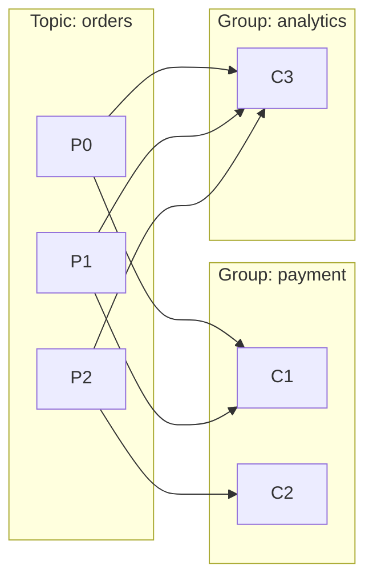
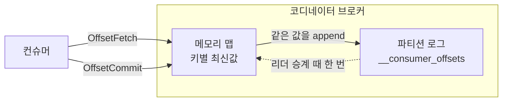

컨슈머가 커밋한 진행 위치는 컨슈머 프로세스 안이 아니라 브로커의 `__consumer_offsets`에 있다. 이름이 내부 토픽일 뿐 여느 토픽과 같아서 파티션으로 나뉘고 로그 파일로 디스크에 놓이며, 커밋 한 번은 여기에 레코드 하나가 붙는 일이다. Kafka의 토픽은 큐가 아니라 append-only 로그라 읽어도 레코드가 남는다.

## 토픽 하나에 파티션 50개

로그 디렉토리에 `__consumer_offsets-0`부터 `-49`까지 디렉토리로 놓인다.

| 설정 | 하는 일 | 기본값 (4.2.1) |
|---|---|---|
| `offsets.topic.num.partitions` | 토픽이 처음 만들어질 때 잡히는 파티션 수 | `50` |
| `offsets.topic.replication.factor` | 그때 잡히는 복제 계수 | `3` |

둘 다 브로커 설정이고 토픽이 자동 생성되는 그 한 번에만 쓰인다. 이미 만들어진 토픽의 파티션 수는 값을 바꿔도 변하지 않는다.

파티션이 50개인 것은 클러스터의 모든 커밋이 이 토픽 하나로 모이기 때문이다. 자동 커밋을 쓰면 컨슈머 하나가 5초마다 담당 파티션 수만큼 레코드를 넣고, 파티션이 하나면 그 리더 브로커 한 대가 그 쓰기를 전부 받는다.

어느 파티션에 들어갈지는 `group.id`를 해싱해 정한다. 한 그룹의 레코드는 전부 같은 파티션으로 들어가고, 그룹이 50개를 넘으면 같은 파티션을 함께 쓰는 그룹이 생긴다. 그 [파티션의 리더 브로커가 그 그룹들의 코디네이터](/posts/kafka-consumer-rebalance-protocol)가 된다.

## 레코드 키를 이루는 세 값

```
[group-01,simple-topic,0]::OffsetAndMetadata(offset=4, ...)

group-01       그룹 이름
simple-topic   진도를 기록할 대상 토픽
0              그 토픽의 파티션 번호
offset=4       simple-topic-0 에서 다음에 읽을 위치
```

대괄호 안이 키이고 값에는 offset과 함께 leader epoch, 커밋 시각이 담긴다. `simple-topic`에 파티션이 3개라면 레코드가 세 개로 갈려 각각 `0`, `1`, `2`를 든다. 파티션은 독립된 로그라 진도가 제각각이다.

이 레코드가 저장된 `__consumer_offsets` 파티션 번호는 키에 없다. `group-01`을 해싱하면 나오니 적어 둘 필요가 없다.

`client.id`도 member ID도 키에 없다. 진행 위치를 가르는 단위는 컨슈머가 아니라 이 세 값의 조합이다.

## 그룹 둘이 같은 파티션을 읽을 때

컨슈머 그룹은 파티션을 나눠 갖는 팀이라 배정표에 파티션 하나가 한 번만 나온다. 그룹 경계 밖에는 제약이 없어 다른 그룹이 같은 파티션을 함께 읽는다.



C1과 C3가 둘 다 P0을 읽는데 커밋 키는 그룹 이름이 달라 갈린다.

| 키 | 값 | 넣은 컨슈머 |
|---|---|---|
| `[payment,orders,0]` | 100 | C1 |
| `[payment,orders,1]` | 250 | C1 |
| `[payment,orders,2]` | 90 | C2 |
| `[analytics,orders,0]` | 40 | C3 |
| `[analytics,orders,1]` | 40 | C3 |
| `[analytics,orders,2]` | 12 | C3 |

그룹 이름이 키에 있으니 그룹끼리 겹치지 않고, 파티션 번호가 있으니 같은 그룹 안에서도 겹치지 않는다. 키에 컨슈머 식별자까지 넣지 않은 것도 같은 설계다. 넣었다면 C1이 죽고 C2가 P0을 인수할 때 키가 `[payment,orders,0,C2]`로 바뀌어 C1이 남긴 100을 못 찾고, 리밸런싱마다 `auto.offset.reset`부터 다시 시작하게 된다.

## 컨슈머가 주고받는 요청 둘

컨슈머는 `__consumer_offsets`를 구독하지 않는다. 읽고 쓰는 주체는 코디네이터 브로커이고, 컨슈머는 전용 요청 둘로 자기 그룹과 파티션만 말한다.



`OffsetFetch`가 와도 코디네이터는 로그를 훑지 않고 메모리 맵에서 조회 한 번으로 답한다. 저장된 값이 없으면 `-1`을 돌려주고, 컨슈머가 `auto.offset.reset`을 적용해 `ListOffsets`로 earliest나 latest 위치를 따로 물어본다.

컨슈머가 `OffsetFetch`를 보내는 것은 파티션을 배정받는 순간뿐이다. 기동 직후와 리밸런싱 직후에 한 번 물어보고, 이후 읽기 위치는 컨슈머 메모리에서 올라간다.

## 코디네이터가 로그를 맵으로 바꾸는 시점

브로커가 어느 파티션의 리더가 되는 순간, 그 파티션 로그를 offset 0부터 끝까지 순차로 읽어 키별 최신값을 담은 맵을 만든다.

```
로그를 순서대로 읽으며 맵을 채운다

[payment,orders,0]   -> 40     덮인다
[analytics,orders,0] -> 12
[payment,orders,0]   -> 100    남는다
[payment,orders,1]   -> 250

결과 맵

[payment,orders,0]   -> 100
[payment,orders,1]   -> 250
[analytics,orders,0] -> 12
```

파티션을 앞에서부터 다 읽는 전체 스캔이지만 컨슈머 그룹의 읽기와 경로가 다르다. Fetch 요청이 아니라 로컬 디스크의 로그 세그먼트를 직접 읽고, `group.id`도 진도 기록도 없다. 한 번에 읽어 들이는 크기는 `offsets.load.buffer.size`가 정하고 기본값은 5MB다.

로그를 한 번만 읽어도 되는 것은 그 파티션에 쓰는 주체가 코디네이터 자신뿐이기 때문이다. `OffsetCommit`이 오면 로그에 붙이면서 메모리 맵도 같은 값으로 고치니 맵이 로그보다 낡아질 수가 없다. 다시 읽어야 하는 경우는 맵을 잃었을 때, 즉 리더가 다른 브로커로 넘어갔을 때뿐이다.

로딩이 끝나기 전에 도착한 `OffsetFetch`와 `OffsetCommit`은 `COORDINATOR_LOAD_IN_PROGRESS`로 거절된다. 이미 돌고 있던 컨슈머는 읽기 위치를 자기 메모리에 들고 있어 데이터 처리는 계속하면서 커밋만 실패한다.

로딩 시간은 로그 크기에 비례하고, 그 크기를 붙잡아 두는 것이 `cleanup.policy=compact`다. 컴팩션 뒤에 남는 레코드 수는 커밋 횟수가 아니라 서로 다른 키의 개수다. 그룹 100개가 파티션 10개짜리 토픽을 읽으면 키가 천 개이고, 5초마다 커밋해 하루에 천칠백만 건을 넣어도 컴팩션이 지나가면 천 건 근처로 돌아온다.

파티션을 50개로 쪼개면 이 로딩 범위도 함께 쪼개진다. 브로커 한 대가 죽으면 그 브로커가 리더였던 파티션들만 다시 로딩되고, 멈추는 것은 그 파티션들에 해싱된 그룹뿐이다. 파티션이 하나였다면 브로커 한 대를 재시작할 때마다 모든 그룹이 멈춘다.

## 값은 다음에 읽을 자리

값에 들어가는 offset은 처리한 마지막 offset이 아니라 다음에 읽을 자리다. offset 0, 1, 2를 처리했으면 3이 들어간다.

기록이 없는 새 그룹이 `auto.offset.reset`의 기본값 `latest`로 붙으면 읽기 위치가 곧바로 Log End Offset으로 잡힌다. 레코드를 한 건도 받지 않은 채 자동 커밋 주기가 돌면 그 위치가 그대로 기록되므로, 메시지 세 건이 쌓인 토픽에 새 그룹을 띄우면 화면에는 아무것도 찍히지 않는데 offset 3이 남는다. 그 순간부터 기록이 있으니 `earliest`로 바꿔 다시 띄워도 0부터 읽지 않는다.

## 기록이 없는 경우

`auto.offset.reset`은 이 토픽에 그 키의 값이 없을 때만 쓰인다. 값이 있으면 `earliest`를 적었든 `latest`를 적었든 저장된 위치부터 읽는다.

- **처음 쓰는 `group.id`.** 그룹 이름을 바꿔 배포하는 것이 여기에 해당한다.
- **`offsets.retention.minutes`를 넘긴 방치.** 그룹은 남아 있는데 [진도만 만료되어 사라진다](/posts/kafka-consumer-lag).
- **토픽 삭제 후 재생성.** 토픽이 지워지면 브로커가 그 토픽에 대한 커밋 기록을 tombstone으로 지운다.

`kafka-console-consumer.sh`가 `--from-beginning`을 붙일 때마다 처음부터 읽어 주는 것이 첫 번째 경로다. `--group`을 주지 않으면 실행할 때마다 `console-consumer-` 뒤에 난수를 붙인 그룹을 새로 만들기 때문이다.
