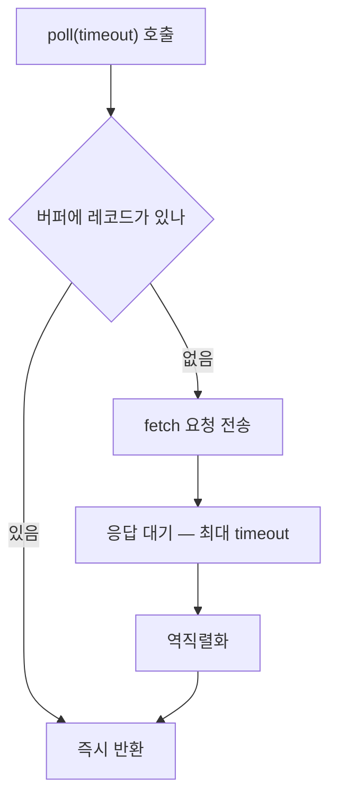

컨슈머 코드는 토픽을 구독하고 무한 루프에서 `poll()`을 부르는 것이 전부다. 프로듀서는 `send()`가 레코드를 배치에 넣어 두고 별도의 Sender 스레드가 실제 전송을 하지만, 컨슈머에는 그렇게 대신 일해 줄 스레드가 없다. 레코드를 가져오는 일은 루프를 도는 그 스레드가 직접 한다.

## 컨슈머가 부르는 것은 셋이다

```java
Properties properties = new Properties();
properties.setProperty(ConsumerConfig.BOOTSTRAP_SERVERS_CONFIG, "localhost:9092");
properties.setProperty(ConsumerConfig.KEY_DESERIALIZER_CLASS_CONFIG, StringDeserializer.class.getName());
properties.setProperty(ConsumerConfig.VALUE_DESERIALIZER_CLASS_CONFIG, StringDeserializer.class.getName());
properties.setProperty(ConsumerConfig.GROUP_ID_CONFIG, "group-01");
properties.setProperty(ConsumerConfig.AUTO_OFFSET_RESET_CONFIG, "earliest");

try (KafkaConsumer<String, String> kafkaConsumer = new KafkaConsumer<>(properties)) {
    kafkaConsumer.subscribe(List.of(topicName));

    while (true) {
        ConsumerRecords<String, String> records = kafkaConsumer.poll(Duration.ofMillis(1000));
        for (ConsumerRecord<String, String> record : records) {
            logger.info("key: {} value: {} partition: {} offset: {}",
                record.key(), record.value(), record.partition(), record.offset());
        }
    }
}
```

- **`subscribe`** — 읽을 토픽을 등록한다. 인자가 `Collection`이라 여러 토픽을 한 번에 구독할 수 있다.
- **`poll`** — 브로커에서 레코드를 가져온다. 반환값은 레코드 하나가 아니라 여러 건이 담긴 `ConsumerRecords`라, 그것을 다시 루프로 펼쳐 `ConsumerRecord` 하나씩 꺼낸다.
- **커밋** — 어디까지 읽었는지를 브로커의 내부 토픽 `__consumer_offsets`에 기록한다. 위 코드에 호출이 없고, `enable.auto.commit` 기본값에 따라 `poll` 안에서 처리된다.

설정에서 프로듀서와 갈리는 자리가 둘이다. `key.serializer`·`value.serializer` 대신 `key.deserializer`·`value.deserializer`를 쓰고, `group.id`가 필수다. `group.id` 없이 `subscribe`를 부르면 `InvalidGroupIdException`이 난다 — 그룹 관리와 커밋 API가 전부 그룹 이름에 매여 있어서다.

## poll은 부른 스레드를 붙잡는다

`poll`이 하는 일의 순서가 `ClassicKafkaConsumer`에 그대로 있다. 버퍼에 이미 모아 둔 레코드가 있으면 그것을 곧바로 돌려주고, 없으면 fetch 요청을 만들어 보낸 뒤 응답을 기다린다.



요청 전송, 응답 수신, 역직렬화가 전부 `poll`을 부른 스레드에서 일어난다. 그래서 `KafkaConsumer`는 thread-safe하지 않다 — 메서드마다 잠금을 잡고 들어가며, 다른 스레드가 같은 컨슈머를 동시에 만지면 `ConcurrentModificationException`으로 막는다. 한 컨슈머는 한 스레드가 쓴다.

레코드를 반환하기 직전에 다음 fetch 요청을 미리 내보내는 것도 이 스레드다. 애플리케이션이 방금 받은 레코드를 처리하는 동안 브로커에서 다음 묶음이 날아오고 있으므로, 다음 `poll`은 대개 기다리지 않고 버퍼에서 바로 꺼내 준다.

## 백그라운드 스레드는 heartbeat만 보낸다

컨슈머에도 백그라운드 스레드가 하나 있다. `AbstractCoordinator`의 내부 클래스 `HeartbeatThread`이고, 스레드 이름은 `kafka-coordinator-heartbeat-thread`에 `group.id`를 이어 붙인 형태다.

하는 일이 둘이다.

- **`heartbeat.interval.ms`마다 그룹 코디네이터에 heartbeat를 보낸다.** 컨슈머 프로세스가 살아있다는 신고다.
- **애플리케이션 스레드가 `poll`을 다시 불렀는지 감시한다.** `max.poll.interval.ms`를 넘기면 스스로 LeaveGroup을 보내고 그룹에서 빠진다.

레코드를 가져오거나 역직렬화하거나 커밋하지는 않는다. 그룹에 아직 합류하지 않은 상태면 스스로 잠들어 있는다.

## 타임아웃이 두 개인 이유

heartbeat를 별도 스레드로 뽑아낸 것은 Kafka 0.10.1의 결과다. 그전에는 heartbeat도 `poll` 안에서 보냈기 때문에, 받은 레코드를 DB에 쓰는 데 오래 걸리면 그 사이 heartbeat가 나가지 않아 살아있는 컨슈머가 죽은 것으로 판정됐다. 처리가 느린 것과 프로세스가 멈춘 것을 구분할 수단이 없었다.

그래서 감시를 둘로 나눴다.

| 설정 | 재는 것 | 넘겼을 때 | 기본값 (4.2.1) |
|---|---|---|---|
| `heartbeat.interval.ms` | heartbeat 전송 주기 | — | `3000` |
| `session.timeout.ms` | heartbeat가 끊긴 시간 | 브로커가 멤버를 축출한다 | `45000` |
| `max.poll.interval.ms` | `poll` 사이의 간격 | 컨슈머가 스스로 그룹에서 빠진다 | `300000` |

`session.timeout.ms`는 프로세스의 생사를, `max.poll.interval.ms`는 처리의 진행을 각각 본다. 처리 로직이 5분 넘게 걸리면 heartbeat는 정상인데도 그룹에서 빠져 리밸런싱이 일어나고, 그 뒤의 커밋이 `CommitFailedException`을 받는다. 이미 파티션을 잃은 컨슈머가 커밋하려 드는 상황이라 거절된다.

처리가 오래 걸리는 컨슈머에서 손댈 값은 `session.timeout.ms`가 아니라 이쪽 둘이다. `max.poll.interval.ms`를 늘리거나, `max.poll.records`를 줄여 한 번에 받는 양을 깎는다. 기본값이 500이므로 한 건에 1초 걸리는 처리라면 한 묶음을 비우는 데 8분이 든다.

## poll의 인자는 sleep이 아니다

`Duration.ofMillis(1000)`은 최대 대기 시간이다. 가져올 게 없을 때만 그 시간까지 기다리고, 버퍼에 레코드가 있으면 즉시 리턴한다. 무한 루프가 초당 한 바퀴 도는 것이 아니라 데이터가 들어오는 만큼 돈다.

기다리는 층이 하나 더 있다. 브로커도 fetch 요청을 곧바로 처리하지 않고, 줄 만큼 쌓이거나 시간이 차기를 기다린다.

| 설정 | 재는 것 | 기본값 (4.2.1) |
|---|---|---|
| `fetch.min.bytes` | 이만큼 모이면 응답한다 | `1` |
| `fetch.max.wait.ms` | 덜 모였어도 이 시간이 지나면 응답한다 | `500` |
| `max.poll.records` | `poll` 한 번이 반환하는 레코드 수 상한 | `500` |

기본값이 1바이트라 브로커는 레코드가 하나만 있어도 곧바로 응답한다. `fetch.min.bytes`를 올리면 왕복이 줄고 그만큼 지연이 붙는데, 프로듀서가 [배치를 모아 보내는 것](/posts/kafka-producer-buffer)과 같은 축의 조율이다.

`max.poll.records`가 자르는 것은 브로커에서 가져오는 양이 아니라 `poll`이 한 번에 건네주는 양이다. 버퍼에 그보다 많이 들어 있으면 다음 `poll`은 네트워크에 나가지 않고 남은 것을 꺼내 준다.

## 커밋은 poll 안에서 일어난다

`enable.auto.commit`의 기본값은 `true`다. 커밋 호출이 없는 코드에서도 진행 위치가 저장되는 것은 `poll`이 매번 시간을 확인해, `auto.commit.interval.ms`가 지났으면 커밋 요청을 함께 보내기 때문이다.

| 설정 | 하는 일 | 기본값 (4.2.1) |
|---|---|---|
| `enable.auto.commit` | `poll` 안에서 자동으로 커밋한다 | `true` |
| `auto.commit.interval.ms` | 자동 커밋의 최소 간격 | `5000` |

커밋되는 값은 처리한 마지막 offset이 아니라 **다음에 읽을 offset**이다. offset 2까지 처리했으면 3이 저장된다.

주체가 `poll`이라는 데서 경계가 따라 나온다. 자동 커밋은 "처리를 끝냈으니 커밋한다"가 아니라 "다음 `poll`을 부를 때가 됐으니 앞서 건네준 것은 처리됐다고 본다"에 가깝다. 그래서 레코드 100건을 받아 40건만 처리한 채 프로세스가 죽었을 때, 그 100건이 이미 커밋됐으면 남은 60건은 다시 읽히지 않는다. 반대로 커밋 직전에 죽으면 이미 처리한 것을 다시 읽는다. 어느 쪽으로 기울일지 직접 고르려면 자동 커밋을 끄고 커밋 시점을 코드가 잡는다.

이 어긋남은 [Lag](/posts/kafka-consumer-lag)에도 그대로 드러난다. Lag의 기준은 커밋된 값이라, 처리는 되고 있는데 커밋이 밀려 있으면 그만큼 밀린 것으로 잡힌다.

## auto.offset.reset은 저장된 offset이 없을 때만 쓰인다

`__consumer_offsets`에 그 그룹의 진행 위치가 없을 때 어디서부터 읽을지가 `auto.offset.reset`으로 정해진다. 새 `group.id`로 처음 접속했거나, 오래 멈춰 있어 저장해 둔 offset이 만료된 경우다. 남아 있는 가장 오래된 offset부터 읽는 `earliest`와 지금 이후에 들어오는 것만 읽는 `latest` 중 하나를 고르며, 기본값은 `latest`다.

기본값 탓에 걸리는 자리가 있다. 메시지를 먼저 세 건 보내 놓고 새 그룹으로 컨슈머를 띄우면, 컨슈머는 fetch position을 offset 3으로 잡고 아무것도 읽지 않는다. 쌓여 있는 0·1·2는 건너뛰고 그 뒤에 보낸 것부터 찍힌다. 기동 로그에 `Resetting offset for partition`으로 시작하는 줄이 남는 것이 유일한 단서다.

한 번이라도 커밋이 있었으면 이 값은 아무 역할을 하지 않는다. 위 코드가 `earliest`를 명시해 둔 것도 그 그룹이 처음 뜰 때만 효력이 있다.

## close가 안 불리면 45초가 남는다

`close()`는 두 가지를 한다. 자동 커밋이 켜져 있으면 마지막 진행 위치를 동기로 커밋하고, 그다음 LeaveGroup을 보내 그룹에서 명시적으로 빠진다. LeaveGroup이 도착하면 코디네이터가 곧바로 [리밸런싱](/posts/kafka-basics)을 시작해 남은 컨슈머들에 파티션을 넘긴다.

이것이 생략되면 브로커는 그 멤버가 아직 있다고 본다. `session.timeout.ms` 45초가 지나 heartbeat 부재가 확정될 때까지 파티션이 그 멤버에게 배정된 채 남는다. 그 사이에 컨슈머를 다시 띄우면 새 멤버가 합류를 시도하는데 이전 멤버 자리가 정리되지 않은 상태라, 기동 로그에 재합류 시도가 반복해 찍힌다.

무한 루프 안에서는 `close()`에 닿을 길이 없다. `while (true)` 아래에 적어 둔 문장은 도달하지 않고, try-with-resources도 블록을 벗어나야 닫히므로 예외가 밖으로 나가지 않는 한 돌지 않는다. IDE의 정지 버튼이나 `SIGTERM`은 JVM을 내리는 신호라 루프를 빠져나오게 만들지 못한다.

빠져나오는 수단이 `wakeup()`이다. 다른 스레드에서 부르면 `poll`에 붙잡혀 있던 스레드가 `WakeupException`을 받고 튀어나오므로, 그 예외를 잡아 `finally`에서 닫는다.

```java
KafkaConsumer<String, String> kafkaConsumer = new KafkaConsumer<>(properties);
Runtime.getRuntime().addShutdownHook(new Thread(kafkaConsumer::wakeup));

try {
    kafkaConsumer.subscribe(List.of(topicName));

    while (true) {
        ConsumerRecords<String, String> records = kafkaConsumer.poll(Duration.ofMillis(1000));
        // 처리
    }
} catch (WakeupException e) {
    logger.info("wakeup 으로 poll 루프를 빠져나왔다");
} finally {
    kafkaConsumer.close();
}
```

`wakeup()`은 컨슈머의 메서드 중 유일하게 다른 스레드에서 불러도 되는 것이다. 나머지를 다른 스레드에서 부르면 `ConcurrentModificationException`으로 막히므로, 종료 신호를 넣을 자리가 여기뿐이다.

## 이 배치는 group.protocol이 classic일 때다

Kafka 4.0부터 컨슈머 그룹 프로토콜을 고를 수 있다. `group.protocol`을 `consumer`로 두면 구현이 `AsyncKafkaConsumer`로 바뀌고 스레드 배치가 뒤집힌다 — `ConsumerNetworkThread`가 네트워크 I/O와 heartbeat를 모두 맡고, 애플리케이션 스레드의 `poll`은 이벤트 큐에서 완료된 fetch를 꺼내 온다.

| 설정 | 고를 수 있는 값 | 기본값 (4.2.1) |
|---|---|---|
| `group.protocol` | `classic` · `consumer` | `classic` |

4.2.1의 기본값이 `classic`이라, 설정을 건드리지 않은 컨슈머는 위에서 본 배치로 돈다. 새 프로토콜은 파티션 할당도 클라이언트가 아니라 브로커가 계산하고, `session.timeout.ms`·`heartbeat.interval.ms`도 클라이언트 설정에서 브로커 설정으로 옮겨간다. 어느 프로토콜로 도는지 모른 채 타임아웃을 조정하면 클라이언트에 적은 값이 아무 일도 하지 않을 수 있다.

---

프로듀서와 컨슈머는 스레드를 반대로 쓴다. 프로듀서는 `send()`가 배치에 넣고 빠지며 전송을 [백그라운드에 맡기고](/posts/kafka-java-producer-internals), 컨슈머는 `poll`을 부른 스레드가 가져오는 일까지 직접 한다. 컨슈머의 백그라운드 스레드가 맡은 것은 살아있다는 신고와, 그 신고가 거짓이 되지 않게 `poll` 간격을 감시하는 일뿐이다.

그래서 컨슈머의 타임아웃은 전부 그 스레드가 언제 돌아오는지를 재고 있다. `poll`이 언제 리턴하는지, 다음 `poll`이 언제 오는지, 마지막 `poll` 뒤에 `close`가 불렸는지. 루프를 한 바퀴 늦게 돌면 파티션을 잃고, 루프를 못 빠져나오면 45초가 남는다.
