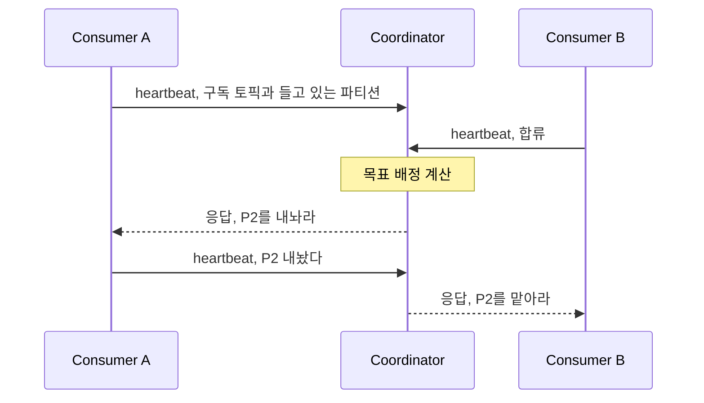
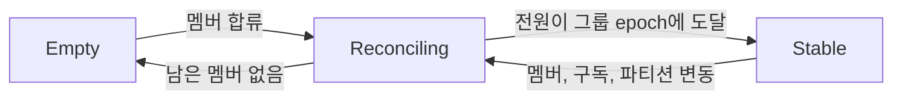

컨슈머 그룹에서 한 파티션은 한 컨슈머에게만 배정되고, 멤버가 들어오거나 나갈 때마다 이 배정은 다시 계산된다. KIP-848은 그 계산을 컨슈머에서 브로커로 옮긴다. `group.protocol`을 `consumer`로 두면 켜지고, Kafka 4.0에서 GA가 되었다.

## 리더가 없어진 자리

classic 프로토콜에서는 컨슈머 중 하나가 [그룹 리더로 뽑혀 배정표를 계산하고](/posts/kafka-consumer-rebalance-protocol), 그러려면 멤버 명단이 확정돼야 하므로 리밸런싱마다 전원이 JoinGroup에 참여하는 자리가 생긴다. 명단도 구독 정보도 코디네이터가 이미 갖고 있던 것이라, KIP-848은 계산만 클라이언트에 외주 주던 것을 거둬들였다.

리더라는 역할이 사라지고, JoinGroup과 SyncGroup이라는 별도 절차도 사라진다. 남는 것은 평소에 계속 오가는 **heartbeat 하나**다.

heartbeat가 생존 신고를 넘어 배정 협상 채널이 된다. 올라가는 heartbeat에는 그 멤버의 구독 토픽과 지금 들고 있는 파티션이 실리고, 내려오는 응답에는 그 멤버가 해야 할 일이 실린다. 내놓을 파티션과 새로 맡을 파티션이다. 리밸런싱이 이벤트가 터지면 전원이 모이는 특별 절차에서, heartbeat를 주고받다 보면 배정이 바뀌어 있는 상시 과정으로 바뀐다.

## 한 파티션이 주인을 바꾸는 순서

epoch는 상태가 바뀔 때마다 1씩 커지는 세대 번호이고, 셋을 나눠 쓴다. 값을 매기는 것은 셋 다 코디네이터다.

| epoch | 무엇의 세대인가 | 어디에 있나 |
|---|---|---|
| 그룹 epoch | 그룹의 멤버와 구독 구성 | 코디네이터 |
| 배정 epoch | 목표 배정이 어느 그룹 epoch로 계산됐는지 | 코디네이터 |
| 멤버 epoch | 그 멤버가 어디까지 따라왔는지 | 컨슈머가 하나씩 들고, 코디네이터도 멤버별로 안다 |

멤버나 구독이 바뀌면 코디네이터가 그룹 epoch를 올리고 그 시점의 목표 배정을 계산한다. 멤버 epoch는 컨슈머가 올리지 않는다. 받은 배정을 처리해 확인하면 코디네이터가 올려서 heartbeat 응답으로 내려보내고, 컨슈머는 그 값을 자기 필드에 받아 다음 heartbeat에 실어 보낸다. 앞의 둘은 브로커 안에만 있고 멤버 epoch만 heartbeat를 타고 오간다.

파티션 하나가 주인을 바꾸는 순서는 정해져 있다.

1. 코디네이터가 지금 주인의 heartbeat 응답에 "이 파티션을 내놔라"를 싣는다.
2. 그 멤버는 offset을 커밋하고 내놓은 뒤, 다음 heartbeat로 보고한다.
3. 내놓아진 파티션만 새 주인의 heartbeat 응답에 실린다.

이전 주인이 내놓기 전에는 새 주인에게 주지 않으므로 한 파티션에 컨슈머 둘이 붙지 않고, 그 대기는 **두 멤버 사이에서만** 일어난다. 나머지 멤버는 자기 파티션을 계속 읽는다. classic에서 eager냐 Cooperative냐를 골랐던 구분이 사라지고 점진이 기본형이 된다.

## 그룹 상태와 그 전이

consumer group이 쓰는 상태는 일곱이다. classic이 쓰는 `Empty`, `PreparingRebalance`, `CompletingRebalance`, `Stable`, `Dead` 다섯을 그대로 안고 둘이 더 붙는다. 다섯이 남아 있는 것은 전환 중에 한 그룹이 두 프로토콜의 멤버를 함께 갖기 때문이다.

새로 붙은 둘이 이 프로토콜의 진행을 나타낸다.

| 상태 | 언제 |
|---|---|
| `Assigning` | 그룹 epoch가 배정 epoch보다 앞섬. 새 배정표를 만드는 중 |
| `Reconciling` | 배정표는 나왔고 멤버들이 그리로 옮기는 중 |
| `Stable` | 전원이 그룹 epoch에 도달 |

다이어그램에 `Assigning`이 없는 이유는 그 상태의 조건에 있다. 그룹 epoch는 올라갔는데 배정 epoch가 아직 못 따라온 구간이어야 하고, 그러려면 epoch를 올리는 일과 배정표를 짜는 일이 떨어져 있어야 한다. 코디네이터는 둘을 한 번에 하므로 두 값이 늘 붙어 다니고, 조건이 성립할 틈이 없다. 떨어지는 경우는 계산을 밖에 맡기고 답을 기다릴 때뿐인데, 그 클라이언트 쪽 assignor가 4.2.1에 없다.

`Reconciling`이 길어져도 읽기는 멈추지 않는다. 옮겨 가는 파티션에 걸린 두 멤버만 서로를 기다리고 나머지는 계속 읽는다. 전원의 JoinGroup을 모으느라 그룹이 소비를 멈추는 classic의 `PreparingRebalance`와 갈리는 자리다.

## 브로커 설정으로 옮겨간 배정 전략

계산 주체가 옮겨가면서, 계산에 관한 설정들도 클라이언트에서 브로커로 옮겨간다.

| classic에서, 컨슈머 설정 | 새 프로토콜에서, 브로커 설정 | 기본값 (4.2.1) |
|---|---|---|
| `partition.assignment.strategy` | `group.consumer.assignors` | `uniform`, `range` |
| `session.timeout.ms` | `group.consumer.session.timeout.ms` | `45000` |
| `heartbeat.interval.ms` | `group.consumer.heartbeat.interval.ms` | `5000` |

서버 내장 전략은 둘이다. 파티션을 고르게 흩는 `uniform`과 토픽별 연속 구간으로 자르는 `range`이고, 둘 다 재배정 때 기존 배정을 최대한 유지한다. 컨슈머는 `group.remote.assignor`로 이름을 골라 요청할 수 있고, 지정하지 않으면 브로커 목록의 첫 번째가 쓰인다.

클라이언트 설정 파일에 남아 있는 `session.timeout.ms`는 새 프로토콜에서 아무 일도 하지 않는다. 값을 조정하기 전에 그 그룹이 어느 프로토콜로 도는지부터 확인해야 하는 이유이고, 스레드 구조가 어떻게 달라지는지는 [컨슈머 poll 루프](/posts/kafka-consumer-poll-loop)에서 다룬다.

옮겨가며 좁아진 것이 하나 있다. classic에서 커스텀 assignor를 꽂던 자리가 새 프로토콜에는 아직 없다. KIP-848에 클라이언트 쪽 assignor가 정의는 되어 있지만 4.2.1 기준으로 구현되지 않았다. 그래서 자기 전용 assignor에 의존하는 Kafka Streams는 새 프로토콜을 쓰지 못하고, 스트림즈용 프로토콜은 KIP-1071로 따로 진행 중이다.

## 넘어가는 길

`group.protocol`의 기본값은 4.2.1에서 아직 `classic`이다. 전환은 그룹 단위로 일어난다. `consumer`로 설정한 멤버가 기존 classic 그룹에 합류하면 코디네이터가 그룹을 온라인으로 전환하고, 롤링 재시작 동안 두 프로토콜의 멤버가 공존한다. 커스텀 메타데이터 없는 표준 assignor를 쓰던 그룹이라는 조건이 붙는다. 두 개짜리 전략 목록을 만들어 롤링 두 번을 밟던 classic 안에서의 전환과 달리, 프로토콜 전환 자체는 재시작 한 바퀴로 끝난다.

---

배정을 누가 계산하느냐는 질문 하나가 리밸런싱의 성격을 정한다. 클라이언트가 계산하면 합의가 필요하고, 합의에는 전원이 멈추는 순간이 따라온다. 조율자가 계산하면 선언과 수렴만 남는다.

대신 고를 수 있는 범위가 좁아졌다. assignor를 직접 구현해 꽂던 자리가 서버에 내장된 둘 중 하나를 이름으로 요청하는 자리로 바뀌었다.
