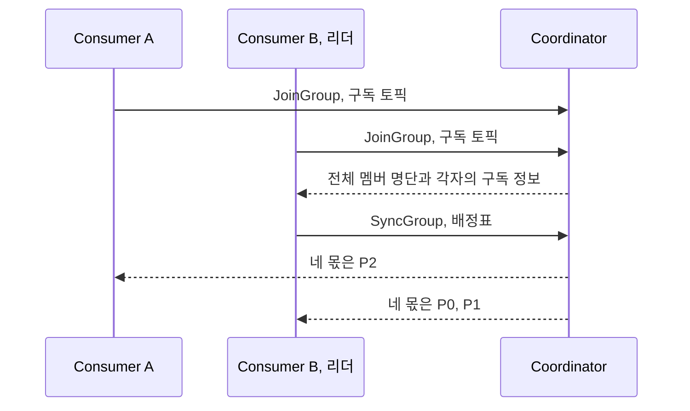
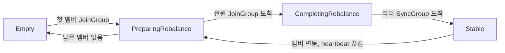

컨슈머 그룹에서 한 파티션은 한 컨슈머에게만 배정되고, 멤버가 들어오거나 나갈 때마다 이 배정은 다시 계산된다. 이 재계산이 [리밸런싱](/posts/kafka-basics)이다. classic 프로토콜은 그 계산을 브로커가 아니라 컨슈머 중 하나에게 맡긴다.

## 코디네이터와 그룹 리더

classic 프로토콜에는 특별한 역할이 둘인데, 있는 곳이 다르다.

| 역할 | 정체 | 하는 일 |
|---|---|---|
| 그룹 코디네이터 | 브로커 하나 | 멤버 명단 관리, heartbeat 수신, 배정 결과 전달 |
| 그룹 리더 | 컨슈머 하나 | 배정표 계산 |

어느 브로커가 코디네이터가 되는지는 그룹 이름으로 정해진다. 커밋된 offset이 저장되는 내부 토픽 `__consumer_offsets`는 여느 토픽처럼 파티션으로 나뉘어 있고, `group.id`를 해싱해 그 그룹의 offset이 저장될 파티션이 정해지며, **그 파티션의 리더 브로커가 그 그룹의 코디네이터**가 된다. 그룹마다 코디네이터가 다를 수 있어 코디네이터 부하가 클러스터에 분산되고, 그룹의 offset 기록과 멤버 관리가 같은 브로커에서 처리된다.

리더는 코디네이터가 멤버 중 하나를 지정한다. 대체로 처음 합류한 멤버다. 리더로 뽑힌 컨슈머도 다른 컨슈머와 직접 통신하지는 않는다. 컨슈머끼리는 서로의 존재를 모르고, 모든 대화는 코디네이터를 거친다.

## JoinGroup과 SyncGroup의 왕복

리밸런싱 한 번은 코디네이터를 축으로 한 왕복이다.

- **JoinGroup으로 합류를 신고한다.** 각 멤버가 자기가 무슨 토픽을 구독하는지를 담아 코디네이터에 보낸다.
- **계산은 리더 혼자 한다.** 코디네이터는 리더에게만 전체 명단을 넘기고, 리더는 자기 JVM 안에서 `partition.assignment.strategy`에 설정된 할당 전략 코드를 돌려 배정표를 만든다.
- **SyncGroup으로 배정표가 돌아온다.** 리더가 코디네이터에 제출하고, 코디네이터가 각 멤버에게 자기 몫만 배포한다.

계산을 일부러 클라이언트에 뒀다. 배정 로직이 컨슈머 쪽에 있으면 **브로커를 고치지 않고도 전략을 갈아 끼울 수 있다.** `partition.assignment.strategy`에는 직접 구현한 assignor를 꽂을 수 있고, Kafka Streams가 실제로 이 자리에 자기 전용 assignor를 꽂아 태스크 배치와 상태 저장소 위치까지 고려한 배정을 한다. 브로커는 그룹이 무슨 기준으로 파티션을 나누는지 전혀 몰라도 된다.

## 그룹 상태와 그 전이

코디네이터는 그룹마다 상태를 하나 들고 있고, 그 값이 리밸런싱의 어느 단계인지를 가리킨다.

| 상태 | 그룹이 놓인 자리 |
|---|---|
| `Empty` | 멤버가 0. 커밋된 offset은 남아 있다 |
| `PreparingRebalance` | 리밸런싱이 시작돼 멤버들의 JoinGroup을 모으는 중 |
| `CompletingRebalance` | 명단이 확정돼 리더의 SyncGroup을 기다리는 중 |
| `Stable` | 배정표가 배포돼 각 멤버가 자기 파티션을 읽는 중 |
| `Dead` | 그룹 메타데이터가 정리됨 |

중간 상태가 둘인 것은 classic의 대기가 둘로 갈리기 때문이다. 기다리는 대상이 다르므로, 리밸런싱이 끝나지 않을 때 그룹이 어느 상태에 멈춰 있는지가 원인을 가른다.

- **`PreparingRebalance`에 오래 머물러 있다는 것은 아직 JoinGroup을 보내지 않은 멤버가 있다는 의미다.** 리밸런싱이 시작됐다는 신호를 받은 컨슈머가 실제로 JoinGroup을 보내는 자리는 [`poll` 안](/posts/kafka-consumer-poll-loop)이라, 받아 둔 한 묶음을 처리하는 데 오래 걸리는 멤버가 늦게 합류한다. 코디네이터가 기다리는 데에는 한도가 있다. 각 멤버가 JoinGroup에 자기 `max.poll.interval.ms`를 실어 보내고, 코디네이터는 그중 가장 큰 값까지 기다린 뒤 그때도 안 온 멤버는 빼고 진행한다.
- **`CompletingRebalance`에 오래 머물러 있다는 것은 명단은 다 모였고 리더의 계산이 늦다는 의미다.** 리더가 계산 도중 이탈하면 남은 멤버로 JoinGroup부터 다시 밟는다.

상태는 `kafka-consumer-groups.sh --describe --state`로 조회한다. 그룹이 `Stable`이 아닌 동안에는 커밋도 흔들린다. 리밸런싱이 진행 중일 때 도착한 `OffsetCommit`은 `REBALANCE_IN_PROGRESS`로 거절되고, 그 사이에 그룹에서 빠진 멤버가 보낸 커밋은 세대가 맞지 않아 `CommitFailedException`이 된다.

`Empty`는 멤버가 0인 상태이지 그룹이 사라진 상태가 아니다. 커밋된 offset은 `offsets.retention.minutes` 동안 그대로 남아서, 배포로 전원을 내렸다 올려도 [진도를 이어받는다](/posts/kafka-consumer-lag). 그 기간을 넘겨 방치하면 그룹은 남아 있는데 진도만 사라진다.

## 전원이 모여야 계산이 서는 비용

리더가 배정표를 만들려면 멤버 명단이 확정돼야 한다. 그래서 리밸런싱마다 **그룹 전원이 JoinGroup에 참여하는 동기화 지점**이 생기고, 이 지점이 classic의 비용 대부분을 만든다.

- **가장 느린 멤버가 전체를 붙잡는다.** 전원이 모일 때까지 계산이 시작되지 못하므로, 늦게 합류하는 멤버 하나가 그룹 전체의 재개를 늦춘다. eager 방식에서는 그동안 전원이 파티션을 내려놓고 있어 이른바 stop-the-world가 된다.
- **리더가 죽으면 처음부터 다시다.** 계산 도중 리더가 이탈하면 남은 멤버로 다시 JoinGroup부터 밟는다.
- **구현이 클라이언트마다 흩어져 있다.** Java, Go, Python 클라이언트가 각자 assignor를 구현하므로 언어와 버전에 따라 동작이 갈리고, 버그도 각자 난다. 전략을 바꾸려면 모든 인스턴스를 발맞춰 배포해야 한다. 기본 전략 목록이 두 개짜리인 채로 롤링 재시작 두 번을 밟아야 Cooperative로 넘어갈 수 있는 [전환 절차](/posts/kafka-basics)가 이 구조의 증상이다.

stop-the-world를 줄이려고 나온 Cooperative Rebalancing은 재배정을 여러 라운드로 나눠 영향받는 파티션만 옮긴다. 대신 revoke와 rejoin을 오가는 프로토콜 절차가 복잡해졌고, 그 절차를 모든 클라이언트 구현이 정확히 밟아야 정합성이 유지된다. 유연함을 클라이언트에 둔 대가가 복잡함까지 클라이언트에 복제되는 것으로 돌아왔다.

---

classic은 유연함을 클라이언트에 뒀다. `partition.assignment.strategy`에 원하는 assignor를 꽂는 자유를 얻는 대신 전원이 모이는 동기화 벽, 흩어진 구현, 발맞춘 배포를 값으로 치른다.

Kafka 4.0에서 GA가 된 [새 프로토콜](/posts/kafka-consumer-rebalance-kip848)은 이 거래를 뒤집어 계산을 코디네이터로 가져간다. `group.protocol`의 기본값은 4.2.1에서 아직 `classic`이라, 설정을 건드리지 않은 그룹은 JoinGroup과 SyncGroup을 오가는 왕복으로 돈다.
