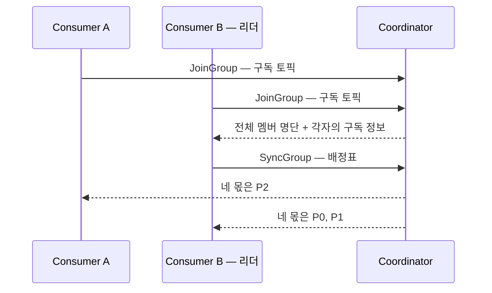
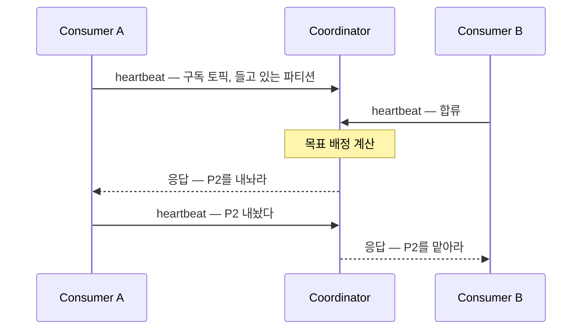

컨슈머 그룹에서 한 파티션은 한 컨슈머에게만 배정되고, 멤버가 들어오거나 나갈 때마다 이 배정은 다시 계산된다. 이 재계산이 [리밸런싱](/posts/kafka-basics)이다. 그런데 그 계산을 누가 하는지가 Kafka 4.0에서 바뀌었다. classic 프로토콜은 컨슈머 중 하나가 계산하고, KIP-848로 들어온 새 프로토콜은 브로커가 계산한다.

## 역할이 양쪽에 하나씩 있다

classic 프로토콜에는 특별한 역할이 둘인데, 있는 곳이 다르다.

| 역할 | 정체 | 하는 일 |
|---|---|---|
| 그룹 코디네이터 | 브로커 하나 | 멤버 명단 관리, heartbeat 수신, 배정 결과 전달 |
| 그룹 리더 | 컨슈머 하나 | 배정표 계산 |

어느 브로커가 코디네이터가 되는지는 그룹 이름으로 정해진다. 커밋된 offset이 저장되는 내부 토픽 `__consumer_offsets`는 여느 토픽처럼 파티션으로 나뉘어 있고, `group.id`를 해싱해 그 그룹의 offset이 저장될 파티션이 정해지며, **그 파티션의 리더 브로커가 그 그룹의 코디네이터**가 된다. 그룹마다 코디네이터가 다를 수 있어 코디네이터 부하가 클러스터에 분산되고, 그룹의 offset 기록과 멤버 관리가 같은 브로커에서 처리된다.

리더는 코디네이터가 멤버 중 하나를 지정한다. 대체로 처음 합류한 멤버다. 뽑혔다고 해서 다른 컨슈머와 통신하게 되지는 않는다 — 컨슈머끼리는 서로의 존재를 모르고, 모든 대화는 코디네이터를 거친다.

## classic — 명단은 브로커가 모으고 계산은 컨슈머가 한다

리밸런싱 한 번은 코디네이터를 축으로 한 왕복이다.

- **JoinGroup** — 멤버들이 코디네이터에 합류를 신고한다. 각자 무슨 토픽을 구독하는지를 담아서.
- **계산** — 코디네이터는 리더에게만 전체 명단을 넘기고, 리더는 자기 JVM 안에서 `partition.assignment.strategy`에 설정된 할당 전략 코드를 돌려 배정표를 만든다.
- **SyncGroup** — 리더가 배정표를 코디네이터에 제출하고, 코디네이터가 각 멤버에게 자기 몫만 배포한다.

계산을 일부러 클라이언트에 뒀다. 배정 로직이 컨슈머 쪽에 있으면 **브로커를 고치지 않고도 전략을 갈아 끼울 수 있다.** `partition.assignment.strategy`에는 직접 구현한 assignor를 꽂을 수 있고, Kafka Streams가 실제로 이 자리에 자기 전용 assignor를 꽂아 태스크 배치와 상태 저장소 위치까지 고려한 배정을 한다. 브로커는 그룹이 무슨 기준으로 파티션을 나누는지 전혀 몰라도 된다.

## 유연함의 값 — 전원이 모여야 계산이 선다

리더가 배정표를 만들려면 멤버 명단이 확정돼야 한다. 그래서 리밸런싱마다 **그룹 전원이 JoinGroup에 참여하는 동기화 지점**이 생기고, 이 지점이 classic의 비용 대부분을 만든다.

- **가장 느린 멤버가 전체를 붙잡는다.** 전원이 모일 때까지 계산이 시작되지 못하므로, 늦게 합류하는 멤버 하나가 그룹 전체의 재개를 늦춘다. eager 방식에서는 그 동안 전원이 파티션을 내려놓고 있어 이른바 stop-the-world가 된다.
- **리더가 죽으면 처음부터 다시다.** 계산 도중 리더가 이탈하면 남은 멤버로 다시 JoinGroup부터 밟는다.
- **구현이 클라이언트마다 흩어져 있다.** Java·Go·Python 클라이언트가 각자 assignor를 구현하므로 언어와 버전에 따라 동작이 갈리고, 버그도 각자 난다. 전략을 바꾸려면 모든 인스턴스를 발맞춰 배포해야 한다 — 기본 전략 목록이 두 개짜리인 채로 롤링 재시작 두 번을 밟아야 Cooperative로 넘어갈 수 있는 [전환 절차](/posts/kafka-basics)가 이 구조의 증상이다.

stop-the-world를 줄이려고 나온 Cooperative Rebalancing은 재배정을 여러 라운드로 나눠 영향받는 파티션만 옮긴다. 대신 revoke와 rejoin을 오가는 프로토콜 절차가 복잡해졌고, 그 절차를 모든 클라이언트 구현이 정확히 밟아야 정합성이 유지된다. 유연함을 클라이언트에 둔 대가가 복잡함까지 클라이언트에 복제되는 것으로 돌아온 셈이다.

## 새 프로토콜 — 계산이 코디네이터로 들어간다

KIP-848은 이 왕복 자체를 접었다. 명단도 구독 정보도 이미 코디네이터가 갖고 있었으므로, 계산만 클라이언트에 외주 주던 것을 거둬들인 것이다. `group.protocol=consumer`로 켜고, Kafka 4.0에서 GA가 되었다.

리더라는 역할이 사라지고, JoinGroup·SyncGroup이라는 별도 절차도 사라진다. 남는 것은 평소에 계속 오가는 **heartbeat 하나**다.

heartbeat가 생존 신고를 넘어 배정 협상 채널이 된다. 올라가는 heartbeat에는 그 멤버의 구독 토픽과 지금 들고 있는 파티션이 실리고, 내려오는 응답에는 그 멤버가 해야 할 일 — 내놓을 파티션, 새로 맡을 파티션 — 이 실린다. 리밸런싱이 "이벤트가 터지면 전원이 모이는 특별 절차"에서 "heartbeat를 주고받다 보면 배정이 바뀌어 있는" 상시 과정으로 바뀐다.

## 멤버별로 수렴한다 — 전원이 멈추는 벽이 없다

코디네이터는 멤버·구독·파티션 메타데이터가 바뀔 때마다 그룹의 **epoch**를 올리고 그 시점의 **목표 배정**을 계산해 둔다. 각 멤버는 자기 epoch를 따로 갖고, 자기 heartbeat 주기에 맞춰 목표 상태로 다가간다.

한 파티션이 주인을 바꾸는 순서는 정해져 있다.

1. 코디네이터가 지금 주인의 heartbeat 응답에 "이 파티션을 내놔라"를 싣는다.
2. 그 멤버는 해당 파티션의 offset을 커밋하고 내놓은 뒤, 다음 heartbeat로 보고한다.
3. 내놓아진 파티션만 새 주인의 heartbeat 응답에 실린다.

이전 주인이 내놓기 전에는 새 주인에게 주지 않으므로 한 파티션에 컨슈머 둘이 붙는 일이 구조적으로 막히고, 그 대기는 **그 파티션에 관련된 두 멤버 사이에서만** 일어난다. 나머지 멤버들은 자기 파티션을 계속 읽는다. 느린 멤버 하나가 붙잡는 것은 자기가 내놓을 파티션의 이동뿐이고, 그룹 전체가 멈추는 구간이 없다. classic에서 eager냐 Cooperative냐를 골랐던 구분 자체가 사라진다 — 점진이 프로토콜의 기본형이다.

## 배정 전략은 브로커 설정이 된다

계산 주체가 옮겨가면서, 계산에 관한 설정들도 클라이언트에서 브로커로 옮겨간다.

| classic에서 — 컨슈머 설정 | 새 프로토콜에서 — 브로커 설정 | 기본값 (4.2.1) |
|---|---|---|
| `partition.assignment.strategy` | `group.consumer.assignors` | `uniform`, `range` |
| `session.timeout.ms` | `group.consumer.session.timeout.ms` | `45000` |
| `heartbeat.interval.ms` | `group.consumer.heartbeat.interval.ms` | `5000` |

서버 내장 전략은 둘이다. 파티션을 고르게 흩는 `uniform`과 토픽별 연속 구간으로 자르는 `range`이고, 둘 다 재배정 때 기존 배정을 최대한 유지한다. 컨슈머는 `group.remote.assignor`로 이름을 골라 요청할 수 있고, 지정하지 않으면 브로커 목록의 첫 번째가 쓰인다.

클라이언트 설정 파일에 남아 있는 `session.timeout.ms`는 새 프로토콜에서 아무 일도 하지 않는다. 값을 조정하기 전에 그 그룹이 어느 프로토콜로 도는지부터 확인해야 하는 이유이고, 스레드 구조가 어떻게 달라지는지는 [컨슈머 poll 루프](/posts/kafka-consumer-poll-loop)에서 다룬다.

옮겨가며 좁아진 것이 하나 있다. classic에서 커스텀 assignor를 꽂던 자리가 새 프로토콜에는 아직 없다 — KIP-848에 클라이언트 쪽 assignor가 정의는 되어 있지만 4.2.1 기준으로 구현되지 않았다. 그래서 자기 전용 assignor에 의존하는 Kafka Streams는 새 프로토콜을 쓰지 못하고, 스트림즈용 프로토콜은 KIP-1071로 따로 진행 중이다.

## 넘어가는 길

`group.protocol`의 기본값은 4.2.1에서 아직 `classic`이다. 전환은 그룹 단위로 일어난다 — `consumer`로 설정한 멤버가 기존 classic 그룹에 합류하면 코디네이터가 그룹을 온라인으로 전환하고, 롤링 재시작 동안 두 프로토콜의 멤버가 공존한다. 커스텀 메타데이터 없는 표준 assignor를 쓰던 그룹이라는 조건이 붙는다. 두 개짜리 전략 목록을 만들어 롤링 두 번을 밟던 classic 안에서의 전환과 달리, 프로토콜 전환 자체는 재시작 한 바퀴로 끝난다.

---

classic은 유연함을 클라이언트에 뒀다. 커스텀 assignor라는 자유를 얻는 대신 전원이 모이는 동기화 벽, 흩어진 구현, 발맞춘 배포를 값으로 치렀다. 새 프로토콜은 그 거래를 뒤집었다 — 계산을 조율자에게 돌려주고, 유연함은 서버 내장 전략 중에서 고르는 것으로 좁혔다.

배정을 누가 계산하느냐는 질문 하나가 리밸런싱의 성격을 정한다. 클라이언트가 계산하면 합의가 필요하고 합의에는 전원이 멈추는 순간이 따라온다. 조율자가 계산하면 선언과 수렴만 남는다.
