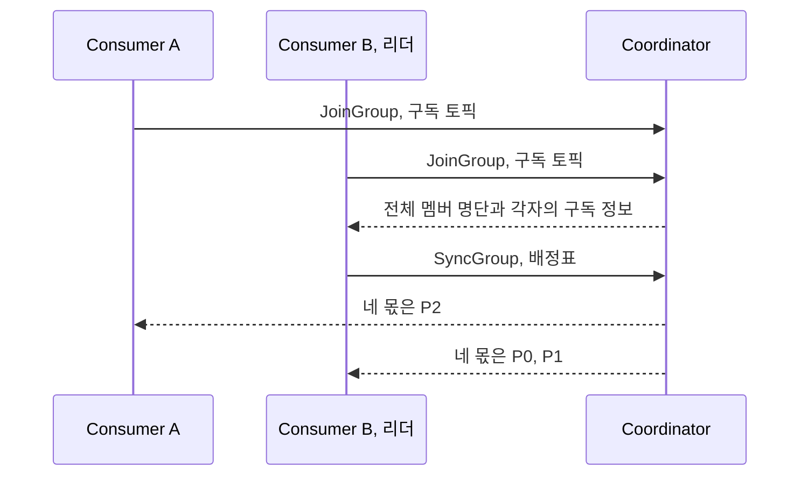
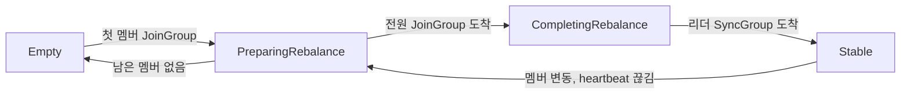
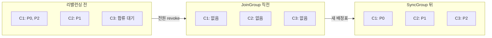
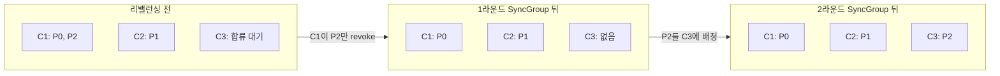

컨슈머 그룹에서 한 파티션은 한 컨슈머에게만 배정되고, 멤버가 들어오거나 나갈 때마다 이 배정은 다시 계산된다. 이 재계산이 [리밸런싱](/posts/kafka-basics)이다. classic 프로토콜은 그 계산을 브로커가 아니라 컨슈머 중 하나에게 맡긴다.

## 코디네이터와 그룹 리더

classic 프로토콜에는 특별한 역할이 둘인데, 있는 곳이 다르다.

| 역할 | 정체 | 하는 일 |
|---|---|---|
| 그룹 코디네이터 | 브로커 하나 | 멤버 명단 관리, heartbeat 수신, 배정 결과 전달 |
| 그룹 리더 | 컨슈머 하나 | 배정표 계산 |

어느 브로커가 코디네이터가 되는지는 그룹 이름으로 정해진다. 커밋된 offset이 저장되는 내부 토픽 `__consumer_offsets`는 여느 토픽처럼 파티션으로 나뉘어 있고, `group.id`를 해싱해 그 그룹의 offset이 저장될 파티션이 정해지며, **그 파티션의 리더 브로커가 그 그룹의 코디네이터**가 된다. 그룹마다 코디네이터가 다를 수 있어 코디네이터 부하가 클러스터에 분산되고, 그룹의 offset 기록과 멤버 관리가 같은 브로커에서 처리된다.

리더는 코디네이터가 멤버 중 하나를 지정한다. 대체로 처음 합류한 멤버다. 리더로 뽑힌 컨슈머도 다른 컨슈머와 직접 통신하지는 않는다. 컨슈머끼리는 서로의 존재를 모르고, 모든 대화는 코디네이터를 거친다.

## JoinGroup과 SyncGroup의 왕복

리밸런싱 한 번은 코디네이터를 축으로 한 왕복이다.

```mermaid
sequenceDiagram
    participant A as Consumer A
    participant B as Consumer B, 리더
    participant C as Coordinator
    A->>C: JoinGroup, 구독 토픽
    B->>C: JoinGroup, 구독 토픽
    C-->>B: 전체 멤버 명단과 각자의 구독 정보
    B->>C: SyncGroup, 배정표
    C-->>A: 네 몫은 P2
    C-->>B: 네 몫은 P0, P1
```

- **JoinGroup으로 합류를 신고한다.** 각 멤버가 자기가 무슨 토픽을 구독하는지를 담아 코디네이터에 보낸다.
- **계산은 리더 혼자 한다.** 코디네이터는 리더에게만 전체 명단을 넘기고, 리더는 자기 JVM 안에서 `partition.assignment.strategy`에 설정된 할당 전략 코드를 돌려 배정표를 만든다.
- **SyncGroup으로 배정표가 돌아온다.** 리더가 코디네이터에 제출하고, 코디네이터가 각 멤버에게 자기 몫만 배포한다.

계산을 일부러 클라이언트에 뒀다. 배정 로직이 컨슈머 쪽에 있으면 **브로커를 고치지 않고도 전략을 갈아 끼울 수 있다.** `partition.assignment.strategy`에는 직접 구현한 assignor를 꽂을 수 있고, Kafka Streams가 실제로 이 자리에 자기 전용 assignor를 꽂아 태스크 배치와 상태 저장소 위치까지 고려한 배정을 한다. 브로커는 그룹이 무슨 기준으로 파티션을 나누는지 전혀 몰라도 된다.

## 그룹 상태와 그 전이

코디네이터는 그룹마다 상태를 하나 들고 있고, 그 값이 리밸런싱의 어느 단계인지를 가리킨다.

| 상태 | 그룹이 놓인 자리 |
|---|---|
| `Empty` | 멤버가 0. 커밋된 offset은 남아 있다 |
| `PreparingRebalance` | 리밸런싱이 시작돼 멤버들의 JoinGroup을 모으는 중 |
| `CompletingRebalance` | 명단이 확정돼 리더의 SyncGroup을 기다리는 중 |
| `Stable` | 배정표가 배포돼 각 멤버가 자기 파티션을 읽는 중 |
| `Dead` | 그룹 메타데이터가 정리됨 |

```mermaid
flowchart LR
    E["Empty"] -->|"첫 멤버 JoinGroup"| P["PreparingRebalance"]
    S["Stable"] -->|"멤버 변동, heartbeat 끊김"| P
    P -->|"전원 JoinGroup 도착"| C["CompletingRebalance"]
    C -->|"리더 SyncGroup 도착"| S
    P -->|"남은 멤버 없음"| E
```

중간 상태가 둘인 것은 classic의 대기가 둘로 갈리기 때문이다. 기다리는 대상이 다르므로, 리밸런싱이 끝나지 않을 때 그룹이 어느 상태에 멈춰 있는지가 원인을 가른다.

- **`PreparingRebalance`에 오래 머물러 있다는 것은 아직 JoinGroup을 보내지 않은 멤버가 있다는 의미다.** 리밸런싱이 시작됐다는 신호를 받은 컨슈머가 실제로 JoinGroup을 보내는 자리는 [`poll` 안](/posts/kafka-consumer-poll-loop)이라, 받아 둔 한 묶음을 처리하는 데 오래 걸리는 멤버가 늦게 합류한다. 코디네이터가 기다리는 데에는 한도가 있다. 각 멤버가 JoinGroup에 자기 `max.poll.interval.ms`를 실어 보내고, 코디네이터는 그중 가장 큰 값까지 기다린 뒤 그때도 안 온 멤버는 빼고 진행한다.
- **`CompletingRebalance`에 오래 머물러 있다는 것은 명단은 다 모였고 리더의 계산이 늦다는 의미다.** 리더가 계산 도중 이탈하면 남은 멤버로 JoinGroup부터 다시 밟는다.

상태는 `kafka-consumer-groups.sh --describe --state`로 조회한다. 그룹이 `Stable`이 아닌 동안에는 커밋도 흔들린다. 리밸런싱이 진행 중일 때 도착한 `OffsetCommit`은 `REBALANCE_IN_PROGRESS`로 거절되고, 그 사이에 그룹에서 빠진 멤버가 보낸 커밋은 세대가 맞지 않아 `CommitFailedException`이 된다.

`Empty`는 멤버가 0인 상태이지 그룹이 사라진 상태가 아니다. 커밋된 offset은 `offsets.retention.minutes` 동안 그대로 남아서, 배포로 전원을 내렸다 올려도 [진도를 이어받는다](/posts/kafka-consumer-lag). 그 기간을 넘겨 방치하면 그룹은 남아 있는데 진도만 사라진다.

## eager 방식의 전면 회수

heartbeat 응답으로 리밸런싱이 시작됐다는 것을 알게 된 멤버는, JoinGroup을 보내기 전에 들고 있던 파티션을 전부 내려놓는다. `onPartitionsRevoked`가 가진 파티션 전체를 인자로 불리고, 그 뒤로 이 멤버에게 배정된 파티션은 하나도 없다. 리더는 누가 무엇을 들고 있었는지 모르는 빈 판에서 배정표를 새로 계산하고, 한 라운드로 끝난다.

파티션 셋을 컨슈머 둘이 나눠 읽다가 C3가 합류하면 배정이 이렇게 지나간다.

```mermaid
flowchart LR
    subgraph E1["리밸런싱 전"]
        direction TB
        E1a["C1: P0, P2"]
        E1b["C2: P1"]
        E1c["C3: 합류 대기"]
    end
    subgraph E2["JoinGroup 직전"]
        direction TB
        E2a["C1: 없음"]
        E2b["C2: 없음"]
        E2c["C3: 없음"]
    end
    subgraph E3["SyncGroup 뒤"]
        direction TB
        E3a["C1: P0"]
        E3b["C2: P1"]
        E3c["C3: P2"]
    end
    E1 -->|"전원 revoke"| E2 -->|"새 배정표"| E3
```

결과만 보면 주인이 바뀐 파티션은 P2 하나이고, C2는 원래 들고 있던 P1을 그대로 돌려받는다. 그래도 리밸런싱 동안에는 세 파티션이 전부 주인 없이 멈춰 있다. 이 그룹 전체의 멈춤을 stop-the-world라고 부른다. 파티션 수십 개를 컨슈머 수십 개가 나눠 읽는 그룹이면 그 시간 동안 들어온 메시지가 전부 Lag로 쌓이고, 재개한 뒤 그것을 따라잡는 데 또 시간이 든다.

`StickyAssignor`를 골라도 멈춤은 같다. 계산 결과가 이전 배정과 최대한 같아질 뿐, 계산하는 동안 전원이 파티션을 내려놓고 있는 절차는 그대로다.

## cooperative 방식의 두 라운드

cooperative 멤버는 파티션을 쥔 채로 JoinGroup을 보내고, 지금 들고 있는 파티션 목록을 구독 정보에 함께 싣는다. 리더는 그 목록과 새 배정을 비교해 주인이 바뀌는 파티션을 찾고, 그 파티션은 이번 배정표에서 아무에게도 주지 않는다. 이전 주인의 몫에서 빼기만 한다.

같은 상황이 두 라운드로 나뉜다.

```mermaid
flowchart LR
    subgraph K1["리밸런싱 전"]
        direction TB
        K1a["C1: P0, P2"]
        K1b["C2: P1"]
        K1c["C3: 합류 대기"]
    end
    subgraph K2["1라운드 SyncGroup 뒤"]
        direction TB
        K2a["C1: P0"]
        K2b["C2: P1"]
        K2c["C3: 없음"]
    end
    subgraph K3["2라운드 SyncGroup 뒤"]
        direction TB
        K3a["C1: P0"]
        K3b["C2: P1"]
        K3c["C3: P2"]
    end
    K1 -->|"C1이 P2만 revoke"| K2 -->|"P2를 C3에 배정"| K3
```

- **1라운드에서는 내놓기만 한다.** C1은 받은 배정표에 P2가 빠진 것을 보고 P2에 대해서만 `onPartitionsRevoked`를 부른 뒤 곧바로 다시 JoinGroup을 보낸다. P0와 P1은 이 동안에도 계속 읽힌다.
- **2라운드에서 새 주인에게 준다.** 이번 JoinGroup에서는 P2를 들고 있다고 보고한 멤버가 없으므로, 리더가 P2를 C3에 배정한다.

라운드를 둘로 나누면 한 파티션을 두 컨슈머가 동시에 쥐는 순간이 생기지 않는다. 1라운드에서 P2를 C3에게 바로 주면 C1이 P2의 마지막 offset을 커밋하기 전에 C3가 읽기 시작할 수 있다. C1이 P2를 내놓았다는 것이 다음 JoinGroup의 소유 목록으로 확인된 뒤에야 P2가 C3에게 넘어간다.

대가로 JoinGroup과 SyncGroup 왕복이 한 번에서 두 번으로 늘고, 두 라운드 모두 전원이 JoinGroup에 참여한다. 줄어드는 것은 왕복 수가 아니라 멈추는 파티션 수다.

리밸런스 리스너가 불리는 범위도 달라진다.

| 콜백 | eager | cooperative |
|---|---|---|
| `onPartitionsRevoked` | JoinGroup 전, 가진 파티션 전부 | SyncGroup 뒤, 내놓을 파티션만 |
| `onPartitionsAssigned` | 배정된 파티션 전부 | 새로 받은 파티션만 |

revoke 콜백에서 커밋하거나 로컬 캐시를 비우는 코드는 eager에서는 리밸런싱마다 모든 파티션에 대해 돌지만, cooperative에서는 옮겨지는 파티션에 대해서만 돈다. 전체를 비운다고 가정하고 짠 코드는 cooperative로 바꾸면 남은 파티션의 상태를 그대로 들고 간다.

어느 방식으로 돌지는 `partition.assignment.strategy`에 적은 전략 목록이 정한다. 컨슈머는 목록의 전략들이 공통으로 지원하는 프로토콜 중 가장 나중에 나온 것을 고르므로, 하나라도 eager만 지원하면 cooperative로 돌지 않는다. 내장 전략 중 cooperative를 지원하는 것은 `CooperativeStickyAssignor`뿐이고, 기본 목록에는 eager 전용인 Range가 함께 들어 있어서 기본 설정의 실제 동작은 eager다. 목록에서 Range를 빼려면 롤링 재시작을 두 번 밟는 [전환 절차](/posts/kafka-basics)를 거친다.

## 전원이 모여야 계산이 서는 비용

리더가 배정표를 만들려면 멤버 명단이 확정돼야 한다. 그래서 리밸런싱마다 **그룹 전원이 JoinGroup에 참여하는 동기화 지점**이 생기고, 이 지점이 classic의 비용 대부분을 만든다.

- **가장 느린 멤버가 전체를 붙잡는다.** 전원이 모일 때까지 계산이 시작되지 못하므로, 늦게 합류하는 멤버 하나가 그룹 전체의 재개를 늦춘다. eager에서는 그 시간 동안 모든 파티션이 멈추고, cooperative에서는 옮겨지는 파티션이 두 라운드에 걸쳐 멈춘다.
- **리더가 죽으면 처음부터 다시다.** 계산 도중 리더가 이탈하면 남은 멤버로 다시 JoinGroup부터 밟는다.
- **구현이 클라이언트마다 흩어져 있다.** Java, Go, Python 클라이언트가 각자 assignor를 구현하므로 언어와 버전에 따라 동작이 갈리고, 버그도 각자 난다. 전략을 바꾸려면 모든 인스턴스를 발맞춰 배포해야 한다. 기본 전략 목록이 두 개짜리인 채로 롤링 재시작 두 번을 밟아야 Cooperative로 넘어갈 수 있는 [전환 절차](/posts/kafka-basics)가 이 구조의 증상이다.

cooperative는 멈추는 파티션을 줄인 대신 revoke와 rejoin을 오가는 절차를 클라이언트에 더했고, 그 절차를 모든 클라이언트 구현이 정확히 밟아야 정합성이 유지된다. 유연함을 클라이언트에 둔 대가가 복잡함까지 클라이언트에 복제되는 것으로 돌아왔다.

---

classic은 유연함을 클라이언트에 뒀다. `partition.assignment.strategy`에 원하는 assignor를 꽂는 자유를 얻는 대신 전원이 모이는 동기화 벽, 흩어진 구현, 발맞춘 배포를 값으로 치른다.

Kafka 4.0에서 GA가 된 [새 프로토콜](/posts/kafka-consumer-rebalance-kip848)은 이 거래를 뒤집어 계산을 코디네이터로 가져간다. `group.protocol`의 기본값은 4.2.1에서 아직 `classic`이라, 설정을 건드리지 않은 그룹은 JoinGroup과 SyncGroup을 오가는 왕복으로 돈다.
