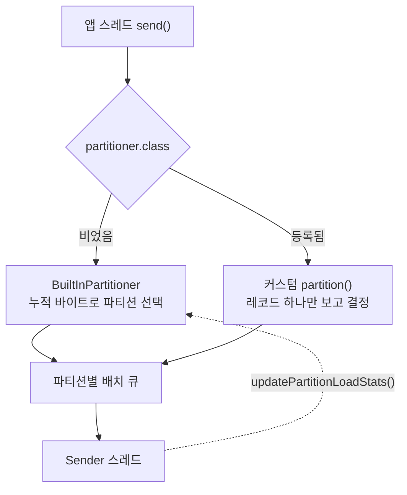

프로듀서가 레코드를 어느 파티션에 넣을지는 브로커가 아니라 프로듀서가 정한다. 그 규칙을 직접 짜려면 `Partitioner`를 구현해 `partitioner.class`에 등록한다. 추상 메서드가 둘뿐인 인터페이스라 구현은 짧고 등록은 설정 한 줄이다. 그 한 줄을 넣으면 프로듀서가 기본으로 쓰던 파티션 배분 로직은 더 이상 불리지 않는다.

## 기본 파티셔너라는 객체는 없음

`partitioner.class`의 기본값은 `null`이고, 이 상태에서 파티션은 `BuiltInPartitioner`가 정한다. 2.x에서 `partitioner.class=DefaultPartitioner`라고 적던 것과 4.x에서 아무것도 적지 않는 것이 같은 동작이다.

| 설정 | 하는 일 | 기본값 (4.2.1) |
|---|---|---|
| `partitioner.class` | 파티션 번호를 정할 구현체 | `null` |
| `partitioner.ignore.keys` | key가 있어도 무시하고 sticky로 보낸다 | `false` |
| `partitioner.adaptive.partitioning.enable` | 브로커 적체를 반영해 파티션을 고른다 | `true` |
| `partitioner.availability.timeout.ms` | 이 시간 넘게 배치가 빠지지 않는 브로커의 파티션을 후보에서 뺀다. `0`이면 쓰지 않는다 | `0` |

설정을 비운 채 프로듀서를 만들고 내부의 `partitionerPlugin`을 꺼내 보면 비어 있다. `Partitioner` 구현체 객체가 생성되지 않는다.

`BuiltInPartitioner`는 `Partitioner`를 구현하지 않는다. 클래스 선언에 implements 절이 없고, 패키지도 `clients.producer`가 아니라 `clients.producer.internals`다. 두 타입이 하는 일도 겹치지 않는다.

| | `Partitioner` | `BuiltInPartitioner` |
|---|---|---|
| 선언 | `public interface` | `public class`, implements 절 없음 |
| 패키지 | `clients.producer` | `clients.producer.internals` |
| 파티션 결정 | `partition(topic, key, keyBytes, value, valueBytes, cluster)` | `peekCurrentPartitionInfo(cluster)` |
| 결정에 쓰는 정보 | 레코드 하나와 클러스터 메타데이터 | 지금 붙어 있는 파티션에 보낸 누적 바이트, 브로커별 적체 통계 |
| 들고 있는 상태 | 없음 | `stickyPartitionInfo`, `partitionLoadStats` |
| 상태 갱신 | 없음 | `updatePartitionInfo(info, appendedBytes, cluster)` |

`DefaultPartitioner`와 `UniformStickyPartitioner`는 4.0에서 삭제됐다. 4.2.1 jar에 남아 있는 프로듀서 파티셔너 클래스는 `Partitioner` 인터페이스와 `RoundRobinPartitioner`, 그리고 `internals`의 `BuiltInPartitioner`뿐이다.

## partition()의 분기 순서

`send()`는 레코드를 곧바로 내보내지 않고 `doSend()`로 들어간다. 거기서 key와 value를 직렬화하고, 파티션 번호를 정하고, 그 번호로 `RecordAccumulator.append()`를 불러 배치에 넣는다. 가운데 단계를 맡는 것이 `KafkaProducer`의 private 메서드 `partition()`이다. 인자와 예외 메시지를 줄이면 분기가 넷이다.

```java
private int partition(ProducerRecord<K, V> record, byte[] serializedKey, ...) {
    if (record.partition() != null)
        return record.partition();                        // 1. 레코드에 박힌 번호

    if (partitionerPlugin.get() != null) {
        int p = partitionerPlugin.get().partition(...);   // 2. 커스텀 파티셔너
        if (p < 0) throw new IllegalArgumentException(...);
        return p;
    }

    if (serializedKey != null && !partitionerIgnoreKeys)
        return BuiltInPartitioner.partitionForKey(...);   // 3. key 해싱

    return RecordMetadata.UNKNOWN_PARTITION;              // 4. -1, append()가 정한다
}
```

커스텀 파티셔너 분기가 key 해싱보다 앞에 있어서, 등록하면 `partitionForKey()`도 sticky 배분도 적응형 배분도 닿지 않는다. 이 스위치는 레코드 단위가 아니라 프로듀서 단위라, 레코드에 번호를 직접 박는 첫 분기를 빼면 "이 레코드만 내가 정하고 나머지는 내장 로직에 맡긴다"는 형태가 나오지 않는다.

내장 경로에서 key가 없으면 `UNKNOWN_PARTITION`, 곧 `-1`을 돌려주고, `append()`가 배치를 채우면서 `BuiltInPartitioner`에게 번호를 받아 그 자리를 메운다. 커스텀 파티셔너는 이 표시를 쓸 수 없다. 음수는 곧바로 `IllegalArgumentException`이라, 내장 계층에 위임할 길이 인터페이스에 없다.

`partitioner.ignore.keys`, `partitioner.adaptive.partitioning.enable`, `partitioner.availability.timeout.ms`도 이 분기 뒤에서 읽힌다. 그래서 Kafka 문서는 셋 모두에 커스텀 파티셔너를 쓰면 효과가 없다고 적어 둔다.

## 내장 파티셔너가 파티션을 옮기는 기준

key가 있으면 파티션은 `murmur2(keyBytes) % 파티션수`로 정해지고, 이 계산은 2.x부터 지금까지 같다. key가 `null`이면 해싱할 것이 없으므로 다른 기준이 필요하고, 이 경우를 sticky 배분이 맡는다.

sticky의 목적은 배치를 채워 보내는 것이다. 파티션을 레코드마다 돌아가며 고르면 파티션이 3개일 때 세 배치를 동시에 조금씩 채우게 되고, 어느 배치도 `batch.size`에 도달하지 못한 채 시간에 밀려 나간다. 한 파티션에 달라붙어 그 배치를 채운 뒤 다음 파티션으로 옮기면 배치가 제 크기로 나간다.

2.4에서 처음 들어온 sticky는 배치가 완성될 때 다음 파티션으로 옮겼다. 이 방식은 느린 브로커로 레코드가 더 몰린다. 브로커가 느리면 그 파티션의 배치가 큐에서 오래 기다리고, 기다리는 동안 레코드가 계속 담기므로, 파티션별 배치 개수가 비슷해도 레코드 수는 느린 브로커 쪽이 많아진다.

3.3부터 기준이 누적 바이트로 바뀌었다. `StickyPartitionInfo`가 현재 붙어 있는 파티션 번호와 그 파티션으로 보낸 누적 바이트를 함께 들고 있고, 레코드를 배치에 넣을 때마다 바이트를 더해 `stickyBatchSize`와 비교한다. 미달이면 그 파티션에 머물고 도달하면 다음 파티션을 고른다. 배치가 몇 개 만들어졌는지는 보지 않는다.



다이어그램에서 점선은 내장 경로에만 붙는다. Sender는 배치를 꺼내 갈 브로커를 고르면서 파티션마다 얼마나 밀려 있는지를 세어 `updatePartitionLoadStats()`로 넘기고, sticky는 다음 파티션을 고를 때 그 통계로 가중 랜덤을 뽑아 적체가 심한 브로커의 파티션이 뽑힐 확률을 낮춘다. `partitioner.adaptive.partitioning.enable`이 켜고 끄는 것이 이 경로다. `partition()`은 이 통계를 볼 방법이 없다.

`BuiltInPartitioner`의 두 상태 필드는 갱신하는 스레드가 다르고, 그에 맞춰 동기화 방식도 다르다.

- **`stickyPartitionInfo`는 앱 스레드들이 쓴다.** 현재 붙어 있는 파티션과 누적 바이트를 담고 있다. `send()`를 부르는 스레드가 여럿이면 그만큼 경합하므로 `AtomicReference`로 감싸여 있다.
- **`partitionLoadStats`는 Sender 스레드가 쓴다.** 쓰는 쪽이 하나이고 읽는 쪽이 앱 스레드들이라, 경합을 막을 필요 없이 갱신이 보이기만 하면 되므로 `volatile`이다.

이 계층이 `internals` 패키지에 있고 `Partitioner` 인터페이스로 열리지 않는 것은 필요한 정보가 다르기 때문이다. `partition()`은 "이 레코드 하나를 어디로 보낼까"라는 질문만 받는데, 균일성을 확보하는 방법은 "이 파티션에 몇 바이트가 쌓였나"를 세는 것이고 그 숫자는 배치를 실제로 채우는 `RecordAccumulator`만 안다. 인터페이스로 공유 버퍼의 내부 상태를 넘길 방법이 없다.

## Partitioner를 구현

파티션 규칙을 직접 정하려면 `Partitioner`를 구현한다. 인터페이스는 두 상위 타입을 상속하고 있어서 채울 메서드가 셋이다.

```java
public interface Partitioner extends Configurable, Closeable {
    int partition(String topic, Object key, byte[] keyBytes,
                  Object value, byte[] valueBytes, Cluster cluster);
    void close();
}
```

`partition()`과 `close()`가 여기 선언돼 있고, `configure(Map<String, ?> configs)`는 `Configurable`에서 온다. 셋은 불리는 시점이 서로 다르다.

| 메서드 | 언제 불리나 | 호출 횟수 |
|---|---|---|
| `configure` | `KafkaProducer` 생성자 안 | 프로듀서마다 한 번 |
| `partition` | `send()`가 직렬화를 마친 뒤 | 레코드마다 한 번 |
| `close` | 프로듀서 `close()` | 프로듀서마다 한 번 |

### configure - 기동 시점에 설정 받기

프로듀서 생성자가 `getConfiguredInstance()`로 클래스를 인스턴스화하고, 그 객체가 `Configurable`이면 곧바로 `configure()`를 부른다. 그래서 이 메서드는 `send()`가 아니라 `new KafkaProducer(...)` 안에서 실행된다.

받는 맵은 프로듀서에 넘긴 설정 원본이다. `ProducerConfig`가 아는 이름만 걸러 내지 않고 그대로 넘어오기 때문에, 파티셔너에 값을 전달하는 통로가 된다.

```java
props.setProperty("custom.specialKey", "P001");
```

```java
private String specialKeyName;

@Override
public void configure(Map<String, ?> configs) {
    specialKeyName = configs.get("custom.specialKey").toString();
}
```

`client.id`는 설정하지 않아도 이 맵에 들어 있다. 프로듀서가 자동으로 만든 값을 넣어 주므로, 로그에 인스턴스를 구분해 찍을 때 쓸 수 있다.

여기서 두 가지가 따라 나온다.

- **여기서 던진 예외는 프로듀서 생성을 실패시킨다.** 설정이 빠졌을 때 기동 시점에 걸러내고 싶으면 이 자리에서 검사한다. `configs.get()`이 `null`을 돌려주는 채로 `toString()`을 부르면 `NullPointerException`이 나므로, 원인을 알리려면 `ConfigException`을 직접 던지는 편이 낫다.
- **여기서 세팅한 값은 이후로 바뀌지 않아야 한다.** `partition()`은 여러 앱 스레드가 동시에 부를 수 있고 그 스레드들이 같은 파티셔너 객체를 공유한다. 기동 뒤에 변하는 상태를 필드에 두면 경합이 생긴다.

### partition - 파티션 번호 반환

인자 여섯 개 중 넷이 레코드에서 온다.

| 인자 | 담는 것 |
|---|---|
| `topic` | 이 레코드가 갈 토픽 |
| `key`, `keyBytes` | key의 원본 객체와 직렬화된 바이트. key가 없으면 둘 다 `null` |
| `value`, `valueBytes` | value의 원본 객체와 직렬화된 바이트 |
| `cluster` | 브로커에서 받아 온 클러스터 메타데이터 |

원본과 바이트가 함께 오는 것은 직렬화가 이미 끝난 뒤에 호출되기 때문이다. 문자열 비교처럼 값 자체가 필요하면 `key`를 쓰고, 해싱처럼 바이트가 필요하면 `keyBytes`를 쓴다. Kafka 내장 해싱도 `keyBytes`를 쓴다.

`cluster`에서 파티션 정보를 꺼낸다.

| 메서드 | 돌려주는 것 |
|---|---|
| `partitionsForTopic(topic)` | 그 토픽의 파티션 전체 |
| `partitionCountForTopic(topic)` | 개수만 |
| `availablePartitionsForTopic(topic)` | 리더가 있는 파티션만 |

파티션 수를 코드에 박지 않고 매번 여기서 읽으면 토픽을 확장했을 때 따라간다. `available` 쪽을 쓰면 리더 선출 중인 파티션을 후보에서 뺄 수 있다. 리더가 없는 파티션 번호를 돌려줘도 예외는 나지 않고, 그 배치가 리더가 정해질 때까지 큐에서 기다린다.

반환값에는 제약이 둘 있다.

- **음수를 돌려주면 `IllegalArgumentException`이 난다.** `send()`를 부른 스레드로 예외가 올라온다.
- **파티션 수 이상을 돌려주면 브로커가 거절한다.** 5개짜리 토픽에 7을 돌려주면 전송이 실패한다.

이 메서드는 레코드마다 `send()`를 부른 스레드에서 실행된다. 여기에 무거운 일을 넣으면 그 시간이 `send()` 지연에 그대로 붙는다.

### close - 자원 해제

프로듀서를 닫을 때 불린다. 파티셔너가 파일이나 커넥션을 잡고 있었으면 여기서 놓고, 잡은 것이 없으면 비워 둔다.

```java
@Override
public void close() { }
```

프로듀서는 이 호출을 `Utils.closeQuietly()`로 감싸기 때문에, 여기서 예외가 나도 프로듀서 종료가 멈추지 않는다.

---

세 메서드가 받는 것에 누적 상태가 없다. `configure()`는 기동 시점의 설정을 받고, `partition()`은 레코드 하나와 클러스터 메타데이터를 받는다. 지금까지 어느 파티션에 몇 바이트를 보냈는지는 어느 인자에도 없다.

그래서 커스텀 파티셔너를 등록하는 것은 구현체를 갈아 끼우는 일이 아니라, 파티션을 고르는 기준을 누적 바이트에서 레코드 단위 규칙으로 바꾸는 선택이 된다. 그 규칙이 균일하게 흩어 주는지는 등록한 쪽이 확인해야 한다.
