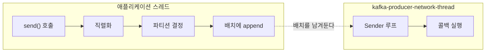
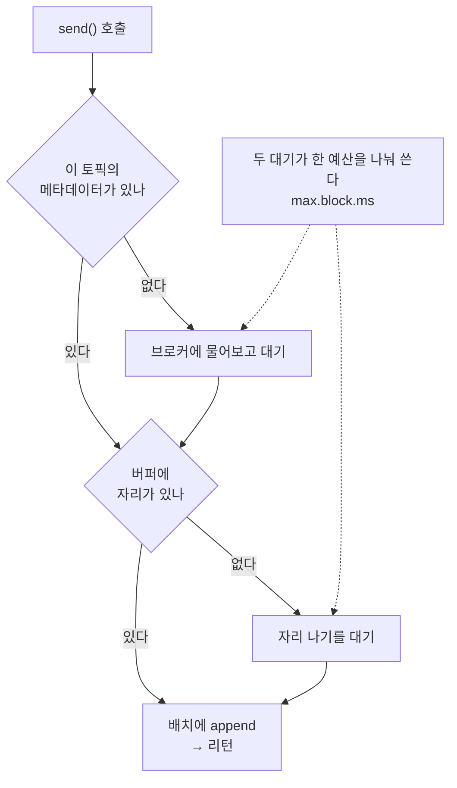
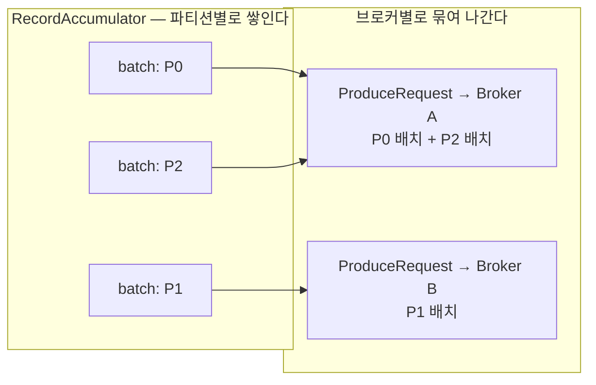

[프로듀서가 무엇을 하는지](/posts/kafka-producer-send)는 어느 언어로 쓰든 같다. 파티션을 정하고, 모아서 보내고, 실패하면 다시 시도한다. 그런데 그것을 **어떻게** 하는지는 클라이언트마다 다르고, 거기서 나오는 동작은 개념만 알고는 예측할 수 없다. `send()`가 즉시 리턴한다고 믿고 짠 코드가 60초를 붙잡거나, 실패한 전송이 성공처럼 보이는 로그를 남기는 일이 그래서 생긴다.

## 스레드는 둘이고, 하나는 생성자에서 뜬다

`send()`가 백그라운드로 나간다는 말에서 스레드 풀 같은 것을 떠올리기 쉽다. 아니다.

> 프로듀서 하나에 딸린 스레드는 **하나**다. 그리고 그 스레드는 `send()`를 부를 때가 아니라 **`KafkaProducer`를 만들 때** 시작된다.

`KafkaProducer` 생성자가 `Sender`를 만들고 그것을 감싼 스레드를 바로 `start()` 한다. 이름은 `kafka-producer-network-thread`에 `client.id`를 이어 붙인 형태다. 그 한 스레드가 모든 브로커와의 통신을 담당한다 — 브로커가 열 대여도 스레드가 열 개로 늘지 않는다.



경계가 어디인지가 중요하다. 직렬화와 파티션 결정은 **`send()`를 부른 스레드가 그 자리에서** 한다. 백그라운드로 넘어가는 건 배치에 넣은 다음부터다.

여기서 두 가지가 따라 나온다. 첫째, `KafkaProducer`를 만드는 것은 객체 하나 만드는 일이 아니라 스레드를 띄우는 일이다. 요청마다 새로 만들어 쓰고 버리면 그때마다 스레드가 뜨고 죽는다. 프로듀서는 만들어 두고 재사용하는 물건이다.

둘째, `client.id`가 스레드 이름에 들어간다. 한 프로세스가 프로듀서를 여러 개 띄웠을 때 스레드 덤프에서 누가 누구인지 알아볼 수 있는 유일한 단서가 이것이다. 로그 라벨용이라고만 생각하기 쉬운 값인데 진단할 때 실제로 쓰인다.

## send()가 블로킹하는 두 자리

앞 글에서 `send()`는 "보낸다"보다 "보낼 것을 배치에 넣어 둔다"에 가깝다고 했다. 그래서 리턴이 빠르다고. 대체로 맞지만 **항상 그렇지는 않다.**

> `send()`는 두 자리에서 멈출 수 있다. 메타데이터를 기다릴 때와, 버퍼 공간을 기다릴 때다.

파티션을 정하려면 그 토픽에 파티션이 몇 개인지 알아야 한다. 처음 보내는 토픽이면 그 정보가 아직 없으니 브로커에 물어보고 기다린다. 그다음 배치에 넣으려면 메모리가 있어야 한다. 프로듀서는 `buffer.memory`만큼의 공간을 고정으로 잡아 두고 거기서 배치를 떼어 쓰는데, 브로커로 빠져나가는 속도보다 밀어 넣는 속도가 빠르면 이 공간이 고갈된다. 그러면 자리가 나기를 기다린다.

두 대기는 **한 예산을 나눠 쓴다.**

| 설정 | 하는 일 | 기본값 (4.2.1) |
|---|---|---|
| `max.block.ms` | `send()`가 멈춰 있을 수 있는 총 시간 | `60000` (60초) |
| `buffer.memory` | 전송 대기 레코드를 담는 총 메모리 | `33554432` (32MB) |

메타데이터를 기다리는 데 40초를 썼으면 버퍼를 기다릴 수 있는 시간은 20초만 남는다. 예산을 다 쓰면 `BufferExhaustedException`으로 실패한다. 이 예외는 콜백으로 오는 것이 아니라 **`send()` 호출 자체가 던진다.**

여기서 하나 짚고 갈 것이 있다. 직렬화와 파티션 결정에 걸리는 시간은 이 예산에 **포함되지 않는다.** 커스텀 Serializer가 느리면 `max.block.ms`가 아무리 짧아도 `send()`는 그만큼 붙잡힌다.



실무에서 아픈 쪽은 두 번째다. 브로커가 느려지거나 한 대가 빠지면 배치가 빠져나가지 못하고 버퍼가 찬다. 그러면 **비동기라고 믿고 짠 코드가 애플리케이션 스레드를 최대 60초 붙잡는다.** 요청을 처리하는 스레드에서 `send()`를 부르고 있었다면 그 요청들이 같이 멈춘다. Kafka 장애가 애플리케이션 장애로 번지는 경로가 여기다.

`send()`가 비동기라는 말은 "ack를 안 기다린다"는 뜻이고, "절대 안 멈춘다"는 뜻이 아니다.

## 배치는 파티션별인데 요청은 브로커별이다

배치가 파티션마다 따로 쌓인다는 것까지는 개념 수준에서 설명된다. 그런데 그 배치들이 그대로 하나씩 나가는 게 아니다.

Sender는 한 사이클마다 보낼 준비가 된 브로커들을 고르고, 그 브로커로 갈 배치들을 **모아서** 요청 하나로 만든다. 배치를 꺼내는 함수가 돌려주는 것이 브로커별로 묶인 배치 목록이다.



P0과 P2의 리더가 같은 브로커라면 두 배치가 한 요청에 실린다. 그래서 층이 둘이다 — **쌓이는 단위는 파티션, 보내는 단위는 브로커.**

이 구조가 두 가지를 설명한다.

- **파티션을 늘려도 요청 수는 그만큼 늘지 않는다.** 요청 수는 브로커 수 쪽으로 수렴한다. 파티션 100개를 브로커 3대에 흩어 두면 한 사이클에 나가는 요청은 최대 3개다.
- **`max.request.size`는 레코드 하나의 상한이 아니다.** 이 값은 브로커 하나로 가는 묶음 전체의 상한이다. 배치를 꺼낼 때 이 크기를 넘지 않을 만큼만 가져간다.

| 설정 | 무엇의 상한인가 | 기본값 (4.2.1) |
|---|---|---|
| `batch.size` | 한 파티션 배치 하나 | `16384` (16KB) |
| `max.request.size` | 한 브로커로 가는 요청 하나 | `1048576` (1MB) |

이름이 비슷해 헷갈리는데 재는 대상이 다른 층이다.

## 콜백은 I/O 스레드에서 돈다

`send()`에 콜백을 넘기면 그 콜백은 애플리케이션 스레드가 아니라 **Sender 스레드가** 실행한다. `Callback` 인터페이스 문서가 이걸 못 박아 두고 있다 — 백그라운드 I/O 스레드에서 실행되므로 빨라야 한다고.

그런데 앞에서 봤듯이 그 스레드는 하나뿐이고 모든 전송을 담당한다.

> 콜백에서 무거운 일을 하면 그 프로듀서의 **전송 전체가** 느려진다. 내가 방금 보낸 메시지뿐 아니라, 다른 스레드가 보내고 있던 것까지.

콜백에서 DB에 쓰거나 외부 API를 호출하면 그 시간 동안 Sender는 다음 배치를 못 보낸다. 콜백은 기록만 하고 무거운 일은 큐에 넘겨야 한다.

같은 이유로 함정이 셋 더 있다.

**콜백 안에서 `close()`를 부르면** Sender 스레드가 자기 자신이 끝나기를 기다리게 된다. Kafka는 이 상황을 알아채고 경고를 남긴 뒤 타임아웃 0으로 강등해서 실행한다. 데드락은 안 나지만 우아한 종료도 안 된다.

**콜백이 예외를 던지면** Kafka가 잡아서 로그만 남기고 넘어간다. Sender가 죽지 않는 건 좋지만, **콜백 안에서 터진 예외는 애플리케이션 쪽으로 전파되지 않는다.** 콜백 안의 버그는 조용하다.

**콜백이 `Future.get()`보다 먼저 끝난다.** 배치가 완료될 때 순서가 이렇다 — 결과를 채우고, 콜백들을 다 실행하고, 그다음에 `get()`을 풀어 준다. 그래서 콜백이 느리면 같은 배치를 `get()`으로 기다리던 쪽도 같이 늦어진다.

## 실패한 콜백은 -1을 들고 온다

콜백을 이렇게 짜기 쉽다.

```java
kafkaProducer.send(record, (metadata, exception) -> {
    try {
        logger.info("partition: {} offset: {}", metadata.partition(), metadata.offset());
    } catch (Exception e) {
        logger.error(e.getMessage());
    }
});
```

`exception`을 검사하지 않고, 대신 `try`로 감쌌다. 실패하면 `metadata`가 null일 테니 NPE가 나고 catch가 잡아 줄 것이라는 생각이다. **그렇게 되지 않는다.**

Kafka 내부는 실패 시 실제로 콜백에 null을 넘긴다. 그런데 사용자 콜백에 닿기 전에 래퍼 하나가 끼어서, null이면 그것을 **모든 필드가 `-1`인 `RecordMetadata`로 바꿔** 넘긴다. 그 래퍼가 만드는 변수 이름이 소스에 `nullMetadata`로 적혀 있다.

> 사용자 콜백은 `metadata`로 null을 **절대 받지 않는다.** 실패해도 객체가 오고, 안에 `-1`이 채워져 있다.

그래서 위 코드는 이렇게 동작한다.

- `metadata.partition()`은 예외를 던지지 않고 `-1`을 돌려준다
- `catch`는 실행되지 않는다
- 로그에 `partition: -1 offset: -1`이 남는다
- 실패 원인이 담긴 `exception`은 한 번도 읽히지 않고 버려진다

성공 로그와 형태가 똑같아서 눈에 걸리지 않는다. 실패를 잡으려고 넣은 `try`가 실패를 지우는 코드가 된 것이다.

`exception`이 성공과 실패를 가르는 유일한 값이다. 그게 이 파라미터가 있는 이유다.

```java
kafkaProducer.send(record, (metadata, exception) -> {
    if (exception != null) {
        logger.error("전송 실패 topic={} partition={}", record.topic(), record.partition(), exception);
        return;
    }
    logger.info("partition: {} offset: {}", metadata.partition(), metadata.offset());
});
```

던져진 예외는 재시도해도 소용없는 것과 일시적인 것으로 갈린다. 토픽 이름이 잘못됐거나 레코드가 너무 크거나 권한이 없는 경우는 다시 보내도 같은 결과다. 반면 리더가 바뀌는 중이거나 복제본이 부족한 경우는 재시도로 넘어간다. 후자는 프로듀서가 알아서 다시 시도한 **뒤에도** 실패했을 때 콜백에 오므로, 콜백까지 온 예외는 이미 재시도를 소진한 것이다.

## close()가 기다리는 것

콜백을 보려고 이런 코드를 쓰게 된다.

```java
try (KafkaProducer<String, String> producer = new KafkaProducer<>(properties)) {
    producer.send(record, callback);
}
Thread.sleep(3000);
```

메인 스레드가 먼저 끝나면 콜백을 못 볼 것 같으니 3초 재우는 것이다. 그런데 저 `sleep`은 **아무 일도 하지 않는다.**

> 인자 없는 `close()`는 이전에 보낸 요청이 전부 완료될 때까지 블로킹한다. 콜백 실행까지 포함해서.

try-with-resources가 닫히는 지점에서 `close()`가 호출되고, 그게 돌아왔을 때는 이미 콜백이 다 끝나 있다. `sleep`에 도달했을 때 기다릴 것이 없다. 지워도 결과가 같다.

그래서 프로듀서를 닫는 방법은 하나면 된다 — 닫으면 알아서 기다린다. 예외는 앞서 본 그 한 가지다. **콜백 안에서 부른 `close()`는 기다리지 않는다.** Sender 스레드가 자기를 기다리는 꼴이라 타임아웃 0으로 강등된다. 종료 처리를 콜백에 넣으면 안 되는 이유다.

---

`send()`는 즉시 리턴하고, 콜백은 그냥 결과를 받는 곳이고, 닫기 전에 좀 기다려 주면 된다 — 개념만 보면 그렇게 읽힌다. 실제 동작을 정하는 건 구현이다. 스레드가 하나라는 사실에서 콜백을 가볍게 짜야 하는 이유가 나오고, 버퍼가 고정 크기라는 사실에서 `send()`가 멈출 수 있다는 결론이 나온다.

[설정 글](/posts/kafka-configuration)에서 Kafka가 주는 보장의 상당수는 브로커가 강제할 수 없고 클라이언트의 선택에 달려 있다고 했다. 그 선택은 설정값에서 끝나지 않는다. `exception`을 검사하는지, 콜백에서 무엇을 하는지, 프로듀서를 언제 닫는지 — 코드가 떠안는 몫이 그만큼 더 있다.
