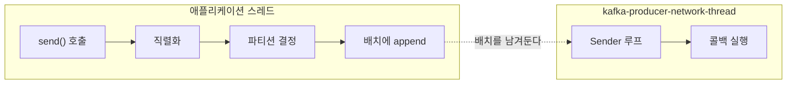

프로듀서가 하는 일은 어느 언어로 쓰든 같다. 파티션을 정하고, 모아서 보내고, 실패하면 다시 시도한다. 그것을 **어떻게** 하는지는 클라이언트마다 다르다. Java 클라이언트는 스레드 하나로 그 일을 하고, 고정 크기 버퍼에서 배치를 떼어 쓴다.

## 스레드는 하나고, 생성자에서 뜬다

프로듀서 하나에 붙는 스레드는 하나다. `KafkaProducer` 생성자가 `Sender`를 만들고 그것을 `KafkaThread`로 감싸 그 자리에서 `start()` 한다. `send()`를 부를 때가 아니라 프로듀서를 만들 때 시작된다. 그 스레드 하나가 모든 브로커와의 통신을 담당한다 — 브로커가 열 대여도 스레드가 열 개로 늘지 않는다.



직렬화와 파티션 결정은 **`send()`를 부른 스레드가 그 자리에서** 한다. 백그라운드로 넘어가는 건 배치에 넣은 다음부터다.

여기서 두 가지가 따라 나온다.

- **`KafkaProducer`를 만드는 것은 스레드를 띄우는 일이다.**
- **`client.id`는 스레드 이름에 들어간다.** `kafka-producer-network-thread`에 `client.id`를 이어 붙인 형태라, 프로듀서를 여러 개 띄운 프로세스에서 스레드 덤프를 볼 때 누가 누구인지 가리는 단서가 이것뿐이다.

## send()가 블로킹하는 두 자리

`send()`는 배치에 넣어 두고 리턴하기 때문에 대체로 빠르지만, 두 자리에서 멈춘다. 메타데이터를 기다릴 때와 버퍼 공간을 기다릴 때다.

파티션을 정하려면 그 토픽에 파티션이 몇 개인지 알아야 한다. 처음 보내는 토픽이면 그 정보가 아직 없으니 브로커에 물어보고 기다린다. 그다음 배치에 넣으려면 메모리가 있어야 한다. 프로듀서는 [고정 크기 버퍼](/posts/kafka-producer-buffer)에서 배치를 떼어 쓰는데, 브로커로 빠져나가는 속도보다 밀어 넣는 속도가 빠르면 이 공간이 고갈된다. 그러면 자리가 나기를 기다린다.

두 대기에 시간이 따로 주어지지는 않는다. `max.block.ms` 하나가 둘을 합쳐서 잰다.

| 설정 | 하는 일 | 기본값 (4.2.1) |
|---|---|---|
| `max.block.ms` | `send()`가 멈춰 있을 수 있는 총 시간 | `60000` (60초) |

메타데이터를 기다리는 데 40초를 썼으면 버퍼 대기에 넘어가는 시간은 20초다. 60초를 다 쓰면 `BufferExhaustedException`으로 실패한다. 이 예외는 콜백으로 오는 것이 아니라 **`send()` 호출 자체가 던진다.**

직렬화와 파티션 결정에 걸리는 시간은 `max.block.ms`가 재는 시간에 포함되지 않는다. 커스텀 Serializer가 느리면 `max.block.ms`가 아무리 짧아도 `send()`는 그만큼 붙잡힌다.

실무에서 아픈 쪽은 두 번째다. 브로커가 느려지거나 한 대가 빠지면 배치가 빠져나가지 못하고 버퍼가 찬다. 그러면 비동기라고 믿고 짠 코드가 애플리케이션 스레드를 최대 60초 붙잡는다. 요청을 처리하는 스레드에서 `send()`를 부르고 있었다면 그 요청들이 같이 멈춘다. Kafka 장애가 애플리케이션 장애로 번지는 경로가 여기다.

## 콜백은 I/O 스레드에서 돈다

`send()`에 콜백을 넘기면 그 콜백은 애플리케이션 스레드가 아니라 Sender 스레드가 실행한다. `Callback` 인터페이스 문서가 이걸 못 박아 두고 있다 — 백그라운드 I/O 스레드에서 실행되므로 빨라야 한다고.

그 스레드는 하나뿐이고 모든 전송을 담당한다. 콜백에서 무거운 일을 하면 그 프로듀서의 전송 전체가 느려진다 — 방금 보낸 메시지뿐 아니라 다른 스레드가 보내고 있던 것까지.

콜백에서 DB에 쓰거나 외부 API를 호출하면 그 시간 동안 Sender는 다음 배치를 못 보낸다. 콜백은 기록만 하고 무거운 일은 큐에 넘겨야 한다.

같은 이유로 함정이 셋 더 있다.

- **콜백 안에서 `close()`를 부르면** Sender 스레드가 자기 자신이 끝나기를 기다리게 된다. Kafka는 이 상황을 알아채고 경고를 남긴 뒤 타임아웃 0으로 강등해서 실행한다. 데드락은 안 나지만 우아한 종료도 안 된다.
- **콜백이 예외를 던지면** Kafka가 잡아서 로그만 남기고 넘어간다. Sender는 죽지 않지만, 콜백 안에서 터진 예외는 애플리케이션 쪽으로 전파되지 않는다.
- **콜백은 `Future.get()`보다 먼저 끝난다.** 배치가 완료될 때 결과를 채우고, 콜백들을 다 실행하고, 그다음에 `get()`을 풀어 준다. 콜백이 느리면 같은 배치를 `get()`으로 기다리던 쪽도 같이 늦어진다.

## 실패한 콜백은 -1을 들고 온다

Kafka 내부는 실패 시 콜백에 null을 넘긴다. 그런데 사용자 콜백에 닿기 전에 래퍼가 끼어서, null이면 그것을 `-1`이 채워진 `RecordMetadata`로 바꿔 넘긴다. 소스에서 그 변수 이름이 `nullMetadata`다.

그래서 `metadata`가 null인지 보는 방식으로는 실패를 걸러낼 수 없다. `metadata.partition()`은 예외를 던지지 않고 `-1`을 돌려주고, 성공했을 때와 형태가 같은 로그가 남는다. `exception`이 성공과 실패를 가르는 유일한 값이다.

```java
kafkaProducer.send(record, (metadata, exception) -> {
    if (exception != null) {
        logger.error("전송 실패 topic={} partition={}", record.topic(), record.partition(), exception);
        return;
    }
    logger.info("partition: {} offset: {}", metadata.partition(), metadata.offset());
});
```

던져진 예외는 재시도해도 소용없는 것과 일시적인 것으로 갈린다. 토픽 이름이 잘못됐거나 레코드가 너무 크거나 권한이 없는 경우는 다시 보내도 같은 결과다. 반면 리더가 바뀌는 중이거나 복제본이 부족한 경우는 재시도로 넘어간다. 후자는 프로듀서가 알아서 다시 시도한 뒤에도 실패했을 때 콜백에 온다. 재시도를 끝내는 것은 횟수가 아니라 [`delivery.timeout.ms`](/posts/kafka-producer-retry-timeout)이고 기본값은 2분이므로, 콜백까지 온 예외는 그 시간을 다 쓴 뒤의 결과다.

## close()가 기다리는 것

프로듀서를 try-with-resources로 닫고, 뒤에 `sleep`을 붙인 코드다.

```java
try (KafkaProducer<String, String> producer = new KafkaProducer<>(properties)) {
    producer.send(record, callback);
}
Thread.sleep(3000);
```

인자 없는 `close()`는 이전에 보낸 요청이 전부 완료될 때까지 블로킹한다. 콜백 실행까지 포함해서. try-with-resources가 닫히는 지점에서 `close()`가 호출되고, 그게 돌아왔을 때는 이미 콜백이 다 끝나 있다. 뒤의 `sleep`은 지워도 결과가 같다.

예외는 앞서 본 한 가지다. 콜백 안에서 부른 `close()`는 기다리지 않는다. Sender 스레드가 자기를 기다리는 꼴이라 타임아웃 0으로 강등된다.

---

스레드가 하나라는 사실에서 콜백을 가볍게 짜야 한다는 결론이 나오고, 버퍼가 고정 크기라는 사실에서 `send()`가 멈출 수 있다는 결론이 나온다.

Kafka가 주는 보장의 상당수는 브로커가 강제할 수 없고 클라이언트의 [선택](/posts/kafka-configuration)에 달려 있다. 그 선택은 설정값에서 끝나지 않는다. `exception`을 검사하는지, 콜백에서 무엇을 하는지, 프로듀서를 언제 닫는지 — 코드가 떠안는 몫이 그만큼 더 있다.
