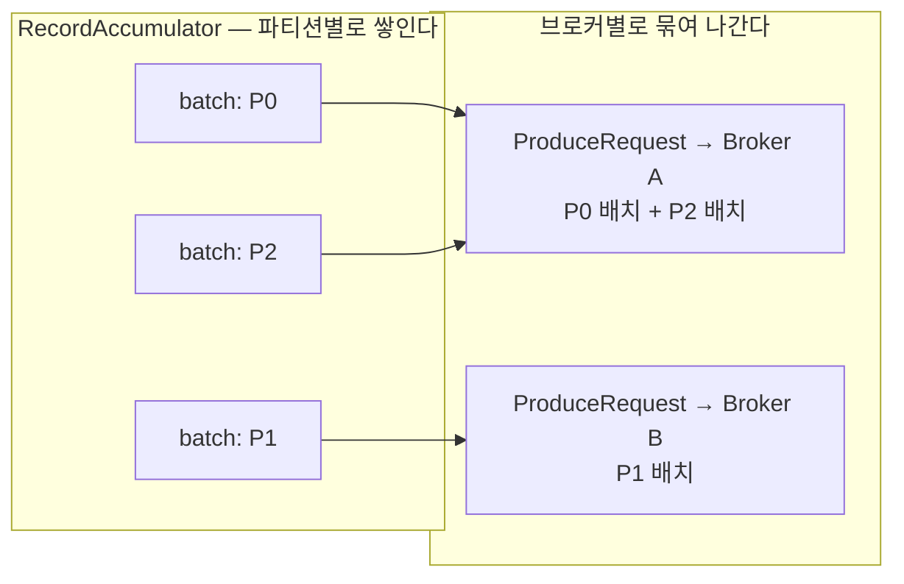

Kafka 프로듀서는 `send()`를 부를 때 레코드를 곧바로 네트워크에 내보내지 않는다. RecordAccumulator라는 메모리 구조에 배치로 넣어 두고, 별도의 Sender 스레드가 그 배치를 꺼내 브로커로 보낸다. `batch.size`·`max.request.size`·`max.in.flight.requests.per.connection`·`buffer.memory`는 전부 이 구조를 가리키고, 네 값이 재는 대상은 서로 다른 층이다.

## 배치는 파티션별인데 요청은 브로커별이다

Sender는 한 사이클마다 보낼 준비가 된 브로커들을 고르고, 그 브로커로 갈 배치들을 **모아서** 요청 하나로 만든다. 배치를 꺼내는 함수가 돌려주는 것이 브로커별로 묶인 배치 목록이다.



P0과 P2의 리더가 같은 브로커라면 두 배치가 한 요청에 실린다.

이 구조가 두 가지를 설명한다.

- **파티션을 늘려도 요청 수는 그만큼 늘지 않는다.** 요청 수는 브로커 수 쪽으로 수렴한다. 파티션 100개를 브로커 3대에 흩어 두면 한 사이클에 나가는 요청은 최대 3개다.
- **`max.request.size`는 레코드 하나의 상한이 아니다.** 이 값은 브로커 하나로 가는 묶음 전체의 상한이다. 배치를 꺼낼 때 이 크기를 넘지 않을 만큼만 가져간다.

| 설정 | 무엇의 상한인가 | 기본값 (4.2.1) |
|---|---|---|
| `batch.size` | 한 파티션 배치 하나 | `16384` (16KB) |
| `max.request.size` | 한 브로커로 가는 요청 하나 | `1048576` (1MB) |

## 파티션마다 배치가 큐로 쌓인다

파티션 하나에 배치 하나가 걸려 있는 것이 아니다. 파티션마다 배치 큐가 있고, 그중 **꼬리에 있는 배치 하나만 열려 있다.** 앞의 것들은 이미 닫혀서 전송을 기다린다.

```
        P0 큐        P1 큐        P2 큐
      ┌────────┐   ┌────────┐   ┌────────┐
      │ 배치3  │   │        │   │ 배치2  │  ← 열린 배치
      │ 배치2  │   │        │   │ 배치1  │
      │ 배치1  │   │ 배치1  │   │        │  ← 큐의 머리
      └────────┘   └────────┘   └────────┘
```

새 배치는 두 경우에 생긴다. 열린 배치의 남은 공간에 레코드가 들어가지 않으면 그 배치를 닫고 새것을 꼬리에 붙이고, 큐가 비어 있으면 첫 배치를 만든다.

쌓이는 이유는 Sender가 아직 꺼내가지 못했기 때문이다. 브로커가 느리거나 그 브로커로 가는 요청이 이미 한도까지 차 있으면 못 꺼내고, 그동안 들어오는 레코드는 계속 새 배치를 만들며 큐를 늘린다.

꺼낼 때는 각 큐의 **머리에서 하나씩만** 가져간다. P0 큐에 배치가 3개 쌓여 있어도 이번 요청에 실리는 것은 1개이고, 나머지는 다음 요청을 기다린다. 오래된 것이 먼저 나가므로 파티션 안의 순서는 유지된다.

| 설정 | 무엇의 개수인가 | 기본값 (4.2.1) |
|---|---|---|
| `max.in.flight.requests.per.connection` | 브로커 하나에 동시에 띄우는 요청 | `5` |

이 값은 파티션당 배치 개수가 아니라 **브로커 커넥션당 요청 개수**다. 5면 응답을 못 받은 요청 5개가 한 브로커를 향해 동시에 날아가 있을 수 있고, 같은 파티션의 배치 1·2·3이 서로 다른 요청에 실릴 수 있다. 그 상태에서 1번이 실패해 재시도되면 2·3이 먼저 기록된다. 파티션 안의 순서가 프로듀서 쪽에서 어긋나는 경로가 이것이고, [`enable.idempotence`](/posts/kafka-producer-idempotence)가 배치에 시퀀스 번호를 붙여 이걸 막는다. Kafka 3.0부터 기본 활성이다.

## buffer.memory는 풀 하나다

배치를 만들 공간은 파티션별로 배정되지 않는다. 프로듀서 인스턴스 하나에 풀이 하나 있고, 모든 토픽·파티션·브로커가 그것을 나눠 쓴다.

| 설정 | 무엇의 크기인가 | 기본값 (4.2.1) |
|---|---|---|
| `buffer.memory` | 프로듀서 하나가 배치에 쓸 수 있는 메모리 총량 | `33554432` (32MB) |

반납 시점은 전송 시점이 아니라 **완료 시점**이다.

| 배치 상태 | 풀 점유 |
|---|---|
| 큐에서 채워지는 중 | 점유 |
| 큐에서 전송 대기 | 점유 |
| 전송됨, 응답 대기 중 | 점유 |
| 응답 도착 또는 최종 실패 | 반납 |

이미 브로커로 날아간 배치도 응답이 올 때까지 자리를 붙잡고 있다. 그래서 버퍼가 고갈되는 원인은 전송이 안 되는 것만이 아니다 — 보낸 것을 정산하지 못해도 새 배치를 만들 공간이 안 생긴다.

몫이 나뉘어 있지 않다는 데서 하나가 더 따라 나온다. 파티션 하나가 느린 브로커에 있어서 그 큐만 길어지면 **그 큐가 풀을 다 먹고, 멀쩡한 파티션으로 보내는 `send()`까지 [같이 멈춘다](/posts/kafka-java-producer-internals).** 파티션별 한도가 없으니 격리도 없다.

풀은 프로듀서 **인스턴스** 단위다. 한 JVM에서 프로듀서를 3개 띄우면 32MB × 3이 잡힌다. 프로듀서를 재사용해야 하는 이유가 스레드 하나 때문만은 아니다.

이 값이 프로듀서 전체 메모리의 상한은 아니다. 압축 버퍼와 요청을 직렬화하는 메모리는 이 풀 밖에서 따로 잡히므로 실제 사용량은 더 크다. Kafka 문서도 이 값을 hard bound가 아니라고 적어 두고 있다.

---

네 설정이 재는 층이 전부 다르다. `batch.size`는 배치 하나, `max.request.size`는 요청 하나, `max.in.flight`는 브로커 하나에 띄운 요청 수, `buffer.memory`는 프로듀서 하나가 쓰는 메모리 총량이다. 어느 값을 올렸을 때 무엇이 늘어나는지가 여기서 갈린다.

그리고 층이 다르다는 것은 격리도 층마다 다르다는 뜻이다. 파티션 안의 순서는 큐가 지켜 주지만, 파티션 사이의 메모리는 아무도 지켜 주지 않는다.

