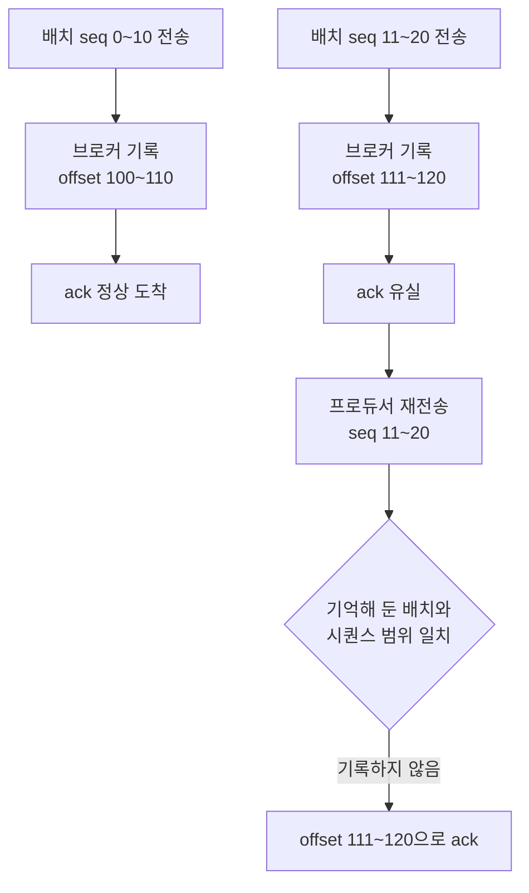

프로듀서는 전송이 실패하면 다시 보낸다. 그런데 실패한 것처럼 보이는 경우 중에는 브로커가 기록까지 마쳤는데 ack만 유실된 경우가 섞여 있다. 프로듀서는 둘을 구분할 수 없어 다시 보내고, 같은 레코드가 로그에 두 번 쌓인다. 멱등 프로듀서는 이 재전송을 막지 않는다. 재전송은 그대로 두고, 브로커가 이미 받은 것을 알아보고 두 번 쓰지 않게 한다.

## 배치가 신분증을 들고 간다

멱등성이 켜지면 프로듀서는 배치 헤더에 값을 세 개 실어 보낸다.

| 필드 | 값 | 정하는 주체 |
|---|---|---|
| producer ID | 프로듀서를 식별하는 번호 | 브로커가 발급 |
| producer epoch | 같은 ID의 세대 번호 | 브로커가 발급 |
| base·last sequence | 배치에 담긴 첫 레코드와 마지막 레코드의 순번 | 프로듀서 |

시퀀스는 0부터 순차로 증가하고, **파티션마다 따로 센다.** 배치 하나가 레코드 11건을 담았다면 base가 0, last가 10이고, 같은 파티션으로 가는 다음 배치는 11부터 시작한다.

producer ID는 프로듀서가 기동할 때 브로커에서 받아 온다. 개발자가 지정할 수 없고, 재기동하면 새 번호가 발급된다.

## 브로커는 파티션마다 배치 5개를 기억한다

브로커는 최근에 받은 배치의 메타데이터를 들고 있는다. 배치 본문이 아니라 그 배치가 무엇이었는지를 가리키는 정보다.

이 기억은 **파티션마다, 그 안에서 다시 producer ID마다** 따로 쌓인다. 상태를 관리하는 `ProducerStateManager`가 파티션 하나에 하나씩 붙어 있고, 그 안에서 producer ID를 키로 엔트리를 나눠 갖는다.

| 기억하는 것 | 쓰이는 곳 |
|---|---|
| producer epoch | 세대가 맞는지 확인 |
| first·last sequence | 이미 받은 배치인지 판정 |
| first·last offset | 중복일 때 돌려줄 응답 |
| timestamp | 응답에 함께 실린다 |

들고 있는 개수는 5개다. 소스에서 그 상수 이름이 `NUM_BATCHES_TO_RETAIN`이고, 큐가 차면 가장 오래된 것을 밀어내고 새 배치를 넣는다.

중복 판정은 두 조건이 함께 맞을 때 성립한다. epoch가 같고, base와 last 시퀀스가 기억해 둔 어느 배치와 **정확히 일치**할 때다. 그러면 브로커는 로그에 붙이지 않고, 그 배치가 처음 기록됐을 때의 offset을 응답으로 돌려준다.

프로듀서가 재전송에 대해 받는 응답은 최초 기록의 offset이다. 성공한 전송의 응답과 형태가 같고, 콜백에 실려 오는 `RecordMetadata`도 같다. 중복이 걸러졌다는 사실은 프로듀서 쪽에 드러나지 않는다.

기억하는 개수가 5라는 것이 `max.in.flight.requests.per.connection`의 상한과 같은 값인 것은 우연이 아니다. 두 값이 같은 것을 센다.

`max.in.flight`가 세는 것은 브로커 하나에 띄우는 **요청** 수이고, 요청 하나에는 배치가 여러 개 실린다. 다만 한 파티션에서는 큐의 머리 하나만 꺼내 싣는다.

| 세는 단위 | 개수 |
|---|---|
| 브로커 하나에 띄운 요청 | 최대 5 |
| 요청 하나에 실린 배치 | 그 브로커가 가진 파티션 수만큼 |
| 한 파티션에 대해 답을 못 받은 배치 | 최대 5 |

브로커 A가 파티션 3개를 갖고 있으면 배치 15개가 동시에 떠 있을 수 있지만, 파티션 하나만 놓고 세면 5개다. 브로커도 파티션마다 5칸을 따로 두므로 마찬가지로 15칸을 갖는다.

재전송될 수 있는 배치는 아직 답을 못 받은 것들뿐이고 그게 파티션당 5개이므로, 5칸만 있어도 후보를 놓치지 않는다. `max.in.flight`를 6으로 올리면 이 대응이 깨진다 — 답을 못 받은 배치가 6개인데 브로커는 5개만 기억하므로, 가장 오래된 하나가 재전송돼 오면 중복인지 판정할 근거가 없다.

## 순서는 중복 제거의 부산물이다

브로커는 받은 배치의 base 시퀀스가 마지막으로 기록한 시퀀스 바로 다음인지도 함께 본다. 빈틈이 있으면 `OutOfOrderSequenceException`으로 거절한다.

배치 세 개가 한꺼번에 날아간 상황을 놓고 보면 이렇게 걸린다.

| 배치 | 시퀀스 | 결과 |
|---|---|---|
| B0 | 0~10 | 기록 성공 |
| B1 | 11~20 | 전송 실패 |
| B2 | 21~30 | 브로커 도착 |

브로커가 마지막으로 기록한 시퀀스는 10이라 다음에 올 것은 11인데 21이 왔다. B2는 거절되고, 프로듀서는 B1과 B2를 다시 보낸다. 재전송된 B1이 먼저 기록되고 그다음 B2가 기록되므로 파티션 안의 순서가 원래대로 유지된다.

순서를 지키는 방식이 뒤 배치를 붙잡아 두는 것이 아니라 **먼저 도착한 뒤 배치를 거절하는 것**이다.

앞 배치가 재시도를 소진해 최종 실패한 경우에는 시퀀스에 메울 수 없는 빈틈이 생긴다. 이때 프로듀서는 그 파티션의 epoch를 올리고 남아 있는 배치들의 시퀀스를 0부터 다시 매긴다. 뒤 배치들은 함께 실패하지 않고 새 세대의 번호를 달고 계속 나간다. 순서는 유지되지만 최종 실패한 배치의 레코드는 그대로 빠지므로, 로그에는 그만큼 빈자리가 남는다.

이 검사에는 배치 5개 큐가 쓰이지 않는다. 마지막으로 기록한 시퀀스 하나만 있으면 빈틈이 있는지 알 수 있다. 같은 엔트리에 담긴 두 값이 각각 다른 일을 한다 — 5개 큐는 중복 판정에, 마지막 시퀀스는 연속성 검사에 쓰인다.

## 보장의 범위는 프로듀서 인스턴스 하나다

producer ID가 기동할 때마다 새로 발급된다는 사실이 경계를 정한다. 애플리케이션이 재시작하면 브로커 입장에서는 처음 보는 프로듀서이고, 시퀀스도 0부터 다시 시작한다.

그래서 재시작 전에 보냈던 레코드를 재시작 뒤에 다시 보내면 걸러지지 않는다. 멱등성이 없애 주는 중복은 **한 프로듀서가 살아 있는 동안 자기가 한 재전송**으로 생긴 것뿐이다. 애플리케이션이 죽었다 살아나며 같은 작업을 반복해 생기는 중복은 다른 층의 문제이고, 트랜잭션이나 컨슈머 쪽 처리가 맡는다.

## 기본 활성에는 조건이 붙어 있다

Kafka 3.0부터 `enable.idempotence`의 기본값이 `true`다. 기본값만 놓고 보면 네 값이 조건을 맞춘 조합으로 함께 맞춰져 있다.

| 설정 | 멱등성이 요구하는 값 | 기본값 (4.2.1) |
|---|---|---|
| `enable.idempotence` | `true` | `true` |
| `acks` | `all` | `all` |
| `retries` | 0보다 큼 | `2147483647` |
| `max.in.flight.requests.per.connection` | 5 이하 | `5` |

네 값이 서로 맞물려 있어서 하나를 건드리면 조건이 깨진다. 깨졌을 때 무슨 일이 벌어지는지는 **`enable.idempotence`를 직접 적었는지**에 따라 갈린다.

| 어긋난 설정 | `enable.idempotence`를 적지 않았을 때 | `true`로 적었을 때 |
|---|---|---|
| `retries=0` | INFO 로그를 남기고 멱등성만 끈다 | `ConfigException` |
| `acks`가 `all`이 아님 | INFO 로그를 남기고 멱등성만 끈다 | `ConfigException` |
| `max.in.flight`가 5 초과 | `ConfigException` | `ConfigException` |

왼쪽 칸의 앞 두 줄이 걸리는 자리다. 프로듀서는 정상적으로 만들어지고 메시지도 정상적으로 전송된다. 달라지는 것은 중복이 걸러지지 않는다는 것뿐인데, 이건 장애가 나기 전까지 드러나지 않는다.

흔적이 아예 없지는 않다. `Idempotence will be disabled because acks is set to 1, not set to 'all'.` 같은 줄이 남는다. 다만 INFO 레벨이라 기동 로그에 묻히기 쉽고, 기동이 실패하지 않으니 찾아볼 계기도 없다.

`max.in.flight`는 셋 중 유일하게 명시 여부와 무관하게 예외를 던진다. Kafka 4.0에서 바뀐 동작이고, 3.x에서는 이것도 다른 둘과 같이 경고만 남기고 멱등성을 껐다. 그때의 경고 문구에 `Please note that in v4.0.0 and onward, this will become an error.`라고 예고가 적혀 있었다. 오래된 자료가 "6으로 두면 조용히 꺼진다"고 적고 있으면 3.x 기준이다.

여기서 따라 나오는 것이 하나 있다. 멱등성에 기대는 코드라면 `enable.idempotence=true`를 **기본값과 같더라도 명시하는 편**이 낫다. 값이 달라지지 않고 바뀌는 것은 조건이 어긋났을 때의 반응뿐이다. 적어 두면 프로듀서 생성이 실패해서 배포 시점에 걸리고, 적지 않으면 로그 한 줄만 남기고 그대로 뜬다.

---

멱등성은 두 층에 걸쳐 있다. 브로커는 시퀀스로 중복을 걸러내고 순서를 되돌리지만, 그 검사가 돌게 만드는 것은 프로듀서가 [고른 설정](/posts/kafka-configuration)이다. 브로커에는 "이 토픽은 멱등 프로듀서만 받는다"고 걸어 둘 자리가 없다.

그리고 그 설정은 조건이 어긋나도 값 자체는 남는다. `enable.idempotence`를 조회하면 `true`가 나오는데 실제로는 꺼져 있는 상태가 만들어질 수 있다. 켜졌는지를 확인하는 자리는 설정값이 아니라 기동 로그다.
