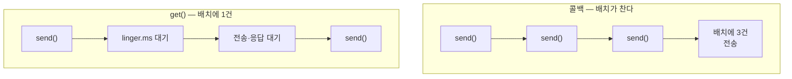
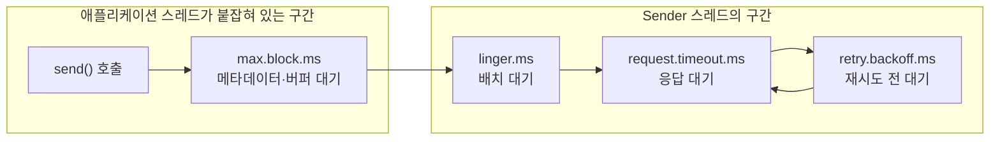

프로듀서 설정 중 시간을 재는 값이 다섯 개다. 이름이 서로 비슷해서 어느 값이 어디에 걸리는지 흐려지는데, 실제로 갈리는 기준은 그 시간을 **누가 기다리고 있는지**다 — `send()`를 부른 애플리케이션 스레드인지, 백그라운드 Sender 스레드인지.

## send()는 콜백이 없어도 비동기다

`send()`는 레코드를 직렬화하고 파티션을 정한 뒤 배치에 넣고 리턴한다. 브로커로 보내는 일은 별도의 Sender 스레드가 한다. 콜백을 넘기든 넘기지 않든 이 동작은 같다.

콜백이 정하는 것은 결과를 받는 방법이다. 프로듀서가 돌려주는 결과는 `RecordMetadata`와 예외 둘이고, 이것을 언제 어느 스레드에서 받을지가 세 갈래로 갈린다.

| 결과를 받는 방법 | 애플리케이션 스레드 | 한 배치에 실리는 레코드 |
|---|---|---|
| 받지 않는다 | 멈추지 않는다 | 여러 개 |
| 콜백을 넘긴다 | 멈추지 않는다 | 여러 개 |
| `Future.get()`을 부른다 | 응답이 올 때까지 멈춘다 | 한 개 |

`get()`이 붙잡는 것은 `send()`가 돌려준 `Future`이므로, 멈추는 쪽은 Sender 스레드가 아니라 `send()`를 부른 스레드다.

## get()을 부르면 배치에 레코드가 하나만 든다

배치가 차는 것은 애플리케이션 스레드가 `send()`를 연달아 부르기 때문이다. 한 번 부르고 결과를 기다리면 그 사이에 다음 레코드가 들어오지 않는다.

```java
for (int i = 0; i < 20; i++) {
    producer.send(record(i)).get();
}
```

루프 한 바퀴가 도는 동안 배치에 레코드 하나가 들어가고, 그 상태로 전송돼 응답이 오고, 그다음에 두 번째 레코드가 들어간다. 두 개가 한 배치에 실릴 자리가 없다.



레코드 하나만 든 배치가 언제 나가는지는 [`linger.ms`](/posts/kafka-producer-send)가 정한다. 큐에 배치가 하나뿐이고 그 배치가 아직 차지 않았으면, 전송 조건은 `linger.ms`가 지났는지 하나뿐이다.

이 값의 기본값은 Kafka 4.0에서 `0`에서 `5`로 올라갔다. 그래서 동기로 보내면 레코드마다 5밀리초를 먼저 기다리고, 그다음에 브로커 왕복을 기다린다. 한 스레드가 낼 수 있는 처리량 상한이 초당 200건이 되고, 왕복이 5밀리초 붙으면 100건으로 내려간다.

전송 자체는 여전히 배치 단위다. 레코드가 한 개 든 배치일 뿐이다.

## 시간은 두 스레드로 갈린다

`send()`가 리턴하기 전까지의 시간과 그 뒤의 시간은 주인이 다르다. 앞은 `send()`를 부른 스레드가 붙잡혀 있는 시간이고, 뒤는 Sender 스레드가 혼자 쓰는 시간이다.



`delivery.timeout.ms`는 이 구간들 중 하나가 아니라, `send()`가 리턴한 뒤부터 성공·실패가 확정될 때까지 전체를 감싼다.

경계가 어디인지가 장애의 번짐 범위를 정한다.

- **콜백으로 받으면** 뒤쪽 구간이 길어져도 애플리케이션 스레드는 다음 레코드를 넣고 있다. 브로커가 느려져도 요청을 처리하는 스레드는 계속 돈다. 다만 배치가 빠져나가지 못해 버퍼가 고갈되면 `send()` 자체가 [최대 `max.block.ms`만큼 멈춘다](/posts/kafka-java-producer-internals).
- **`get()`으로 받으면** 뒤쪽 구간 전체를 애플리케이션 스레드가 물고 있는다. 재시도가 붙으면 그 시간까지 같이 기다린다.

## 한 번의 시도와 전체 상한

배치를 보낸 뒤 브로커가 응답하지 않으면 Sender는 `request.timeout.ms`까지 기다리고 끊는다. 에러 응답이 온 경우는 기다릴 것이 없으니 곧바로 다음 단계로 간다. 어느 쪽이든 다시 보내기 전에 대기를 둔다.

이 대기는 시도할수록 늘어난다. `retry.backoff.ms`에서 시작해 시도마다 2배가 되고 `retry.backoff.max.ms`에서 멈추며, 매번 ±20% 흔들린다. 기본값으로는 100 → 200 → 400 → 800 → 1000밀리초로 늘고 그 뒤로는 1000에 머문다. 흔들림을 주는 것은 여러 프로듀서가 같은 순간에 몰려 재시도하는 것을 막기 위해서다.

| 설정 | 재는 것 | 기본값 (4.2.1) |
|---|---|---|
| `request.timeout.ms` | 한 번의 전송이 응답을 기다리는 시간 | `30000` (30초) |
| `retry.backoff.ms` | 재시도 전 대기의 시작값 | `100` |
| `retry.backoff.max.ms` | 그 대기가 늘어날 수 있는 상한 | `1000` |
| `retries` | 재시도 횟수 | `2147483647` |
| `delivery.timeout.ms` | `send()` 이후 성공·실패 판정까지의 총 시간 | `120000` (2분) |

`retries` 기본값은 `int`의 최대값이다. 횟수로는 사실상 끝나지 않으므로, 재시도를 끝내는 것은 `delivery.timeout.ms`다. 2분이 지나면 몇 번을 시도했든 그 배치는 실패로 확정된다. Kafka 문서도 `retries`를 그대로 두고 `delivery.timeout.ms`로 조절하라고 권한다.

두 값 사이에는 제약이 걸려 있다.

> `delivery.timeout.ms` ≥ `linger.ms` + `request.timeout.ms`

전송을 한 번 시도하는 데 필요한 최소 시간보다 총 상한이 작으면 아무것도 성립하지 않기 때문이다. 이 제약을 어겼을 때의 동작은 값을 명시했는지에 따라 갈린다.

| 상황 | 결과 |
|---|---|
| `delivery.timeout.ms`를 명시하고 제약을 어김 | `ConfigException` — 프로듀서 생성 자체가 실패한다 |
| 명시하지 않았는데 `linger.ms` + `request.timeout.ms`가 2분을 넘김 | 예외 없이 `delivery.timeout.ms`를 그 합으로 올리고 경고 로그만 남긴다 |

아래 칸은 `request.timeout.ms`만 크게 올렸을 때 걸린다. 기동이 실패하지 않으므로 설정 파일에 적은 값과 실제로 적용된 값이 조용히 달라진다.

## 만료는 배치 단위다

`delivery.timeout.ms`가 만료되면 프로듀서는 그 배치를 포기하고 콜백에 예외를 넘긴다. 예외 메시지가 배치에 몇 건이 실려 있었는지를 그대로 말해 준다.

```
org.apache.kafka.common.errors.TimeoutException:
Expiring 18 record(s) for orders-0:120000 ms has passed since batch creation
```

시간을 넘긴 것은 배치이고, 그 안의 레코드 18건이 전부 같은 예외를 받는다. 콜백은 18번 불린다.

그래서 이 숫자는 결과를 어떻게 받기로 했는지에 따라 달라진다. 콜백으로 보내고 있었으면 한 번의 만료로 수십 건이 함께 실패하고, `get()`으로 보내고 있었으면 `Expiring 1 record(s)`가 된다. 한 번에 처리하는 양과 한 번에 잃는 양이 같은 값이다.

---

시간 값들이 걸리는 대상은 레코드가 아니라 배치다. `request.timeout.ms`는 배치 하나의 응답을 기다리고, `delivery.timeout.ms`는 배치 하나의 수명을 잰다.

그 배치에 레코드가 몇 개 실리는지를 정하는 것은 설정이 아니라 코드다. 결과를 콜백으로 받으면 애플리케이션 스레드가 계속 레코드를 밀어 넣어 배치가 차고, `get()`으로 받으면 배치마다 한 건이 된다. `send()` 뒤에 `.get()`을 붙이느냐가 처리량과 실패 단위를 함께 바꾼다.
