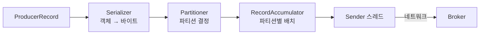
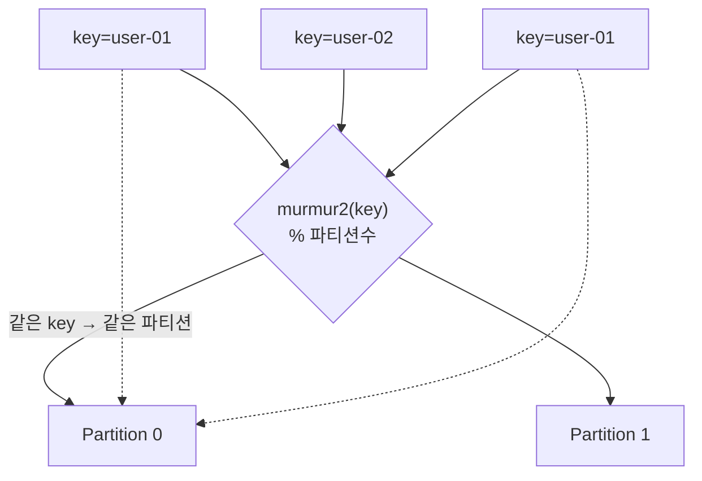
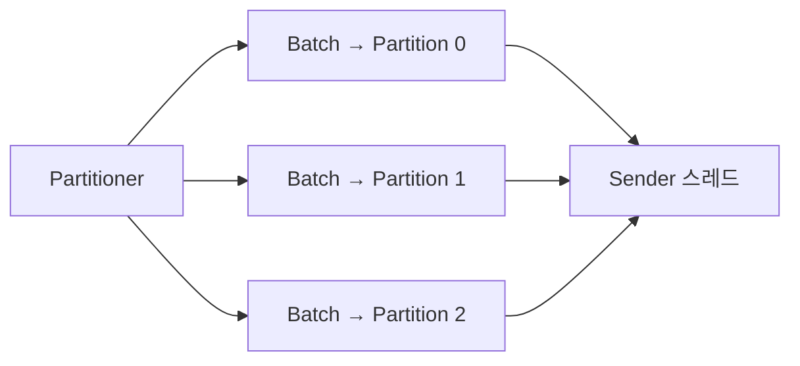
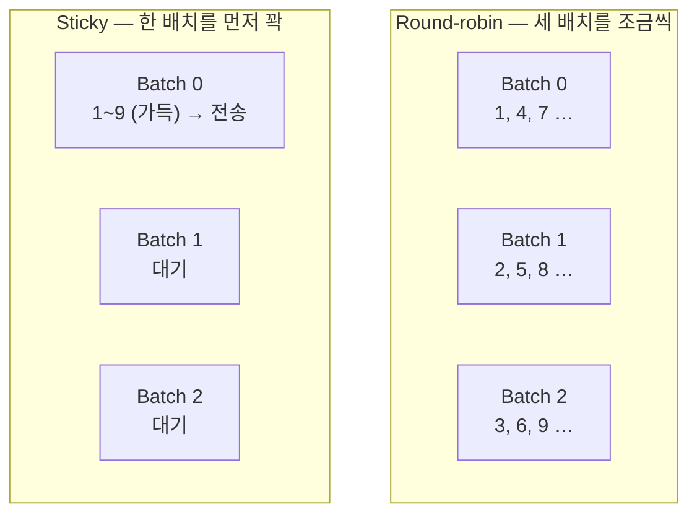

프로듀서 코드는 짧다. 레코드를 만들고 `send()`를 부르면 끝이다. 그 한 줄 안에서 메시지는 바이트로 바뀌고, 어느 파티션으로 갈지 정해지고, 다른 메시지들과 한 덩어리로 모인 뒤에 전송된다.

## send()가 지나가는 길

세 가지 일이 일어난다. Serializer가 **값을 바이트로 바꾸고**, Partitioner가 **어디로 갈지 정하고**, 배치와 Sender가 **모아서 보낸다**. 앞의 둘은 `send()`를 호출한 스레드가 그 자리에서 처리하고, 마지막 전송만 별도의 백그라운드 스레드가 맡는다.

> `send()`는 "보낸다"보다 "보낼 것을 배치에 넣어 둔다"에 가깝다. 그래서 리턴이 빨라도 아직 브로커에 도착한 게 아니다.

Partitioner가 Serializer 뒤에 오는 건, 파티션을 정할 때 쓰는 key가 **이미 직렬화된 바이트**여야 하기 때문이다. 해싱은 객체가 아니라 바이트에 대해 이루어진다.

## 브로커는 바이트만 받는다 — Serializer

브로커가 취급하는 것은 byte array 하나뿐이다. `Integer` key와 `String` value를 담아 보내도, 파티션의 로그 파일에 앉는 것은 그 객체가 아니라 바이트다. 객체를 바이트로 바꾸는 것이 **직렬화**, 컨슈머가 그 바이트를 다시 객체로 되돌리는 것이 **역직렬화**다.

어떤 Serializer를 쓸지는 프로듀서 설정에 **명시해야** 한다.

| 설정 | 하는 일 |
|---|---|
| `key.serializer` | key 객체를 바이트로 변환할 클래스 |
| `value.serializer` | value 객체를 바이트로 변환할 클래스 |

기본 타입은 Kafka 클라이언트에 내장된 것을 그대로 쓴다 — `StringSerializer`, `IntegerSerializer`, `LongSerializer`, `ByteArraySerializer` 등. key 타입이 `String`에서 `Integer`로 바뀌면 `key.serializer`만 `IntegerSerializer`로 갈아 끼우면 된다.

내장 Serializer로 안 되는 경우가 실무에서는 오히려 흔하다. `Order`나 `Customer` 같은 도메인 객체를 그대로 보내려면 **커스텀 Serializer를 직접 구현**해야 한다. 이걸 피하려고 객체를 JSON 문자열로 만들어 `StringSerializer`에 태우는 방식도 자주 쓴다.

여기서 한 가지가 따라 나온다. 직렬화와 역직렬화는 **프로듀서와 컨슈머가 각자 설정하는 별개의 값**이다.

> Kafka는 둘이 맞는지 검사해 주지 않는다. 프로듀서가 `IntegerSerializer`로 쓴 것을 컨슈머가 `StringDeserializer`로 읽으면, 브로커는 아무 불만 없이 바이트를 넘기고 컨슈머에서 깨진다.

브로커는 내용에 무관심하다. 스키마를 모르니 타입이 맞는지도 모른다. 이 빈틈을 메우려고 쓰는 것이 Schema Registry 같은 별도 장치다.

## 어느 파티션으로 갈까 — Partitioner

토픽은 파티션 여러 개로 되어 있으니, 레코드 하나가 그중 어디로 갈지 정해야 한다. 이걸 정하는 게 **Partitioner**다.

> 파티션을 결정하는 것은 브로커가 아니라 **프로듀서**다. 메시지는 목적지가 이미 정해진 채로 떠난다.

프로듀서가 이걸 계산할 수 있는 이유는, 브로커에 처음 접속할 때 **메타데이터**를 받아 오기 때문이다. "토픽 `orders`의 파티션은 3개이고, 각 파티션의 리더는 어느 브로커다" 같은 정보다. 파티션 수를 알아야 나눗셈이 성립하고, 리더가 어디인지 알아야 그 브로커로 직접 보낼 수 있다. 이 메타데이터는 주기적으로 갱신되어, 파티션이 늘거나 리더가 바뀌어도 따라간다.

key가 있는 경우의 규칙은 단순하다. key의 바이트를 해싱해 파티션 수로 나눈 나머지를 쓴다 — Kafka는 murmur2 해시를 쓴다.

결정적이고 상태가 없다. 같은 key는 파티션 수가 그대로인 한 항상 같은 파티션으로 간다. 그래서 "순서를 지켜야 하는 단위"를 key로 잡으면 그 단위의 순서가 보장된다.

## 하나씩 보내지 않는다 — 배치

파티션이 정해진 레코드는 곧바로 네트워크로 가지 않고 **배치**에 쌓인다. 레코드 하나마다 네트워크 요청을 한 번씩 보내면 요청 오버헤드가 본문보다 커지기 때문이다. 모아 보내면 요청 수가 줄고 압축 효율도 좋아진다.

배치는 **파티션마다 따로** 존재한다.

한 배치에 담긴 레코드는 전부 같은 파티션으로 간다. 파티션이 서로 다른 브로커에 있으니 섞을 수가 없다.

배치가 출발하는 조건은 둘이고, 둘 중 하나만 충족되면 나간다.

| 설정 | 조건 | 기본값 |
|---|---|---|
| `batch.size` | 배치가 이 크기만큼 차면 즉시 전송 | `16384` (16KB) |
| `linger.ms` | 덜 찼어도 이 시간이 지나면 전송 | `5` |

고속버스와 같다. 승객이 다 차면 바로 출발하고, 다 안 찼어도 정시가 되면 출발한다. 값을 올리면 배치가 커져 처리량이 오르고, 그만큼 레코드마다 지연이 붙는다.

이 기본값은 한때 `0`이었고 Kafka 4.0에서 `5`로 올라갔다. 배치를 키워 얻는 효율이 5밀리초 지연보다 대체로 이득이라는 판단이다. 오래된 자료가 `0`이라고 적고 있으면 그 시절 기준이다.

그리고 `0`으로 되돌려도 배치가 사라지지는 않는다. 프로듀서는 요청과 요청 사이에 도착한 레코드를 자연히 한 배치로 묶기 때문에, 보내는 속도가 도착 속도를 못 따라가는 상황이면 이 값과 무관하게 배치가 찬다. `linger.ms`는 **부하가 낮을 때** 인위적으로 모아 주는 장치다.

## key가 없으면 — Round-robin과 Sticky

key가 `null`이면 해싱할 것이 없으니 다른 기준이 필요하다. 목표는 두 가지인데, 서로 당긴다 — 파티션에 **고르게** 분배하는 것과, 배치를 **잘 채워** 보내는 것.

**Round-robin**은 앞쪽을 택한다. 파티션을 순서대로 돌면서 레코드를 하나씩 나눠 넣는다. 이름 그대로고, 분배는 완벽하게 균일하다. Kafka 2.4 이전의 기본 방식이었다.

문제는 배치와 만났을 때 드러난다. 파티션이 3개라면 Round-robin은 세 배치를 **동시에 조금씩** 채운다. 그래서 어느 배치도 빨리 차지 못한다.

배치가 `batch.size`에 도달하지 못하면 `linger.ms` 만료로 나간다. Round-robin에서는 **덜 찬 배치가 시간에 밀려 나가는 일이 상시로** 벌어진다.

**Sticky Partitioning**은 순서를 뒤집는다. 한 파티션에 "달라붙어" 그 배치를 꽉 채운 뒤 전송하고, 그다음 파티션으로 옮겨 간다. 배치가 제 크기로 나가니 요청 수가 줄고 지연도 준다. Kafka 2.4부터 key 없는 메시지의 기본 방식이 되었다.

짧게 끊어 보면 특정 파티션에 몰린 것처럼 보이지만, 전송이 계속되면 파티션들을 차례로 돌기 때문에 **길게 보면 고르게 수렴한다.**

| | Round-robin | Sticky |
|---|---|---|
| 기준 | 레코드 단위로 파티션 순회 | 배치 단위로 파티션 순회 |
| 배치 충전율 | 낮다 (덜 찬 채 전송) | 높다 (채워서 전송) |
| 균일도 | 항상 균일 | 짧게 보면 편중, 길게 보면 균일 |
| 기본값 시기 | Kafka 2.4 이전 | Kafka 2.4 이후 |

이후 버전에서 한 걸음 더 갔다. Kafka 3.3에서 `DefaultPartitioner`는 deprecated되고 4.0에서 삭제됐다. 지금은 `partitioner.class`를 비워 두면 파티션에 쌓인 바이트를 세어 옮겨 갈 시점을 정하고 느린 브로커의 파티션에는 덜 보내는 [내장 계층](/posts/kafka-custom-partitioner)이 그 일을 맡는다.

컨슈머에도 `RoundRobin`과 `Sticky`라는 이름의 전략이 있는데, 그것은 **컨슈머 그룹에 파티션을 배정하는** 할당 전략이라 `partition.assignment.strategy`로 고르고, 여기서 말한 것은 **프로듀서가 레코드를 파티션에 넣는** 분배 전략이라 `partitioner.class`로 고른다. 이름만 같고 계층이 다르다.

## 보내고 나서 — 재시도와 순서

배치를 실제로 보내는 건 `send()`를 호출한 스레드가 아니라 **Sender 스레드**다. 애플리케이션 스레드는 배치에 넣고 바로 돌아가고, Sender가 준비된 배치를 골라 브로커로 보낸 뒤 응답을 받아 콜백을 실행한다. 그래서 `send()`는 `Future`를 돌려준다 — 결과는 나중에 다른 스레드에서 온다.

전송이 실패하면 프로듀서가 다시 시도한다. 실패는 대체로 일시적이다. 리더가 바뀌는 중이거나, 네트워크가 흔들리거나, 브로커가 잠시 바쁜 경우다. 언제까지 다시 시도할지는 횟수가 아니라 [`delivery.timeout.ms`](/posts/kafka-producer-retry-timeout)가 정하고, 기본값은 2분이다. 재시도 자체는 좋은 기본값인데, 재시도가 **순서를 깨뜨릴 수 있다**는 부작용이 있다.

한 커넥션에 응답을 기다리는 요청을 여러 개 띄울 수 있다. 이 개수를 정하는 것이 `max.in.flight.requests.per.connection`이고 기본값은 5다. 그 상태에서 앞선 요청이 실패해 재시도되면 뒤 요청이 먼저 기록될 수 있다. 파티션 안에서 순서가 보장된다고 했는데 프로듀서 쪽에서 어긋나는 경우다.

이 문제는 [멱등 프로듀서](/posts/kafka-producer-idempotence)가 해결한다. 각 배치에 시퀀스 번호를 붙여 브로커가 순서와 중복을 검사하게 만드는 방식이고, Kafka 3.0부터 `enable.idempotence`가 기본 활성이다. 켜져 있으면 in-flight 요청이 여러 개여도 순서가 유지되고, 재시도로 인한 중복 기록도 걸러진다.

---

프로듀서 설정은 같은 축 위에서 조율된다. `linger.ms`를 늘리면 처리량이 오르고 지연이 붙는다. `acks`를 올리면 안전해지고 느려진다. 재시도를 켜면 유실이 줄고 순서가 흔들리므로 멱등을 함께 켠다. `send()`가 한 줄인 것과 달리, 그 한 줄이 어떤 성격의 전송이 될지는 이 값들이 정한다.
