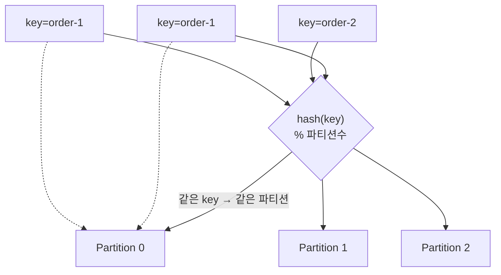
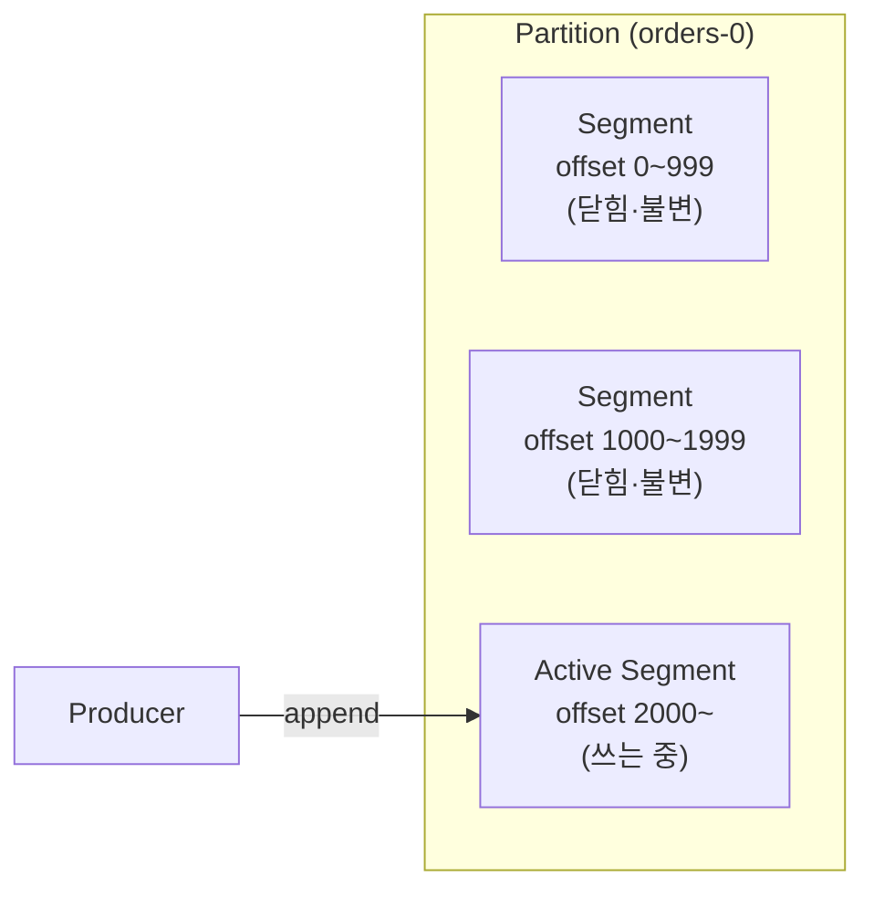
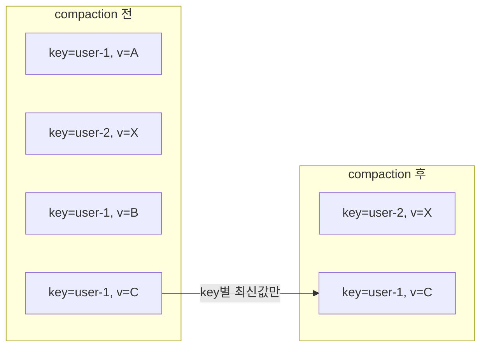

Kafka에 메시지를 보낸다고 하면 흔히 문자열 한 줄을 떠올린다. 하지만 Kafka가 실제로 다루는 단위는 문자열이 아니라 **레코드(record)**라는 구조체다. 그리고 그 레코드들은 파티션이라는 append-only 로그에 쌓이는데, 이 로그도 하나의 거대한 파일이 아니라 **여러 조각으로 나뉘어 디스크에 저장**된다. 이 글은 두 계층을 잇는다 — 레코드 하나가 무엇으로 이루어져 있고(논리), 그것들이 디스크에 어떻게 쌓이는가(물리).

## 레코드는 문자열이 아니다

프로듀서가 보내는 메시지 하나는 여러 필드를 가진 레코드다.

| 필드 | 역할 | 필수 |
|---|---|---|
| **key** | 파티션 배정·compaction의 기준 | 선택 (null 가능) |
| **value** | 실제 본문(payload) | 사실상 필수 |
| **timestamp** | 생성·기록 시각 | 자동 |
| **headers** | 부가 메타데이터 (그 자체가 key-value 목록) | 선택 |
| **offset** | 파티션 안에서의 순번 | 브로커가 부여 |

key와 value는 Kafka 입장에선 그냥 **바이트 배열**이다. JSON이든 문자열이든 Avro든, 직렬화·역직렬화는 프로듀서와 컨슈머가 알아서 하고 Kafka는 그 안을 들여다보지 않는다.

> Kafka는 내용에 무관심하다. key·value를 바이트로 받아 바이트로 돌려줄 뿐, 스키마도 타입도 모른다.

offset은 프로듀서가 넣는 게 아니라 **브로커가 파티션에 기록하는 순간 매기는 순번**이다. 파티션마다 0부터 1씩 증가하고, 한 번 정해지면 바뀌지 않는다.

## key가 하는 일

key는 있어도 그만인 부가 정보가 아니라 **동작을 바꾸는 열쇠**다. 프로듀서가 레코드를 어느 파티션에 넣을지는 이 key로 정해진다.

- **key가 있으면** — `hash(key) % 파티션수`로 파티션이 정해진다. 그래서 **같은 key는 언제나 같은 파티션**으로 간다.
- **key가 null이면** — 특정 파티션에 매이지 않고 여러 파티션에 고르게 분산된다.

이게 왜 중요하냐면, Kafka에서 **순서는 파티션 안에서만 보장**되기 때문이다. 파티션이 여러 개면 그들 사이의 전역 순서는 없다.

> `주문ID`를 key로 쓰면 한 주문의 이벤트들이 전부 같은 파티션에 순서대로 쌓인다. key 없이 뿌리면 같은 주문의 이벤트가 여러 파티션에 흩어져 순서가 섞인다.

"순서가 필요한 단위"를 key로 잡는 것 — 이게 Kafka에서 key를 설계하는 첫 번째 기준이다.

## 로그에 쌓인다 — 세그먼트

파티션은 append-only 로그라, 레코드는 항상 끝에만 붙는다. 그런데 파티션 하나가 몇 달간 쌓이면 수백 GB가 된다. 이걸 **파일 하나로 두면** 오래된 메시지를 지우는 것도, 특정 offset을 찾는 것도 통째로 뒤져야 해서 곤란하다.

그래서 Kafka는 파티션을 **세그먼트(segment)**라는 일정 크기의 조각으로 나눈다.

- 새 레코드는 항상 **맨 끝의 활성 세그먼트(active segment)**에만 쓰인다.
- 활성 세그먼트가 정해진 크기(또는 시간)에 도달하면 닫히고, 새 세그먼트가 열린다.
- 닫힌 세그먼트는 **불변(immutable)**이다 — 더는 쓰이지 않고 읽히기만 한다.

세그먼트 하나는 사실 파일 한 개가 아니라 짝지어 다닌다.

| 파일 | 담는 것 |
|---|---|
| `.log` | 레코드 본문이 순서대로 |
| `.index` | offset → `.log` 안의 바이트 위치 (드문드문) |
| `.timeindex` | timestamp → offset |

`.index`가 핵심이다. 컨슈머가 "offset 1500부터 읽어줘"라고 하면, 전체 로그를 처음부터 훑는 게 아니라 인덱스로 **그 근처 바이트 위치로 점프**한 뒤 조금만 스캔하면 된다. 세그먼트로 쪼개고 인덱스를 두는 이유가 여기 있다 — 읽기와 삭제를 국소적으로 만들기 위해서다.

## 얼마나 보관하나 — retention

로그가 무한히 쌓일 순 없으니 오래된 것은 지운다. 기준은 두 가지다.

| 정책 | 기준 | 예 |
|---|---|---|
| 시간 기반 | 마지막 수정 후 경과 시간 | "7일 지난 건 삭제" |
| 용량 기반 | 파티션 총 크기 | "파티션이 50GB 넘으면 오래된 것부터" |

여기서 중요한 성질 하나 — **삭제는 세그먼트 단위**로 일어난다.

> retention은 레코드 하나하나를 골라 지우지 않는다. "이 세그먼트는 통째로 기한이 지났다"를 판단해 세그먼트 파일을 통째로 버린다.

그래서 활성 세그먼트는 retention 대상이 되지 않는다 — 아직 닫히지 않았으니 통째로 버릴 수가 없다. 세그먼트 크기를 너무 크게 잡으면 그만큼 오래된 데이터가 안 지워지고 남는 이유도 이것이다.

## 같은 key의 최신값만 — compaction

retention이 "오래되면 버린다"라면, **compaction**은 다른 종류의 정리다. 시간이 아니라 **key**를 기준으로, 같은 key의 옛 레코드를 지우고 **최신 값 하나만 남긴다.**

`user-1`의 값이 A→B→C로 바뀌었으면, 최신인 C만 남고 A·B는 사라진다. 도입에서 "key는 compaction의 기준"이라 했던 게 여기서 회수된다. key가 없으면 "무엇의 최신값인지" 판단할 수 없으니, **compaction은 key가 있어야 성립**한다.

이게 유용한 곳은 "현재 상태만 필요한" 토픽이다. 예를 들어 사용자별 최신 설정, 상품별 현재 가격처럼 **변경 이력이 아니라 마지막 값**이 관심사인 경우. 이런 토픽은 시간이 지나도 무한정 커지지 않고 "key 개수만큼"으로 수렴한다.

key의 value를 null로 보내면 그 key를 지우라는 신호(**tombstone**)가 되어, compaction 때 해당 key가 통째로 사라진다. 삭제도 결국 "그 key의 최신값이 '없음'"이라는 레코드로 표현하는 셈이다.

보관 정책은 토픽마다 고른다 — 로그를 기간만큼 쌓다 버릴지(delete), key별 최신값만 유지할지(compact). 이벤트 스트림인지 상태 저장소인지에 따라 갈리고, 그 선택이 그대로 이 토픽이 "무엇을 기억하는가"를 정한다.

---

## 부록 — 관련 설정

개념을 설정 이름과 연결해 두면 실무에서 찾기 쉽다. 값은 예시다.

| 설정 | 의미 | 예시 값 |
|---|---|---|
| `segment.bytes` | 세그먼트 하나의 최대 크기 (넘으면 롤오버) | `1073741824` (1GB) |
| `segment.ms` | 크기와 무관하게 이 시간마다 세그먼트 롤오버 | `604800000` (7일) |
| `retention.ms` | 시간 기반 보관 기간 | `604800000` (7일) |
| `retention.bytes` | 용량 기반 보관 한도 (파티션당) | `-1` (무제한) |
| `cleanup.policy` | 정리 방식 | `delete` / `compact` / `compact,delete` |
