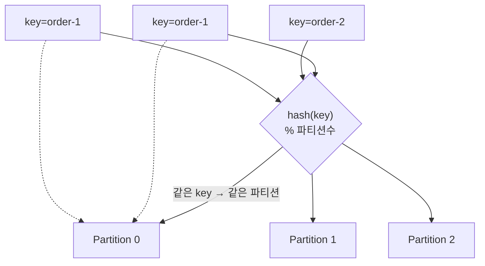
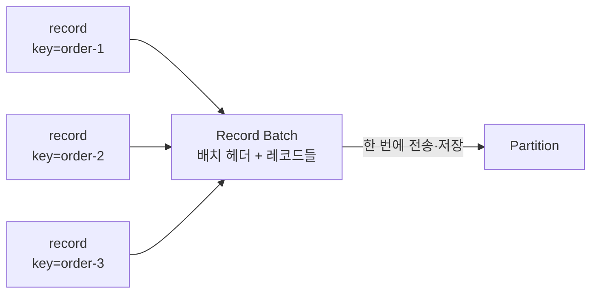
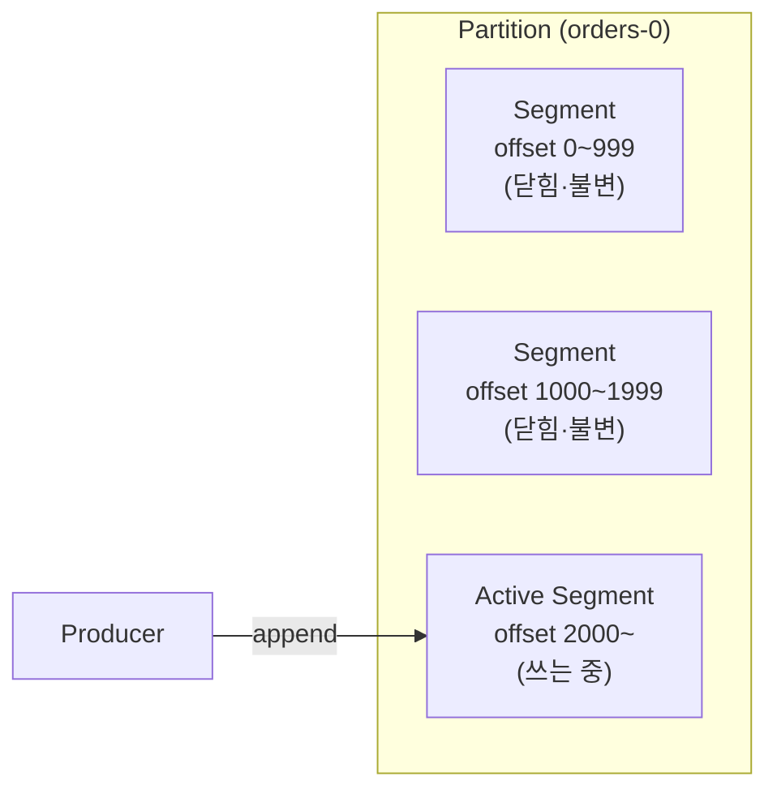
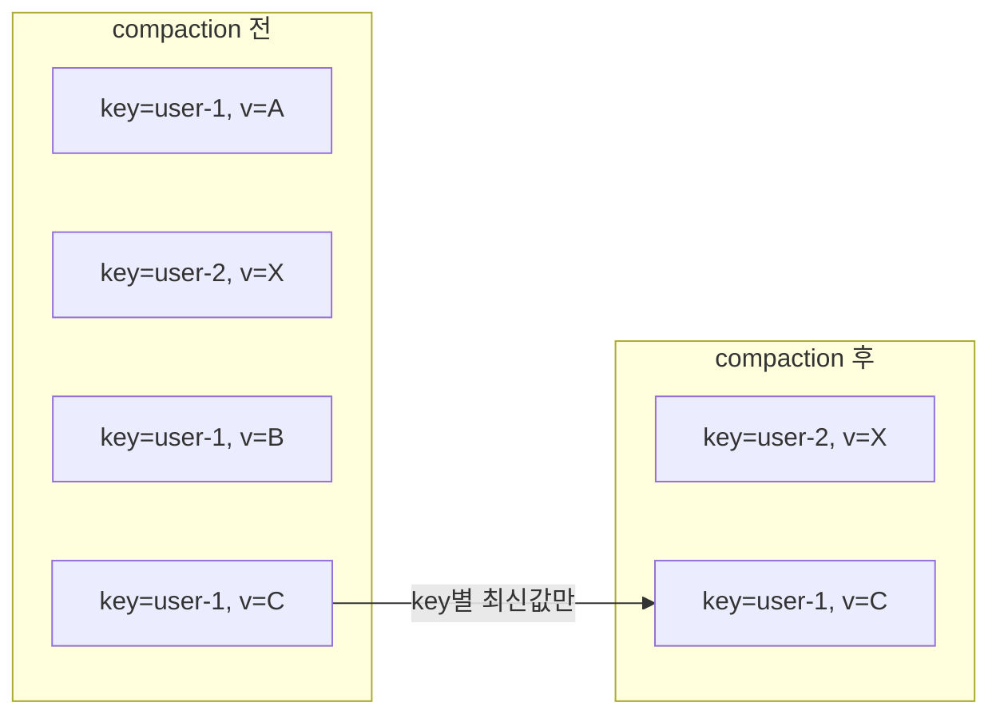

Kafka가 다루는 단위는 **레코드**라는 구조체다. 그 레코드들은 파티션이라는 append-only 로그에 쌓이고, 이 로그도 하나의 거대한 파일이 아니라 **여러 조각으로 나뉘어 디스크에 저장**된다.

## 레코드는 문자열이 아니다

프로듀서가 보내는 메시지 하나는 여러 필드를 가진 레코드다.

| 필드 | 역할 | 필수 |
|---|---|---|
| **topic** | 어느 토픽으로 보낼지 | 필수 |
| **partition** | 파티션 번호를 직접 지정 | 선택 (지정하면 파티션 결정 단계를 건너뛴다) |
| **key** | 파티션 배정·compaction의 기준 | 선택 (null 가능) |
| **value** | 실제 본문 | 사실상 필수 |
| **timestamp** | 생성·기록 시각 | 자동 |
| **headers** | 부가 메타데이터 — 그 자체가 key-value 목록 | 선택 |
| **offset** | 파티션 안에서의 순번 | 브로커가 부여 |

key와 value는 Kafka 입장에선 그냥 **바이트 배열**이다. JSON이든 문자열이든 Avro든, 직렬화·역직렬화는 프로듀서와 컨슈머가 알아서 하고 Kafka는 그 안을 들여다보지 않는다.

> Kafka는 내용에 무관심하다. key·value를 바이트로 받아 바이트로 돌려줄 뿐, 스키마도 타입도 모른다.

offset은 프로듀서가 넣는 게 아니라 **브로커가 파티션에 기록하는 순간 매기는 순번**이다. 파티션마다 0부터 1씩 증가하고, 한 번 정해지면 바뀌지 않는다.

## key가 하는 일

프로듀서가 레코드를 어느 파티션에 넣을지는 key로 정해진다.

- **key가 있으면** — `hash(key) % 파티션수`로 파티션이 정해진다. 그래서 **같은 key는 언제나 같은 파티션**으로 간다.
- **key가 null이면** — 특정 파티션에 매이지 않고 여러 파티션에 고르게 분산된다.

Kafka에서 **순서는 파티션 안에서만 보장**된다. 파티션이 여러 개면 그들 사이의 전역 순서는 없다.

> `주문ID`를 key로 쓰면 한 주문의 이벤트들이 전부 같은 파티션에 순서대로 쌓인다. key 없이 뿌리면 같은 주문의 이벤트가 여러 파티션에 흩어져 순서가 섞인다.

그래서 key는 "순서가 필요한 단위"로 잡는다.

## 레코드는 하나씩 저장되지 않는다

프로듀서가 네트워크에 내보내고 브로커가 디스크에 쓰는 단위는 레코드 하나가 아니라, 여러 레코드를 묶은 **레코드 배치**다.

프로듀서는 레코드가 생길 때마다 즉시 보내지 않고 잠깐 모은다. 정해진 크기가 차거나 정해진 시간이 지나면 그 묶음을 한 번에 보낸다. 브로커도 배치를 풀어 낱개로 저장하지 않고 **배치 그대로 로그에 붙인다.**

묶는 이유는 셋이다.

- **네트워크 왕복이 줄어든다** — 레코드 1000개를 1000번 보내는 대신 몇 번에 나눠 보낸다.
- **압축이 배치 단위로 걸린다** — 낱개 메시지는 압축해도 별로 줄지 않지만, 형태가 비슷한 레코드 수백 개를 묶으면 압축률이 크게 오른다.
- **공통 정보의 오버헤드가 분산된다** — timestamp나 offset의 기준값을 배치 헤더에 한 번만 두고, 개별 레코드는 그 기준으로부터의 차이만 갖는다.

offset도 이 구조를 따른다. 배치 헤더에 시작 offset이 있고 각 레코드는 거기서 몇 번째인지를 나타내는 증분만 갖는다. 그래서 로그 파일을 그냥 열면 개별 레코드가 아니라 배치 단위 정보가 먼저 보이고, 안의 레코드를 보려면 배치를 펼쳐야 한다.

대가는 지연이다. 첫 레코드가 만들어진 뒤 배치가 찰 때까지 기다려야 한다. 배치를 크게 잡으면 처리량과 압축률은 오르지만 개별 메시지의 지연은 늘어난다.

## 로그에 쌓인다 — 세그먼트

파티션은 append-only 로그라, 레코드는 항상 끝에만 붙는다. 그런데 파티션 하나가 몇 달간 쌓이면 수백 GB가 된다. 이걸 **파일 하나로 두면** 오래된 메시지를 지우는 것도, 특정 offset을 찾는 것도 통째로 뒤져야 해서 곤란하다.

그래서 Kafka는 파티션을 **세그먼트**라는 일정 크기의 조각으로 나눈다.

- 새 레코드는 항상 **맨 끝의 활성 세그먼트**에만 쓰인다.
- 활성 세그먼트가 정해진 크기나 시간에 도달하면 닫히고, 새 세그먼트가 열린다.
- 닫힌 세그먼트는 **불변**이다 — 더는 쓰이지 않고 읽히기만 한다.

디스크에서 파티션은 디렉토리 하나이고, 세그먼트는 그 안의 파일이다. 파일 이름은 **그 세그먼트에 담긴 첫 레코드의 offset을 20자리로 채운 값**이다. 이 첫 offset을 base offset이라 부른다. offset 0부터 시작하는 세그먼트는 `00000000000000000000`, 1000부터 시작하는 세그먼트는 `00000000000000001000`이 된다. 자리를 채우는 이유는 이름순 정렬이 곧 offset 순 정렬이 되게 하기 위해서다. 덕분에 파일을 열어보지 않고 **이름만으로 어느 offset이 어느 세그먼트에 있는지** 알 수 있다.

세그먼트 하나는 사실 파일 한 개가 아니라 짝지어 다닌다.

| 파일 | 담는 것 |
|---|---|
| `.log` | 레코드 본문이 순서대로 |
| `.index` | offset → `.log` 안의 바이트 위치 (드문드문) |
| `.timeindex` | timestamp → offset |

그래서 컨슈머가 "offset 1500부터 읽어줘"라고 하면 세 단계로 처리된다.

1. **파일 이름**으로 세그먼트를 고른다 — base offset이 1500 이하인 것 중 가장 큰 것.
2. 그 세그먼트의 `.index`에서 1500에 가장 가까운 항목을 찾아 `.log` 안의 **바이트 위치로 점프**한다.
3. 거기서부터 조금만 순차로 읽어 1500에 도달한다.

전체 로그를 처음부터 훑는 일은 어느 단계에도 없다.

## 얼마나 보관하나 — retention

로그가 무한히 쌓일 순 없으니 오래된 것은 지운다. 기준은 두 가지다.

| 정책 | 기준 | 예 |
|---|---|---|
| 시간 기반 | 마지막 수정 후 경과 시간 | "7일 지난 건 삭제" |
| 용량 기반 | 파티션 총 크기 | "파티션이 50GB 넘으면 오래된 것부터" |

**삭제는 세그먼트 단위**로 일어난다.

> retention은 레코드 하나하나를 골라 지우지 않는다. "이 세그먼트는 통째로 기한이 지났다"를 판단해 세그먼트 파일을 통째로 버린다.

그래서 활성 세그먼트는 retention 대상이 되지 않는다 — 아직 닫히지 않았으니 통째로 버릴 수가 없다. 세그먼트 크기를 너무 크게 잡으면 그만큼 오래된 데이터가 안 지워지고 남는다.

## 같은 key의 최신값만 — compaction

retention이 "오래되면 버린다"라면, **compaction**은 다른 종류의 정리다. 시간이 아니라 **key**를 기준으로, 같은 key의 옛 레코드를 지우고 **최신 값 하나만 남긴다.**

`user-1`의 값이 A→B→C로 바뀌었으면, 최신인 C만 남고 A·B는 사라진다. key가 없으면 "무엇의 최신값인지" 판단할 수 없으니, **compaction은 key가 있어야 성립**한다.

이게 유용한 곳은 "현재 상태만 필요한" 토픽이다. 예를 들어 사용자별 최신 설정, 상품별 현재 가격처럼 **변경 이력이 아니라 마지막 값**이 관심사인 경우. 이런 토픽은 시간이 지나도 무한정 커지지 않고 "key 개수만큼"으로 수렴한다.

key의 value를 null로 보내면 그 key를 지우라는 신호가 된다. 이를 **tombstone**이라 하고, compaction 때 해당 key가 통째로 사라진다.

보관 정책은 토픽마다 고른다 — 로그를 기간만큼 쌓다 버리는 `delete`로 갈지, key별 최신값만 유지하는 `compact`로 갈지. 이벤트 스트림인지 상태 저장소인지에 따라 갈린다.
