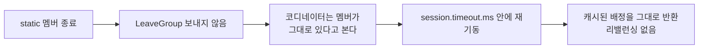

컨슈머가 재시작하면 그룹은 리밸런싱을 한다. 코드가 한 줄도 안 바뀐 롤링 배포에서도 인스턴스 수만큼 반복되고, 컨슈머가 서른 대 마흔 대로 늘어나면 한 대를 내렸다 올리는 일이 그룹 전체를 그만큼 멈춰 세운다. Static Membership은 이 재시작을 리밸런싱 사유에서 빼는 장치다.

## group.instance.id가 바꾸는 것

컨슈머를 조회하면 나오는 식별자 셋 중에서, 브로커가 세션마다 새로 발급하는 것이 member ID다. 컨슈머 하나가 재시작하면 브로커 입장에서는 알던 멤버가 사라지고 낯선 멤버가 새로 합류한 것으로 보이므로, [그 자체가 리밸런싱 사유](/posts/kafka-consumer-lag)가 된다.

`group.instance.id`는 그 자리에 개발자가 정한 고정값을 얹는다.

| 설정 | 하는 일 | 기본값 (4.2.1) |
|---|---|---|
| `group.instance.id` | 값이 있으면 그 컨슈머를 static 멤버로 취급한다 | 없음 |

값이 없으면 dynamic 멤버이고, 이것이 전통적인 동작이다. 클라이언트 코드에서 둘을 가르는 조건도 이 한 줄뿐이다.

```java
protected boolean isDynamicMember() {
    return rebalanceConfig.groupInstanceId.isEmpty();
}
```

같은 ID를 쓰는 인스턴스는 그룹에 하나만 있을 수 있으므로, 인스턴스마다 다른 값을 줘야 한다.

## 재기동에서 리밸런싱이 생략되는 경로

static 멤버가 종료될 때 클라이언트가 하는 일이 dynamic 멤버와 다르다.

```java
return membershipOperation == LEAVE_GROUP || (isDynamicMember() && membershipOperation == DEFAULT);
```

기본 동작에서 LeaveGroup 요청이 나가는 것은 dynamic 멤버뿐이다. static 멤버는 아무 신호도 보내지 않고 사라지므로, 코디네이터는 그 멤버가 아직 그룹에 있다고 본다. 리밸런싱을 일으킬 사건 자체가 없다.



돌아온 멤버는 `group.instance.id`로 식별되고, 브로커는 들고 있던 배정을 리밸런싱 없이 그대로 돌려준다. 그래서 재시작 전에 맡던 파티션을 재시작 뒤에도 그대로 맡는다. 캐시나 로컬 상태를 들고 일하는 컨슈머라면 워밍업을 다시 하지 않아도 된다.

세션 타임아웃 안에 돌아오지 못하면 그때 멤버 목록과 static ID 맵 양쪽에서 제거되고, 그 시점에 리밸런싱이 돈다. 리밸런싱이 사라지는 것이 아니라 재시작 시점에서 세션 타임아웃 만료 시점으로 미뤄진다.

## 멈춤이 그룹에서 파티션 하나로 옮겨간다

배정이 유지된다는 것은 그 파티션을 다른 컨슈머가 넘겨받지 않는다는 뜻이기도 하다. 원래 주인은 내려가 있고 대신 읽을 컨슈머는 없으니, 재기동이 끝날 때까지 그 파티션은 아무에게도 읽히지 않는다. 프로듀서는 그동안에도 계속 쓰므로 그만큼 밀린다.

| | dynamic 멤버 | static 멤버 |
|---|---|---|
| 재시작 때 리밸런싱 | 두 번 (내려갈 때, 올라올 때) | 없음 |
| 멈추는 범위 | 그룹 전체 | 그 멤버가 맡던 파티션만 |
| 멈추는 시간 | 리밸런싱이 도는 동안 | 컨슈머가 돌아올 때까지 |

Static Membership은 멈춤을 없애는 것이 아니라 멈춤의 모양을 바꾼다. 넓고 짧게 멈추던 것이 좁고 길게 멈추는 쪽으로 옮겨간다. 컨슈머가 많을수록 앞쪽 비용이 커지므로 바꿀 값어치가 생기고, 파티션 하나가 오래 밀리면 곤란한 워크로드라면 반대가 된다.

## session.timeout.ms의 양쪽

기본값 45초는 [heartbeat가 끊긴 시간을 재는 값](/posts/kafka-consumer-poll-loop)이라 장애를 빨리 잡아내는 쪽으로 맞춰져 있다. 프로세스를 내렸다 올리는 데 그보다 오래 걸리면 재기동이 끝나기 전에 멤버가 축출되고, 리밸런싱을 피하려고 켠 설정이 아무 일도 하지 않는다. `group.instance.id` 설정 문서도 이 값을 함께 늘려 쓰라고 적어 둔 이유가 여기 있다.

늘리는 쪽에는 값이 붙는다. 같은 값이 두 가지를 동시에 재고 있다.

- **재기동을 기다려 주는 시간.** 길수록 리밸런싱 없이 돌아올 수 있는 여유가 늘어난다.
- **죽은 멤버를 방치하는 시간.** 진짜로 죽었을 때도 그만큼 기다린 뒤에야 파티션이 넘어간다.

2분으로 두면 재기동에 2분까지 쓸 수 있고, 인스턴스가 영영 안 돌아오는 장애에서도 그 파티션이 2분 동안 밀린다. KIP-345는 권장 숫자를 못 박지 않고 리밸런싱이 너무 잦지 않을 만큼 크게 잡으라고만 하며, 상한을 30분으로 둔다.

## 영구 이탈을 고르는 방법

재기동이 아니라 스케일인처럼 영영 내리는 경우에는 기다림이 손해다. Kafka 4.x의 `close(CloseOptions)`가 이 선택을 열어 둔다.

```java
public enum GroupMembershipOperation {
    LEAVE_GROUP,
    REMAIN_IN_GROUP,
    DEFAULT
}
```

| 값 | static 멤버의 종료 동작 |
|---|---|
| `DEFAULT` | LeaveGroup을 보내지 않는다. 자리를 유지한 채 사라진다 |
| `LEAVE_GROUP` | 보낸다. static 멤버여도 즉시 그룹에서 빠진다 |
| `REMAIN_IN_GROUP` | 보내지 않는다 |

앞의 조건식에서 `membershipOperation == LEAVE_GROUP`이 `isDynamicMember()`와 OR로 묶여 있는 것이 이 자리다. 명시하면 static 여부와 무관하게 LeaveGroup이 나가고, 세션 타임아웃을 기다리지 않고 곧바로 재배정이 일어난다. 롤링 재시작에는 기본값을 쓰고 스케일인에는 `LEAVE_GROUP`을 주는 식으로 종료 경로를 갈라 두면, 세션 타임아웃을 길게 잡아 두고도 의도한 축소는 지연 없이 반영된다.

이 기본값은 재시작 말고 한 자리에 더 걸린다. 처리가 길어 `max.poll.interval.ms`를 넘기면 컨슈머는 그룹에서 빠지는 절차를 밟는데, 그 절차가 종료 때와 같은 기본값을 쓰므로 코디네이터에 이탈을 알리는 요청은 dynamic 멤버에서만 나간다.

그래서 poll 간격을 넘겼을 때의 결과가 갈린다. dynamic 멤버는 그 순간 파티션을 내놓고 다른 컨슈머가 넘겨받지만, static 멤버는 파티션을 붙든 채로 남는다. 밀린 처리를 끝내고 `session.timeout.ms` 안에 poll을 다시 부르면 같은 파티션으로 이어 읽고, 리밸런싱은 한 번도 일어나지 않는다. 그 시간까지 못 돌아오면 heartbeat가 끊긴 것으로 확정돼 그때 넘어간다.

Static Membership이 감싸는 범위가 재시작만이 아니라는 뜻이다. 처리가 순간적으로 느려져 poll을 놓치는 경우도 같은 유예를 받는다.

## 새 프로토콜의 이탈 신호

`group.protocol`을 `consumer`로 둔 [새 프로토콜](/posts/kafka-consumer-rebalance-kip848)에서도 Static Membership은 그대로 쓸 수 있는데, 떠나는 방식이 다르다. classic static 멤버는 아무것도 보내지 않고 사라지지만, 새 프로토콜은 떠난다는 사실을 알리되 static 신원은 유지하는 신호를 따로 둔다. heartbeat에 싣는 member epoch가 그 신호다.

| epoch | 뜻 |
|---|---|
| `0` | 그룹에 합류하겠다 |
| `-1` | 그룹을 떠나겠다 |
| `-2` | 잠시 떠나며 세션 타임아웃 안에 돌아오겠다 |

`-2`는 바운스처럼 내렸다 바로 올리는 경우를 위해 뒀고, 코디네이터는 이 신호를 받으면 그 멤버가 세션 타임아웃 안에 돌아온다고 본다.

클라이언트는 종료 시점에 둘 중 하나를 고른다.

```java
return isStaticMember ?
    ConsumerGroupHeartbeatRequest.LEAVE_GROUP_STATIC_MEMBER_EPOCH :   // -2
    ConsumerGroupHeartbeatRequest.LEAVE_GROUP_MEMBER_EPOCH;           // -1
```

같은 ID로 돌아오면 코디네이터가 옛 멤버를 새 멤버로 갈아 끼우고 들고 있던 배정을 돌려준다. 아직 놓이지 않은 instance ID로 합류를 시도하면 `UNRELEASED_INSTANCE_ID` 에러가 돌아오는데, 같은 ID를 가진 인스턴스가 둘 뜨는 상황이 여기서 걸린다.

`LEAVE_GROUP`을 명시했을 때 static 멤버도 `-1`을 보내는 것은 서버에 static 멤버를 영구히 빼는 별도 수단이 없어서다. 영구 이탈용 신호가 따로 없으니 dynamic 멤버와 같은 값을 써서 그 멤버를 펜싱하는 쪽으로 처리한다.

---

Static Membership을 켜는 일은 리밸런싱을 없애는 선택이 아니라 리밸런싱이 일어날 시점을 재시작 순간에서 세션 타임아웃 만료 시점으로 옮기는 선택이다. 그 사이의 시간에 파티션 하나가 밀리고, 그 시간의 길이를 `session.timeout.ms`가 정한다.

그래서 두 값을 따로 정할 수 없다. 재기동에 필요한 시간이 세션 타임아웃의 하한을 정하고, 파티션 하나가 밀려도 되는 시간이 상한을 정한다. 둘 사이가 좁으면 Static Membership이 맞는 워크로드가 아니다.
