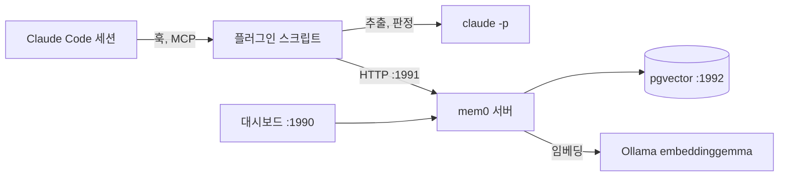

Claude Code는 세션을 새로 열면 빈 컨텍스트로 시작한다. 프로젝트 루트의 CLAUDE.md 한 장이 매번 읽히는 전부다. 어제 "이 방식은 안 되더라"고 함께 결론 낸 내용, 그 결론에 이르기까지 대안을 비교한 근거는 세션 로그에만 남고 다음 세션은 그것을 모른다. 같은 실패를 다시 밟고, 같은 설명을 다시 한다.

그 빈 자리를 메우려면 세션 밖에 기억을 두고, 다음 세션이 그것을 찾아 읽게 하는 장치가 필요하다.

## 기억할 대상

남겨야 하는 것은 **코드를 봐도 안 나오는 것**이다. 코드는 저장소에 있다.

- **결정과 그 이유.** 라이브러리 A 대신 B를 고른 이유, 그때 기각한 대안과 기각 근거.
- **한 번 밟은 함정.** 특정 설정이 왜 안 먹는지, 어떤 에러가 실제로는 다른 원인이었는지.
- **작업 중인 상태.** 어디까지 했고 다음에 무엇을 하려 했는지.
- **작업 습관.** 답변 언어, 커밋 메시지 형식, 확인 없이 해도 되는 것과 안 되는 것.

이 넷은 회사 저장소 몇 개, 개인 블로그, 그리고 이 기억 시스템 자체까지 프로젝트를 넘나들며 쌓인다. 그래서 기억은 프로젝트 단위로 격리되되 필요하면 가로질러 검색할 수 있어야 한다.

그리고 쌓이기만 하지 않고 정리되어야 한다. 사람의 기억은 낮에 쌓인 것이 잠자는 동안 정리된다. 중복은 합쳐지고 뒤집힌 결론은 새것으로 덮인다. 쌓이기만 하는 저장소는 몇 주 뒤 검색 결과가 비슷한 문장 다섯 개로 채워진다.

## 후보 셋

### Claude Code 기본 메모리

Claude Code에는 자동 메모리가 내장되어 있다. 프로젝트별 디렉터리 아래 마크다운 파일 하나에 사실 하나를 적고, 색인 파일 MEMORY.md가 세션마다 컨텍스트에 통째로 올라간다.

설정이 없고 즉시 쓸 수 있다. 다만 두 가지가 요구사항과 어긋났다.

- **프로젝트 경계에 갇힌다.** 디렉터리가 프로젝트별로 나뉘어 있어 다른 저장소에서 배운 것을 가져올 수 없다.
- **검색이 아니라 적재다.** 색인 전체가 매 세션 올라가므로 기억이 늘수록 컨텍스트를 그만큼 잡아먹는다. 관련 있는 것만 골라 넣는 단계가 없다.

### Mem0 Platform

mem0는 LLM 에이전트용 메모리 레이어다. 문장을 넣으면 LLM이 기억할 가치가 있는 사실만 추출하고, 기존 기억과 비교해 추가할지 갱신할지 결정하고, 벡터로 저장해 의미 검색을 제공한다. 회사가 운영하는 클라우드 판이 Mem0 Platform이고, Claude Code용 공식 플러그인이 이 API를 바라본다.

플러그인은 세 층으로 되어 있다.

| 층 | 하는 일 |
|---|---|
| MCP 서버 | add_memory, search_memories 같은 도구를 Claude에게 노출 |
| 라이프사이클 훅 | 세션 시작 시 기억 주입, 프롬프트마다 관련 기억 검색, 턴이 끝날 때 요약 저장 |
| 스킬 | /mem0:remember, /mem0:dream 같은 슬래시 명령 |

기능은 가장 많다. 그래프 메모리, 자동 카테고리 분류, 프로젝트 요약, 웹훅, 일괄 처리가 전부 서버 쪽에 있다. 대신 모든 기억이 외부 SaaS로 나간다. 회사 저장소에서 나온 결정 기록이 섞여 들어가는 구조라 이 조건이 걸렸다. 무료 티어의 한도도 훅이 프롬프트마다 호출하는 사용 패턴과 맞지 않았다.

### mem0 OSS 셀프호스팅

같은 저장소에 셀프호스팅용 서버가 들어 있다. FastAPI 서버 하나, pgvector가 붙은 Postgres 하나, 관리용 대시보드 하나를 docker compose로 올린다. 추출과 임베딩에 쓸 모델은 provider 설정으로 고른다.

데이터가 밖으로 나가지 않고 서버 코드를 고칠 수 있다. 대신 클라우드 판의 부가 기능은 없다. 그래프 메모리와 자동 분류는 클라우드 전용이고, 요약 API와 웹훅과 일괄 처리도 OSS에는 없다. 그리고 공식 플러그인은 클라우드 주소가 하드코딩되어 있어 그대로는 로컬 서버에 붙지 않는다.

## 결정

데이터를 안에 두는 쪽을 우선해 셀프호스팅을 골랐다. 그래서 잃는 기능은 다른 방법으로 메운다.

| 기준 | 기본 메모리 | Mem0 Platform | OSS 셀프호스팅 |
|---|---|---|---|
| 프로젝트 가로지르기 | 불가 | 가능 | 가능 |
| 검색 후 주입 | 없음 | 있음 | 있음 |
| 데이터 위치 | 로컬 | 외부 SaaS | 로컬 |
| 비용 | 0 | 무료 티어 한도, 이후 유료 | 서버는 0, 모델 호출은 별도 |
| 부가 기능 | 없음 | 전부 | 대부분 없음 |
| 수정 가능성 | 없음 | 없음 | 서버, 플러그인 모두 |

잃는 것은 처음부터 목록으로 적어 두었다. 그래프 메모리, 자동 카테고리, 요약 엔드포인트, 웹훅, 내보내기 API, 일괄 작업, 그리고 claude.ai 웹에서는 쓸 수 없다는 점까지. 하나씩 정말 필요한지를 묻고, 필요한 것은 다른 방법으로 만들었다.

## 기억 시스템에 필요한 두 모델

mem0가 "메모리 레이어"라고 불리는 이유는 저장소가 아니라 그 앞뒤에 붙은 두 단계에 있다. 둘 다 모델이 필요하고, 종류가 다르다.

### 넣을 때: 사실을 추출하는 LLM

대화 원문을 그대로 저장하면 기억이 아니라 로그다. 한 턴에 수천 자가 오가고 그중 다음 세션에도 참인 문장은 두어 개다. 그 두어 개를 골라내고, 이미 있는 기억과 같은 내용이면 버리고, 같은 주제인데 결론이 바뀌었으면 옛것을 갱신하는 판단이 저장 때마다 들어간다.

이 판단은 언어를 이해하는 모델만 할 수 있다. 저장 요청마다 LLM에게 "이 대화에서 기억할 사실을 뽑아라"와 "이 사실은 기존 기억 대비 추가인가 갱신인가 중복인가"를 묻는다.

### 찾을 때: 의미를 좌표로 바꾸는 임베딩 모델

다음 세션에서 사용자가 프롬프트를 치면 그 프롬프트와 **관련된** 기억을 골라 넣어야 한다. 키워드 검색은 여기서 약하다. "Kafka 컨슈머 랙"이라고 저장한 기억은 "consumer lag이 왜 늘지"라는 질문에 단어 하나도 겹치지 않는다. 한국어와 영어가 섞이고, 같은 것을 다른 말로 부르는 일이 잦다.

임베딩 모델은 문장을 수백 개의 숫자로 이루어진 벡터로 바꾼다. 의미가 비슷한 문장은 가까운 벡터가 된다. 저장할 때 기억을 벡터로 바꿔 두고, 검색할 때 질문도 벡터로 바꿔 가장 가까운 것 몇 개를 고른다. 그래서 저장소가 일반 Postgres가 아니라 벡터 컬럼과 거리 연산을 지원하는 pgvector다.

| | 추출 LLM | 임베딩 모델 |
|---|---|---|
| 하는 일 | 문장을 읽고 판단하고 새 문장을 쓴다 | 문장을 고정 길이 벡터 하나로 바꾼다 |
| 부르는 때 | 저장할 때마다 | 저장할 때, 검색할 때 |
| 크기 | 수십억 파라미터 이상 | 수억 파라미터 |
| 서로 대체 | 불가 | 불가 |

둘은 한쪽으로 다른 쪽을 대신할 수 없다. 생성 모델은 벡터를 내지 않고, 임베딩 모델은 문장을 쓰지 않는다. 그래서 셀프호스팅 서버의 provider 설정도 llm과 embedder 두 칸으로 나뉘어 있다.

### 두 칸의 선택

**추출 LLM은 Claude Code 구독이다.** 서버 설정의 llm 칸을 쓰지 않고, 호스트에서 `claude -p`를 헤드리스로 불러 추출과 판정을 맡긴다. 이유는 셋이다.

- **호출하는 것이 사람이 아니라 훅이다.** 프롬프트 3번마다, 턴이 끝날 때마다 자동으로 나가고 상한이 없다. 종량제 API 위에 이 패턴을 올리면 청구서가 사용량을 그대로 따라간다. 구독 안에서는 호출당 비용이 0이다.
- **판정 품질.** 사실 하나를 기존 기억과 합치면서 포트 번호나 파일 경로를 하나도 흘리지 않아야 한다. 무인으로 하루 수십 번 도는 판정이라 여기서 잃은 식별자는 복구할 방법이 없다.
- **로컬 LLM의 무게.** 같은 일을 맥 안의 모델로 하면 20GB 안팎을 디스크와 메모리에서 상주시켜야 한다. 이미 결제한 구독이 있는데 그 무게를 질 이유가 없었다.

**임베딩 모델은 로컬 Ollama의 embeddinggemma다.** Anthropic에는 임베딩 API가 없다. 300M 파라미터, 768차원, 다국어 모델이고 디스크에서 621MB를 쓴다. 임베딩은 대화 원문이 아니라 추출이 끝난 한 문장씩 처리하므로 작아도 되고, 로컬에서 돌아가니 기억 텍스트가 밖으로 나가지 않는다.

## 구조

