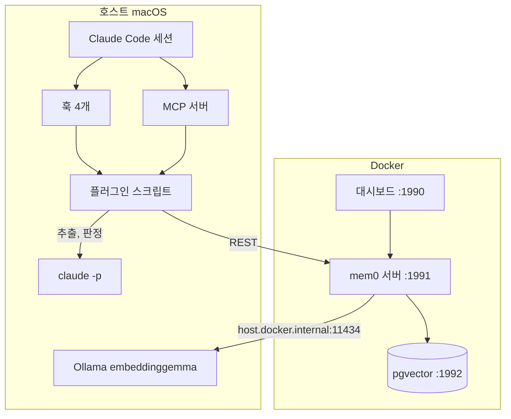

Claude Code는 세션을 새로 열면 빈 컨텍스트로 시작한다. 이전 세션에서 내린 결정과 밟은 함정을 다음 세션에서 꺼내 쓰기 위해, 오픈소스 메모리 레이어 mem0를 맥 한 대 안에 셀프호스팅했다. Docker 안의 mem0 서버가 기억을 저장하고, 호스트의 Ollama가 임베딩을 만들고, Claude Code에 걸린 훅과 MCP 서버가 세션과 서버를 잇고, 훅이 헤드리스로 부르는 `claude -p`가 무엇을 기억할지 판단한다.



## 서버

mem0 공식 저장소의 셀프호스팅 서버를 그대로 쓴다. 고친 곳은 세 파일이다.

| 파일 | 변경 |
|---|---|
| docker-compose.yaml | 포트를 1990, 1991, 1992로 |
| server/main.py | 허용 provider 화이트리스트에 `ollama` 추가 |
| server/requirements.txt | `ollama` 패키지 추가 |

서버는 허용하는 provider를 튜플로 들고 있고, 이미지에 번들된 것만 통과시킨다. mem0 라이브러리 자체는 Ollama를 지원하지만 서버 화이트리스트가 막고 있어서 한 줄을 더했다.

```python
# server/main.py
BUNDLED_LLM_PROVIDERS = ("openai", "anthropic", "gemini", "ollama")
BUNDLED_EMBEDDER_PROVIDERS = ("openai", "gemini", "ollama")
```

저장소는 두 층으로 되어 있다. 사실을 추출하고 임베딩하고 저장하는 핵심 로직은 `mem0ai`라는 파이썬 패키지이고, `server/` 폴더는 그 패키지를 REST로 감싼 FastAPI 앱이다. docker compose는 컨테이너를 시작할 때마다 `mem0ai`를 PyPI에서 새로 설치한다. 그래서 `server/` 아래 파일을 고치면 반영되지만, 저장소 안의 라이브러리 소스를 고쳐도 컨테이너 안에서는 PyPI 버전이 덮어쓴다. 고친 세 파일이 전부 `server/` 아래인 것도 그 때문이다.

### 모델 설정

이 시스템에서 서버가 부르는 모델은 임베딩 모델 하나다. 대화에서 기억할 사실을 뽑고 기존 기억과 중복인지 판정하는 LLM 일은 훅이 호스트에서 `claude -p`로 끝낸 뒤 결과 문장만 서버에 넘긴다. 서버는 받은 문장을 벡터로 바꿔 저장한다.

임베딩 모델은 Ollama의 embeddinggemma다. 768차원이고, 주소는 컨테이너에서 호스트를 가리키는 `http://host.docker.internal:11434`다. 이 설정은 설정 파일 대신 Postgres에 있다. 대시보드나 POST /configure로 넣으면 mem0_app 데이터베이스의 settings 테이블에 config_overrides라는 JSON 한 줄로 저장되고, 서버는 요청마다 이 값을 읽는다.

그 JSON에는 `embedder` 옆에 `llm` 항목도 있다. mem0 서버는 원래 저장 요청을 받으면 스스로 LLM을 불러 추출과 판정을 하도록 설계되어 있고, `llm`은 그때 쓸 모델을 넣는 자리다. 이 시스템에서는 훅이 저장 요청에 항상 `infer=False`를 붙여 그 단계를 건너뛰게 하므로, `llm`에 무엇이 들어 있어도 호출되지 않는다.

### Ollama

Ollama는 호스트에서 Homebrew 서비스로 돈다. LaunchAgent plist에 `OLLAMA_KEEP_ALIVE=1m`을 넣어 마지막 요청 1분 뒤에 모델을 메모리에서 내린다. embeddinggemma는 콜드 로드가 0.5초라 요청마다 다시 올려도 체감이 없다. 이 환경변수는 `brew services restart`로는 적용되지 않는다. restart가 plist를 다시 생성하면서 직접 넣은 환경변수를 지우기 때문에, `launchctl bootout`과 `bootstrap`으로 에이전트를 다시 올린다.

## Claude Code 연결

### 훅

`~/.claude/settings.json`에 훅 넷이 걸려 있다. 전부 플러그인 폴더의 셸 스크립트를 부른다.

| 이벤트 | 하는 일 | 사용자가 기다리나 |
|---|---|---|
| SessionStart | 상태줄 배너, 최근 활동 타임라인 주입 | 짧게 |
| UserPromptSubmit | 프롬프트로 검색해 관련 기억 5개 주입. 3번째 프롬프트마다 최근 대화 자동 저장 | 검색만, 저장은 백그라운드 |
| Stop | 턴이 끝날 때 마지막 답변에서 사실 추출, 저장 | 아니오, 백그라운드 |
| PostToolUse (mem0 도구) | 세션 통계 갱신 | 아니오 |

백그라운드로 보내는 훅은 전부 같은 형태다.

```bash
( python3 capture_session_summary.py >/dev/null 2>&1 & )
```

Claude Code는 훅의 출력을 파이프로 받고, 그 파이프가 닫히면 훅이 끝났다고 본다. 파이프는 그것을 쥔 프로세스가 전부 놓아야 닫힌다.

`python3 script.py &`로만 쓰면 셸은 바로 끝나지만, 자식 파이썬이 셸의 출력 파이프를 물려받아 계속 쥐고 있다. 파이프가 안 닫히니 Claude Code는 자식이 끝날 때까지 기다리고, 그 40초 남짓 동안 다음 턴이 멈춘다.

위 형태는 자식이 파이프를 쥐지 않게 한다. 자식의 출력을 `/dev/null`로 돌리고, 괄호로 감싼 서브셸이 자식을 띄운 뒤 즉시 끝난다. 파이프를 쥔 프로세스가 없으니 바로 닫히고, 자식은 뒤에서 계속 돈다. Linux라면 `setsid`로 자식을 떼어 낼 수 있지만 macOS에는 그 명령이 없다. 이 형태로 Stop 훅은 275ms에 돌아온다.

### MCP 서버

`~/.claude.json`에 stdio MCP 서버 하나가 등록되어 있다. 파이썬 파일 하나로, 외부 의존성 없이 newline 구분 JSON-RPC를 직접 구현했다. 도구는 다섯이다.

| 도구 | 하는 일 |
|---|---|
| add_memory | 문장 하나를 저장. type 지정 가능 |
| search_memories | 의미 + 키워드 검색. type 필터, 프로젝트 가로지르기 옵션 |
| get_memories | 최신순 목록 |
| update_memory | id로 본문 교체. 통합 작업에서 쓴다 |
| delete_memory | id로 삭제 |

기억 하나에는 본문 말고도 꼬리표 셋이 붙는다.

| 꼬리표 | 뜻 | 누가 채우나 | 값 |
|---|---|---|---|
| user_id | 기억 주인 | MCP 서버 | 환경변수 |
| project | 기억이 속한 프로젝트 | MCP 서버 | 현재 디렉터리의 git remote 주소를 `owner-repo` 꼴로 바꾼 것. 이 블로그 저장소에서는 `jamin12-jamin12.github.io` |
| type | 기억의 종류 | Claude | decision, learning, task_learning, anti_pattern, preference, note 중 하나 |

- **프로젝트는 디렉터리가 정한다.** 어느 디렉터리에서 세션을 열었는지가 곧 프로젝트라, Claude가 잘못 적거나 빼먹을 일이 없다.
- **type은 검색 필터다.** "결정만 보여줘"처럼 종류로 거를 때 쓴다.

그래서 Claude가 add_memory에 넘기는 것은 기억할 문장과 type 둘뿐이다.

### 어댑터

플러그인 폴더는 공식 플러그인을 복사한 것이다. 공식 스크립트는 전부 Mem0 클라우드인 api.mem0.ai의 v3 API를 부르도록 짜여 있는데, 셀프호스팅 서버의 REST는 주소, 인증 헤더, 요청과 응답 모양이 다르다. 그대로 실행하면 로컬 서버와 말이 통하지 않는다.

스크립트마다 호출 코드를 고치는 대신 `scripts/_local_api.py` 한 파일에 서버 호출을 모았다. 훅 스크립트, MCP 서버, 하루 한 번 도는 메모리 정리 스크립트까지 스크립트 11개가 서버를 부를 때 전부 이 파일을 거친다. 클라우드 API가 바뀌든 로컬 서버가 바뀌든 고칠 곳은 이 파일 하나다.

이 파일이 번역하는 차이는 여섯 가지다.

| 차이 | 클라우드 v3 | 로컬 REST | 어댑터가 하는 일 |
|---|---|---|---|
| 검색 주소와 응답 | POST /v3/memories/search/ 가 배열을 반환 | POST /search 가 `{"results": [...]}` 를 반환 | 주소를 바꾸고 results를 꺼내 배열로 돌려준다 |
| 인증 헤더 | Authorization: Token | X-API-Key | 헤더 이름을 바꿔 붙인다 |
| 필터 문법 | `{"AND": [...]}` 중첩 트리 | 평면 dict | 트리를 평면 dict로 펼친다 |
| 프로젝트 범위 | app_id 필드 | 전용 필드 없음 | metadata.project에 넣는다 |
| 호출별 추출 지시 | 요청마다 custom_instructions 전달 | 서버 전역 설정 하나 | 호출별 값은 버린다. 추출은 호스트에서 끝내므로 쓸 일이 없다 |
| 처리 방식 | 비동기. event_id를 주고 나중에 처리 | 동기. 결과에 id가 바로 옴 | 응답의 id를 그대로 돌려준다. 상태 조회는 없다 |

어댑터가 맡는 것은 여기까지다. 서버 LLM이 하던 사실 추출과 중복 판정은 어댑터가 아니라 `scripts/_claude_extract.py`가 `claude -p`로 대신한다.

## 저장 파이프라인

훅과 서버 사이에 `claude -p`가 두 번 들어간다.


### 추출

프롬프트의 규칙은 여섯 줄이다. 영어로 쓸 것, 문장 하나가 혼자 성립할 것, 파일 경로와 포트와 에러 문자열은 원문 그대로 둘 것, 이 세션이 끝나도 참인 것만 남길 것, 코드를 보면 알 수 있는 것은 버릴 것, 없으면 빈 배열. 출력은 JSON 문자열 배열 하나다. 모델은 haiku다. 추출은 판단보다 정리에 가까워 작은 모델로 충분했다.

### 판정

추출된 사실 하나마다 서버에 벡터 검색을 쳐서 유사도 0.35 이상인 기억을 최대 5개 가져온다. 후보가 없으면 판정 없이 ADD다. 후보가 있으면 다시 haiku에게 셋 중 하나를 고르게 한다.

| 판정 | 뜻 | 서버 동작 |
|---|---|---|
| ADD | 새 정보 | POST /memories |
| UPDATE | 같은 주제, 기존 기억을 대체 | PUT /memories/{id}, 병합 텍스트 |
| SKIP | 이미 있음 | 없음 |

UPDATE에는 안전장치가 붙어 있다. 모델이 돌려준 id가 검색 후보 5개 안에 있어야 한다. 후보에 없는 id를 지어내면 UPDATE를 버리고 ADD로 처리한다. 무인으로 도는 코드가 존재하지 않는 id에 PUT을 날리는 일은 없어야 한다.

### claude -p 호출 형태

```bash
~/.local/bin/claude -p \
  --strict-mcp-config --mcp-config '{"mcpServers":{}}' \
  --setting-sources "" \
  --model haiku \
  "$PROMPT"
```

플래그 셋이 각각 이유가 있다.

- **`--setting-sources ""`.** `claude -p`도 Claude Code 세션이고, 세션이 끝나면 Stop 훅이 돈다. 설정 파일을 하나도 읽지 않게 해서 자식 세션에 훅이 없도록 한다. 이 플래그가 없으면 Stop 훅이 자기 자신을 무한히 부른다.
- **`--strict-mcp-config`와 빈 MCP 설정.** `claude -p`는 시작 시 사용자의 MCP 서버를 전부 연결한다. 커넥터가 십수 개면 핸드셰이크만 40초가 넘는다. 추출에는 하나도 필요 없다. 이걸 끄면 호출 하나가 6초에서 9초다.
- **절대 경로.** 훅 안의 PATH에는 대화형 셸의 `claude`가 세션 한정 shim으로만 잡히는 경우가 있어 설치 경로를 직접 가리킨다.

## 읽기 경로

세션이 시작되면 SessionStart 훅이 상태줄과 최근 기억 타임라인을 컨텍스트에 넣는다. 그 뒤 프롬프트마다 UserPromptSubmit 훅이 프롬프트 전문을 쿼리로 서버에 검색을 쳐서 상위 5개를 "auto-retrieved" 블록으로 주입한다. 첫 프롬프트에는 규칙 하나가 함께 들어간다. 과거 작업을 언급하거나 결정을 묻거나 에러가 보이면 Claude가 직접 search_memories를 type 필터를 바꿔 2에서 4개 병렬로 던지라는 것이다.

기억 본문은 전부 영어다. 검색이 벡터와 BM25 키워드의 하이브리드라 언어가 섞이면 키워드 쪽이 죽는다. 추출 프롬프트, MCP 도구 설명, 서버 전역 설정에 같은 문장이 박혀 있고, 식별자는 번역하지 않는다. 한국어로 물어도 Claude가 영어 명사구로 바꿔 검색하고 답은 한국어로 한다.

## 한 턴이 끝난 뒤의 실제 흐름

실제 로그다.

```
19:19:31 Capturing session summary (723 chars, 20 files)
19:20:14 Session summary: 1 added, 0 updated, 4 skipped, 0 failed
```

1. Stop 훅이 transcript에서 마지막 답변 723자와 이 세션에서 건드린 파일 20개를 뽑는다.
2. 275ms 안에 훅이 반환하고, 추출은 백그라운드로 넘어간다.
3. haiku가 사실 5개를 뽑는다.
4. 사실마다 서버에 검색을 치고 haiku가 판정한다. 넷은 SKIP, 하나는 ADD.
5. ADD 하나가 `infer=False`로 서버에 들어가고, 서버가 embeddinggemma로 임베딩해 pgvector에 넣는다.

43초가 걸렸고 사용자는 그 시간을 느끼지 않는다. 다음 세션의 첫 프롬프트가 이 사실과 관련되면 자동으로 컨텍스트에 올라온다.

## 서버가 하는 일

이 구조에서 mem0 서버가 하는 일은 셋이다. 임베딩, 저장, 코사인과 BM25 검색. 클라우드 판에서 서버 LLM이 하던 추출, 중복 판정, 분류, 요약, 리랭크는 전부 호스트의 Claude로 갔거나 필요 없어졌다.
