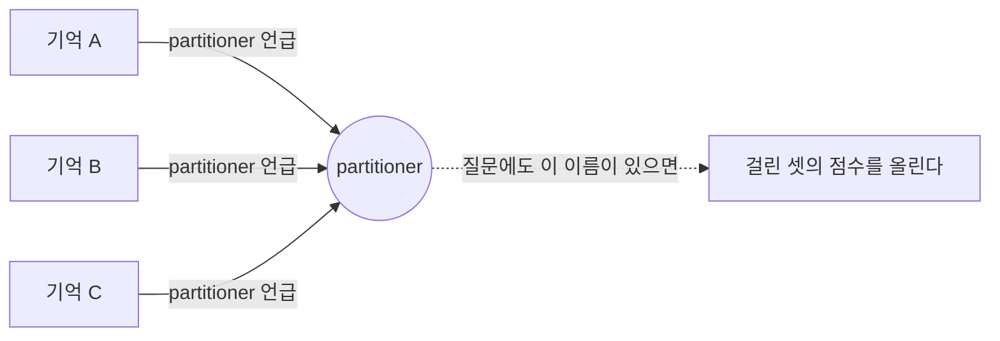
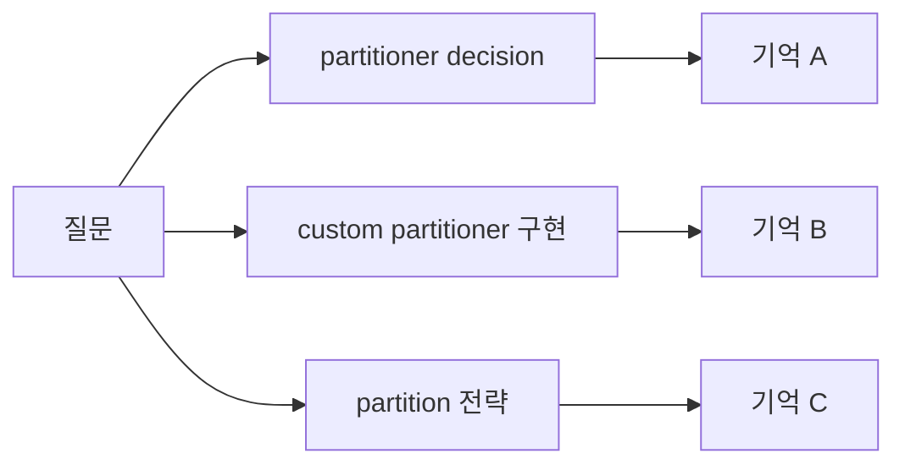
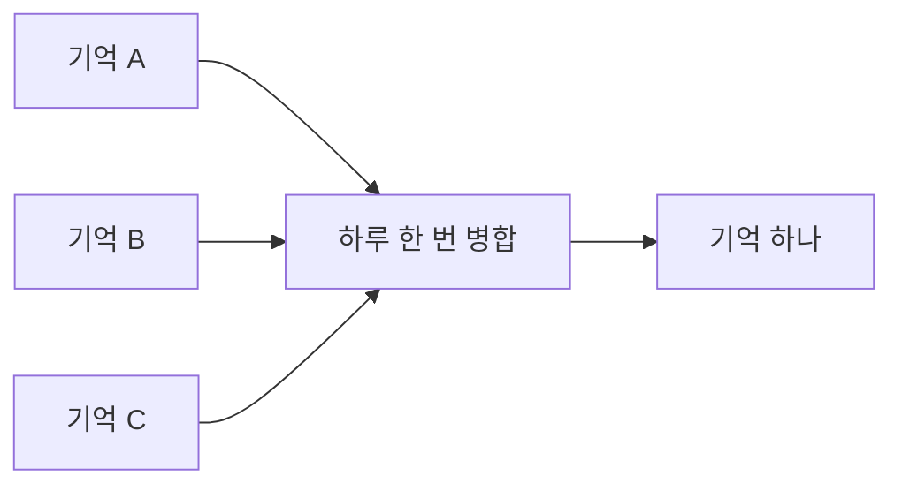
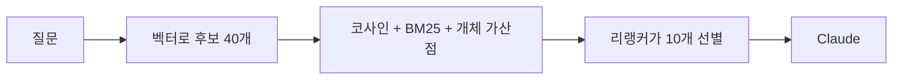

기억을 벡터로 저장하고 검색하는 서버 mem0의 클라우드 판에는 셀프호스팅 서버에 없는 기능이 둘 있다. 기억에서 뽑은 고유명사로 기억들을 잇는 그래프 메모리, 그리고 저장할 때 서버 LLM이 기억마다 카테고리를 여러 개 붙이는 자동 분류.

둘 다 저장하는 시점에 LLM을 한 번 더 불러 구조를 미리 만들어 둔다. 읽을 때는 그 구조만 따라가면 되니 LLM이 필요 없다. 읽을 때의 LLM 호출이 비싼 환경에서 맞는 거래다.

이 구성에서 읽는 쪽은 대화 중인 Claude 자신이고 구독 요금 안에 있다. 호출당 비용이 0이라 구조를 미리 만들어 둘 이유가 약하다. 각 기능이 풀려던 문제를 먼저 놓고, 그 문제를 읽는 시점에 무엇이 대신 푸는지를 적는다.

## 따로 저장되는 기억들

기억은 한 문장짜리 사실로 하나씩 저장된다. 같은 대상을 말하는 사실 셋이 각각 다른 기억에 들어 있어도, 서로 관련이 있다는 표시는 어디에도 없다.

그러면 질문 하나에 그 셋이 같이 올라오지 않는다. 벡터 검색은 질문과 기억의 문장이 얼마나 비슷한지만 보기 때문이다. "why custom partitioner"라고 물으면 "default sticky partitioner sends more records to a slow broker, so we replaced it"은 겹치는 단어가 partitioner 하나뿐이라 밀린다. 같은 결정을 말하는 기억인데도 그렇다.

## 그래프 메모리가 저장하는 것

클라우드가 그래프 메모리라고 부르는 것은 개체마다 그 개체가 나온 기억 목록을 붙여 둔 구조다. 기억을 저장할 때마다 문장에서 고유명사를 뽑고, 이름마다 행 하나를 만들고, 그 이름이 나온 기억의 id를 잇는 행을 또 만든다. 검색할 때 질문에서도 고유명사를 뽑아, 같은 이름에 걸린 기억에 점수를 더해 준다.

기억과 기억 사이에 저장되는 것은 없다. 두 기억이 이어졌다고 말할 때 근거는 같은 이름을 언급했다는 것 하나다. "이 결정이 저 결정을 뒤집었다"나 "이 사실이 저 판단의 근거다" 같은 관계는 어디에도 적히지 않는다. 공식 문서도 타입이 붙은 관계를 만들지 않고 동시 등장에서 연결을 추론한다고 적고 있다. 외부 그래프 DB를 붙였던 옛 방식은 관계를 필드로 저장했는데, 내장 그래프가 그것을 대체하면서 없어졌다.

정교한 부분은 하나다. 이름을 저장할 때 임베딩을 함께 만들어서 표현이 달라도 같은 개체로 묶인다. 그 위에 얹히는 것은 같은 이름을 가진 기억을 위로 올려 주는 가산점까지고, 그 점수도 벡터가 이미 뽑아 온 후보 안에서만 순서를 바꾼다.

## 병렬 검색과 병합

이름과 기억을 짝지은 행을 만들어 두지 않아도, 읽는 쪽이 표현을 바꿔 여러 번 검색하면 같은 대상의 기억이 모인다.

이 검색을 하는 주체는 훅이 아니라 Claude다. 훅은 프롬프트마다 한 번만 검색한다. 세션 첫 프롬프트에 "과거 작업이나 결정을 물으면 영어 명사구로 바꿔 2에서 4개를 병렬로 검색하라"는 규칙이 주입되고, 그 뒤로는 Claude가 필요한 턴을 판단해 따른다. 검색 횟수를 늘리는 비용이 0이라 가능한 방식이다.

그리고 하루 한 번, 정리 스크립트가 프로젝트의 기억 전체를 읽어 같은 주제의 사실들을 한 기억으로 합친다. 노드로 묶어 두는 대신 아예 한 덩어리로 만든다.

합쳐 두면 하나만 검색에 걸려도 나머지가 같이 딸려 온다. 기억이 다른 기억을 가리켜야 할 때는 `[mem0:8자리id]`를 본문에 적고, 병합으로 사라진 id는 스크립트가 살아남은 id로 고쳐 쓴다.

정리하면 개체 가산점은 후보 안에서 순서를 바꾸고, 병렬 검색은 후보 자체를 넓힌다. 흩어진 기억을 한 질문 아래로 모으는 일은 병렬 검색과 병합이 맡는다. 가산점이 나은 점은 검색 한 번으로 끝난다는 것인데, 그 장점은 검색이 비쌀 때만 값을 한다.

## 카테고리 대신 type

읽기 전에 기억을 종류로 걸러야 할 때가 있다. "지금 작업 상태만", "내가 직접 저장한 결정만" 같은 경우다.

클라우드는 저장할 때 서버 LLM이 기억마다 라벨을 여러 개 붙인다. 셀프호스팅 서버에는 이 기능이 없고, 만들지도 않았다. `metadata.type` 한 값이 그 자리를 채운다. 값은 열한 개다.

훅이 코드에 고정된 값으로 붙이는 넷은 그 기억이 어디서 왔는지를 말한다.

| 값 | 담는 것 |
|---|---|
| session_summary | 세션이 끝날 때 Stop 훅이 대화에서 뽑은 사실 |
| auto_capture | 3번째 프롬프트마다 최근 대화에서 뽑은 사실 |
| compact_summary | 컨텍스트 압축 직전에 PreCompact 훅이 남기는 사실 |
| project_profile | CLAUDE.md, AGENTS.md 같은 규약 파일을 읽어 넣은 프로젝트 전제 |

Claude가 add_memory를 부를 때 고르는 일곱은 내용이 무엇인지를 말한다.

| 값 | 담는 것 |
|---|---|
| decision | 무엇을 고르고 무엇을 기각했는지, 이유까지 |
| learning | 코드나 문서를 읽어서 알게 된 사실 |
| task_learning | 이 작업을 하다 알게 된 것, 다음 작업에도 쓰일 것 |
| preference | 내가 어떤 방식으로 일하기를 원하는지 |
| anti_pattern | 하지 말아야 할 것과 그렇게 판단한 근거 |
| session_state | 지금 어디까지 했는지 |
| note | 위 어디에도 안 맞는 것 |

추출 프롬프트는 분류를 하지 않는다. 사실만 뽑고 값은 호출한 파이프라인이 붙인다. 그래서 저장되는 기억은 대부분 앞의 넷을 달고 들어오고, 뒤의 일곱은 Claude가 남길 만하다고 판단한 것에만 붙는다.

한 값으로 충분한 이유는 읽을 때 먼저 필요한 판단이 "얼마나 믿을 것인가"이기 때문이다. 자동으로 뽑힌 요약인지 내가 직접 저장한 결정인지가 그 판단을 정하고, 그 정보는 앞의 넷과 뒤의 일곱을 가르는 것만으로 나온다. architecture인지 tooling인지 같은 세부 구분은 검색과 Claude가 맡는다.

## 검색 신호 넷

서버가 순위를 정할 때 쓰는 신호는 넷이고, LLM을 부르는 것은 없다.

| 신호 | 잡는 것 | 필요한 것 |
|---|---|---|
| 벡터 코사인 유사도 | 뜻이 비슷한 문장 | 기본 동작 |
| 키워드 BM25와 표제어 처리 | 같은 단어의 다른 어형 | spaCy와 en_core_web_sm |
| 개체 가산점 | 질문과 기억이 공유하는 고유명사 | 같은 spaCy 모델 |
| 크로스인코더 리랭커 | 후보가 이 질문의 답인지 | sentence-transformers와 서버 패치 |

표제어 처리와 개체 추출은 둘 다 spaCy 하나에 걸려 있다. 이 패키지가 없으면 개체 추출은 빈 목록을 돌려주고 표제어 처리는 원문을 그대로 통과시킨다. 에러도 경고도 나지 않아서, 겉보기에는 BM25가 켜져 있는데 실제로는 절반만 도는 상태가 된다.

리랭커는 벡터가 못 하는 일을 맡는다. 기억의 벡터는 저장할 때 질문을 모르는 채로 만들어져서 주제가 비슷한지까지만 담는다. 리랭커는 질문과 후보를 한 쌍으로 같이 읽어 답인지를 점수로 매기는 작은 분류 모델이고, 문장을 생성하지 않아 LLM보다 훨씬 가볍다. mem0의 검색은 top_k로 자른 뒤에 리랭크하므로, 서버에서 후보를 40개로 넓혀 놓고 그 안에서 고르게 해야 회수가 좋아진다.
