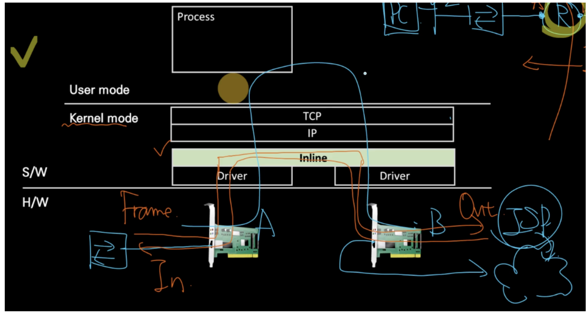
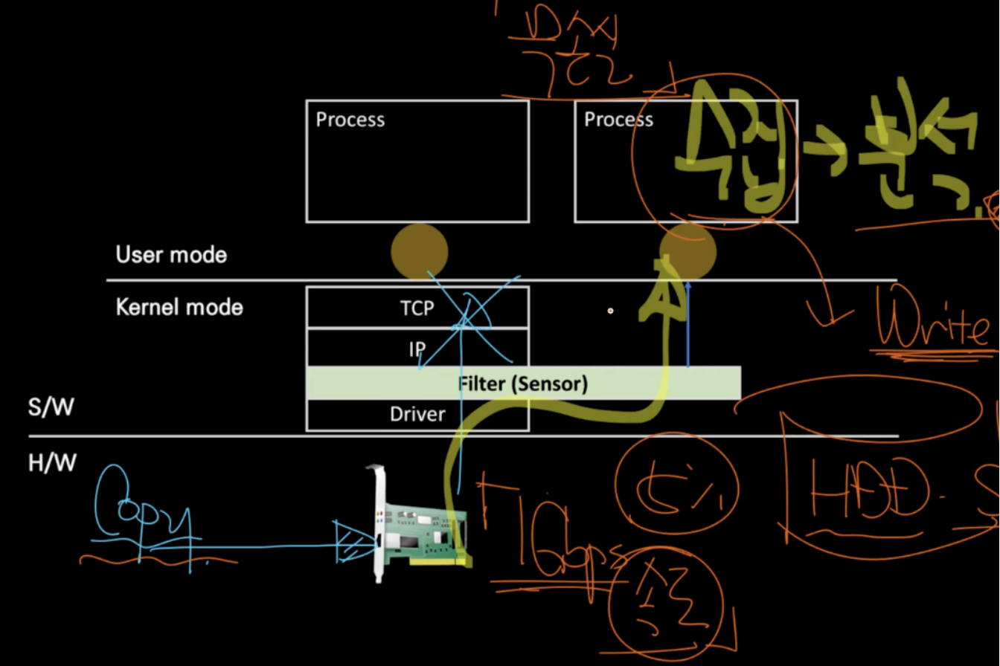
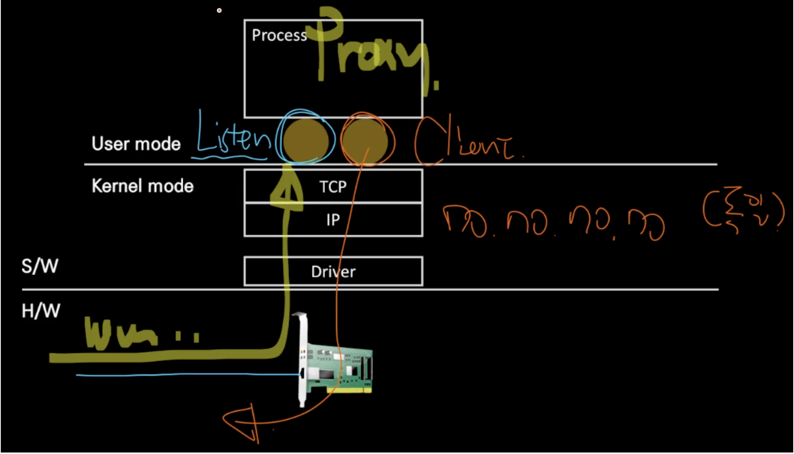
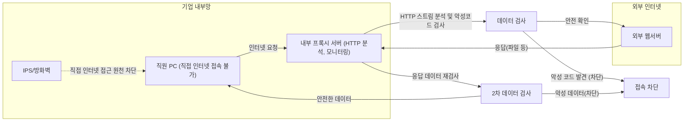

## 네트워크 장치의 세 가지 구성 구조 (Inline, Out-of-Path, Proxy)

네트워크 장치는 크게 인라인(Inline), 아웃오브패스(Out-of-Path), 프록시(Proxy) 세 가지 구조로 나뉜다.

### 1. 인라인(Inline) 구조

인라인 구조는 네트워크 흐름의 경로상에 직접 위치하여 패킷 데이터를 제어하거나 조정한다. 패킷이 장치를 직접 통과해야 한다.

- 데이터 처리 방식: 패킷 단위로 데이터를 처리한다.
- 기능 및 역할:
    - 통과 여부 결정(허용 또는 차단)
    - 경로 선택 및 바이패스 결정 가능
    - 대표적인 장치: 라우터, 방화벽 등

인라인 구조는 특정 트래픽을 필터링하거나 차단이 필요한 경우, 또는 경로 지정을 통해 네트워크 성능 최적화가 필요한 경우에 사용된다.

> 라우터는 인라인 구조의 전형적인 예시다. 네트워크 경로상에 위치하여 패킷을 적절히 전달하거나 차단하는 역할을 수행한다.

### 2. 아웃오브패스(Out-of-Path) 구조

아웃오브패스 구조는 네트워크 경로 밖에서 패킷을 복사하여 분석만 수행하는 구조다. 실시간으로 패킷의 흐름에 간섭하지 않고, 주로 정보를 수집하고 분석하는 목적으로 활용된다.

- 데이터 처리 방식: 패킷 데이터를 읽기만 하며, 제어하거나 차단하지 않는다.
- 기능 및 역할:
    - 보안 위협 탐지(IDS: Intrusion Detection System)
    - 네트워크 장애 진단 및 모니터링
- 연결 방식:
    - 네트워크 내 탭(Tap) 장치를 이용하여 패킷을 복사하여 수집
    - 센서 장치로 사용하여 데이터 분석 및 진단 수행

네트워크 성능에 영향을 최소화하면서 데이터 분석을 통해 네트워크 상황을 지속적으로 모니터링할 수 있다.

> IDS 장치나 네트워크 성능 모니터링 도구들이 아웃오브패스 구조의 대표적 사례다.

### 3. 프록시(Proxy) 구조

프록시 구조는 패킷 수준이 아닌 애플리케이션 스트림 수준에서 데이터를 처리한다. 클라이언트와 서버 사이에서 중계자 역할을 수행하며, 데이터의 필터링 및 제어가 가능하다.

- 데이터 처리 방식: 스트림 데이터를 소켓 수준에서 처리한다.
- 기능 및 역할:
    - 스트림 데이터를 모니터링 및 분석
    - 클라이언트와 서버 사이의 요청과 응답 관리(대리자 역할)
    - 어플리케이션 레벨에서 데이터 제어 및 필터링

HTTP와 같은 애플리케이션 레벨 프로토콜 분석이나 특정 파일 유형(mp3, jpg, doc 등)의 필터링이 필요한 경우에 활용된다.

### 네트워크 장치 구조 정리

| **구조**              | **데이터 처리 단위** | **대표 장치**    | **주요 역할**           |
| ------------------- | ------------- | ------------ | ------------------- |
| 인라인(Inline)         | 패킷            | 라우터, 방화벽     | 패킷 통과 여부 결정 및 필터링   |
| 아웃오브패스(Out-of-Path) | 패킷            | IDS, 모니터링 도구 | 데이터 분석 및 모니터링       |
| 프록시(Proxy)          | 소켓 스트림        | 웹 프록시 서버     | 스트림 데이터 분석 및 대리자 역할 |

---

## 네트워크의 Inline 구조

네트워크에서 인라인(Inline) 구조는 데이터(패킷)가 네트워크 장치를 직접 통과하여 전달되는 형태다. 데이터가 장치를 지나가는 동안 처리, 필터링, 결정 등을 수행할 수 있어 다양한 네트워크 장비에서 사용된다.

### 1. Inline 구조의 기본 개념

인라인 장치는 패킷을 필터링하여 통과시키거나(bypass), 차단하는(drop) 구조다. 데이터를 처리하는 장치가 직접 네트워크 경로상에 위치한다.

### 2. Inline 구조를 사용하는 주요 장치

- **라우터(Router)**: 네트워크 간 데이터를 전달하거나 차단할 때 사용하는 대표적 인라인 장치.
- **인터넷 공유기**: 가정에서 사용하는 공유기도 인라인 디바이스다.
- **방화벽(Firewall)**: 패킷 필터링을 수행하여 보안 위협을 차단하는 인라인 장치.
- **IPS(Intrusion Prevention System, 침입 방지 시스템)**: 침입을 사전에 차단하는 보안 장치로 인라인 방식으로 운영된다.

공통 특징:
- 처리 데이터 단위는 패킷이다.
- 패킷의 흐름을 허용하거나 차단하는 결정(drop, bypass)을 내린다.

### 3. Inline 장치의 작동 방식 (Inbound/Outbound)

- **Inbound(내부로 들어오는 트래픽)**: 외부(인터넷 등)에서 네트워크 내부로 들어오는 데이터 흐름
- **Outbound(외부로 나가는 트래픽)**: 내부 네트워크에서 외부로 나가는 데이터 흐름

처리 과정:
1. 외부 인터페이스에서 들어온 패킷(프레임)을 장치 내부의 네트워크 인터페이스(LAN 카드)가 수신한다.
2. 수신된 데이터는 장치 내에서 분석되어 내부 규칙에 따라 처리된다.
3. 처리된 패킷은 장치 내에서 결정된 경로로 나가거나 차단된다.

장치가 특정 패킷을 분석한 후 문제가 없다고 판단하면 바이패스(bypass)하여 통과시키고, 문제가 있다고 판단하면 즉시 드랍(drop)하여 차단한다.

### 4. Inline 구조의 성능 이슈 (Throughput)

인라인 장치는 네트워크 데이터가 반드시 통과하는 지점이므로, 처리 속도(Throughput)에 따라 전체 네트워크 성능이 결정된다.

성능 저하를 막기 위해 주로 다음과 같은 방식을 사용한다.
- 소프트웨어가 아닌 하드웨어 수준에서의 데이터 처리 (TCP 헤더, IP 헤더 분석 등을 하드웨어 가속기가 담당)
- 패킷 분석 및 필터링을 위한 전용 가속기(accelerator) 사용
- 커널(kernel) 모드에서 데이터 처리를 수행하여 빠른 속도를 유지

중간에 위치한 인라인 장치의 성능이 낮다면, 네트워크 전체 속도가 그 수준으로 제한된다. 예를 들어, 10Gbps 네트워크에 1Gbps 처리 성능을 가진 장치가 설치되면 전체 네트워크 속도가 1Gbps로 제한된다.

---

## 네트워크의 Out-of-Path 구조 (센서 구조와 DPI 그리고 망중립성)

아웃오브패스(Out-of-Path)는 인라인 구조와 달리 직접 데이터 흐름을 차단하거나 변경하지 않고, 수집하고 분석하는 센서 역할을 수행한다.

### 1. Out-of-Path 구조의 기본 개념과 특징

아웃오브패스 구조는 네트워크 외부에서 데이터를 읽고 분석만 수행한다. 실시간 통신 경로에 직접적인 영향을 주지 않고, 데이터를 복사하여 모니터링 및 분석 목적으로 활용된다.

### 2. Out-of-Path 구조의 작동 원리 및 구성요소

#### 1. 포트 미러링(Port Mirroring)
- 네트워크 스위치의 특정 포트를 통해 오가는 데이터를 복사하여 전달하는 기술이다.
- 포트 미러링을 통해 복사된 데이터는 센서 장치에서 분석한다.
- 직접 네트워크 경로를 방해하지 않으며 원본 데이터와 동일한 복사본을 제공한다.
- 장애 진단, 보안 위협 탐지 등의 분석이 가능하다.

#### 2. 탭 스위치(Tap Switch)
- 전문적으로 데이터를 복사하여 여러 센서로 전송하는 장치다.
- 대량의 데이터를 동시에 여러 장치로 복사할 수 있다.
- 보안 모니터링, 장애 진단, 연구 목적의 트래픽 수집에 활용된다.

### 3. DPI(Deep Packet Inspection)와 SPI(Shallow Packet Inspection)

아웃오브패스 구조에서 수행하는 데이터 분석의 두 가지 방법이 있다.

- **SPI (Shallow Packet Inspection)**: 패킷의 헤더 부분만 읽어 분석한다. (예: HTTP 헤더를 분석해 특정 사이트 접근 차단)
- **DPI (Deep Packet Inspection)**: 패킷의 페이로드(내용)까지 심도 있게 읽어 분석한다. 개인의 프라이버시 문제로 법적인 제약이 많다.

| **구분** | **검사 범위** | **목적** | **법적 문제** |
|---|---|---|---|
| SPI | 헤더만 분석 | 사이트 차단 및 기본 탐지 | 비교적 허용 |
| DPI | 페이로드까지 분석 | 심층적인 보안 위협 탐지 | 프라이버시 문제로 제한적 허용 |

### 4. 아웃오브패스 구조와 망중립성(Net Neutrality)

- 망중립성 원칙은 ISP가 데이터를 차별적으로 처리하지 않고 동등하게 제공해야 한다는 원칙이다.
- 아웃오브패스 구조를 이용하여 특정 사이트나 서비스의 접근을 차단할 수 있지만, 법적·윤리적 문제가 발생할 수 있다.
- ISP가 특정 서비스나 사이트를 차별적으로 처리하거나 차단하는 것은 망중립성 원칙 위반이다.

ISP가 특정 사이트 접속을 차단하고 경고 화면을 대신 보여주는 경우가 있다. 이는 SPI를 이용하여 사이트의 URL을 분석하고, 센서 장치가 원본 서버보다 빠르게 응답을 보내 차단하는 방식이다.

### 5. TCP 세션 하이재킹

TCP 세션 하이재킹(Session Hijacking)은 클라이언트와 서버 사이에 이미 수립된 TCP 연결을 도청한 뒤, 가짜 패킷을 만들어 세션에 끼어드는 기술이다.

#### 응답 삽입(Response Injection)의 핵심

- 클라이언트 → 서버로 보낸 요청을 중간에서 가로채 확인
- 서버가 응답하기 전에 위조된 응답 패킷을 먼저 클라이언트에 전송
- 클라이언트는 먼저 받은 패킷을 진짜라고 인식하고 그에 따라 동작
- 이후 도착한 실제 서버 응답은 무시하거나 TCP RST로 세션 종료

### 6. Out of Path 장치와 관계

#### 1. 트래픽 복사본을 통해 실시간으로 세션 추적 가능
- Out of Path 장치는 SPAN 포트 / TAP를 통해 모든 트래픽 복사본을 실시간 수신한다.
- 이를 통해 클라이언트의 요청을 실시간으로 파악하고 세션 정보(IP, Port, Seq)를 확보한다.

#### 2. 독립된 송신용 NIC를 통해 응답 패킷을 삽입 가능
- 일반 Out of Path 장비는 응답을 보낼 수 없지만, 유해사이트 차단 장비는 별도의 NIC를 통해 클라이언트에게 위조 패킷을 직접 송신할 수 있다.
- 이로써 정상적인 세션에 끼어들어 응답을 먼저 보낸다.

#### 3. TCP는 응답을 먼저 받은 쪽을 신뢰
- TCP는 같은 세션의 응답을 먼저 받은 것을 기준으로 처리한다.
- Out of Path 장치가 빠르게 위조 응답을 보내면, 클라이언트는 그것을 진짜 서버 응답으로 인식하고 세션을 종료하거나 리디렉션을 수행한다.

### 7. HTTPS

1. TCP 3-way handshake ← 평문
2. TLS Handshake (ClientHello, ServerHello 등) ← 일부 평문
3. TLS 세션 수립 완료
4. 암호화된 HTTP 요청/응답 주고받기

#### 1. HTTPS에서 감시 가능한 정보

TLS 암호화가 완료되기 이전 단계(ClientHello)에서는 일부 정보가 암호화되지 않고 평문으로 전송된다.

#### 2. 감시 가능한 항목 (평문 상태)

| **항목**                           | **설명**                 | **감시 가능 여부** |
| -------------------------------- | ---------------------- | ------------ |
| **IP 주소**                        | 목적지 서버의 IP             | 가능           |
| **포트 번호**                        | 주로 443 (HTTPS)         | 가능           |
| **SNI (Server Name Indication)** | 접속하려는 도메인명             | 가능           |
| **TLS 버전, Cipher suite**         | 보안 프로토콜 구성 정보          | 가능           |
| **패킷 크기, 전송 빈도**                 | 트래픽 메타데이터              | 가능           |
| **HTTP 헤더 / 바디**                 | URI, Cookie, Content 등 | 암호화되어 감시 불가  |

---

## proxy

프록시(Proxy) 구조는 클라이언트와 서버 사이에서 중계자(대리인) 역할을 한다. 인터넷 사용자의 익명성 보호와 우회 접속 목적으로 널리 사용된다.

### Proxy 구조의 기본 개념과 특징

프록시는 사용자가 특정 서버에 직접 접속하지 않고, 중간에 있는 프록시 서버를 통해 우회하여 접속하도록 하는 구조다.

- 데이터를 직접 전송하지 않고 중간 프록시 서버를 경유한다.
- 프록시는 소켓 스트림 수준에서 데이터를 다루며, 주로 TCP/IP 연결을 사용한다.
- 데이터 전송 과정에서 사용자의 IP 주소와 위치를 숨기는 기능을 제공한다.

주요 사용 목적:
- 지역적 제한 우회 (Geo-blocking)
- IP 주소 익명화
- 인터넷 서비스 차단 회피

### Proxy 구조의 작동 원리 (우회 예시)

한국에 있는 사용자가 미국에 위치한 웹서버에 접속할 때, 직접 접속하지 않고 독일이나 중국의 프록시 서버를 통해 우회하여 접속한다. 웹서버 입장에서는 프록시 서버의 IP만 확인할 수 있으며, 실제 사용자의 IP는 확인할 수 없다.

**접속 흐름 예시**

| **직접 접속**     | **프록시 우회 접속**     |
| ------------- | ----------------- |
| 한국 → 미국       | 한국 → 중국(프록시) → 미국 |
| 사용자의 실제 IP 노출 | 사용자의 실제 IP 숨김     |

#### Proxy 서버의 기술적 구조

프록시 서버의 기술적 구조는 크게 두 개의 소켓을 열어 연결을 중계한다.
- 하나의 소켓은 클라이언트로부터 요청을 듣기 위한 리슨 소켓(Listen Socket)
- 다른 하나는 클라이언트 요청을 받아 실제 목적지 서버로 연결하는 클라이언트 소켓(Client Socket)

처리 과정:
1. 클라이언트가 프록시 서버의 리슨 소켓에 접속하여 목적지 서버를 요청한다.
2. 프록시 서버는 클라이언트 요청을 수락하고 별도의 클라이언트 소켓을 열어 실제 목적지 서버에 연결한다.
3. 목적지 서버에서 응답을 받으면 프록시 서버는 다시 이 응답을 클라이언트에게 전달한다.

#### Proxy 구조 사용 시의 장단점

**장점**
- IP 주소 및 사용자의 위치 보호
- 지역 제한 콘텐츠 접근 가능
- 인터넷 사용의 익명성 증가

**단점**
- 중계 서버로 인해 인터넷 접속 속도 저하 발생 가능
- 프록시 서버의 보안 문제로 개인정보 노출 위험 존재

### 보호와 감시 목적의 활용법

기업의 내부 보안 강화와 직원들의 인터넷 사용을 모니터링하기 위한 목적으로도 프록시가 활용된다.

#### 1. 보호와 감시 목적의 프록시 구조

보호 및 감시 목적의 프록시는 일반적으로 기업 내부에 설치된 서버 형태로 운영된다. 기업 내부망과 인터넷을 분리한 상태에서, 직원이 직접 인터넷에 연결하는 것을 차단하고 내부 프록시 서버를 통해서만 외부와 통신할 수 있도록 구성한다.

직원이 인터넷을 사용하려고 시도하면, 프록시 서버가 요청을 중계하면서 데이터 내용을 검사한다. 직원의 모든 인터넷 접속 기록과 사용 데이터는 프록시 서버에 남으며, 기업의 관리자는 필요 시 이를 점검할 수 있다.

#### 2. 보호 목적: 악성코드 차단과 내부망 보호

프록시 서버는 직원이 인터넷에서 다운로드하는 모든 데이터를 분석한다. 직원의 PC는 프록시 서버를 통해서만 파일을 받을 수 있으며, 프록시 서버는 문서가 악성코드를 포함하고 있는지 여부를 검사한다.

악성코드 검사를 통과한 파일만 직원의 PC로 전달되며, 그렇지 않은 경우 프록시 서버에서 차단된다. 악성 데이터가 기업 내부망에 진입하기 전에 차단하는 첫 번째 방어선 역할을 수행한다.

#### 3. 감시 목적: 직원 인터넷 사용 모니터링

기업 내부망에서는 직원의 PC가 프록시 서버를 경유해서만 인터넷에 연결할 수 있기 때문에, 직원이 어느 웹사이트를 방문했고 어떤 파일을 다운로드했는지 기록된다. 관리자는 직원이 근무 중 규정을 위반한 사이트에 접근했는지 여부를 확인할 수 있다.

기록된 로그는 내부 보안 감사의 자료로 활용된다.

### 네트워크의 리버스 프록시(Reverse Proxy)

리버스 프록시(Reverse Proxy)는 일반 프록시와 반대로, 클라이언트가 아닌 서버 측에서 사용된다. 서버를 보호하기 위한 프록시 구조다.

#### 1. 리버스 프록시란?

일반적인 프록시가 클라이언트를 대신하여 인터넷 서버로 요청을 중계한다면, 리버스 프록시는 외부 클라이언트가 서버로 보내는 요청을 중간에서 대신 받아 서버를 보호하거나 처리한다.

인터넷상에 노출된 웹 서버는 해킹, DDoS 공격, 악성 트래픽 등의 위협에 노출되어 있다. 리버스 프록시 서버가 웹 서버 앞단에 위치하여 클라이언트의 요청을 대신 받아 웹 서버에 전달하고, 웹 서버의 응답을 다시 클라이언트에게 전달한다.

#### 2. 리버스 프록시의 주요 역할과 활용 목적

##### 1. 웹 서버 보호 및 보안 강화

- **IPS(침입 방지 시스템)**: 리버스 프록시 앞단에서 IPS를 통해 패킷 수준의 공격을 사전에 차단한다.
- **웹 애플리케이션 방화벽(WAF)**: HTTP 트래픽을 심층 분석하여 웹 서버를 노리는 공격을 탐지하고 차단한다.
- **SSL/TLS 암호화 해제**: 암호화된 HTTPS 트래픽을 중간에서 복호화하여 악의적인 내용을 검사할 수 있다.

##### 2. 부하 분산 및 성능 향상

리버스 프록시 서버는 웹 서버에 들어오는 많은 요청을 여러 대의 백엔드 서버로 분산시키는 부하 분산(load balancing) 기능을 수행할 수 있다.

### 로컬 프록시와 Fiddler 활용

프록시의 활용법 중에는 내 컴퓨터 한 대에서만 내부적으로 작동하도록 구성하는 방법도 있다. 로컬 프록시 또는 PC 내부에서 활용하는 프록시 구조다.

#### 1. 로컬 프록시란?

로컬 프록시는 개인 PC 내부에서 프록시 서버와 클라이언트가 모두 동일한 컴퓨터에 존재하도록 설정한 프록시 구조다. 웹 브라우저가 인터넷으로 데이터를 주고받을 때 로컬에 설치된 프록시 소프트웨어를 반드시 경유하도록 설정된다.

웹 브라우저의 프록시 설정에 127.0.0.1(루프백 주소)를 입력하여 내부 프록시로 설정한다. 브라우저가 요청하는 모든 트래픽이 로컬에서 동작하는 프록시 소프트웨어를 통과하게 된다.

#### 2. 로컬 프록시를 사용하는 이유 (HTTPS 분석의 어려움)

웹 통신이 HTTPS로 암호화되어 있다면, Wireshark와 같은 패킷 분석 도구를 사용하더라도 요청과 응답 내용을 파악하기 어렵다. 암호화된 데이터를 복호화하려면 복잡한 인증서 설정과 추가 작업이 필요하기 때문이다.

이런 문제를 해결하기 위해 로컬 프록시 도구인 **Fiddler**가 사용된다. Fiddler는 HTTPS 트래픽을 복호화하고, 스트림 단위로 데이터를 분석할 수 있는 도구다.

