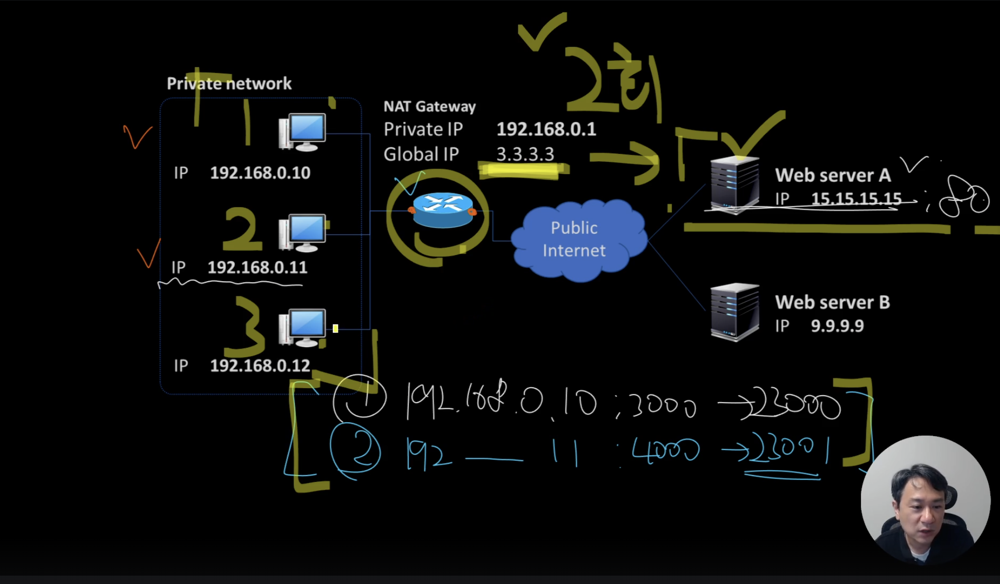

## NAT란?

### IP 주소가 부족하던 시절, NAT는 왜 등장했는가?

IPv4 주소는 한정되어 있고, 늘어나는 컴퓨터와 스마트폰, IoT 기기들을 수용하기엔 부족했다. 이 문제를 해결하기 위해 탄생한 것이 NAT다.

NAT는 외부 인터넷과 내부 네트워크 사이에서 IP 주소를 변환하는 중개자 역할을 한다. 공유기에서 NAT는 핵심 기능으로 작동한다. 외부에는 하나의 공인 IP만 보이게 하면서, 그 안에서 수많은 사설 IP 기기들이 인터넷을 함께 사용할 수 있도록 해준다.

### NAT는 단순한 주소 변환기가 아니다

NAT는 IP 주소뿐 아니라 **포트 번호**도 함께 관리한다.
이를 통해 동일한 공인 IP 주소를 사용하는 여러 장치들의 통신을 동시에 구분하고 처리한다.

같은 가정 내에서 두 대의 노트북이 각각 유튜브와 넷플릭스를 실행하는 경우, 공유기는 이들이 사용하는 포트 번호를 각각 다르게 할당하여, 응답을 받을 때 어느 기기에 어떤 응답을 돌려줘야 하는지를 정확히 구분한다.

### NAT는 보안에도 기여한다

NAT는 원칙적으로 **내부에서 시작된 통신만을 허용**한다. 외부에서 내부로 직접 접근하는 시도는 기본적으로 차단되기 때문에, 의도하지 않은 외부 공격이나 스캔 시도로부터 내부 기기들을 보호한다.

이런 이유로 웜 바이러스나 포트 스캐닝과 같은 공격이 과거보다 줄어들었고, P2P 통신도 별도의 설정 없이는 쉽게 이뤄지지 않게 되었다. NAT는 결과적으로 **방화벽과 유사한 효과**를 제공한다.

### NAT는 모두 같은 방식으로 작동하지 않는다

NAT도 그 구조에 따라 다르게 작동한다. 대표적인 두 가지 구조는 **Symmetric NAT**와 **Cone NAT**다.

Symmetric NAT는 요청을 보낼 때마다 외부로 나가는 포트 번호를 계속 바꾸는 방식이다. 같은 내부 장치가 동일한 외부 서버에 요청하더라도, 매번 다른 외부 포트로 나가게 된다. 보안성이 높지만, 외부에서 이 장치로 직접 접근하기가 어렵다. 일부 P2P 애플리케이션은 작동이 제한된다.

반대로 Cone NAT는 내부 주소와 포트가 한 번 외부로 매핑되면, 그 매핑이 일정 시간 유지된다. 외부 장치가 NAT의 외부 주소와 포트를 알고 있다면 해당 장치에 다시 연결할 수 있다. P2P 환경에 적합하지만, 보안성은 상대적으로 낮다.

---

## Symmetric NAT 방식

인터넷을 사용할 때는 대부분 공유기를 통해 연결된다. 가장 엄격한 방식이 **Symmetric NAT**다.

### 1. Symmetric NAT의 작동 배경과 기본 원리

**Symmetric NAT**는 내부의 특정 호스트가 외부에 연결을 시도할 때마다, IP 주소뿐 아니라 포트 번호까지 변경한다.

**"내부 호스트와 외부 호스트가 통신할 때마다 매번 다른 외부 포트 번호를 부여"** 한다. 내부 장치가 같은 내부 포트를 사용하더라도, 연결하는 외부 서버의 IP 주소나 포트가 다르면 매번 전혀 다른 외부 포트를 할당한다. 외부에서 내부로 연결하려 할 때, 연결 요청이 성공하기 위해서는 정확히 일치하는 매핑 정보(IP, 포트 번호)를 미리 갖추고 있어야 한다.

### 2. Symmetric NAT의 실제 패킷 흐름과 변환 과정

내부 네트워크에 사설 IP 주소 192.168.0.10인 컴퓨터가 있다. 브라우저에서 웹사이트(abc.com)에 접속하려 한다. abc.com 웹서버의 실제 IP 주소는 15.15.15.15이다. 이 PC는 운영체제로부터 랜덤한 포트를 할당받아 TCP 연결을 시작한다(예: 내부 포트 3000).

이 요청 패킷이 NAT 장비(공유기)를 지나 외부로 나갈 때, NAT는 패킷을 그대로 보내지 않고 변조를 수행한다. 원본 패킷의 출발지 IP(192.168.0.10)와 포트(3000)는 내부망에서만 유효한 정보이므로 인터넷망에서 사용할 수 없다. NAT 장비는 다음과 같이 변환한다.

- **출발지 IP:** 192.168.0.10 → 3.3.3.3 (공인 IP)
- **출발지 포트:** 3000 → 외부에 사용 가능한 랜덤 포트 번호(23000)

|**내부망 (원본)**|**NAT 통과 후 (변환됨)**|
|---|---|
|192.168.0.10 : 3000 →|3.3.3.3 : 23000|

### 3. NAT 테이블의 생성과 관리 방식

Symmetric NAT의 핵심은 'NAT 테이블'이다. NAT 테이블은 NAT 장비 내부에서 유지하는 자료구조로, **내부 호스트의 원본 IP/포트 정보와 외부로 변환된 IP/포트 정보의 매핑을 저장한 데이터베이스**다.

이 NAT 테이블은 내부에서 외부로 나가는 트래픽(outbound)이 발생했을 때만 생성된다. 외부에서 내부로 들어오는 최초의 연결 시도(inbound)는 NAT 테이블에 존재하지 않으므로 항상 차단된다. 오직 내부에서 먼저 요청이 있어야만 매핑 정보가 생성되며, 이후 이 정보를 기준으로 외부에서 들어오는 응답 패킷이 내부로 전달된다.

| **내부 IP**    | **내부 Port** | **외부 목적지 IP** | **외부 목적지 Port** | **NAT 외부 IP** | **NAT 외부 Port** |
| ------------ | ----------- | ------------- | --------------- | ------------- | --------------- |
| 192.168.0.10 | 3000        | 15.15.15.15   | 80              | 3.3.3.3       | 23000           |

### 4. Symmetric NAT의 보안성과 한계

Symmetric NAT는 외부에서의 무작위 연결을 원천적으로 차단하기 때문에 보안 측면에서 강력하다. 예측 불가능한 외부 포트 매핑과 내부 요청이 없으면 NAT 테이블 자체가 만들어지지 않는 구조 덕분에, 외부에서의 무작위 침입이나 공격이 어렵다.

하지만 이 특성 때문에 **양방향 연결이 필요한 실시간 서비스(P2P 게임, 화상 회의, WebRTC 등)** 는 NAT 통과가 어렵다. 이런 환경에서는 중계 서버(STUN/TURN 서버)를 활용하거나 NAT traversal 알고리즘을 사용해야 한다.

---

## Full Cone NAT 방식의 이해와 내부 네트워크 접속 문제

### 1. Full Cone 방식의 특징

**Full Cone NAT 방식**은 개방적이고 유연하다. 내부의 특정 장치가 한번 외부 인터넷과 연결되면, 이때 생성된 NAT 테이블 항목을 기반으로 이후 외부의 어떠한 호스트로부터라도 해당 내부 장치로 연결이 허용된다. 내부 장치가 외부로 나갈 때 단 하나의 외부 포트를 사용하여 고정된 NAT 테이블 매핑을 생성한다. 이 매핑은 외부 상대방의 IP 주소나 포트 번호에 관계없이 동일하게 유지된다.

### 2. Full Cone NAT 방식의 작동 원리

내부 네트워크의 장치가 사설 IP 주소 192.168.0.10을 가지고 있다고 가정한다. 이 장치가 외부에 위치한 웹서버 A(15.15.15.15)와 통신하기 위해 내부에서 임의의 포트(예: 3000번)를 열어 접속을 시도한다.

NAT 장비(공유기)는 이 연결 요청이 외부로 나갈 때 다음과 같이 변환하여 NAT 테이블에 저장한다.

|**내부 IP**|**내부 Port**|**외부 IP(공인 IP)**|**외부 Port(공인 Port)**|
|---|---|---|---|
|192.168.0.10|3000|3.3.3.3|8080|

이 테이블이 생성된 이후부터는 외부에서 이 공인 주소(3.3.3.3:8080)로 오는 어떠한 접속도 내부의 원본 주소(192.168.0.10:3000)로 전달된다. 외부 IP 주소나 포트 번호가 다르더라도 NAT 테이블의 외부 포트(8080)만 동일하면 모두 내부로 진입 가능하다.

최초에 웹서버 A(15.15.15.15)와 접속한 이후, 또 다른 웹서버 B(9.9.9.9)가 같은 외부 포트(8080)를 통해 연결을 요청하면, NAT는 별도의 추가적인 인증이나 제한 없이 그대로 내부의 장치(192.168.0.10)로 전달한다.

### 3. Full Cone NAT 방식의 장점과 내부 네트워크 접속 문제 해결

Full Cone NAT 방식은 게임과 같은 P2P 연결이 많은 환경에 적합하다. 중계 서버를 거치지 않고 직접 연결이 가능하기 때문에 속도와 응답성이 향상된다.

Full Cone NAT를 사용할 때는 '홀 펀칭(Hole Punching)' 방식이 가능하다. 내부에서 외부로 미리 특정 포트를 한번 열어두면, 외부에서 임의의 장치가 이 포트를 통해 직접 접속하는 기술이다. 랑데부 서버라는 중계 서버가 한 번만 연결 정보를 전달하면, 이후 클라이언트끼리 직접 연결이 가능하다. P2P 게임, VoIP(인터넷 전화), 화상회의 같은 서비스에서 사용된다.

### 4. 보안적 문제와 고려 사항

Full Cone NAT에서는 한 번이라도 NAT 테이블에 포트가 기록되면, 이후 해당 포트를 통해 임의의 외부 호스트에서 연결이 들어올 때 별도의 보안 필터링 없이 내부로 전달된다. 의도하지 않은 외부 접근이 발생할 가능성이 있다.

NAT 테이블의 포트 충돌로 인해 원하지 않은 내부 장치로 트래픽이 전달되는 상황도 발생할 수 있다. 보안이 엄격한 기업이나 기관에서는 Symmetric NAT와 같은 폐쇄적인 방식을 선택하는 경우가 많다.

---

## Restricted Cone NAT 방식의 작동 원리

### 1. Restricted Cone NAT

Full Cone NAT 방식은 내부 클라이언트가 한 번 외부로 데이터를 전송하면, 외부에서 그에 대응하는 포트로 들어오는 패킷은 **누가 보냈든 간에** 모두 허용한다.

공격자든 제3자든 그 포트만 알고 있으면 해당 내부 장치에 접근이 가능하다는 뜻이다. 보안 측면에서 허점이 있다.

Restricted Cone NAT 방식은 Full Cone의 문제를 인지하고, **이전에 통신한 상대에게만 응답을 허용**하는 구조를 갖춘다.

### 2. Restricted Cone NAT의 동작 방식

포트 개방의 조건을 제한한다. 제한은 두 가지 방향으로 이루어진다.

1. **IP-Restricted Cone** (기본형)
    → 외부에서 접속을 허용하려면, 이전에 통신한 **외부 IP 주소와 같아야** 함
2. **Port-Restricted Cone**
    → 외부에서 접속을 허용하려면, 이전에 통신한 **IP 주소뿐 아니라 포트 번호까지 동일해야** 함

일반적으로 "Restricted Cone NAT"라고 하면 첫 번째인 IP-Restricted Cone을 의미한다.

---

## Port Restricted Cone 방식

Port Restricted Cone NAT: 외부 **IP와 포트 모두 일치**해야 접근 가능하다.

### 1. Port Restricted Cone NAT의 작동 원리

Port Restricted Cone NAT에서는 NAT 테이블에 기록된 **외부 대상의 IP와 포트가 완전히 일치**해야만, 해당 외부 호스트의 응답이 내부로 전달된다.

| **내부 IP**    | **내부 Port** | **외부 IP**   | **외부 Port** | **NAT 외부 Port** |
| ------------ | ----------- | ----------- | ----------- | --------------- |
| 192.168.0.10 | 3000        | 15.15.15.15 | 5555        | 8080            |

### 2. Symmetric NAT와의 차이

- **내부 IP+내부 Port**를 기준으로 한 번 매핑을 생성하면,
    그 매핑은 **"어떤 목적지(IP:Port)로 나가든" 동일한 공인 포트를 계속 재사용**한다.

1. 192.168.0.10:3000 → 10.10.10.10:555
2. 192.168.0.10:3000 → 10.10.10.10:556
3. 192.168.0.10:3000 → 8.8.8.8:80

모두 공인 포트 203.0.113.5:40000 하나를 쓰게 된다.

---

## 포트 포워딩

가정이나 소규모 사무실에 설치된 공유기는 대부분 NAT 기능을 사용한다.
NAT가 적용되면 내부 네트워크는 사설 IP 대역(예: 192.168.x.x)을 쓰고, 외부와 통신할 때는 공유기가 가진 단 하나의 공인 IP를 경유한다.
공인 IP를 절약하고 보안 효과도 얻지만, **외부에서 내부 서비스로 직접 접근**해야 할 때는 문제가 생긴다.

- 내부 PC에 개발용 웹 서버(예: 192.168.0.12:80)를 띄워 두고 외부에서 테스트해야 하는 상황
- P2P 프로그램이나 온라인 게임이 내부 포트를 열어 두고 외부 노드와 직접 연결해야 하는 상황

**외부→내부 방향** 패킷이 필요할 때 NAT는 기본적으로 모두 차단한다.
차단을 우회하기 위해 **NAT 매핑 테이블**에 수동으로 엔트리를 만들어 주는 기법이 포트 포워딩이다.

### 포트 포워딩의 동작 원리

1. **외부 포트 지정**
    공유기(공인 IP: 3.3.3.3)의 80번 포트로 들어오는 모든 TCP 패킷을

2. **내부 호스트·포트로 매핑**
    내부 PC 192.168.0.12:80 으로 그대로 전달하도록 NAT 테이블에 규칙(rule)을 만든다.

3. **패킷 흐름**

    1. 외부 클라이언트가 `http://3.3.3.3` 요청
    2. 공유기는 규칙을 확인해 헤더를 로컬 주소로 변환
    3. 내부 웹 서버가 응답 → 공유기에서 다시 공인 IP로 변환 → 외부 클라이언트로 전송

**공유기 자신이 웹 서버 역할을 하는 것처럼** 보이지만, 실제 데이터 처리는 내부 호스트가 담당한다.

---

## UPnP

NAT 환경에서 포트 포워딩을 직접 설정하지 않았는데도 토렌트나 P2P 프로그램이 작동하는 이유는, 대부분의 가정용 공유기가 **UPnP(Universal Plug and Play)** 기능을 기본 실행 상태로 두기 때문이다.

원래 NAT 뒤에 있는 내부 호스트가 외부와 직접 P2P 세션을 맺으려면 공유기 설정 화면에서 일일이 포트를 개방해야 한다. 그러나 토렌트 클라이언트를 실행하면, 그런 과정 없이 외부 피어와 연결된다. 그 비밀이 UPnP이고, 그 안에서 실제로 포트를 열어 주는 절차를 담당하는 하위 프로토콜이 **SSDP(Simple Service Discovery Protocol)** 다.

### 네트워크용 Plug & Play

1990년대 후반, 마우스나 프린터처럼 PC 주변장치를 꽂자마자 쓰게 해 준 **Plug & Play(PnP)** 개념이 등장했다. USB 디바이스를 꽂으면 윈도우가 자동으로 드라이버를 찾아 설치해 주는 경험이 그것이다.
UPnP는 이 개념을 **가정용 IP 네트워크**까지 확장했다. 토렌트 프로그램 같은 애플리케이션이 네트워크에 "이 포트가 필요하다"고 방송하면(SSDP 브로드캐스트), 공유기가 응답하면서 필요한 포트를 자동 개방하고 이후의 트래픽까지 매핑(포트 포워딩)을 유지한다.

### 자동 개방이 일어나는 과정

1. **애플리케이션 구동**
    토렌트 클라이언트가 시작되면 내부 IP:포트 정보를 담아 SSDP 알림을 멀티캐스트로 전송한다.

2. **공유기의 응답**
    UPnP 기능이 활성화된 공유기가 "포트 개방 가능" 메시지를 되돌려 준다.

3. **포트 매핑 생성**
    클라이언트는 원하는 프로토콜·포트(예: TCP 51413)를 요청하고, 공유기는 NAT 테이블에 공인 포트를 예약한다.

4. **세션 성립**
    외부 피어가 공인 IP:포트로 접속하면, 공유기가 내부 토렌트 프로세스로 트래픽을 투과시키고 응답도 역변환한다.

### P2P 연결 과정

P2P 연결에서 핵심은, **상대방이 나에게 연결을 시도할 수 있는 "주소(IP + Port)"를 아는 것**이다.

1. 애플리케이션은 UPnP로 라우터에 포트포워딩을 요청한다.
2. 그러면 컴퓨터는 외부에서 `공인IP:열린포트`로 접근 가능해진다.
3. 문제는 **애플리케이션이 이 "공인 IP + 포트"를 모른다는 것**이다.

이를 해결하기 위해 **STUN 프로토콜**이 사용된다.

UPnP로 포트를 열었더라도, **애플리케이션은 그 외부 포트가 뭔지, 공인 IP가 뭔지를 모른다.**

즉, 상대방에게 "어디로 연결하라"고 알려줄 수 없다.
그래서 애플리케이션은 **STUN 서버에 UDP 패킷을 날려서**,

> "당신은 지금 `123.123.123.123:60000`으로 보입니다"
> 라는 응답을 받고, 이 정보를 상대방(Peer)에게 전달한다.

P2P 통신을 하려면 서로의 IP와 Port 정보를 교환해야 한다. 그래서 중간의 **시그널링 서버**가 필요하다.

시그널링 서버의 역할은 다음과 같다.

1. Peer A, B 모두 연결 의사를 가지고 시그널링 서버에 접속
2. 서로의 IP/Port 정보를 교환
3. 양쪽이 **정확한 상대 주소를 알았으니**, UDP 패킷을 직접 주고받을 수 있게 됨

