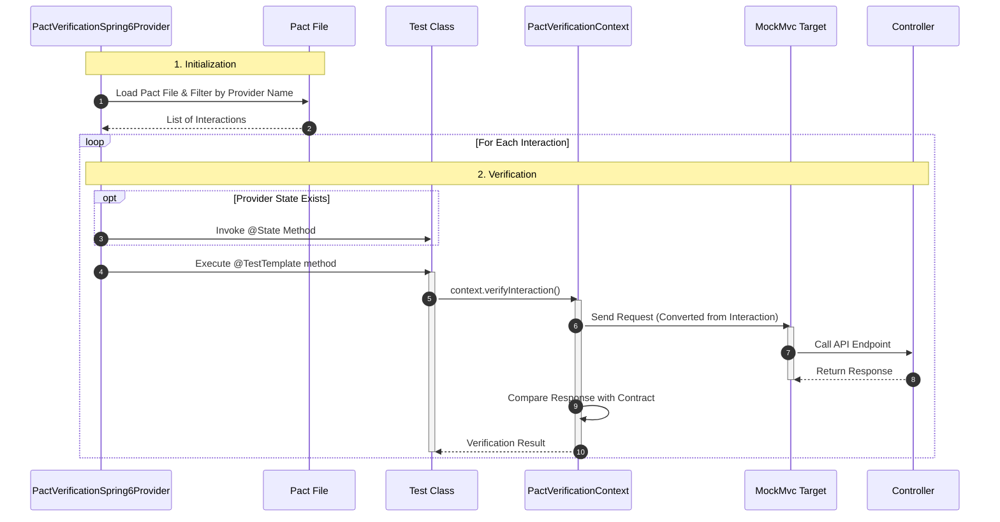

Pact에서 Provider 테스트는 Consumer가 만든 계약을 검증하는 단계다.  
계약은 이미 Consumer 테스트 단계에서 만들어져 있고, Provider는 그 계약을 지금도 만족하는지를 확인한다.

이 단계에서 새로운 계약이 생성되지는 않는다.  
검증의 결과는 성공 또는 실패뿐이다.

## Pact file

Provider 테스트의 시작점은 pact file이다.

- Consumer 테스트가 성공적으로 실행되었고
- 그 결과로 pact file이 생성되어 있으며
- 이 파일이 로컬 디렉터리나 Pact Broker에 존재해야 한다

Provider 테스트는 이 pact file을 입력값으로 사용한다.

```kotlin
@Provider("kube-management")
@PactFolder("../build/pacts")
```

여기서 Provider 이름은 pact file 안의 `provider.name`과 정확히 일치해야 한다. 일치하지 않으면 Pact는 이 테스트가 어떤 계약을 검증해야 하는지 알 수 없다.

## Provider 테스트는 @TestTemplate 기반이다

Provider 테스트에는 일반적인 `@Test`가 없다.

```kotlin
@TestTemplate
fun verifyPact(context: PactVerificationContext) {
  context.verifyInteraction()
}
```

이 메서드는 한 번만 실행되지 않는다.

- pact file 안에 interaction이 여러 개 있으면
- 이 메서드는 interaction 수만큼 반복 실행된다

`@TestTemplate`은 테스트를 여러 번 실행하기 위한 틀이다.
실제 몇 번 실행될지는 확장이 결정한다.

여기서는 Pact 확장이 interaction 단위로 실행 컨텍스트를 제공한다.

## PactVerificationSpring6Provider의 역할

`PactVerificationSpring6Provider`는 Provider 테스트의 실행 엔진이다.

이 확장이 하는 일은 정리하면 다음과 같다.

- pact file을 로딩한다
- Provider 이름이 일치하는 pact만 선별한다
- pact 안의 interaction 목록을 만든다
- interaction 하나당 하나의 실행 컨텍스트를 만든다
- `@TestTemplate`을 interaction 수만큼 실행한다
- interaction에 provider state가 있으면 해당 `@State` 메서드를 실행한다
- `PactVerificationContext`를 생성해 테스트 메서드에 전달한다

이 확장이 없으면 `@TestTemplate`은 아무 의미가 없다.
반복 실행의 기준과 실행 맥락을 제공하는 주체가 이 확장이다.

## SpringExtension의 역할

`SpringExtension`은 JUnit 5 테스트를 Spring TestContext와 연결한다.

이 확장이 없으면 다음이 불가능하다.

- `@WebMvcTest` 사용
- `@MockBean` 사용
- `WebApplicationContext` 주입
- Spring이 관리하는 MVC 인프라 사용

Provider 테스트에서 SpringExtension은 Pact와 직접적인 관련은 없다.
Spring MVC 환경을 만들고 유지하는 역할만 한다.

## 왜 @WebMvcTest를 사용하는지

Provider 테스트에서 전체 애플리케이션 컨텍스트를 띄우는 선택지는 항상 무겁다.

`@SpringBootTest`를 사용하면 다음 문제가 생긴다.

- DB 설정이 필요해진다
- Redis나 외부 인프라 설정이 엮인다
- 테스트 실패 원인이 계약이 아닌 환경 문제가 된다

그래서 웹 레이어만 검증하는 방향으로 접근했다.

```kotlin
@WebMvcTest(controllers = [NamespaceV1Controller::class])
```

이 설정으로 로딩되는 것은 다음뿐이다.

- Controller
- MVC 인프라
- ArgumentResolver
- MessageConverter
- MockMvc

Service, Repository, DB, Redis는 로딩되지 않는다.
Provider 테스트의 목적에는 이 정도가 충분했다.

## @State는 무엇이고 왜 등장하는가

Consumer는 interaction을 정의할 때 전제 조건을 함께 적을 수 있다.

```kotlin
given(“project has unassigned namespaces”)
```

이 문장은 요청 자체의 일부가 아니다.
이 요청이 의미를 가지는 조건을 설명한다.

Provider 테스트에서는 이 조건을 실제 상태로 만들어야 한다.

```kotlin
@State(“project has unassigned namespaces”)
fun projectHasUnassignedNamespaces() {
  // 상태 준비
}
```

중요한 점은 이 메서드가 호출되는 시점이다.

- interaction 하나를 검증하기 직전에
- Pact 확장이 자동으로 호출한다

`@TestTemplate` 실행 전에 Pact 확장이 강제로 먼저 호출하는 구조다. 개발자가 호출 순서를 바꾸거나 건너뛸 수 없다.

```
1. @State(“...”)       ← Pact 확장이 먼저 호출
2. @BeforeEach         ← JUnit이 호출
3. @TestTemplate       ← verifyInteraction() 실행
```

Provider 테스트는 이 메서드를 통해
“지금 이 요청이 실행 가능하다”는 환경을 만든다.

## @State 안에서 실제로 하는 일

`@State` 메서드 안에서 하는 일은 테스트 전략에 따라 다르다.

`@WebMvcTest`를 사용하는 경우, Controller가 의존하는 UseCase가 `@MockBean`이므로 **UseCase의 리턴값을 세팅**하는 코드를 작성한다.

```kotlin
@MockBean lateinit var getNamespaceUseCase: GetNamespaceUseCase

@State(“project has unassigned namespaces”)
fun projectHasUnassignedNamespaces() {
    whenever(getNamespaceUseCase.execute(“project-1”))
        .thenReturn(listOf(NamespaceResponse(“ns-1”), NamespaceResponse(“ns-2”)))
}
```

여기서 세팅하는 건 **Controller의 응답이 아니라 UseCase의 리턴값**이다. Controller는 이 리턴값을 받아서 평소 코드대로 직렬화, `@ResponseStatus`, `@ExceptionHandler` 같은 웹 레이어 로직을 그대로 실행한다. 만약 Controller 응답을 직접 만들어 반환하는 구조였다면 Controller 로직을 아예 타지 않으니 계약 검증 의미가 없어진다.

`@SpringBootTest`를 사용하는 경우라면 Mock 대신 진짜 DB에 데이터를 넣는 코드가 들어간다.

```kotlin
@State(“project has unassigned namespaces”)
fun projectHasUnassignedNamespaces() {
    namespaceRepository.save(Namespace(“ns-1”, “project-1”))
    namespaceRepository.save(Namespace(“ns-2”, “project-1”))
}
```

`@State`는 “이 시나리오의 사전 조건을 준비하는 자리”이고, 그 안에 뭘 넣을지는 테스트 전략에 따라 달라진다.

## PactVerificationContext란 무엇인가

`PactVerificationContext`는 지금 검증 중인 interaction 하나를 대표하는 객체다.

이 객체 안에는 다음 정보가 들어 있다.

- 현재 interaction의 요청 정보
- 기대되는 응답 정보
- 검증 로직
- 검증 대상(Target)

Provider 테스트에서 이 객체를 직접 다루는 이유는 단순하다.

- 검증 대상(Target)을 지정해야 하고
- 검증을 실행해야 하기 때문이다

```kotlin
context.target = Spring6MockMvcTestTarget(mockMvc)
context.verifyInteraction()
```

이 두 줄이 Provider 테스트의 핵심이다.

## WebApplicationContext는 무엇인가

`WebApplicationContext`는 Spring MVC 테스트용 컨텍스트다.

`@WebMvcTest`로 구성된 MVC 환경 전체를 담고 있다.

- Controller
- DispatcherServlet
- ArgumentResolver
- MessageConverter

MockMvc를 만들 때 이 컨텍스트가 필요하다.

``` kotlin
MockMvcBuilders.webAppContextSetup(webApplicationContext)
```

이 컨텍스트는 Pact와 직접적인 관련은 없다.
MockMvc를 통해 컨트롤러를 실행하기 위한 기반일 뿐이다.

## 두 컨텍스트가 만나는 지점

`@BeforeEach`는 두 컨텍스트를 연결하는 위치다.

- Spring이 만든 MVC 환경으로 MockMvc를 만들고
- Pact가 만든 검증 컨텍스트에 그 MockMvc를 Target으로 등록한다

``` kotlin
context.target = Spring6MockMvcTestTarget(mockMvc)
```

이 한 줄로 Pact는 HTTP 서버 대신
Spring MVC 내부 호출을 사용하게 된다.

## 요청 정보는 어디서 오는가

Pact가 `GET /namespaces?projectId=project-1` 같은 요청을 보낼 수 있는 이유는, Consumer 테스트가 생성한 **pact file에 이미 다 적혀 있기 때문**이다.

```json
{
  "interactions": [
    {
      "providerState": "project has unassigned namespaces",
      "description": "get unassigned namespaces",
      "request": {
        "method": "GET",
        "path": "/namespaces",
        "query": { "projectId": "project-1" }
      },
      "response": {
        "status": 200,
        "body": [{ "name": "ns-1" }, { "name": "ns-2" }]
      }
    }
  ]
}
```

요청 정보, 기대 응답, State 문자열 전부 pact file 안에 있다. `@State`는 사전 조건을 준비하는 역할일 뿐, 요청 정보를 알려주는 게 아니다.

## MockMvc는 어떻게 Controller를 호출하는가

`@WebMvcTest`가 띄운 Spring MVC 인프라에는 **DispatcherServlet**이 포함되어 있다. 실제 서버에서 요청을 라우팅하는 것과 동일한 컴포넌트다.

```
Pact가 MockMvc에 GET /namespaces 넣음
  → MockMvc가 DispatcherServlet에 전달
  → DispatcherServlet이 @GetMapping("/namespaces") 매칭
  → NamespaceController 메서드 호출
  → Controller가 UseCase.execute() 호출
  → MockBean이 @State에서 세팅한 값 반환
  → Controller가 응답 리턴
```

MockMvc는 진짜 HTTP 서버를 띄우지 않지만, Spring MVC의 라우팅 로직은 그대로 동작한다. 실제 운영에서 톰캣이 하는 일을 MockMvc가 톰캣 없이 대신하는 구조다.

Pact는 UseCase를 직접 부르지 않는다. MockMvc → DispatcherServlet → Controller → Controller가 UseCase 호출. Pact는 맨 앞에서 MockMvc에 요청을 넣는 것까지만 한다.

## interaction 하나가 검증되는 전체 흐름

interaction 하나가 검증될 때의 흐름은 다음과 같다.

1. Pact가 pact file에서 interaction 하나를 선택한다
2. 해당 interaction에 provider state가 있으면 `@State`를 실행한다 (Mock 세팅)
3. `@BeforeEach`가 실행되어 MockMvc target이 설정된다
4. `verifyInteraction()`이 target(MockMvc)에 pact file의 요청을 보낸다
5. MockMvc → DispatcherServlet → Controller → UseCase(MockBean) → 응답 반환
6. 돌아온 응답을 계약과 비교한다

이 과정을 interaction 수만큼 반복한다.

## 전체 흐름 요약




## 참고

[Pact JUnit 5 Spring Provider Documentation](https://docs.pact.io/implementation_guides/jvm/provider/junit5spring)

[Pact Spring 6 Provider Documentation](https://docs.pact.io/implementation_guides/jvm/provider/spring6)
