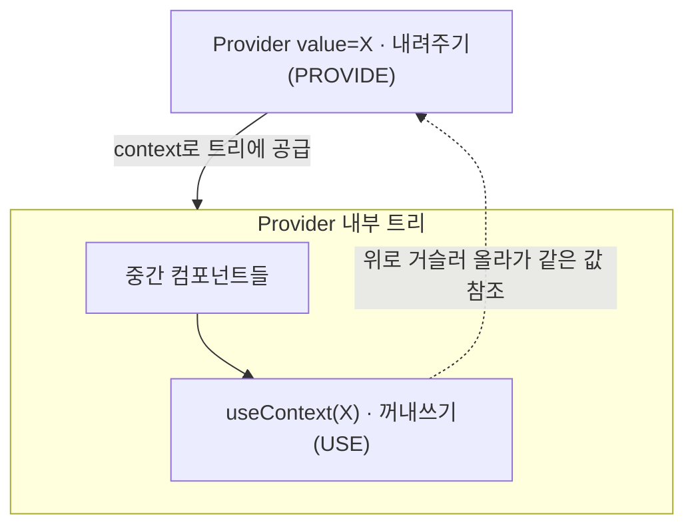

백엔드만 하다가 회사 모바일 앱(React Native) 코드를 처음 열었을 때 제일 먼저 막힌 곳이 앱 최상단 파일이었다. `<QueryClientProvider>`, `<SafeAreaProvider>` 같은 태그가 앱 전체를 감싸고 있었는데, "HTML 태그처럼 생긴 게 감싸고만 있는데 대체 뭘 하는 거지?"가 이해되지 않았다.

따져보니 내가 두 가지를 착각하고 있었다. 첫째, JSX 태그는 HTML이 아니라 **함수 호출**이라는 것. 둘째, Provider는 값을 **내려주기만** 하고 실제로 쓰는 곳은 따로 있다는 것이었다.

## JSX 태그는 사실 함수 호출이었다

`<SafeAreaProvider><App /></SafeAreaProvider>` 이 코드는 화면에 그려지는 마크업이 아니다. 컴파일되면 결국 이렇게 된다.

```js
createElement(SafeAreaProvider, null, createElement(App, null))
// → 실행 시: SafeAreaProvider({ children: App(...) })
```

즉 `<SafeAreaProvider>`는 `SafeAreaProvider(props)`라는 **함수를 부르는 문법**이고, 그 함수 본문 안에서 평범한 자바스크립트 로직이 돈다. 컴포넌트라는 건 결국 "props를 받아서 UI 설명(트리)을 return하는 함수"였다. 그리고 태그 사이에 넣은 내용은 전부 `props.children`으로 들어간다.

여기까지 받아들이니 "감싼다"는 게 시각적 포장이 아니라 **내용을 `children`이라는 인자로 넘긴다**는 뜻이라는 게 보였다.

## prop drilling이라는 불편함

React는 부모가 자식에게 데이터를 `props`로 내려준다. 문제는 깊은 곳의 컴포넌트가 어떤 값을 써야 할 때다. 10단계 아래 컴포넌트에 값을 주려면, 그 사이의 컴포넌트들이 자기는 쓰지도 않는 값을 계속 손으로 전달해야 한다. 이걸 prop drilling이라고 불렀다.

Context와 Provider는 이걸 우회하는 장치였다. 트리 꼭대기에서 값을 한 번 "공급"해두면, 그 아래 어느 깊이의 컴포넌트든 **중간 단계를 건너뛰고 직접** 꺼내 쓸 수 있다.

```tsx
const ThemeContext = createContext('light')

// Provider — 하위 트리에 값을 공급
<ThemeContext.Provider value="dark">
  <App />            {/* 이 안의 누구든 'dark'를 볼 수 있다 */}
</ThemeContext.Provider>

// Consumer — 트리 어디서든 값을 꺼낸다 (props 안 거치고)
function DeepChild() {
  const theme = useContext(ThemeContext)  // 'dark'
}
```

`useContext`는 자기 위쪽으로 트리를 거슬러 올라가 가장 가까운 Provider를 찾아 그 값을 쓴다. Provider가 없으면 못 찾아서 에러가 난다.

## 내려주는 곳과 쓰는 곳은 다르다

내가 제일 헷갈렸던 지점이 여기였다. Provider는 값을 **내려주기만** 한다. 실제로 그 값을 쓰는 건 트리 안쪽의 누군가다.



그래서 Provider 컴포넌트 코드만 읽으면 "이게 뭘 하나?" 싶고, 정작 사용처는 한참 아래 다른 파일에 있다. 이 분리가 처음엔 흐름을 안 보이게 했지만, 익숙해지니 "공급은 한 곳, 소비는 여러 곳"이라는 구조가 깔끔하게 느껴졌다.

## 백엔드로 번역하면

Spring을 떠올리니 한 번에 정리됐다.

| React | Spring |
|---|---|
| `createContext` | 주입 슬롯/토큰 정의 |
| `<X.Provider value={v}>` | 스코프에 빈 바인딩(`@Bean` 등록) |
| `useContext(X)` | `@Autowired`로 빈 꺼내기 |
| Provider의 트리 위치 | 빈 스코프(application/request 등) |

즉 **Context는 하위 트리를 스코프로 삼는 DI 컨테이너**, **Provider는 그 스코프에 값을 등록하는 지점**, **useContext는 등록된 값을 꺼내는 주입**이었다. 컨테이너에 빈을 등록하는 쪽과 `@Autowired`로 꺼내 쓰는 쪽이 다른 클래스인 것처럼, 여기서도 내려주는 곳과 쓰는 곳이 다른 것뿐이었다.

결국 Provider는 "공급은 한 곳, 소비는 여러 곳"이라는 구조였다. 이걸 받아들이고 나니, 앱 최상단에서 어떤 객체를 한 번 내려두고 깊은 곳의 컴포넌트들이 그걸 꺼내 쓰는 React 특유의 패턴이 비로소 읽히기 시작했다.
