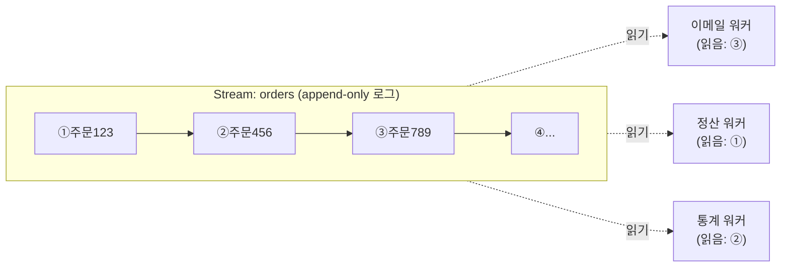

## 시작은 흔한 문제 하나

주문이 하나 들어왔다고 하자. 할 일이 여러 개다.

- 이메일 워커: 주문 확인 메일을 보낸다
- 정산 워커: 매출에 반영한다
- 통계 워커: 대시보드 지표를 쌓는다

셋은 서로 속도가 다르고, 가끔 배포나 장애로 잠깐씩 죽기도 한다. "주문 발생"이라는 사건 하나를 이 셋한테 어떻게 흘려보낼까? Redis로 풀어본다면 떠오르는 선택지는 둘이다 — Pub/Sub과 List 큐. 그런데 둘 다 한 군데씩 깨진다.

### Pub/Sub은 받을 사람이 없으면 그냥 버린다

Pub/Sub은 발사 후 망각(fire-and-forget)이다. `PUBLISH` 하는 순간 **그때 붙어 있는 구독자에게만** 전달되고 끝이다.

정산 워커가 배포 때문에 30초 죽어 있었다면, 그 사이 들어온 주문 이벤트는 정산 워커 입장에선 **영영 존재한 적도 없는** 일이 된다. 메시지를 어디 보관하지 않으니까. 유실을 허용할 수 없는 일에는 못 쓴다.

### List 큐는 꺼내는 순간 사라진다

그럼 List로 큐를 만들어 보자. `LPUSH`로 넣고 워커가 `BRPOP`으로 꺼낸다. 죽어 있어도 큐에 쌓여 있으니 유실은 막는다.

문제는 **꺼내면 사라진다**는 것. 이메일 워커가 주문을 `BRPOP`으로 가져가면 그 항목은 큐에서 빠진다. 정산 워커와 통계 워커는 같은 주문을 볼 수가 없다. 하나의 사건을 여러 곳에서 독립적으로 소비하는 게 안 된다. 게다가 한 번 처리한 메시지를 나중에 다시 보는 것(replay)도 불가능하다.

### 그래서 필요한 것: 지워지지 않는 로그

정리하면 우리가 원하는 건 이거다.

- 메시지가 **유실되지 않고 쌓인다** (Pub/Sub의 약점 해결)
- 읽어도 **사라지지 않는다** → 여러 소비자가 같은 메시지를 각자 본다 (List의 약점 해결)
- 각 소비자는 **자기가 어디까지 읽었는지**만 기억하면 된다

이건 큐가 아니라 **로그**다. 파일에 로그를 append하면 줄이 계속 쌓이고, 누가 읽든 줄은 지워지지 않고, 독자마다 "나는 몇 번째 줄까지 봤다"는 자기 위치만 들고 있는 것 — 그 구조를 Redis가 자료구조로 제공하는 게 **Stream**이다. (Kafka를 써봤다면 똑같은 멘탈 모델이다.)

## 멘탈 모델: append-only 로그 + 각자의 포인터



핵심은 세 가지다.

1. **append-only** — 메시지는 끝에만 추가되고, 명시적으로 지우기 전엔 사라지지 않는다
2. **읽어도 안 지워진다** — 워커가 읽어도 메시지는 로그에 그대로 남는다
3. **위치는 독자의 몫** — 이메일 워커는 ③까지, 정산 워커는 ①까지… 서로의 진행 상태가 독립적이다

List 큐였다면 ①을 누가 꺼내는 순간 나머지는 못 봤겠지만, 로그라서 셋이 같은 ①을 각자 본다. 이게 Pub/Sub과 List가 동시에 못 줬던 두 가지를 한 번에 푸는 지점이다.

## 메시지에 붙는 ID = 로그의 줄 번호

로그니까 각 줄에 줄 번호가 필요하다. Stream에 메시지를 넣으면 이런 ID가 붙는다.

```text
1737284567890-0
└─────┬──────┘ │
   timestamp   sequence
```

- 앞: 밀리초 단위 Unix timestamp
- 뒤: 같은 밀리초 안에서의 순번 (동시에 여러 개 들어오면 증가)

여기서 중요한 건 형식 암기가 아니라 **두 가지 성질**이다.

- **항상 증가한다** → 그래서 "이 ID 다음부터 읽어줘"가 성립한다. 독자의 "포인터"가 바로 이 ID다.
- **시간이 박혀 있다** → ID만 봐도 대략 언제 들어온 메시지인지 안다.

"몇 번째 줄까지 읽었다"의 그 줄 번호가 이 ID라고 생각하면 된다.

## 읽는 방법은 두 갈래다

로그를 읽는 방식이 둘로 갈린다.

| 방식 | 위치를 누가 관리하나 | 비유 | 쓰임새 |
|------|---------------------|------|--------|
| **직접 읽기** | 내가(클라이언트가) 직접 | `tail -f logfile` | 단순 구독, 모니터링 |
| **Consumer Group** | Redis 서버가 대신 | 여러 일꾼이 한 작업 목록을 나눠 처리 | 부하 분산 + 유실 없는 처리 |

직접 읽기는 "내가 마지막으로 본 ID"를 내 코드가 들고 있으면서 그 다음부터 달라고 하는 방식이다. 위의 워커 그림이 딱 이거다 — 각자 포인터를 자기가 챙긴다.

반대로 **여러 일꾼이 한 작업을 나눠 처리**하고 싶고(이메일 워커를 3대로 늘려서 부하를 나누기), 게다가 "누가 뭘 처리하다 실패했는지"까지 서버가 추적해주길 원하면 Consumer Group을 쓴다. Consumer Group은 Stream을 단순한 로그에서 안정적인 작업 분배기로 바꿔주는 별도의 메커니즘이다.

## 운영에서 바로 만나는 것: 무한히 쌓인다

로그의 장점(안 지워짐)은 그대로 단점이기도 하다. **메모리가 무한정 늘어난다.** 주문 이벤트를 영원히 보관할 게 아니라면, 추가할 때 길이를 잘라줘야 한다.

```bash
# 최근 약 10000개만 유지하고 오래된 건 버린다 (~는 근사치 허용 = 더 빠름)
XADD orders MAXLEN ~ 10000 * orderId 123 amount 10000
```

"읽었으니 지워지겠지"가 아니라 **명시적으로 잘라야 한다**는 것 — 로그 모델을 택한 대가다. 이것까지 알아야 큰 그림이 닫힌다.

---

## 부록: 명령어 치트시트

큰 그림을 잡았으면 명령어는 필요할 때 여기서 찾으면 된다.

**메시지 추가 — `XADD`**

```bash
XADD orders * orderId 123 amount 10000 status pending
# → "1737284567890-0"  (반환값이 부여된 ID)
```

- `*`: ID 자동 생성 (직접 지정도 가능)
- 뒤는 `필드 값` 쌍의 나열, 여러 개 가능
- `XADD orders MAXLEN ~ 10000 * ...` 로 추가와 동시에 트리밍

**과거 메시지 조회 — `XRANGE`** (히스토리, 동기)

```bash
XRANGE orders - +              # 처음(-)부터 끝(+)까지 전부
XRANGE orders - + COUNT 2      # 앞에서 2개만
XRANGE orders 1737284567890-0 + # 특정 ID부터 끝까지
```

**실시간 읽기 — `XREAD`** (새 메시지 대기, polling)

```bash
XREAD STREAMS orders 0             # 처음부터 모두
XREAD BLOCK 5000 STREAMS orders $  # 지금 이후 새 것만, 5초 블로킹 대기
XREAD STREAMS orders payments 0 0  # 여러 Stream 동시에
```

- 시작 위치: `0`(처음) / `$`(지금 이후 새 것만) / `<특정 ID>`(그 다음부터)

**상태 확인**

```bash
XLEN orders          # 메시지 개수
XINFO STREAM orders  # 길이, 첫/마지막 메시지, 그룹 수 등
```

| 명령어 | 용도 | 특징 |
|--------|------|------|
| `XRANGE` | 과거 메시지 범위 조회 | 동기, 범위 지정 |
| `XREAD` | 실시간 새 메시지 대기 | `BLOCK`으로 대기, 여러 Stream 동시 |
