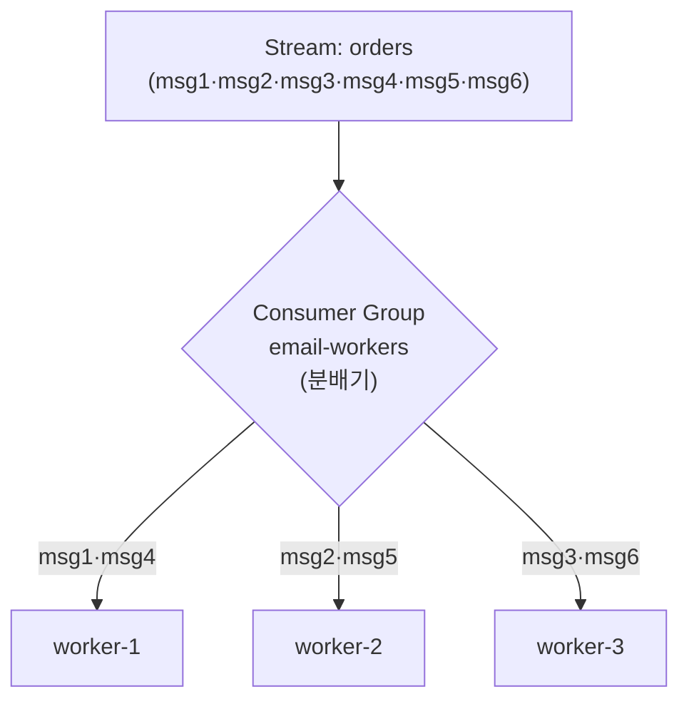
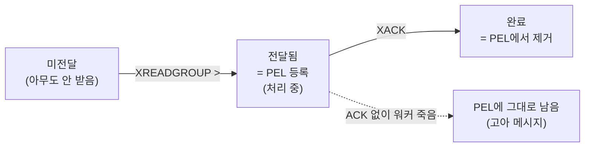
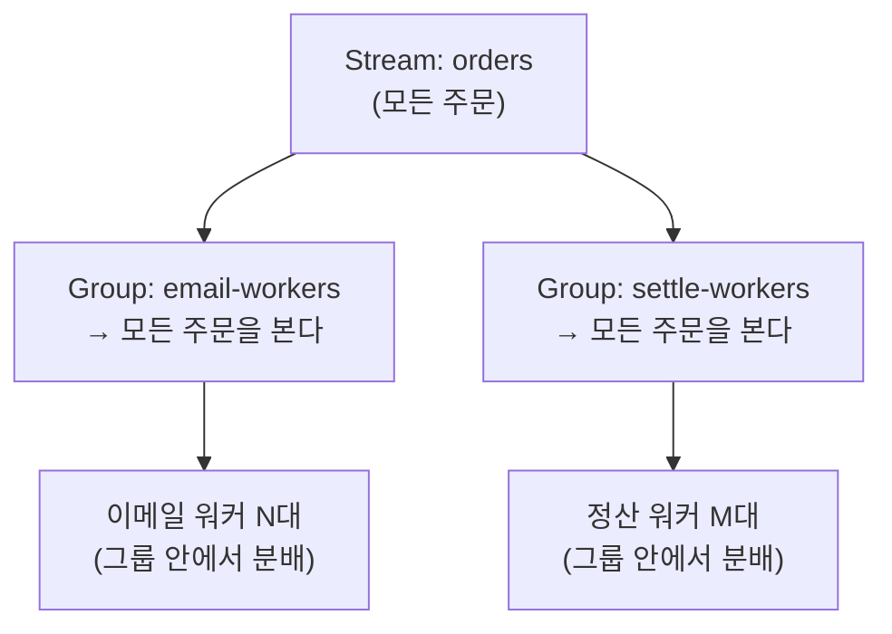

## 워커 한 대로는 부족할 때

Redis Stream은 메시지가 지워지지 않고 쌓이는 로그다. 주문 이벤트가 계속 들어온다고 하자. 이메일 워커 한 대가 `XREAD`로 로그를 읽으면서 차례차례 메일을 보낸다. 잘 돌아간다.

그런데 주문이 폭증하면 한 대로는 못 버틴다. 워커를 3대로 늘리고 싶다. 여기서 두 가지 문제가 생긴다.

1. **중복** — 셋이 각자 로그를 읽으면 같은 주문을 셋 다 본다. 메일이 3번 간다.
2. **실패 추적 불가** — 워커가 메일 보내다 죽으면 그 메시지는 어떻게 되나? 누가 다시 처리하나? `XREAD`는 알 길이 없다.

`XREAD`(직접 읽기)는 본질적으로 **broadcast**다. 위치를 각 클라이언트가 알아서 관리하니, 모두가 모든 메시지를 본다. 모니터링이나 단일 구독에는 맞지만, "여러 일꾼이 한 작업 목록을 **나눠서** 처리하고, 실패한 건 챙긴다"에는 안 맞는다.

이걸 풀어주는 게 **Consumer Group**이다.

## Consumer Group이 하는 일: 분배 + 추적

Consumer Group은 "이 그룹에 속한 워커들이 하나의 작업 목록을 나눠 갖는다"는 약속이다. 핵심은 Redis 서버가 두 가지를 **대신 기록**해준다는 것이다.

- **어디까지 나눠줬는지** (그룹 전체가 공유하는 진행 위치)
- **누가 무엇을 처리 중인지, 끝냈는지** (워커별 처리 상태)



같은 그룹 안에서는 **한 메시지가 한 워커에게만** 전달된다. msg1을 worker-1이 받으면 worker-2·3은 그 msg1을 받지 않는다. 그래서 워커를 늘릴수록 처리량이 선형으로 는다. 메일은 한 번만 간다.

워커는 `XREADGROUP`으로 "그룹 이름 + 내 이름"을 대면서 "아직 아무도 안 가져간 새 메시지 달라(`>`)"고 요청한다. 그러면 서버가 알아서 안 겹치게 하나씩 떼어준다.

## 메시지의 생명주기: 받는 것과 끝내는 것은 다르다

Consumer Group의 진짜 핵심은 여기다. 메시지를 **받았다(delivered)**와 **처리 끝냈다(acknowledged)**가 분리되어 있다.

워커가 메시지를 받으면, 그 메시지는 **PEL(Pending Entries List)**이라는 "처리 중 목록"에 들어간다. 처리를 끝내고 `XACK`를 보내야 비로소 PEL에서 빠진다.



이 분리가 왜 중요하냐면, **"받았지만 아직 안 끝난 메시지"를 서버가 정확히 알고 있기 때문**이다.

- 워커가 메일을 보내다 죽었다 → ACK를 못 보냈다 → 그 메시지는 **PEL에 그대로 남아 있다**
- 즉 유실되지 않는다. "이건 누군가 받아갔지만 아직 안 끝났다"는 사실이 서버에 기록돼 있으니, 나중에 다시 처리할 근거가 된다

만약 PEL 없이 "받는 순간 끝"으로 처리했다면, 워커가 죽는 순간 그 메시지는 증발했을 것이다. PEL이 있어서 **at-least-once(최소 한 번은 처리)** 보장이 가능해진다.

처리 중인(=ACK 안 된) 메시지 목록은 `XPENDING`으로 들여다본다. 누가 받았는지, 얼마나 오래 붙잡고 있는지(idle time), 몇 번 전달됐는지가 다 나온다 — 막힌 메시지를 찾는 도구다.

## 한 사건을 여러 용도로: 그룹 간 독립성

주문 하나를 이메일도 보내고 정산도 해야 한다. 이메일과 정산은 서로 다른 일이고, 둘 다 모든 주문을 봐야 한다. 그런데 같은 그룹에 넣으면 메시지가 분배돼서 어떤 주문은 이메일만, 어떤 주문은 정산만 받게 된다 — 망한다.

답은 **그룹을 따로 만드는 것**이다. 그룹은 서로 완전히 독립적이라, 각 그룹이 전체 메시지를 처음부터 다 본다.



- **그룹 안**: 메시지를 나눈다 (부하 분산)
- **그룹 간**: 각자 전부 본다 (같은 사건의 다른 용도)

Kafka의 Consumer Group과 정확히 같은 모델이다. "같은 데이터를 여러 관점으로 소비"하려면 관점마다 그룹을 만든다.

---

## 부록: 명령어 치트시트

**그룹 생성 — `XGROUP CREATE`**

```bash
XGROUP CREATE orders email-workers 0
# orders 스트림에 email-workers 그룹 생성, 0 = 처음부터 ($ = 지금 이후)
```

**그룹으로 읽기 — `XREADGROUP`**

```bash
XREADGROUP GROUP email-workers worker-1 COUNT 1 STREAMS orders >
# 그룹·워커 이름 명시, COUNT만큼, > = 아직 아무도 안 받은 새 메시지
```

- `>`: 새 메시지 (다른 워커와 안 겹치게 분배됨)
- `0`: **이미 내가 받았지만 ACK 안 한** 내 PEL 메시지 재조회 (재시작·재시도 시)
- `COUNT`: 한 번에 가져갈 개수. 안 주면 한 워커가 있는 만큼 다 가져가버려 분배가 깨진다

**처리 완료 — `XACK`**

```bash
XACK orders email-workers <message-id>
# 처리 끝났다고 알림 → PEL에서 제거
```

**처리 중 목록 확인 — `XPENDING`**

```bash
XPENDING orders email-workers          # 요약: 개수, ID 범위, 워커별 보유 수
XPENDING orders email-workers - + 10   # 상세: 메시지별 담당자·idle time·전달 횟수
```

**상태 조회**

```bash
XINFO GROUPS orders                # 그룹별 consumers·pending·last-delivered-id
XINFO CONSUMERS orders email-workers  # 워커별 pending·idle
```
