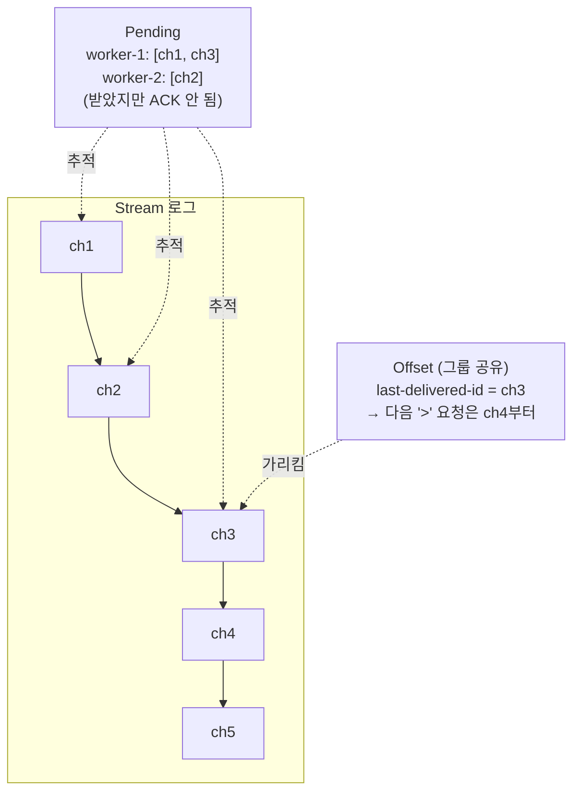
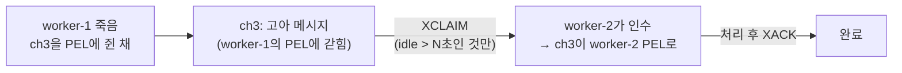
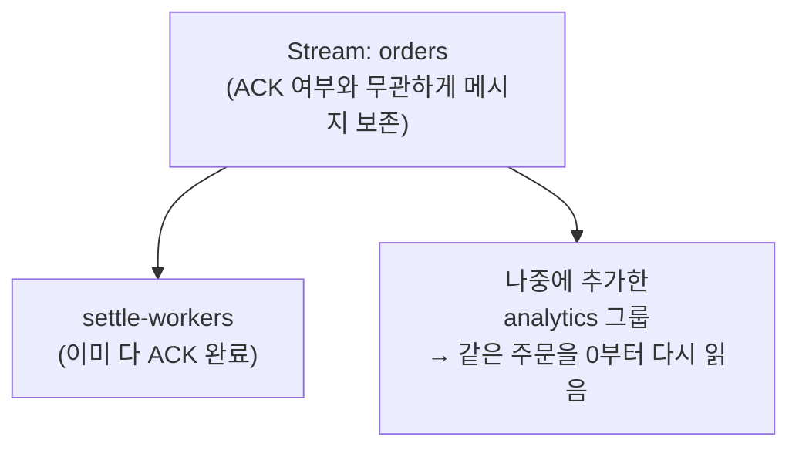

## 죽은 워커가 들고 있던 메시지

Consumer Group으로 주문을 처리하는 워커가 여러 대 돌고 있다. worker-1이 주문 하나를 받아 정산을 하다가, 절반쯤에서 프로세스가 죽었다. ACK는 못 보냈다.

질문이 줄줄이 따라온다.

- 이 메시지는 사라졌나? → **아니다.**
- 다른 워커가 알아서 다시 가져가나? → **아니다, 그냥 두면 안 가져간다.**
- 그럼 영영 안 처리되나? → 내버려두면 그렇다.

이 동작을 이해하려면 Consumer Group이 진행 상태를 기록하는 **두 개의 서로 다른 장부**를 구분해야 한다. 둘을 같은 거라고 착각하는 순간 위 질문에 다 틀린 답을 하게 된다.

## 두 개의 장부: Offset과 Pending

| 장부 | 무엇을 기록하나 | 관리 단위 |
|------|----------------|-----------|
| **Offset** (`last-delivered-id`) | 그룹이 **어디까지 나눠줬는지** | **그룹 전체가 공유** |
| **Pending** (PEL) | 줬는데 **아직 ACK 안 된 것** | **워커별로 따로** |

Offset은 "로그의 어디까지 진도를 뺐나"를 가리키는 **하나의 포인터**고, 그룹 전체가 공유한다. Pending은 "받아갔지만 안 끝낸 메시지들"의 목록이고, 워커마다 자기 것을 따로 들고 있다.



여기서 핵심 성질 두 가지가 나온다.

**① ACK는 Pending만 줄인다. Offset은 안 건드린다.**

worker-1이 ch1을 처리하고 ACK를 보내면, ch1은 worker-1의 Pending에서 빠진다. 하지만 Offset(`last-delivered-id`)은 ch3에 그대로다. ACK는 "이거 끝냈다"는 뜻이지 "진도를 뺐다"는 뜻이 아니기 때문이다. 둘은 아예 다른 축이다.

**② Offset은 그룹이 공유한다 → 워커는 자기가 본 적 없는 메시지부터 받을 수 있다.**

worker-1이 ch1·ch2를 받으면 그룹 Offset이 ch2까지 전진한다. 이때 worker-2가 처음 `>`로 요청하면 ch1·ch2가 아니라 **ch3**을 받는다. worker-2는 ch1·ch2를 본 적이 없는데도 그렇다 — Offset은 워커 개인이 아니라 **그룹의 진도**라서, 누가 읽었든 그룹 전체의 포인터가 같이 전진하기 때문이다.

이 두 가지를 헷갈리면 "ACK 했는데 왜 다음 메시지가 안 와?"(→ Offset과 무관) 같은 데서 막힌다.

## 그래서 죽은 워커의 메시지는

다시 처음 질문으로. worker-1이 ch3을 받고 죽었다. 정리하면 이 상태다.

- Offset은 이미 ch3(혹은 그 이상)까지 전진해 있다 → 다른 워커가 `>`로 요청하면 ch4부터 받는다. **ch3은 아무도 새로 안 가져간다.**
- ch3은 worker-1의 **Pending에 그대로 남아 있다** → 유실은 아니다. 단지 죽은 워커 이름으로 묶여 있을 뿐이다.

즉 ch3은 "유실되진 않았지만, 죽은 워커의 PEL에 갇혀서 아무도 안 건드리는" 고아 상태다. 누군가 **명시적으로 인수**해야 처리된다. 이게 `XCLAIM`(또는 `XAUTOCLAIM`)이다.



보통 "일정 시간(idle) 이상 ACK 안 된 메시지"만 인수 대상으로 거는데, 잠깐 느린 워커의 메시지까지 뺏지 않으려는 것이다. 운영에서는 이 인수 작업을 주기적으로 도는 별도 루프(claim 워커)로 둔다.

## 진도를 되돌리고 싶을 때: Offset 재설정

배포 후 "지난 1시간 메시지를 전부 다시 처리해야 한다"는 상황이 온다. Offset이 그룹의 진도 포인터니까, **그 포인터를 과거로 옮기면** 그 지점부터 다시 `>`로 흘러나온다. `XGROUP SETID`가 그 일을 한다.

```bash
XGROUP SETID orders settle-workers <과거-ID>
# 이후 '>' 요청은 그 ID 다음부터 다시 전달된다
```

Offset이 그룹 공유라는 성질이 여기서 장점이 된다 — 포인터 하나만 옮기면 그룹 전체의 재처리가 된다.

## 메시지는 ACK해도 남는다 → 나중에 다른 용도로

ACK는 PEL(처리 중 목록)에서만 빼는 것이지, 로그에서 메시지를 지우는 게 아니다. 그래서 ACK가 다 끝난 뒤에도 메시지는 Stream에 그대로 있고, **나중에 만든 다른 그룹**이 그 메시지를 처음부터 다시 읽을 수 있다.



"정산 워커가 이미 다 처리한 주문"이라도 나중에 분석 그룹을 새로 붙이면 과거 주문을 전부 재생할 수 있다. 로그라서 가능한 일이고, 동시에 이래서 **트리밍(`MAXLEN`)으로 직접 잘라주지 않으면 메모리가 무한정 는다.**

---

## 부록: 명령어 치트시트

**상태 확인**

```bash
XINFO GROUPS orders
# last-delivered-id (= Offset), pending 개수 등
```

**Pending(처리 중) 조회**

```bash
XPENDING orders settle-workers          # 요약
XPENDING orders settle-workers - + 10   # 메시지별 담당자·idle time·전달 횟수
```

**고아 메시지 인수 — `XCLAIM` / `XAUTOCLAIM`**

```bash
# idle 10초(10000ms) 넘은 특정 메시지를 worker-2가 인수
XCLAIM orders settle-workers worker-2 10000 <msg-id>

# 조건 맞는 것들을 자동으로 스캔하며 인수 (운영에서 주로 사용)
XAUTOCLAIM orders settle-workers worker-2 10000 0
```

**Offset 재설정 — `XGROUP SETID`**

```bash
XGROUP SETID orders settle-workers <과거-ID>   # 그 ID 다음부터 재처리
XGROUP SETID orders settle-workers 0            # 처음부터 전부 재처리
```

**내 Pending 재조회 (재시작·재시도 시)**

```bash
XREADGROUP GROUP settle-workers worker-1 STREAMS orders 0
# '>' 가 아니라 '0' → 내가 받았지만 ACK 안 한 메시지를 다시 받음
```

| 개념 | 의미 | 단위 | ACK 영향 |
|------|------|------|----------|
| Offset (`last-delivered-id`) | 어디까지 나눠줬나 | 그룹 공유 | 없음 |
| Pending (PEL) | ACK 안 된 메시지 | 워커별 | ACK하면 감소 |
