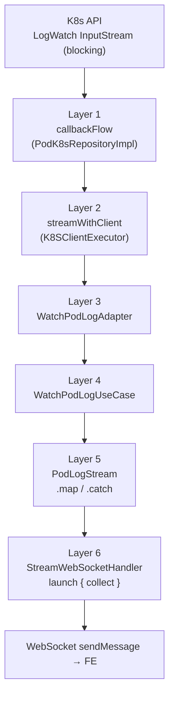

서버 내부 구조의 핵심은 **Kotlin Flow 로 짜여진 6 레이어 파이프라인** 이다. 맨 아래는 Fabric8 LogWatch 가 뱉어내는 blocking InputStream, 맨 위는 WebSocket 세션으로 `sendMessage` 를 날리는 코루틴이다. 그 사이를 여러 Flow 연산자가 잇는다.



각 레이어는 한 가지만 책임진다. 이 구조가 유지되는 한, 어느 지점에서 cancel 하더라도 전체 체인이 깨끗이 회수된다.

## Layer 1 — callbackFlow: blocking InputStream 을 Flow 로 바꾸기

Fabric8 의 `LogWatch` 는 `getOutput(): InputStream` 을 제공한다. 여기서 라인을 읽으려면 `bufferedReader().forEachLine { ... }` 같은 blocking 호출이 필요하다. 이 blocking 코드를 그대로 `flow { emit(...) }` 안에서 돌리면 곤란하다. `flow { }` 는 suspend 블록이라 **해당 코루틴을 blocking I/O 로 점유** 해버린다.

해결은 `callbackFlow` 다. **채널 기반** 으로 돌아가서, blocking 코드를 `launch(Dispatchers.IO)` 로 별도 스레드에 띄우고 결과만 `trySend` 로 채널에 넣는 구조를 자연스럽게 지원한다.

```kotlin
override fun watchPodContainerLog(
  namespace: String,
  podName: String,
  container: String,
  tailLines: Int,
  k8sUser: K8SUser,
): Flow<String> =
  k8SClientExecutor.streamWithClient(k8sUser) { client ->
    callbackFlow {
      val logWatch = client.pods().inNamespace(namespace).withName(podName)
        .inContainer(container)
        .tailingLines(tailLines).watchLog()

      val readerJob = launch(Dispatchers.IO) {
        try {
          logWatch.output.bufferedReader().useLines { lines ->
            lines.forEach { line -> trySend(line) }
          }
        } catch (e: Exception) {
          logger.warn(e) { "..." }
        } finally {
          close()
        }
      }

      awaitClose {
        readerJob.cancel()
        runCatching { logWatch.close() }
      }
    }
  }
```

여기에 이 레이어의 핵심 세 가지가 다 들어있다.

**`trySend`** — 채널이 차면 값이 드랍된다. 생산자 쪽 스레드가 멈추지 않게 한다. 로그는 "드랍해도 재앙은 아닌" 데이터라 기본 버퍼(64) 로도 실무상 큰 문제는 없다. 드랍을 완전히 막고 싶으면 `channelFlow` + suspending `send` 로 갈 수 있지만, 그러면 backpressure 가 생산자(blocking reader 스레드)까지 전달되어야 해서 트레이드오프가 있다.

**`launch(Dispatchers.IO)`** — blocking 읽기 루프를 별도 자식 코루틴으로 분리한다. 여기엔 단순한 "스레드 분리" 이상의 의미가 있다.

callbackFlow 의 블록은 위에서 아래로 순차 실행되는 **producer 코루틴**이다. 마지막 줄의 `awaitClose { ... }` 는 "Flow 가 cancel 될 때 실행할 정리 코드" 를 등록하는 역할인데, 이게 실행되어야 훅이 설치된다. 만약 `useLines { forEach { trySend } }` 를 launch 없이 블록 안에 직접 쓰면, producer 코루틴이 blocking read 에 갇혀서 **`awaitClose` 줄에 도달조차 못한다**. cancel 훅이 설치되지 않은 상태로 blocking 만 도는 셈이다.

이 상태에서 downstream 이 cancel 을 걸어도 문제다. Kotlin cancel 은 cooperative 라 suspend point 가 있어야 감지되는데, `useLines` 내부의 blocking read 에는 suspend point 가 없다. cancel 신호는 **무시**되고, InputStream 이 자연 EOF 될 때까지 blocking read 는 계속 돈다. 리소스 회수가 이 시점까지 지연된다.

```kotlin
// ✗ launch 없이 직접 쓰면
callbackFlow {
  bufferedReader.useLines { ... trySend(it) ... }  // 여기서 블록 갇힘
  awaitClose { logWatch.close() }                   // 도달 못함 → 훅 미설치
}

// ✓ 별도 자식 코루틴으로 분리
callbackFlow {
  val readerJob = launch(Dispatchers.IO) {
    bufferedReader.useLines { ... trySend(it) ... }
  }
  awaitClose {                                      // 즉시 설치됨
    readerJob.cancel()
    logWatch.close()
  }
}
```

`launch` 로 분리하면 producer 본체는 곧바로 `awaitClose` 에 도달해 훅을 등록한다. 자식 코루틴은 IO 풀 스레드에서 blocking read 를 돌린다. `Dispatchers.IO` 를 쓴 건 blocking I/O 전용 스레드 풀에서 돌려서 Default 같은 CPU 바인딩 풀을 장시간 점유하지 않게 하는 관례다.

**`awaitClose`** — 이 블록이 이 레이어의 **자원 회수 단 하나의 진실** 이다. Flow 가 cancel 되든, 자연 종료되든, 예외로 끝나든 `awaitClose` 가 한 번 실행된다. 여기에 `logWatch.close()` 를 두면 K8s API 서버와의 HTTP 스트림이 확실히 끊긴다.

한 가지 미묘한 부분이 있다. `readerJob.cancel()` 만으로는 blocking 읽기 루프가 안 멈춘다. 위에서 말한 것과 같은 이유 — `useLines` 내부의 blocking read 는 cancel 신호를 감지하지 못한다. 그래서 **`logWatch.close()` 로 InputStream 을 닫아 read 쪽에 IOException 을 발생시켜** 빠져나오게 한다. 두 줄이 순서대로 같이 있어야 실제로 회수된다.

## Layer 2 — streamWithClient: client 생명주기를 Flow 에 묶기

K8s Client 는 연결 풀이나 캐시를 가진 무거운 객체다. 일반 요청용 `doWithClient` 는 콜백이 반환되면 즉시 정리 로직을 돌린다. 콜백이 동기적으로 끝나는 REST 스타일 호출에는 맞지만, Flow 로 long-lived 스트림을 여는 경우엔 콜백 반환 시점에 스트림이 막 시작된 직후라 **정리가 너무 빨리 일어난다**.

그래서 스트림 전용 메서드를 하나 더 뒀다.

```kotlin
fun <R> streamWithClient(
  user: K8SUser,
  block: (KubernetesClient) -> Flow<R>,
): Flow<R> =
  flow {
    val client = k8sClientRepository.getClient(user)
    try {
      emitAll(block(client))
    } finally {
      if (user.k8sAuth is K8STemporalConfigAuth) client.close()
    }
  }
```

`flow { emitAll + try/finally }` 는 **외부 Flow 의 생명주기에 정리 훅을 꽂는** 작은 패턴이다. `emitAll` 이 collect 되는 동안은 try 블록 안이고, Flow 가 종료되면 finally 가 실행된다. 여기에 client close 같은 자원 회수를 걸어두면 Flow 생명주기와 자동 동기화된다.

`K8STemporalConfigAuth` 일 때만 close 하는 건 우리 인증 구조 때문이다. 대부분의 인증 타입은 lazy 공유 client 라 close 하면 **다른 요청까지 터진다**. 임시 인증만 매 호출마다 새로 만들어지는 구조라 그것만 close 대상이다.

주의할 점 하나. `K8SUserContextHolder` 같은 ThreadLocal 에 user context 를 설정하던 기존 패턴이 있는데, **여기선 일부러 설정하지 않았다**. Flow 의 collect 는 여러 스레드를 오갈 수 있고, 특히 `launch(Dispatchers.IO)` 에서 `trySend` 된 값을 다른 스레드가 받을 수 있다. ThreadLocal 은 의미가 없어지고, 잘못 쓰면 **다른 요청의 context 를 덮어쓰는 버그** 가 된다.

## Layer 3~4 — Adapter 와 UseCase: 거의 통과

`WatchPodLogAdapter` 와 `WatchPodLogUseCase` 는 Flow 를 거의 그대로 흘려 보낸다.

```kotlin
// Adapter
override fun watch(command: WatchPodLogCommand, k8sUser: K8SUser): Flow<String> =
  podK8sRepository.watchPodContainerLog(...)

// UseCase
override fun execute(command: WatchPodLogCommand): Flow<String> {
  val k8sUser = K8SClusterUser.systemUserClusterAuth(command.clusterName)
  return watchPodLogOutPort.watch(command, k8sUser)
}
```

얼핏 "왜 이렇게 얇은 레이어를?" 싶지만, 여기서 헥사고날 포트/어댑터 경계가 지켜진다. UseCase 는 K8s API 나 Fabric8 같은 구체 기술을 모른다. OutPort 인터페이스만 알고, 거기에 Command 와 K8SUser 를 넘긴다. 도메인 로직이 늘어나거나(권한 체크, 필터링) K8s 가 아닌 다른 스트림 소스가 붙을 때 이 경계가 힘을 낸다.

Flow 가 **cold** 라는 점이 중요하다. `return someFlow` 한다고 실제 K8s 호출이 일어나지 않는다. 체인이 다 구성된 뒤 누군가 `collect` 할 때 비로소 상류로 거슬러 올라가 실행된다. 4 레이어를 지나는 런타임 비용이 사실상 0이다.

## Layer 5 — PodLogStream: payload 변환과 에러 캡처

도메인 타입(`String` 로그 라인)이 전송용 타입(`StreamPayload`) 으로 바뀌는 자리다.

```kotlin
override fun execute(params: Map<String, String>): Flow<StreamPayload> {
  val command = WatchPodLogCommand.from(params)
  return watchPodLogInPort
    .execute(command)
    .map<String, StreamPayload> { StreamPayload.Data(it) }
    .catch { ex -> emit(StreamPayload.Error(ex.message ?: "stream error")) }
}
```

`.map` 은 각 라인을 `Data` 로 감싼다. `.catch` 는 상류에서 올라온 예외를 `Error` payload 로 변환한다. `.catch` 의 핵심 효과는 **예외를 데이터 이벤트로 바꿔서 하류에 전달** 하는 것이다. Handler 쪽의 `collect` 는 평범하게 종료되고, 마지막 이벤트로 Error 가 도달한다. 예외가 하류 try/catch 에 터지는 게 아니라 데이터 스트림의 한 원소로 흘러간다.

## Layer 6 — Handler: 코루틴 발사와 전송

모든 게 모이는 지점이다.

```kotlin
private val scope = CoroutineScope(SupervisorJob() + Dispatchers.IO)

val job = scope.launch {
  try {
    flow.collect { payload ->
      val outbound = when (payload) {
        is StreamPayload.Data -> OutboundMessage(id, "data", payload = payload.value)
        is StreamPayload.Complete -> OutboundMessage(id, "complete")
        is StreamPayload.Error -> OutboundMessage(id, "error", message = payload.message)
      }
      sessionRegistry.sendTo(session, outbound)
    }
    sessionRegistry.sendTo(session, OutboundMessage(id, "complete"))
  } catch (_: CancellationException) {
    // unsubscribe 정상 흐름
  } catch (e: Exception) {
    sessionRegistry.sendTo(session, OutboundMessage(id, "error", message = e.message))
  }
}
```

두 가지 선택이 의미가 있다.

**`SupervisorJob`** — 일반 `Job` 이면 자식 코루틴 하나가 실패할 때 형제 전부 cancel 된다. 한 구독의 K8s API 에러 때문에 **다른 구독이 같이 멈추면 곤란하다**. Supervisor 가 자식 간 실패를 격리한다.

**`Dispatchers.IO`** — 이 파이프라인 전체가 I/O 성격이다. Default 디스패처(CPU 바인딩) 보다는 IO 풀이 맞다.

launch 가 리턴한 `Job` 을 Registry 에 저장한다. FE 가 unsubscribe 를 보내거나 heartbeat 타임아웃이 발생하면 `job.cancel()` 로 끊는다. 그 한 줄이 6 레이어를 통째로 회수한다.

## cancel 전파의 실제 경로

어느 레이어에서든 Flow 가 끊기면 다른 레이어가 자동으로 정리된다. 세 종료 경로가 모두 같은 정리 코드를 탄다.

**경로 1 — FE 가 unsubscribe 전송**

```
SubscriptionRegistry.unsubscribe → Job.cancel
 → Handler 의 collect 가 CancellationException
 → Flow 체인 cancel 전파
 → PodLogStream, UseCase, Adapter 차례로 종료
 → streamWithClient 의 finally 실행 → client close 판단
 → callbackFlow cancel → awaitClose 실행
 → readerJob.cancel() + logWatch.close()
 → blocking read 가 IOException 으로 빠져나옴
```

**경로 2 — Pod 종료로 InputStream EOF**

```
useLines 가 EOF 로 forEach 종료
 → finally { close() } → channel close
 → Flow 자연 종료
 → collect 정상 리턴 → COMPLETE 메시지 전송
```

**경로 3 — K8s API 에러**

```
useLines 에서 IOException
 → catch 에서 warn 로그, finally close
 → Flow 자연 종료 (예외를 하류로 안 던짐)
 → Handler 는 COMPLETE 로 인식
```

세 경로 모두 `awaitClose` 를 반드시 탄다. 이 설계가 유지되는 한 LogWatch 가 누수될 여지는 없다.

## cold flow 의 이점

전체를 놓고 보면 이 구조의 힘은 **cold flow + 구조적 동시성** 조합이다. `return flow` 만으로는 아무 일도 안 일어나고, 맨 위에서 `launch { collect }` 를 하는 순간 6 레이어가 한 번에 엮인다. 테스트할 때는 `collect` 쪽만 모킹하면 된다. 중간 레이어를 추가하거나 빼는 것도 Flow 연산자를 끼우는 선에서 끝난다.

그리고 관리해야 할 "자원 회수 코드" 가 **`awaitClose` 한 곳에만 있다**. 6 레이어가 자기 책임을 지면서도, 진짜 외부 리소스를 쥔 건 맨 아래 `callbackFlow` 뿐이다. 이 중앙 집중이 여러 종료 경로를 하나의 정리 흐름으로 묶어준다.
