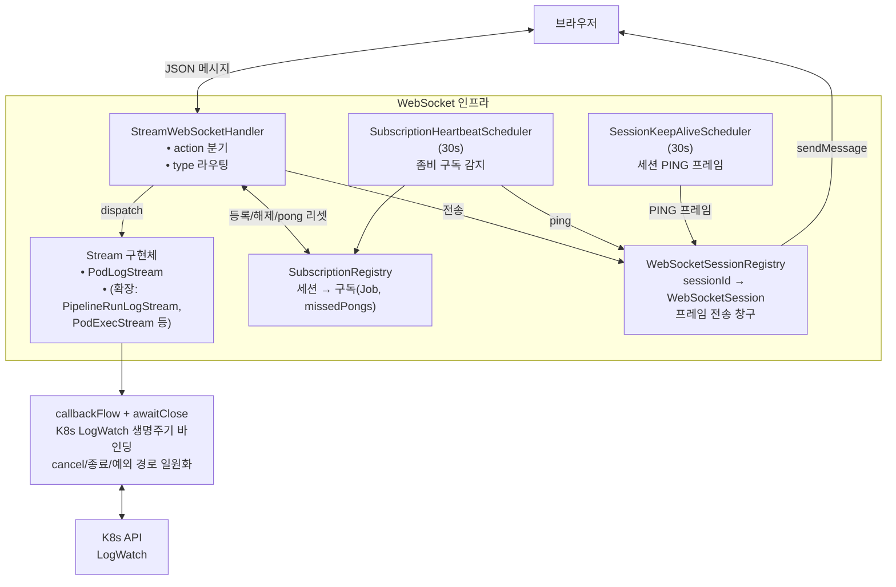

WebSocket 구현을 시작할 때 가장 단순한 그림은 이거였다.

```kotlin
@Component
class LogHandler : TextWebSocketHandler() {
  override fun handleTextMessage(session: WebSocketSession, message: TextMessage) {
    val req = parse(message.payload)
    val logWatch = k8sClient.pods()
      .inNamespace(req.namespace).withName(req.podName).watchLog()
    logWatch.output.bufferedReader().forEachLine { line ->
      session.sendMessage(TextMessage(line))
    }
  }
}
```

"메시지 오면 K8s LogWatch 열어서 라인별로 쏴주면 되지." 이렇게 끝나면 좋지만, 실사용 요구사항 하나만 붙어도 이 그림은 깨진다. 결과적으로 Registry, Strategy, Scheduler 같은 계층이 차례로 쌓였다. 이게 한꺼번에 나온 설계가 아니라, **요구사항 하나가 한 단계를 낳는** 과정이었다.

## Stage 1 — 구독을 "중지" 할 수 있어야 한다

사용자가 로그 화면을 떠나면 스트림을 멈춰야 한다. 서버가 이를 감지해서 K8s LogWatch 를 닫아야 리소스가 회수된다.

위 코드에는 문제가 두 개 있다.

- `handleTextMessage` 안에서 `forEachLine` 을 돌리면 해당 스레드가 blocking 된다. Tomcat NIO 구조에서는 이 스레드가 반환 안 되면 **다음 메시지를 받을 수가 없다**. "stop" 메시지가 있어도 처리 못한다.
- 설령 비동기로 띄운다 해도 그 실행 단위를 **외부에서 취소할 수단**이 필요하다.

해결은 비동기 Job 으로 띄우고 그 참조를 보관하는 것이다.

```kotlin
val jobs = mutableMapOf<String, Job>()  // sessionId → Job

// 시작
jobs[session.id] = scope.launch {
  logWatch.output.bufferedReader().forEachLine { session.sendMessage(TextMessage(it)) }
}

// 중지
jobs[session.id]?.cancel()
```

여기서 **Map 으로 Job 을 보관하는** 얇은 Registry 가 벌써 탄생했다. 아직은 sessionId 하나당 Job 하나지만, 이 Map 이 나중에 `SubscriptionRegistry` 로 자란다.

## Stage 2 — 한 사용자가 여러 로그를 동시에 본다

한 화면에서 Pod A 로그 + Pod B 로그를 동시에 보는 요구가 들어왔다. 이제 한 연결당 Job 하나로는 부족하다.

**Map 이 두 단계가 된다**. `Map<sessionId, Map<subscriptionId, Job>>` 로. 한 세션 아래 여러 구독이 붙는다.

**메시지에 구독 식별자가 필요해진다**. 서버가 내려주는 라인에 `subscriptionId` 를 실어야 FE 가 "이건 Pod A 로그", "이건 Pod B 로그" 로 분류한다.

Handler 도 바뀐다. 단순 echo 가 아니라 action 을 보고 subscribe/unsubscribe 를 분기하는 **라우터** 로 진화하는 시점이다.

## Stage 3 — K8s LogWatch 는 반드시 닫혀야 한다

취소 경로가 생겼다고 끝이 아니다. LogWatch 는 K8s API 서버와 HTTP 스트림을 하나 점유하고 있다. 이걸 안 닫으면 서버 재시작까지 남는다.

문제는 정리가 필요한 경로가 여러 개라는 것이다.

- FE 가 unsubscribe 를 보내서 Job 이 cancel 되는 경로
- Pod 가 죽어서 로그 InputStream 이 자연 EOF 되는 경로
- 네트워크 에러로 예외가 터지는 경로

이 셋 모두에서 **LogWatch 를 닫는 코드가 한 번, 반드시 실행** 되어야 한다. 경로별로 책임지게 하면 중복 호출이나 누락이 생긴다.

Kotlin Flow 의 `callbackFlow { awaitClose { ... } }` 패턴이 정확히 이걸 해결한다. `awaitClose` 는 Flow 가 어떤 이유로든 종료될 때 한 번 실행된다. 자원 정리를 여기 모아두면 세 경로가 자동으로 같은 코드를 탄다. 이 구조가 왜 중요한지는 별도 편에서 좀 더 파고든다.

## Stage 4 — FE 가 unsubscribe 를 안 보내고 탭을 닫았다

이상적인 시나리오에서는 FE 가 컴포넌트 언마운트 시점에 unsubscribe 를 보낸다. 현실은 그렇지 않다. 탭 강제 종료, 크래시, 네트워크 단절처럼 **unsubscribe 가 도달하지 못하는 상황** 이 있다.

TCP 레벨에서도 이걸 항상 감지하지 못한다. NAT 타임아웃이나 모바일 네트워크 전환 같은 경우 서버는 상대가 사라진 걸 모른 채 소켓을 계속 들고 있을 수 있다.

결국 **서버가 주기적으로 "살아있니?" 하고 확인** 해야 한다. 구독별로 ping 을 보내고 pong 이 돌아오는지 본다. 지정 횟수만큼 pong 이 안 오면 구독을 강제 cancel. 이 로직은 주기적으로 도는 스케줄러와, 구독별 미응답 카운터를 가진 Registry 로 구성된다.

## Stage 5 — 구독이 하나도 없는데 연결은 유지하고 싶다

"브라우저 접속 시 WebSocket 을 한 번 열어두고, 화면 진입할 때마다 subscribe" 패턴을 지원하려면 구독이 0개인 세션도 유지돼야 한다.

여기서 Stage 4 의 heartbeat 만으로는 부족하다. heartbeat 는 구독이 있을 때만 동작하니까, 구독이 0이면 프레임 트래픽이 0이 되고, Tomcat idle timeout 에 걸려 **연결이 끊긴다**.

세션 자체를 살리는 **별도 keep-alive** 가 필요하다. WebSocket 제어 프레임 `PingMessage` 를 서버가 주기적으로 보내면 브라우저가 자동으로 `PongMessage` 로 응답하고, 이 프레임이 idle timer 를 리셋한다. FE 코드 변경 없이 연결이 유지된다. 스케줄러 하나가 또 추가된다.

## Stage 6 — 새 type 을 추가하려면

Pod 로그뿐 아니라 PipelineRun 로그, 웹 터미널, 리소스 메트릭 같은 type 이 계속 붙는다. Handler 에 `if (type == "pod-log") ... else if ...` 식으로 분기를 쌓으면 파일이 불어나고 수정 충돌이 잦아진다.

Strategy 패턴으로 분리한다. `Stream` 인터페이스를 두고 각 type 을 구현체로 만든다.

```kotlin
interface Stream {
  val type: String
  fun execute(params: Map<String, String>): Flow<StreamPayload>
}
```

Handler 는 구현체 리스트를 주입받아 `streamByType[type]?.execute(params)` 만 호출한다. 새 type 추가 = 새 `@Component` 하나 추가. Handler 는 건드리지 않는다.

## 결국 무엇이 쌓였나

시작의 `forEachLine { session.sendMessage(line) }` 에서 여섯 단계가 올라갔다.

- **라우터 Handler** — action 별 분기, 메시지 파싱
- **Stream 인터페이스 + 구현체** — type 별 다형 디스패치
- **SubscriptionRegistry** — 세션/구독/Job 상태 저장소
- **WebSocketSessionRegistry** — 세션별 메시지 전송, 세션 enumerate
- **SubscriptionHeartbeatScheduler** — 구독별 pong 미응답 감지
- **SessionKeepAliveScheduler** — 세션 레벨 WS PING
- **`callbackFlow { awaitClose }`** — 자원 정리 일원화

시각적으로 이어보면 이렇게 된다.



각 컴포넌트는 미리 설계된 추상화가 아니라 요구사항 하나하나에 대응해서 **불가피하게 생긴 것들** 이다. 단발성 연결이라면 "그냥 소켓 열고 보내기" 가 맞지만, 긴 수명의 다중 스트림을 서빙하는 순간 이 코드는 **다중화 상태 머신** 이 된다. 지금 코드는 그 최소한의 구성을 쌓은 결과다.
