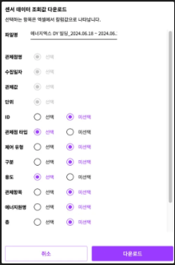
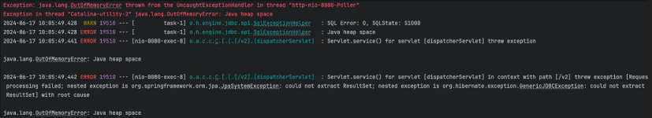

서버 환경은 t3.medium이고, 롤링 배포를 위한 메모리를 빼면 실제 사용할 수 있는 메모리는 2GB 정도였다.



약 1000만 건(작성 날짜 기준 최대 4000만 건)의 데이터를 CSV 파일로 다운로드해야 하는 기능에서 OOM이 발생했다.



처음에는 과거 데이터가 변하지 않으니 미리 파일을 만들어놓으면 될 거라 생각했다. 하지만 사용자의 선택에 따라 컬럼값, 날짜, 관제점 등이 바뀌어야 했고, 미리 만들어놓는 건 현실적으로 불가능했다. 서버를 안전하게 굴리기 위해 데이터가 아무리 많아도 서버가 터지지 않게 만드는 게 목표였다.

## Repository 변경 시도

처음 구조는 대용량 데이터를 한번에 리스트로 메모리에 올리는 방식이었다.

```java
return getControlPointAndVlaueJpaQuery()
    .where(controlValue.controlPointId.in(controlPointIds),
        controlValue.collectedAt.between(startDate, endDate))
    .fetch()
```

이러니 OOM이 날 수밖에 없었다. Stream으로 바꾸면 순차적으로 가져올 수 있을 거라 생각해서 `@Query` Stream과 QueryDSL Stream 두 가지를 시도했다.

```java
// @Query stream
@Query(...)
Stream<ControlPointAndValueWithFloorZoneQuery> streamAllBy(
    @Param("controlPointIds") List<Long> controlPointIds,
    @Param("startDate") LocalDateTime startDate,
    @Param("endDate") LocalDateTime endDate);
```

```java
// QueryDSL stream
return getControlPointAndVlaueJpaQuery()
    .where(controlValue.controlPointId.in(controlPointIds),
        controlValue.collectedAt.between(startDate, endDate))
    .stream();
```

세 가지 모두 데이터가 너무 많은 탓인지 OOM을 해결하지 못했다.

## 호출 쪼개기 및 쿼리 튜닝

너무 많은 데이터를 한번에 조회하는 게 문제라고 판단해서, 넓은 기간의 데이터를 한 번에 가져오는 대신 기간을 쪼개서 순차적으로 가져오도록 변경했다.

```java
LocalDate startDate = rawDataDownLoadRequest.startDate();
LocalDate endDate = rawDataDownLoadRequest.endDate();

while (!startDate.isAfter(endDate)) {
    LocalDate nextDate = startDate.plusDays(10);
    if (nextDate.isAfter(endDate)) {
        nextDate = endDate;
    }
}
```

쿼리도 튜닝했다. 1000만 건 중에서 관제점별로 실제로 다른 값은 `controlValue.id`, `controlValue.collectedAt`, `controlValue.value` 세 개뿐이고 나머지는 전부 똑같은 데이터가 반복되고 있었다. 반복되는 데이터를 최소화하고 인덱스를 적용해서 쿼리 성능을 높였다.

```java
getQueryFactory()
    .select(
        Projections.constructor(
            ControlPointAndValueWithFloorZoneQuery.class,
            controlPoint.id,
            controlPoint.building.id,
            controlPoint.name,
            controlPoint.valueType,
            controlPoint.controlPointType,
            controlPoint.sortationType,
            controlPoint.purposeType,
            controlPoint.itemType,
            controlPoint.itemName,
            controlPoint.itemUnit,
            controlPoint.isUsageRole,
            controlPoint.isFeeRole,
            zone.id,
            parentZone.id,
            floor.id,
            floor.num,
            floor.floorType,
            zone.name,
            parentZone.name,
            controlValue.id,
            controlValue.collectedAt,
            controlValue.value
        )
    )
    .from(controlPoint)
    .join(zone).on(controlPoint.zone.id.eq(zone.id))
    .leftJoin(parentZone).on(zone.parent.id.eq(parentZone.id))
    .join(floor).on(zone.floor.id.eq(floor.id))
    .join(controlValue).on(controlPoint.id.eq(controlValue.controlPointId));
```

반복되는 관제점 데이터는 Map에 한 번만 담아두고, Stream으로 들어오는 관제값마다 Map에서 꺼내서 조합하는 방식이다.

## StreamingResponseBody로 순차 전송

기존에는 모든 데이터를 StringWriter에 담고 바이트로 변환해서 한번에 전송하는 방식이었다.

```java
try (StringWriter writer = new StringWriter();
     CSVPrinter csvPrinter = new CSVPrinter(writer, CSVFormat.DEFAULT)) {
    getHeader(rawDataDownLoadRequest, csvPrinter);
    getBody(rawDataDownLoadRequest, controlPointAndValueResponses, csvPrinter);
    ...
    InputStream byteArrayInputStream = new ByteArrayInputStream(outputBytes);
    return new InputStreamResource(byteArrayInputStream);
```

한번에 모두 보내는 게 아니라 순차적으로 데이터를 보내야 메모리에 부담이 없을 거라 생각했다. **OutputStreamWriter와 StreamingResponseBody**를 사용해서 데이터를 받을 때마다 flush를 호출해 순차적으로 클라이언트에게 전송하도록 변경했다.

```java
@Transactional(readOnly = true)
public StreamingResponseBody getRawDataToCsv(RawDataDownLoadRequest rawDataDownLoadRequest,
    HttpServletRequest httpServletRequest) {
    return outputStream -> {
        try (OutputStreamWriter writer = new OutputStreamWriter(outputStream, StandardCharsets.UTF_8);
             CSVPrinter csvPrinter = new CSVPrinter(writer, CSVFormat.DEFAULT)) {
            getHeader(rawDataDownLoadRequest, csvPrinter);
            csvPrinter.flush();

            try (Stream<ControlValue> scrollableResults = controlPointService.getRawData(
                controlPointMap.keySet().stream().toList(),
                startDate, nextDate);) {
                scrollableResults.forEach(controlValue -> {
                    try {
                        getBody(rawDataDownLoadRequest, controlPointResponse, controlValue, csvPrinter);
                        csvPrinter.flush();
                    } catch (IOException e) {
                        throw new FileInputStreamException(FAILED_CREATE_FILE.getMessage());
                    }
                });
            }
        }
    };
}
```

## 영속성 캐시 문제

여기까지 적용하고 테스트했는데, 데이터가 순차적으로 잘 들어가다가 또 OOM이 발생했다.

이것저것 찾아보다가 아직 트랜잭션이 끝나지 않은 상태에서 조회한 데이터들이 영속성 캐시에 남아 메모리를 차지하고 있는 것으로 예상했다. `entityManager.detach()`로 처리가 끝난 엔티티를 영속성 컨텍스트에서 분리해주니 메모리 문제 없이 동작했다.

```java
try (Stream<ControlValue> scrollableResults = controlPointService.getRawData(
    controlPointMap.keySet().stream().toList(),
    startDate, nextDate);) {
    scrollableResults.forEach(controlValue -> {
        ControlPointResponse controlPointResponse = controlPointMap.get(
            controlValue.getControlPointId());
        try {
            getBody(rawDataDownLoadRequest, controlPointResponse, controlValue, csvPrinter);
            csvPrinter.flush();
            entityManager.detach(controlValue);
        } catch (IOException e) {
            throw new FileInputStreamException(FAILED_CREATE_FILE.getMessage());
        }
    });
}
entityManager.clear();
```

## 비동기 스레드 풀 제한

하나의 요청에는 잘 대응할 수 있게 됐지만, 여러 사람이 동시에 다운로드를 하면 여전히 OOM이 발생했다.

처음에는 Java의 **Semaphore**로 동시에 접근하는 스레드 수를 제한하려 했다. 그런데 응답이 비동기로 이루어져 있어서 스레드를 컨트롤하기 어려웠다. Semaphore를 조사하면서 비동기 작업이 서블릿 스레드가 아닌 `SimpleAsyncTaskExecutor`에서 스레드를 매번 새로 만들어 사용하고 있다는 걸 알게 되었다.

스레드 풀로 교체해서 동시 실행 스레드 수를 제한하니 해결되었다.

```java
@Override
public AsyncTaskExecutor getAsyncExecutor() {
    ThreadPoolTaskExecutor executor = new ThreadPoolTaskExecutor();
    executor.setCorePoolSize(2);
    executor.setMaxPoolSize(5);
    executor.setThreadNamePrefix("ASYNC-");
    executor.initialize();
    return executor;
}

@Override
public void configureAsyncSupport(AsyncSupportConfigurer configurer) {
    configurer.setTaskExecutor(Objects.requireNonNull(getAsyncExecutor()));
    configurer.setDefaultTimeout(600000);
}
```
