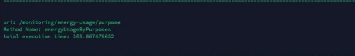
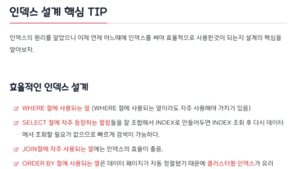
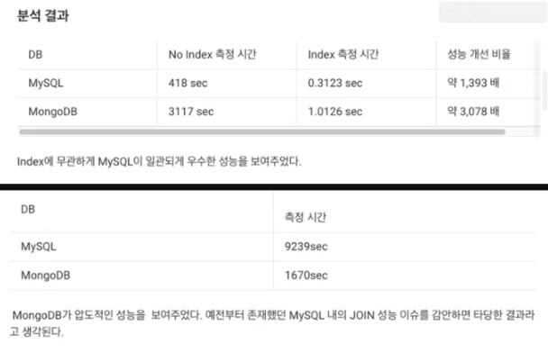
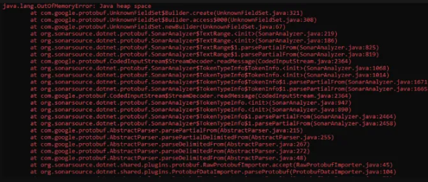

2천만 건이 있는 테이블에서 그래프 데이터를 조회하는데 시간이 점점 느려지기 시작했다. 데이터가 쌓이면서 기존 쿼리로는 감당이 안 되는 수준이 된 것이다.



데이터 하나를 조회하는데 165초가 걸렸다. 팀 회의를 통해 데이터베이스에 인덱스를 적용하는 것을 첫 번째 해결책으로 정했다.

## 인덱스

인덱스는 책의 찾아보기와 같다. '홍길동'을 찾으려면 색인에서 '홍' 또는 'ㅎ'으로 시작하는 항목을 찾으면 빠르게 검색할 수 있다.



어떤 컬럼 조합이 가장 효과적인지 알 수 없었기 때문에, 가능한 조합을 전부 테스트했다. 각 조합마다 3회씩 측정하고 평균을 냈다.

| 인덱스 설정 | 1회 | 2회 | 3회 | 평균 |
|-----------|-----|-----|-----|------|
| NOTHING | 237s | 237s | 237s | 237s |
| control point id | 140s | 127s | 129s | 132s |
| collected at | 222s | 220s | 221s | 221s |
| control point id, collected at | 118s | 118s | 118s | 118s |
| (collected at, control point id) | 197s | 197s | 196s | 196.67s |
| (control point id, collected at) | 85s | 88s | 82s | 85s |
| control point id, collected at, (collected at, control point id) | 131s | 134s | 131s | 132s |
| control point id, collected at, (control point id, collected at) | 91s | 94s | 88s | 91s |

결과적으로 `(control point id, collected at)` 복합 인덱스가 가장 좋은 성능을 보였다. 기존 237초에서 85초로, 약 3배 빠르긴 했다. 하지만 85초는 사용자가 체감하기엔 여전히 너무 느렸다.

## MongoDB

NoSQL이 대용량 읽기/쓰기에 강하다는 이야기가 있어서, 가장 데이터가 많은 관제값 테이블을 MongoDB로 옮기는 방안을 시도했다. 조인 없이 단순 WHERE 조건으로만 조회하는 구조라 MongoDB가 더 빠를 거라 생각했다.

결과는 예상과 달랐다.



동일한 조건에서 MySQL이 MongoDB보다 빠르게 조회되었다. MongoDB가 빛을 보려면 "JOIN이 많고 스키마가 자주 바뀌는 복잡한 쿼리"를 대체하는 상황이어야 했는데, 우리 관제값 데이터는 단순 WHERE 쿼리만 쓰는 구조라 MongoDB의 강점을 살릴 수 없었다.

## Heap Overflow

그다음으로 시도한 건 연산 위치를 바꾸는 것이었다. 데이터베이스에서 GROUP BY와 SUM으로 처리하던 집계를 Java 애플리케이션으로 옮겨서 처리하면 어떨까 했다.

데이터가 조금만 많아지면 메모리 부족으로 서버가 종료되었다.



메모리 용량을 늘려서 임시로 버틸 수는 있었지만, 데이터가 계속 쌓이는 구조에서 메모리만 올리는 건 근본적인 해결이 아니었다.

## 집계 테이블

여기서 발상을 전환했다. 조회 시점에 2천만 건을 매번 집계하는 게 아니라, **미리 집계해둔 결과를 조회**하면 되는 것이었다.


배치 작업에 추가 JOB을 붙여서 일일 단위, 월간 단위로 데이터를 사전 집계해 별도 테이블에 저장하도록 개발했다. 원본 2천만 건을 매번 훑는 대신, 이미 계산된 집계 데이터에서 읽어오는 구조다.

문제는 테이블이 3개로 나뉘면서 생겼다. 같은 관제값 데이터인데 기간타입에 따라 원본 테이블, 일일 집계 테이블, 월간 집계 테이블을 각각 따로 조회해야 했다. 서비스 로직에서 if-else로 분기를 태우면 테이블이 추가될 때마다 분기가 늘어나고, 조회 로직과 테이블 선택 로직이 뒤섞여 코드가 복잡해진다.

팩터리 메서드 패턴을 적용해서 이 문제를 해결했다. 기간타입을 넘기면 팩터리가 알아서 맞는 서비스를 반환하는 구조다.

```java
@Service
@RequiredArgsConstructor
public class ControlValuesServiceFactory {
    private final ControlValueService controlValueService;
    private final ControlValueDailyAggregateService controlValueDailyAggregateService;
    private final ControlValueMonthlyAggregateService controlValueMonthlyAggregateService;

    public ControlValueProvider<?> getService(PeriodQueryDateFormat primaryDateFormat) {
        return switch (primaryDateFormat) {
            case DAY_MINUTE, DAY_HOUR -> controlValueService;
            case WEEK, MONTH, DATE_RANGE -> controlValueDailyAggregateService;
            case YEAR, YEARS -> controlValueMonthlyAggregateService;
        };
    }
}
```

호출하는 쪽에서는 어떤 테이블에서 가져오는지 신경 쓸 필요가 없다. 팩터리에 기간타입만 넘기면 된다.

```java
ControlValueProvider<?> controlValueProviderService = controlValuesServiceFactory.getService(primaryDateFormat);
List<? extends ControlValueInterface> controlValues = controlValueProviderService.getControlValues(
    controlPointIds, startDate, endDate);
```


이렇게 분리해두니 나중에 집계 테이블 종류가 추가되더라도 팩터리 클래스의 switch에 한 줄만 추가하면 되고, 서비스 로직은 건드릴 필요가 없어졌다.


결과: **0.02초**. 165초에서 0.02초면 8,250배 개선이다.

## 캐싱

여기서 한 가지 더 최적화할 수 있는 포인트가 있었다. 관제값의 과거 데이터는 변하지 않는다. 어제의 관제값이 오늘 바뀔 일은 없다. 이 특성을 이용하면 한 번 조회한 과거 데이터를 캐싱해두고 재사용할 수 있다.


오늘 날짜를 제외한 요청에 대해서만 캐싱을 적용했다. 오늘 데이터는 아직 변할 수 있으니 캐싱하지 않고, 과거 데이터만 캐싱 대상으로 잡았다. 메모리 관리를 위해 최대 300개 항목 저장, 매일 자정에 초기화하도록 설정했다.

캐싱된 데이터 조회 결과: **0.0005초**

165초에서 시작해서 인덱스(85초), 집계 테이블(0.02초), 캐싱(0.0005초)까지 — 같은 데이터 양에서 속도를 개선하지는 못했지만 여러 기법을 조합해서 목표했던 조회 속도 개선을 달성할 수 있었다.
